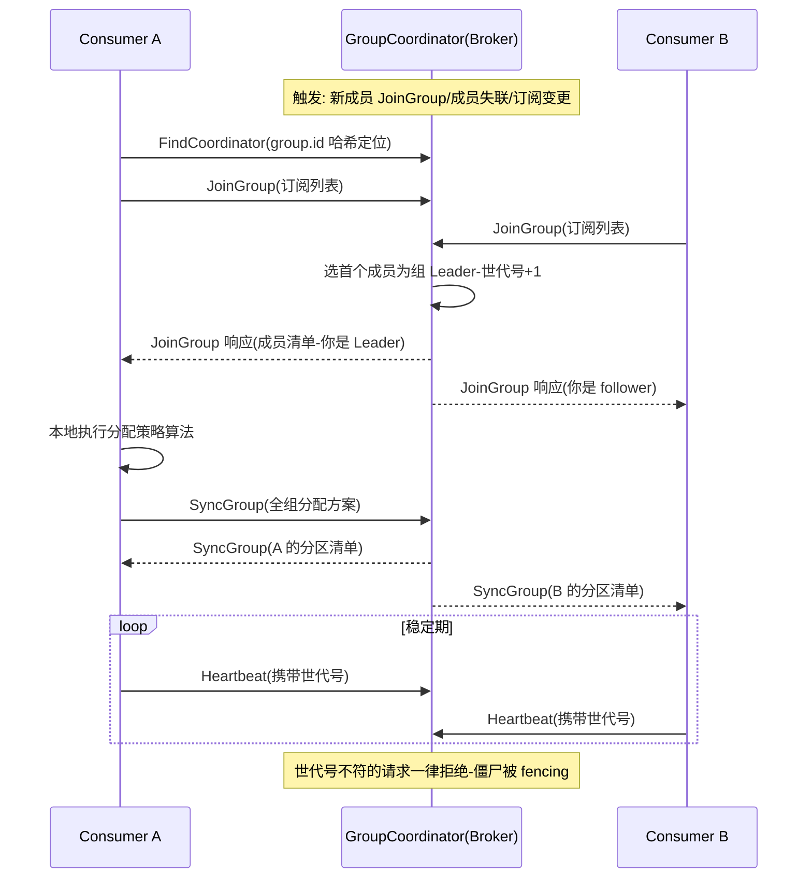
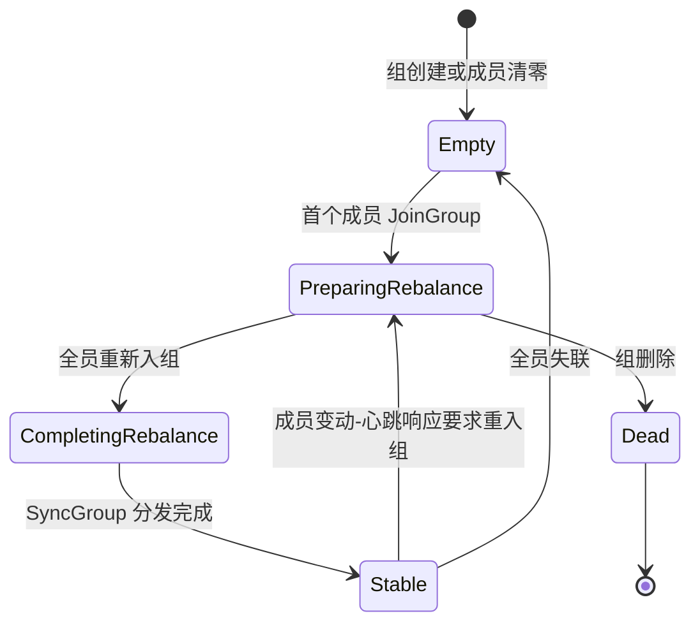
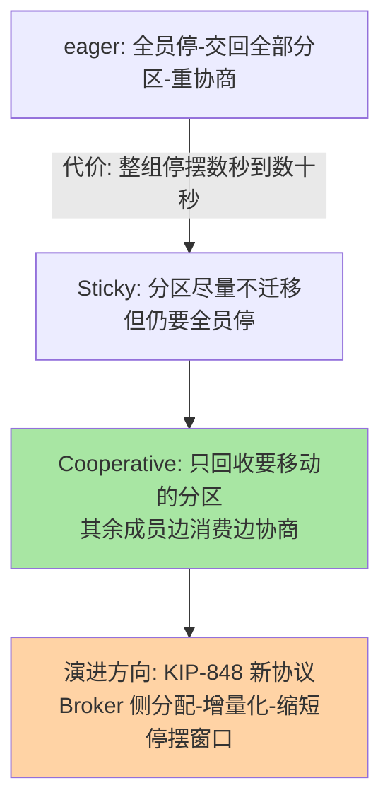

# Kafka Consumer Group 消费机制深读：Rebalance 协议、位点提交与并行消费的世代账本

> **本文核心**：Consumer Group 把「分布式负载均衡」做成了一个**以 Group Coordinator 为中心的成员协议**——成员用 JoinGroup 报到、组内选出的 Leader 消费者跑分配算法、SyncGroup 下发分配结果、Heartbeat 与 poll 双时钟维持成员资格；每次成功协商产生一个递增的 **Generation（世代号）**，旧世代的成员与位点操作被直接 fencing。分区是消费的独占单位（同组内一个分区只归一个消费者），位点（offset）提交是「消费到哪里了」的唯一账本，存在 __consumer_offsets 内部主题按 key 压缩。**机制链**：FindCoordinator 找组 → JoinGroup 入组选 Leader → Leader 按分配策略算分诊 → SyncGroup 领各自分区 → poll 拉取消费 → commitSync/Async 提交位点 → 成员变化触发 Rebalance 回到协商阶段。

## 一句话摘要

消费组的实现原理核心是**独占分片 + 世代化协议**：分区独占让「顺序消费」与「位点记账」都退化为单点问题（一个分区一个消费者一本账），世代号让任何一次成员变动的混乱都被 fencing 在旧世代里；而它最著名的代价——eager Rebalance 的「全员停止消费」——正是协议简单性的价格（所有成员交回全部分区重新协商），cooperative 增量再平衡用「只回收要移动的分区」把这价格砍掉大半。**位点提交的全部坑（重复消费、漏提交、提交回退）都源于同一个事实：提交的是「下一条要读的位移」，而「处理完成」与「提交成功」永远是两个时刻**——读懂这句话，at-least-once + 业务幂等为什么是标准答案就不言自明。

## 前置阅读

- [消费模式与幂等（入门）](../../入门层/从零开始认识事件驱动架构系列/3_消费模式与幂等-入门.md)
- [消费者组与再平衡（入门）](../../../../middleware/kafka/入门层/从零开始认识Kafka系列/11_消费者组与再平衡-入门.md)
- 本系列第 2 篇 [Kafka Broker 存储](./2_KafkaBroker存储-特性.md)（位点与消息都存在同一套日志结构里）

## 目标导向

本文是什么：事件驱动视角下消费组机制的协议级深读。功能：拆解 Rebalance 协议的角色与世代 fencing、算清分配策略的偏斜账、掌握位点提交的三种姿势与语义边界。收益：消费抖动排查、Rebalance 风暴治理、堆积扩容规划的协议级判断力。必看场景：发布期间消费暂停治理、重复消费事故复盘、消费组扩容评审、lag 积压应急。

## 5W 速记卡

| 维度 | 一句话 |
|---|---|
| What | Coordinator 中心的成员协议 + 分区独占分配 + __consumer_offsets 位点账本 |
| Why | 分区独占保顺序与简单记账，世代号 fencing 僵尸成员 |
| When | Rebalance 风暴、重复消费、堆积扩容、发布期消费暂停 |
| Where | 消费者与 Coordinator 之间、位点在内部主题 __consumer_offsets |
| How | JoinGroup → 分配 → SyncGroup → poll/heartbeat → 提交位点 → 变动再协商 |

## 一、事件驱动视角：消费组是事件的「订阅分诊台」

事件驱动架构里，一个业务域的事件通常要喂给多类下游：同构扩容的（同一服务多实例分摊——队列语义）与异构共存的（风控、数仓、审计各自全量——发布订阅语义）。Consumer Group 用一个机制同时表达两种语义：**组间广播**（不同 group.id 各自持有独立位点、互不影响，全量各自读）、**组内队列**（同组消费者分摊分区，一条事件只被组内一个实例处理）。这个「队列/发布订阅二元性」不需要两套系统，是消费组模型的第一层优雅。第二层优雅在**独占分片**：分区是消费的最小单位，组内独占——它同时解决了三个分布式难题：顺序（分区内单消费者，天然有序）、记账（位点按分区一租户，无共享竞争）、交付（一条消息组内只投一次，无需分布式去重）。**追问：为什么独占分区，而不是「共享队列、消费者各拉各的、用 CAS 抢位点」？**反方案分析：共享拉取意味着同一分区的消息被多个消费者交错处理——分区内顺序被打碎，下游幂等去重的压力陡增；位点 CAS 让「消费进度」变成热点行，Broker 端要为此引入锁与冲突重试。独占分片把这两个问题在分配阶段一次性锁死，代价是「分配本身需要一个协议」——这就是 Rebalance 协议存在的理由，也是本篇的主戏。

## 二、Rebalance 协议：一次成员协商的完整旅程

### 2.1 协议角色与世代 fencing

角色分工有个常被误解的点：**Coordinator 是 Broker 侧的「协议主持人」，只管成员名册与转发；分区怎么分是 Leader 消费者在客户端算的**。为什么这么设计？设计思想在于「控制面最小化」：Coordinator 不需要理解分配策略（策略是可插拔的），Broker 只维护「谁在组里、当前第几代、各人领了什么」的名册；分配逻辑放在客户端，新策略上线不用动 Broker。组的位置由 `group.id` 哈希映射到 __consumer_offsets 的 50 个分区之一（默认值，官方口径），该分区 Leader 所在的 Broker 就是这个组的 Coordinator——位点存储与组管理共用一个「家」。组成员失联（session.timeout.ms 内无心跳，3.0 起默认 45 秒）或处理超时（max.poll.interval.ms 内没有下一次 poll，默认 5 分钟）都会触发 Rebalance。

### 2.2 组状态机：Rebalance 的阶段流转

**PreparingRebalance 阶段组内全员停止消费**（eager 协议先交回所有分区再入组）——这是 Rebalance 代价的准确表述：不是「恢复慢」，而是「协商期间整组停摆」。三次交互（FindCoordinator/JoinGroup/SyncGroup）本身是秒级内完成的快协议，慢与抖动都来自触发频率与边缘条件，往下看两笔最容易失控的账。

### 2.3 两笔失控账：处理超时与心跳误判

**账一：max.poll.interval.ms 超时**。单批消息处理时长超过它（默认 5 分钟），消费者还没来得及下一次 poll，Coordinator 判定「这个成员活着但不干活」、踢出组触发 Rebalance；新分配里它重新拿到分区、重新 poll、又处理超时、又被踢——**Rebalance 风暴**的标准成因，整组反复停摆、lag 指数上升。参数层的三板斧：max.poll.records 调小（单批少拉点）、max.poll.interval.ms 调大（给重活宽限）、重活异步化 + 手动提交位点（poll 线程只投递不处理）。**账二：session.timeout.ms 与 heartbeat.interval.ms 的配比**（官方建议约 3 倍，如 45 秒/3 秒）：会话超时调得太短，一次 GC 停顿或网络抖动就被误判死亡、无谓 Rebalance；调得太长，真崩溃的接管时间跟着拉长。**为什么 KIP-62 要把「处理超时」和「存活超时」拆成两个参数？**因为旧版本两件事共用一个超时：消费者拉了一大批发得慢，心跳线程还活着却被判死——误判源就是「语义不同的事共用一个时钟」，拆分是对症下药。

### 2.4 分配策略：偏斜、抖动与增量演进

| 策略 | 算法 | 偏斜风险 | 适用 |
|---|---|---|---|
| Range（旧默认） | 按 Topic 逐个切分给排序后的成员 | 多 Topic 时前面的成员多拿（每 Topic 的零头都给第一名） | 单 Topic、入门默认 |
| RoundRobin | 全部 Topic 的分区混排轮分 | 无系统性偏斜 | 多 Topic 均匀诉求 |
| Sticky | 尽量保留上次分配再均衡 | 接近均匀 | 减少分区迁移抖动 |
| CooperativeSticky | Sticky + 增量协商（只回收要动的分区） | 接近均匀 | 大规模组、发布频繁（推荐） |

Range 的偏斜是算术题：每个 Topic 分区数除以成员数的余数都给「排序第一」的成员，N 个 Topic 的零头叠加，头部成员负载显著偏高——**为什么它曾经是默认？**实现最直白、结果可预测，在「单 Topic + 成员数整除」的早期场景没有暴露问题；多 Topic 微服务化后偏斜显形，社区演进路线是 RoundRobin（治均匀）→ Sticky（治迁移抖动）→ CooperativeSticky（治停摆）。**为什么不一步到位默认 cooperative？**再深一层：增量协商要求消费者客户端与分配策略双方都理解「两阶段回收」（先告知要回收的分区让业务提交位点收尾、再入组接新分区），旧客户端混布时协议协商会退化回 eager——默认切换必须等生态齐套（KIP-429，2.4 起可用），这是「好机制被生态兼容性拖慢落地」的典型演进样本。

## 三、位点提交：一本「下一条读哪」的账

### 3.1 语义核心：提交的永远是「下一条」

位点存在 __consumer_offsets（key = group + topic + partition，value = offset + 元数据，compact 清理保每个 key 最新值），**提交值语义是「下一条要消费的位移」**。这个定义决定了所有坑的形状：「处理完成」与「提交成功」是两个时刻，两者之间的任何崩溃产生分叉：先处理后提交 → 崩在提交前 = 重复（at-least-once）；先提交后处理 → 崩在处理前 = 丢失（at-most-once）。三种提交姿势的语义表：

| 姿势 | 配置/调用 | 语义 | 风险 |
|---|---|---|---|
| 自动提交 | enable.auto.commit=true（默认，5 秒周期） | poll 时顺手提交上批位置 | 崩溃窗口内语义含糊，重复与漏处理都可能 |
| 同步提交 | commitSync() | 阻塞到确认，失败重试 | 阻塞吞吐 |
| 异步提交 | commitAsync(callback) | 不阻塞、不自动重试 | 失败静默、乱序回退风险 |

**为什么不推荐「自动提交 + 完事」的生产姿势？**反方案：自动提交的时钟与业务处理的边界完全脱钩——提交时你不知道那批消息业务上做没做完，重复与丢失都可能发生且不可控；标准姿势是 `enable.auto.commit=false` + **处理完成后手动提交**，用 at-least-once + 下游幂等（按事件 ID 去重或状态机天然幂等）把「重复」变成无害操作。**追问：commitAsync 既然快，为什么不全程用它？**再深一层：异步提交失败不重试（重试可能提交一个更旧的位移把账本回退），若一直没人补交，Rebalance 抢走分区时账本停在很早的位置——整批重做。工程上成熟的组合是「循环内 commitAsync 保吞吐 + 关闭前/触发 onPartitionsRevoked 时 commitSync 兜底对账」——快路径与准账本各司其职。

### 3.2 Rebalance 与位点交接：分区易主前的最后一件事

Rebalance 时分区易主，**易主前必须把已处理未提交的位点交割清楚**——eager 协议下的标准动作是 ConsumerRebalanceListener 的 onPartitionsRevoked 回调里 commitSync：旧主把账本更新到「我实际做完的地方」，新主从那里继续。漏了这一步的形态非常典型：每次发布 → 分区易主 → 新主从旧位点重做一大段 → 大量重复事件冲进下游。配合 cooperative 的两阶段回收，这个交割点被显式拉长（回收回调里可以慢慢收尾），这也是增量协议对业务更友好的实质。

## 四、不同量级的思考：约束驱动解法

- **十万级（日事件十万、峰值百级 TPS）**：这一档的核心问题是「正确消费与语义清晰」——单实例或 2-3 实例小组、手动提交 + 业务幂等、默认分配策略即可；约束来自团队对协议细节的认知带宽，思考方式是**语义驱动**：把「重复无害」做实（事件 ID 唯一约束），协议参数保持默认，少一个调过的参数就少一类事故。
- **百万级（日事件百万、峰值万级 TPS）**：这一档的核心问题是「实例数与分区数的匹配规划」——分区数是并行度天花板（消费者多于分区就是空转），按「峰值 TPS ÷ 单实例消费能力」反推实例数、再让分区数 ≥ 2 倍实例数留扩容余量；约束来自分区数变动牵动存储与再均衡，思考方式是**配比驱动**：容量规划从「分区-实例-吞吐」三角联算，扩容先看 lag 趋势再动分区数。
- **千万级（日事件千万、峰值十万级 TPS）**：这一档的核心问题是「Rebalance 频率与停摆成本」——发布频繁 + 组规模大时，每次 eager 协商的整组停摆被乘上高频，必须迁移 CooperativeSticky、引入 static membership（KIP-345，重启不触发 Rebalance）、把 max.poll.interval.ms 与批次大小按最慢业务校准；约束来自发布节奏与协议停摆窗口的乘积，思考方式是**停摆预算驱动**：把「每季度允许的消费停摆总时长」当预算表，反推允许的发布频率与协议形态。
- **亿级（日事件亿级、峰值百万级 TPS）**：这一档的核心问题是「单组并行度与集中式协商的极限」，而不是「继续调参数」——组规模上百实例、分区数千级时，JoinGroup 全员同步协商与 Coordinator 单点的压力都见顶，方向是组拆分（按 key 域或业务子域拆多组）、评估 KIP-848 新协议（Broker 侧增量分配）；约束来自协议的集中式协商结构，思考方式是**拆组驱动**：让每个组的账回到千万级去算，而不是把一个组调到极限。

## 五、业内惯例与生产实践

**提交纪律（业内惯例）**：`enable.auto.commit=false` + 处理完成后提交，下游以事件 ID 幂等兜底——at-least-once 是工程上唯一能同时守住「不丢」与「实现简单」的语义。**超时配比基线**：heartbeat.interval.ms ≈ session.timeout.ms / 3（如 3 秒/45 秒，官方口径）；max.poll.interval.ms 按「最慢单批处理时长的 2 倍以上」设定；max.poll.records 与单条处理成本相乘不超过 poll 间隔。**发布纪律**：消费组滚动发布前先确认分配策略为 CooperativeSticky（否则每次发布全组停摆）；给消费者实例配 static membership（group.instance.id）让常规重启不触发 Rebalance。**监控三件套**：consumer lag（含按分区分布，警惕单分区偏斜）、rebalance rate（稳定组每周应接近零，频繁 Rebalance 即事故前兆）、位点提交延迟（处理完成到提交的时间差，反映崩溃时的重复窗口）。

## 六、事故与实践叙事

**事故一：Rebalance 风暴，越慢越踢、越踢越慢**。某对账服务消费一批含重处理逻辑的事件，高峰期单批处理时长逼近 max.poll.interval.ms（默认 5 分钟），某次下游数据库抖动处理变慢、超时被踢出组——重新入组后重新拉批、下游仍慢、再次超时再次被踢，组内三实例陷入风暴，整组消费停摆二十分钟、lag 涨了千万级。复盘落了三件事：max.poll.records 从 1000 降到 200（单批变短、超时难触发）、重活改为 poll 后异步处理 + 完成后手动提交、加「Rebalance 频率」告警（每小时 >3 次即人工介入）。**教训**：max.poll.interval.ms 不是超时重试参数，是「成员资格与处理速度的绑定条款」——处理速度没把握，先把批次改小。

**事故二：发布即重复，易主没交账本**。某事件处理器每次滚动发布后下游出现重复事件洪峰，排查发现消费者没配 RebalanceListener——eager 协议下分区被回收时旧主没做最终提交，新主从几分钟前的旧位点重做。修复只加了一个回调（onPartitionsRevoked 里 commitSync）加一段发布前核对（观察单次发布的重复事件量应归零），洪峰消失。**教训**：重复消费的根因排查路径里，「Rebalance 交接是否交割位点」要排在「业务逻辑是否幂等」前面——账本没交割，幂等做得再好也在白白消耗下游去重能力。

**实践叙事：lag 偏斜定位法**。某团队监控只看组内 lag 总和，长期「看起来健康」，某次容量评审按分区拆开看才发现 30% 的 lag 集中在 1 个分区——对应热点 key 的事件全进同一分区，该消费者长期满载而同组其他实例半闲。处置组合拳：热点 key 加盐（key 追加随机后缀打散到多分区，顺序性由业务层按原 key 聚合保证）+ 该 Topic 分区扩容。**教训**：分区独占模型下，组内负载 = 分区负载的映射，**聚合 lag 会把「结构性偏斜」藏进平均值里**——按分区看 lag 是消费组监控的最低配置。

## 七、设计思想：把负载均衡做成「有世代的成员协议」

消费组最值得沉淀的设计思想有三层。第一层：**独占分片把分布式问题降维**——顺序、记账、交付语义都被「分配」一次性确定，运行期不再需要协调，复杂度集中在成员变动一个点上。第二层：**世代号（Generation）是最小成本的僵尸治理**——不需要分布式锁、不需要租户仲裁，每次协商世代 +1，旧世代成员的任何请求被 Coordinator 一句话拒绝；这与第 1 篇事务的 epoch fencing、容器编排平台的状态版本号是同一个思想的不同皮肤：**用单调递增的代数把「时间上的先后」变成可校验的字段**。第三层：**控制面与数据面分离**——Coordinator 只管名册（控制面），消息流直连分区 Leader（数据面），协商再频繁也不给数据路径加一跳。三层叠加，消费组才能做到「成员频繁进出而分区基本不动、协议偶尔停摆而消费路径永远简单」。

## 八、Trade-off：三组核心取舍的总账

**协议简单性与停摆代价**：eager 协议「全员交回、整组重来」换来最简单的一致性证明（每代只有一个全局分配结果），代价是协商期整组停摆；cooperative 把停摆压缩到「要动的分区」，代价是两阶段回收的协议与实现复杂度、以及混布期兼容性——停摆预算大的组必须付复杂度，小组不必。**位点实时性与重复窗口**：每处理一条就 commitSync 最稳，但阻塞与请求放大不可接受；攒批提交把重复窗口拉长到「两次提交之间」，重复窗口的代价由下游幂等消化——**提交频率本质是「账本精度」与「提交成本」的定价问题**。**分区数与灵活性**：分区多并行度高、扩容余量大，但每个分区都是存储与再均衡的固定成本（Broker 篇的分区账在消费侧同样成立）；分区一旦定少，扩分区会破坏 key 顺序（新分区分流旧 key）——分区规划要按「最大并发实例数 × 安全系数」一步到位。

## 九、什么时候用与不用：决策口径

**什么时候用消费组**：同一份事件流要被多类下游独立消费（多组广播）、或单逻辑消费者要水平扩容（组内队列）——消费组是这两种诉求的原生答案。**什么时候不用组而用指定分区**（assign 模式，不订阅、直接指定分区）：流处理框架自己管分配、单机调试、需要精确控制「哪个进程读哪个分区」的极少数场景——绕过 Rebalance 协议换完全可控，代价是失去组级的故障接管。**什么时候该警惕组模型的边界**：单分区热点压不死也摊不开（key 域天然倾斜且业务无法加盐）时，组模型无解，要么业务层分域、要么换批处理路径。**推荐**：常规业务一律消费组 + 手动提交 + 幂等兜底；组规模上百或发布频繁时升级 cooperative + static membership；永远不要让消费者数量超过分区数（空转成员只会触发无谓协商）。

## 追问链

**质疑者第一层：为什么分区分配让 Leader 消费者算，而不是 Coordinator 直接算？**把分配逻辑放 Broker，每加一种策略都要发版升级 Broker 集群——策略创新被控制面版本卡死；放客户端，策略是 jar 包里可插拔的接口实现，Coordinator 只认「Leader 给我什么就发什么」。控制面保持无知（keep it dumb），演进速度就留在数据面的发布节奏里——这与网关「决策数据化、执行框架化」是同一个架构哲学。

**质疑者第二层：再深一层，世代 fencing 真的能拦住所有僵尸吗？拦截窗口有多窄？**僵尸（处理超时被踢但进程还活着的成员）在得知自己出局前可能还在提交位点、还在发起新请求——这些请求带着旧世代号，Coordinator 一律回 IllegalGeneration 拒绝，窗口关闭在「Coordinator 完成新世代 SyncGroup」的时刻。真正的窄缝在客户端本地：僵尸在出局前已经把消息交给了下游——这部分无法 fencing，只能靠下游幂等消化。**协议 fencing 的边界是「服务端状态」，不含「已发出的副作用」**——这是所有「世代/租约类」机制的共同边界，不是 Kafka 的特例。

**质疑者第三层：位点为什么存 Kafka 自己的 __consumer_offsets，而不存外部数据库让业务顺手管理？**存外部库，位点更新与消息处理就跨了两个系统——「处理完」与「位点落库」之间的一致性要业务自己造（分布式事务或补偿），Coordinator 也失去了从位点分区就近管理组的地位（FindCoordinator 的路由设计让组管理与位点存储同址）。内置位点把「消费进度」变成与消息同样的日志资产：同复制、同恢复、同运维。追问到这层又是那句话：**能进日志的状态就进日志**——与事务 marker、与 producer snapshot 一脉相承。

## 你们可能会问

**Q1：消费者实例数怎么定？**
上限就是分区数（超出的实例空转）；合理值按「峰值 TPS ÷ 单实例稳定消费能力」估，再对照分区数留余量。单实例消费能力要实测（序列化 + 业务处理 + 提交的全链路），不要按配置理论值估。

**Q2：扩分区会怎样，什么时候能做？**
新分区会让带 key 的新事件按新分区数重新哈希——同 key 的新旧事件可能分属不同分区，分区内顺序对「扩容前的存量 key」不再连续。追加型事件流（只关心时间线）可以放心扩；强顺序业务要么一开始规划足分区，要么扩容时按 key 迁移方案专项设计。

**Q3：怎么快速定位「频繁 Rebalance」的元凶？**
先看 Coordinator 侧的离开原因：心跳超时（session.timeout）→ 查 GC 与网络；poll 超时（max.poll.interval）→ 查处理时长分布；主动离开（Close）→ 查发布窗口与实例重启。三类原因对应三条完全不同的治理路径，先归因再动手。

**Q4：处理完就该立刻提交吗，有没有更省的姿势？**
不必逐条提交：按「处理完成批次」攒着用 commitAsync 提交、Rebalance 回调与关闭前 commitSync 兜底，是吞吐与账本精度的标准平衡；对重复极敏感的少量场景才值得逐批同步提交，其余场景的重复交给下游幂等消化更划算。

## 💡 实战提示

- 💡 提交姿势标准组合：enable.auto.commit=false + 循环内 commitAsync + onPartitionsRevoked/关闭前 commitSync——吞吐与账本精度两头都要
- 💡 风暴预防三件套：max.poll.records 调小、max.poll.interval.ms 按最慢单批的 2 倍设、重活异步化——别让「处理慢」升级成「整组停摆」
- 💡 发布前检查分配策略与 static membership：eager + 无静态成员 = 每次发布全组停摆 + 易主重复，cooperative + group.instance.id 双开关先打开
- 💡 lag 必须按分区看：聚合值掩盖结构性热点，单分区 lag 占比超 30% 就是倾斜信号，先加盐或分域再谈扩容
- 💡 成员数不超过分区数：空转成员不产生吞吐只产生协商风险，扩容前先算「分区数天花板」

## 自测三问

1. 为什么说「提交的是下一条」决定了提交语义的全部坑？（答：处理完成与提交成功是两个时刻，时序与崩溃点决定 at-least-once 或 at-most-once——不存在天然 exactly-once，重复要靠下游幂等消化）
2. eager 与 cooperative Rebalance 的本质差别是什么？（答：eager 全员交回全部分区、协商期整组停摆；cooperative 只回收要移动的分区、其余成员边消费边协商——用两阶段协议换停摆窗口）
3. 世代号 fencing 拦得住什么、拦不住什么？（答：拦得住旧世代成员的服务端操作（提交位点/入组请求）；拦不住已发给下游的业务副作用——后者只能靠业务幂等）

## 开放问题

- KIP-848 新一代消费者协议（Broker 侧分配、全增量协商）的全面落地节奏与旧客户端混布策略仍在社区推进中，大规模组迁移前以所用发行版的兼容矩阵为准。
- 跨集群灾备场景下消费组位点的语义迁移（组整体切换 vs 实例级接管）尚无统一最佳实践，位点偏移换算与重复窗口的度量方法仍是各团队自建。

## 📎 核心带走

- **核心一句话**：消费组 = 独占分片（顺序/记账/交付降维）+ 世代化成员协议（JoinGroup/SyncGroup/Heartbeat + fencing）+ 日志化位点账本（__consumer_offsets）——负载均衡被做成了协议而不是中间件功能
- **机制链**：FindCoordinator → JoinGroup（选 Leader）→ Leader 算分配 → SyncGroup 下发 → poll/heartbeat 维持资格 → 手动提交位点 → 成员变动触发 Rebalance 回到协商；易主前 onPartitionsRevoked 交割位点
- **失效点/边界**：处理超时与心跳误判都触发停摆性 Rebalance；eager 协商整组停摆；位点未交割则易主重做；僵尸已发出的副作用 fencing 不住；分区数是并行度与顺序性的双天花板

## 📌 数据与事实声明

- 写于 2026-09-15，协议流程与参数默认值（session.timeout.ms 45 秒、heartbeat.interval.ms 3 秒、max.poll.interval.ms 5 分钟、__consumer_offsets 默认 50 分区等）以 Kafka 官方文档为准，随版本演进以所用版本说明核对（如 KIP-62、KIP-345、KIP-429 引入的语义变化）
- 事故叙事均为多来源工程实践的匿名化抽象，不含任何真实公司、系统与数据；量级数字为业内认知或公开口径参考，非实测基准

## 📚 参考资料

| 类型 | 标题 | 来源 |
|---|---|---|
| 官方文档 | Kafka Consumer Configs（session/heartbeat/max.poll 与提交参数） | kafka.apache.org/documentation/#consumerconfigs |
| 设计提案 | KIP-62 拆分 poll 超时、KIP-345 Static Membership、KIP-429 Incremental Cooperative Rebalancing、KIP-848 New Consumer Protocol | cwiki.apache.org/confluence/display/KAFKA |
| 原理书 | 《Kafka: The Definitive Guide》第 2 版（消费组与 Rebalance 章节） | 公开出版 |
| 关联文章 | 本系列第 1 篇 Producer 机制、第 2 篇 Broker 存储；中间件仓库 Consumer 协调器与再平衡深读 | 本仓库 |
