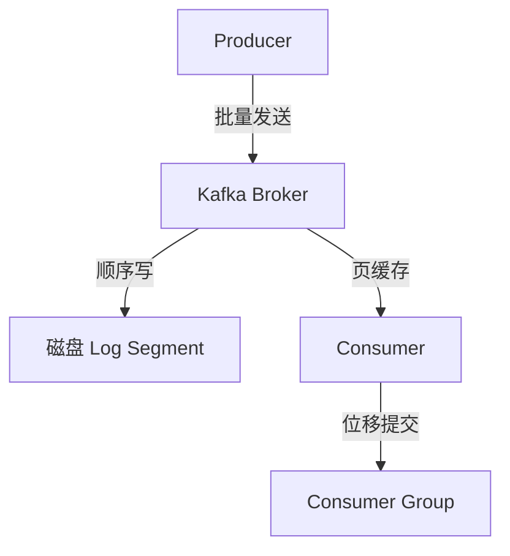

# 深入理解 Kafka 事件机制系列

> Kafka 事件机制：Producer / Broker / Consumer 三角色深度解析。

## 系列导航表

| 序号 | 篇目 | 深度 | 一句话定位 |
|---|---|---|---|
| 1 | Kafka Producer 机制 | 特性 | 分区策略 + 批量发送 + 压缩 |
| 2 | Kafka Broker 存储 | 特性 | Log Segment + 页缓存 + 刷盘策略 |
| 3 | Kafka Consumer Group | 特性 | Rebalance + 位移提交 + 并行消费 |

## 全局心智模型

## 四层进阶路径

- L1 入门：从零开始认识事件驱动架构
- L2 特性：Kafka 机制 + RocketMQ 机制
- L3 专题：亿级消息堆积实战
- L4 整合：从零实现事件驱动框架 Demo

## 篇目状态

| 篇目 | 状态 |
|---|---|
| 1_KafkaProducer机制-特性.md | ✅ 已落地 |
| 2_KafkaBroker存储-特性.md | ✅ 已落地 |
| 3_KafkaConsumerGroup消费-特性.md | ✅ 已落地 |