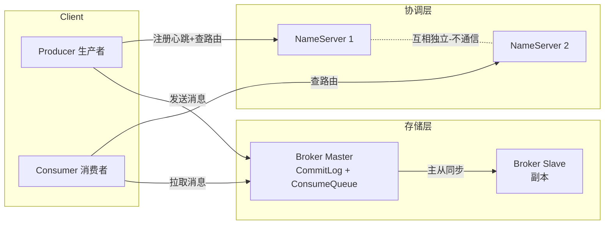
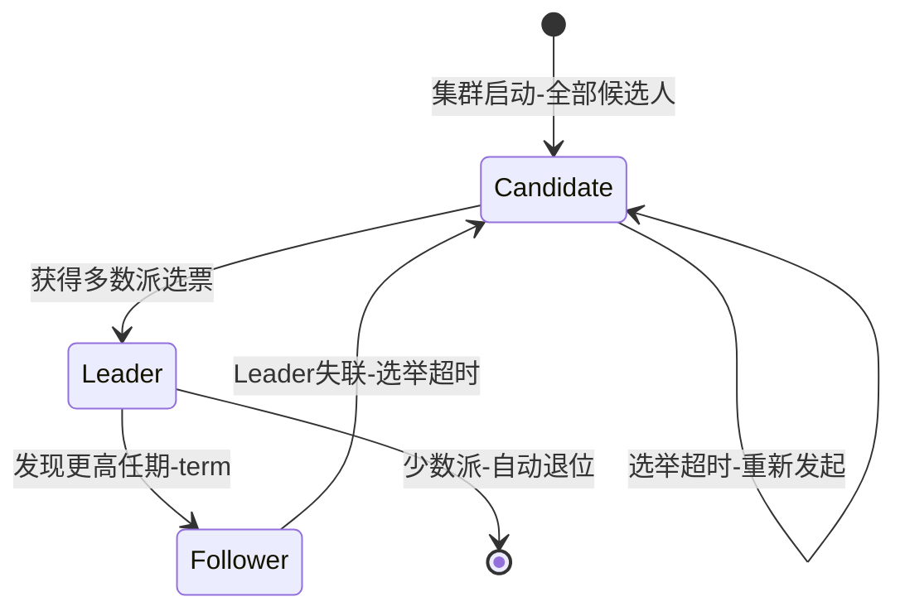
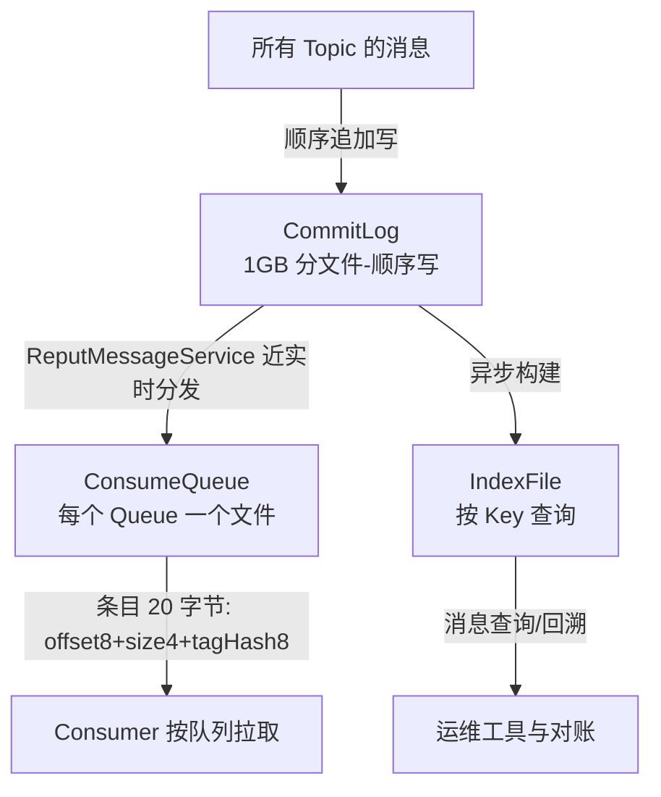
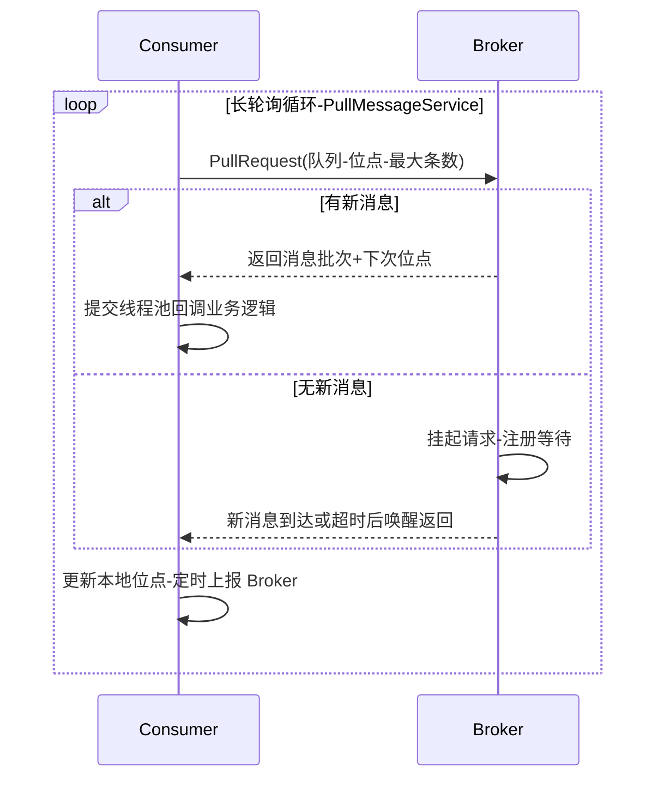

# RocketMQ 架构与消息模型深度解析

> **一句话摘要**:RocketMQ 的架构本质是「无状态路由(NameServer)+ 单文件顺序写存储(CommitLog)+ 逻辑队列索引(ConsumeQueue)」三件套——用读时多级索引换写时顺序吞吐,用 AP 设计的注册中心换故障时的持续可用,这是它支撑金融级事件驱动链路的底层原理。

## 🎯 本文核心

**核心机制一句话**:RocketMQ 把「消息写入」收敛为单文件顺序追加(CommitLog),把「按队列消费」降级为对 CommitLog 的只读索引(ConsumeQueue),把「集群协调」压到最薄(NameServer 无状态、不互连)——写路径极致简单,复杂度全部转移到了读路径与协调路径。

**机制链**:客户端路由发现 → NameServer 无状态路由 → Broker 主从复制(Dledger 判主)→ CommitLog 混存顺序写 → ConsumeQueue/IndexFile 索引分发 → Push(长轮询 Pull)消费投递。

事件驱动架构里,消息中间件是「事件的事实总线」:上游把「已发生的事实」写成不可变事件,下游按自己的节奏消费。RocketMQ 的一切设计都围绕一个目标——**让「事实落盘」这条路径快且不丢**。这篇从架构四件套(NameServer/主从/存储/消费投递)把机制穿透到底。

---

## 一、NameServer:为什么路由中心要「无状态」

### 1.1 机制:注册、心跳、剔除

NameServer 是整个集群最轻的角色,每个节点互相独立、彼此不通信、不持久化路由元数据。它只维护一张内存路由表,生命周期由三个动作构成:

| 动作 | 默认行为(公开口径) | 说明 |
|---|---|---|
| 注册 | Broker 启动时向**每台** NameServer 全量注册 | 一对多广播,不是选一台 |
| 心跳 | Broker 每 30s 发一次心跳包,携带全部 Topic 配置 | 心跳即注册,顺带更新路由 |
| 剔除 | NameServer 每 10s 扫描,120s 无心跳则移除该 Broker | 被动等待,不主动探测 |

客户端(Producer/Consumer)启动时从 NameServer 拉一次路由,之后每 30s 定时刷新。也就是说:**路由信息在 NameServer、客户端缓存、Broker 实际状态三个地方各有一份,靠时间窗口最终对齐**。

**设计思想**:这是一次典型的 CAP 取舍——消息路由场景要的是「注册中心永远能答」(AP),不是「答案永远最新」(CP)。ZooKeeper 是 CP:选举期间整个集群不可用,而 RocketMQ 认为「拿着 30 秒前的旧路由继续发消息」远好过「路由服务整体不可用」。

**追问:为什么不选 ZooKeeper 做注册中心?** Kafka 早期就依赖 ZooKeeper。RocketMQ 团队的答案写在架构里:ZK 的一致性协议(ZAB)要求多数派写成功才算数,给路由注册这种高频写场景引入了不必要的延迟;更致命的是 ZK 选举窗口内不可写,而消息发送不能等任何人投票。NameServer 牺牲一致性(各节点数据可能有秒级差异),换来「任意一台活着,集群就能工作」。

**再追问:各节点路由不一致,会不会发错地方?** 会,但危害被三个机制兜住:①客户端拿到失效路由发送失败后,会触发**即时路由刷新**(发送异常驱动,不等 30s 周期);②Broker 心跳携带全量 Topic 配置,恢复后自动重新注册;③路由错误的表现是「发送失败可重试」,而不是「发错数据」。最坏情况是分钟级的发送失败窗口,不会产生脏数据。

**打破砂锅问到底:那 Broker 宕机后,为什么客户端最长要等几分钟才彻底切走?** 时间窗口是叠加的:NameServer 要 120s 才剔除死 Broker,客户端刷新周期又是 30s,所以最坏 150s 内客户端还拿着死地址。这解释了一个经典线上现象——**切换期间靠发送端重试硬扛**,而不是靠路由秒级收敛。这也是为什么生产环境发送端必须开重试(默认同步发送重试 2 次,公开口径),它是路由收敛窗口内的最后防线。

### 1.2 事故复盘:路由缓存窗口引发发送失败风暴

一次线上事故:机房网络抖动导致某 Broker Master 掉线 3 分钟后恢复。期间 NameServer 已把它剔除,但恢复后的前几十秒,部分客户端还缓存着旧路由,向它发送消息时连接被拒,发送失败率突增。排查时先看到的是「发送超时」,一度误判为 Broker 性能问题;复盘下来根因是**路由三层缓存(客户端 30s + NameServer 120s + 发送端本地重试)的收敛顺序**:恢复后的 Broker 还没重新注册成功,客户端却已经拿到(旧)路由。教训沉淀为两条:发送端必须容忍「路由可达但 Broker 未就绪」的瞬态失败并重试;发布/网络变更窗口要预留路由收敛时间,不能改完立刻压测。

---

## 二、主从复制与 Dledger 判主:可靠性与自动切换

### 2.1 主从同步的两种姿态

4.x 经典架构下,Broker 以「1 主 N 从」为一组,Master 承接读写,Slave 只做备份与读分担。复制策略由 `brokerRole` 决定:

| 模式 | 行为 | 代价 | 适用 |
|---|---|---|---|
| ASYNC_MASTER | Master 写完立即返回,Slave 异步追 | 主挂可能丢最后一段消息 | 日志/埋点等可容忍场景 |
| SYNC_MASTER | Master 等 Slave 写完成功才返回 | 发送延迟增加一个内网 RTT | 资金/订单等不丢场景 |

与刷盘模式(`flushDiskType`:SYNC_FLUSH 同步刷盘 / ASYNC_FLUSH 异步刷盘)正交组合。金融级事件链路的业内惯例是「同步刷盘 + 同步复制」四件套全开,代价是单条消息发送延迟显著上升(毫秒到几十毫秒级,业内认知)。

**追问:为什么有了同步复制还要同步刷盘?** 它们防的是不同的死法。同步复制防「Master 机器整个没了」(磁盘烧了、机器失联),Slave 上有副本;同步刷盘防「Master 进程挂了但机器还在」——异步刷盘时消息只落在页缓存(Page Cache),进程崩溃后操作系统会把页缓存刷下去,但**机器掉电**时页缓存数据就没了。两个开关组合成四种可靠性档位,按业务容忍度选,这是典型的 Trade-off:每一级可靠性都直接换走一部分吞吐。

### 2.2 Dledger:用 Raft 把「人工切主」变成「自动判主」

经典主从的死穴在「切换」:Master 挂了,Slave 不会自动接管,需要人工(或外部脚本)改配置重启,恢复时间以分钟到小时计。Dledger 用 Raft 协议解决这件事:一组 Broker(3 或 5 副本)通过多数派选举选出 Leader,写入必须多数派落盘才算成功,Leader 挂掉后剩余节点秒级自动选出新 Leader。

**为什么不选 keepalived/VIP 这类传统高可用方案?** 因为它们是「网络可达性感知」,不是「数据一致性感知」:VIP 漂移只看心跳,不关心新主是否拥有全部已确认消息,切换后可能出现「新主缺消息」的数据空洞,极端情况双写脑裂。Raft 的多数派写入从协议层面保证「新 Leader 必然拥有所有已提交数据」——判主的依据是**复制位点**,不是网络连通性。这就是 5.x Controller 模式的思路来源:即使保留经典主从的存储形态,也引入一个轻量协调者基于副本位点做主切换(5.x 能力,公开口径)。

**设计取舍的代价**:Dledger 3 副本意味着每条消息至少写 2 台机器才算成功,存储成本翻 3 倍、写入吞吐约为单机的少数派水平;而且 Dledger 把 CommitLog 换成了自有文件格式,与经典主从的存储不完全兼容,迁移有成本。所以业内常见姿势是:普通业务用经典主从+同步复制(人工或 Controller 切换),资金链路才上 Dledger。

---

## 三、CommitLog 混存与 ConsumeQueue:存储引擎的「一招鲜」

### 3.1 机制:所有 Topic 混写一个逻辑大文件

RocketMQ 存储层最核心的一个决定:**所有 Topic 的消息,不管谁发给谁,统统顺序追加写进同一个 CommitLog**(逻辑上单队列,物理上按 1GB 切文件,公开口径)。消息在 CommitLog 里只有「一串带自描述头的二进制」,甚至不区分 Topic 排列顺序。

那消费怎么找消息?靠两套旁路索引:

- **ConsumeQueue**:每个 Topic 的每个 Queue 一个文件,条目定长 20 字节(CommitLog 物理偏移 8B + 消息大小 4B + Tag 哈希 8B,公开口径)。它不存消息体,只存「指针」。
- **IndexFile**:哈希索引,支持按业务 Key(如订单号)与时间区间反查消息,用于问题定位与对账,不参与主消费路径。

**设计思想——为什么这么设计?** 把「多队列随机写」归并为「单文件顺序写」。消息中间件的写入瓶颈几乎都在磁盘随机 IO:Topic 一多,「每个 Topic 一个文件」就意味着写指针满天飞,磁盘磁头(或 SSD 的写放大)被来回拉扯。混存之后,无论 1 个 Topic 还是 1 万个 Topic,磁盘看到的都是同一条顺序写流——这是 RocketMQ 敢宣称「万级 Topic 依旧高吞吐」(公开口径)的底层底气。

**追问:为什么不用一个 Topic 一个文件的方案?** 这正是 Kafka 的经典做法(每个 Partition 一个日志文件)。它的优势是消费路径简单(直接顺序读日志),但在 Topic/分区数量暴涨时退化明显:每个分区都有独立文件与写指针,文件句柄数、页缓存碎片化、刷盘线程都随分区数线性膨胀。Kafka 社区后来用 KRaft 与分层存储缓解,但「分区数上限」的认知依然存在。RocketMQ 用「写时混存 + 读时索引」把 Topic 数量与磁盘写模式解耦,代价是**消费读 CommitLog 时可能退化成随机读**(冷消息不在页缓存时),需要靠 ConsumeQueue 的局部性 + 操作系统预读来兜底。

**再追问:混存会不会让单个 Topic 的读写互相拖累?** 会,这就是「邻居效应」:一个大流量 Topic 的高峰会推高整台 Broker 的 CommitLog 写入水位,所有 Topic 共享这个天花板。业界对应手段是物理隔离——重要业务拆独立 Broker 组/独立集群,把「爆炸半径」圈起来。混存换来了写吞吐,代价是故障与容量必须按「集群」而不是按「Topic」规划。

### 3.2 写路径:页缓存 + MMAP + 文件预热

CommitLog 写入链路(机制穿透):Producer 消息到达 → Broker 把消息体追加写入 MappedByteBuffer(MMAP 内存映射文件)→ 数据先落在页缓存 → 异步刷盘线程批量刷回磁盘(SYNC_FLUSH 时由同步刷盘线程等待落盘再返回)。文件首次创建时会做**预热**:把新文件全量写零并提前翻页,避免首次写入时缺页中断集中爆发。这解释了两个业内常识:①消息写入为什么快——多数情况下「写消息」只是写内存页;②为什么异地灾备恢复后第一次消费特别慢——冷数据不在页缓存,读走真磁盘。

### 3.3 事故复盘:冷读拖垮整台 Broker

一次复盘过的线上故障:某下游服务从积压的陈旧位点开始追消息(跨度一周),大量 CommitLog 文件早已被逐出页缓存,消费变成真·磁盘随机读,磁盘 util 飙到高位,连带同 Broker 的**写入**延迟一起劣化(读写共享磁盘与页缓存)。排查路径:先看消费位点时间跨度 → 再看磁盘 IO 指标与页缓存命中率 → 定位到冷读。治理手段:限流追读速度、给冷数据单独窗口消化、容量规划时把「堆积恢复读」算进磁盘预算。教训:**堆积不只是消费侧问题,恢复过程本身是对存储层的一次压力测试**。

---

## 四、Push 的本质:披着 Push 外衣的长轮询 Pull

### 4.1 机制:两条路径,一个真相

RocketMQ 对外提供 Push 与 Pull 两种消费 API,但**Broker 从不真正向客户端推数据**。所谓 PushConsumer,底层是一个「长轮询循环」:

这个设计的取舍很清晰:**Pull 的位点控制权 + Push 的实时体验**。真 Push(Broker 主动推)有三个难处:推太快客户端打爆、推慢了吞吐上不去、客户端挂了推发送丢;真 Pull(纯客户端轮询)则延迟等于轮询间隔。长轮询把两头的好处合起来:无消息时请求在 Broker 端挂起(数秒级超时,业内口径),有消息立即返回,延迟接近 Push;流量控制权在客户端(拉多少、什么时候拉),背压天然成立。

**打破砂锅问到底:位点(Offset)存在哪、什么时候提交?** 集群消费模式下位点以消费组为单位存 Broker 端,客户端**定时批量**上报(默认数秒周期,公开口径)。这个设计的代价:消费者崩溃重启后,会从「上次上报的位点」继续,期间已处理但未上报的消息会被**重复投递**——所以事件驱动链路的铁律「消费端必须幂等」,根源就在这里,不是工程洁癖而是机制必然。

### 4.2 消息模型:Topic、Queue 与消费组

事件驱动的语义模型可以一句话对应:Topic 是「事件类型」,MessageQueue 是「事件的分片日志」,消费组是「一个订阅方」。同一消费组内,一条消息只被组内一个消费者处理(负载均衡);不同消费组各自独立消费全量(广播传播)。Queue 数量决定组内并行度上限——**消费者实例数超过 Queue 数量的部分完全空闲**,这是容量规划的第一公式。

---

## 五、量级演进:同一套架构,三个完全不同的问题

架构不分级地谈「性能」没有意义。以「日消息量」为主轴拆三档(所有数字为行业认知口径,具体以实测压测为准):

| 档位 | 典型形态 | 思考方式 |
|---|---|---|
| 日均十万级 | 单 Master + 单 Slave,异步复制 | 够用驱动:先把事件链路跑通,不为不存在的量级预付复杂度 |
| 日均千万级 | 多主多从 + 同步复制 + 3 台 NameServer | 故障域驱动:预演主从切换、监控主从延迟,按「机器会挂」来设计 |
| 日均亿级+ | Dledger 多副本或多集群分域 + Topic 拆分 | 瓶颈驱动:自下而上盘点磁盘/网络/元数据,触发分域升级 |

三档各自的约束来源与核心问题,逐档展开:

- **日均十万级**,约束来源是「人与流程」而不是机器——单机磁盘顺序写能力远超此量级,硬件不会先成为瓶颈。这一档的核心问题是「把事件链路跑通并留好观测」,而不是「高可用与扩展性」。
- **日均千万级**,约束来源是故障恢复时间(RTO)与不丢消息(RPO)的硬性要求。这一档的核心问题是「机器挂掉时消息不丢、链路快速恢复」,而不是「单集群极限吞吐」。
- **日均亿级+**,约束来源是单集群元数据规模、混存邻居效应与切换爆炸半径。这一档的核心问题是「水平扩展与故障隔离」,而不是「再压榨单机 10% 性能」。

**自下而上推一遍边界**:单块 NVMe 盘顺序写能力在 GB/s 量级,混存后单 Broker 写入上限取决于刷盘策略与副本协议(同步刷盘+同步复制时显著下降,业内认知);单集群上限再被 NameServer 内存路由表与运维复杂度封顶。对处于任意档位的集群来说,这一档的核心问题是「找出当前最先饱和的那块资源」,而不是「所有指标一起优化」。**触发升级的信号**:磁盘 IO 持续高位、主从复制延迟曲线抬头、堆积恢复时间超过业务容忍窗——三者任一出现,就该从「加机器」升级到「拆集群」。

## 六、源码/关键路径

以 4.x 客户端与 Broker 源码为参照(类名为公开源码口径):

| 路径 | 关键类/方法 | 发生了什么 |
|---|---|---|
| 路由发现 | `MQClientInstance.updateTopicRouteInfoFromNameServer` | 定时 30s + 发送异常触发,拉全量路由更新本地表 |
| 心跳注册 | `BrokerController` 注册任务 + `RouteInfoManager.registerBroker` | 心跳携带全量 Topic 配置,内存表原地更新,最后心跳时间戳刷新 |
| 剔除检测 | `RouteInfoManager.scanNotActiveBroker` | NameServer 每 10s 扫描,120s 无心跳移除 |
| 消息写入 | `DefaultMessageStore.putMessage` → `CommitLog.putMessage` | 加锁追加写 MappedByteBuffer,构造存储耗时统计 |
| 索引分发 | `ReputMessageService` → `CommitLogDispatcherBuildConsumeQueue/Index` | 后台线程从分发位点重放 CommitLog,近实时构建两套索引 |
| 长轮询 | `PullMessageProcessor` + `LongPollingService`(PullRequestHoldService) | 无消息挂起请求,消息到达或超时唤醒补一次拉取 |
| 主从复制 | `HAService`(经典)/ Dledger `DLedgerEntryPusher`(Raft) | 经典模式 Slave 长连接拉 CommitLog;Dledger 多数派投票+日志复制 |

## 七、业内惯例/生产实践

1. **NameServer 至少 3 台、跨机架部署**:无状态所以可以随意重启,但全挂了新客户端起不来(老客户端靠缓存还能撑)。
2. **发送端重试必须开,且要处理重试引发的重复**:路由收敛窗口、Broker 瞬态失败都靠它兜底;重试意味着同一消息可能落盘多次,消费幂等是配套必选项。
3. **可靠性四件套按业务选档**:日志/埋点「异步刷盘+异步复制」即可;资金链路「同步刷盘+同步复制」,并接受对应的延迟上升。
4. **监控三张仪表盘**:存储层(页缓存命中率、刷盘耗时、主从延迟)、路由层(心跳剔除事件)、消费层(堆积量、位点时间跨度)。
5. **容量规划把「堆积恢复」算进去**:磁盘预算按峰值流量+最大可容忍堆积时长推,而不是按稳态流量。
6. **升级 5.x 优先考虑 Controller 模式而非全量 Dledger 化**:保留经典存储形态、获得自动切换,迁移成本最小(公开口径)。

## 八、什么时候用/不用:RocketMQ 架构形态选型

| 需求场景 | 推荐形态 | 明确推荐理由 |
|---|---|---|
| 事件驱动改造起步,量级十万级/日 | 经典主从(1主1从)+ 异步复制 | 架构最简,故障人工恢复可接受,先跑通事件语义 |
| 订单/交易类事件,量级千万级/日 | 经典主从 + 同步复制 + 自动告警 | 不丢优先于自动切换,复制位点清晰可控 |
| 资金/对账类,要求自动故障切换 | Dledger(3副本)或 5.x Controller 模式 | 多数派写入从协议层消除数据空洞与脑裂 |
| 海量 Topic(数千+)共享集群 | RocketMQ 混存架构本身就是理由 | 万级 Topic 顺序写不退化(公开口径),优于分区制架构 |
| 不建议选择/需改造 | 强一致跨库事务场景指望消息架构本身 | 消息中间件提供的是可靠投递,不是分布式事务——事务语义见系列下一篇 |

## ⚖️ Trade-off:这套架构牺牲了什么

| 设计选择 | 换来的 | 牺牲的(代价) |
|---|---|---|
| NameServer 无状态、不互连 | 部署极简、任意节点可服务、无选举不可用窗 | 路由最终一致,故障剔除最坏分钟级窗口 |
| CommitLog 全量混存 | 万级 Topic 顺序写、磁盘吞吐拉满 | 消费随机读风险、邻居效应、容量只能按集群规划 |
| ConsumeQueue 轻量索引 | 消费定位 O(1),索引文件极小 | 依赖近实时分发线程,索引落后时消费不可见 |
| 长轮询模拟 Push | 背压在客户端、延迟接近实时 | 位点异步提交 → 重复投递是常态,幂等成本转嫁业务 |
| SYNC 同步刷盘/复制 | 机器级、进程级故障都不丢消息 | 单条延迟上升、吞吐下降,费用换可靠性 |

## ❓ 你们可能会问

**Q1:NameServer 全挂了会怎样?**
A:存量客户端靠本地路由缓存继续收发,短期内无感;新客户端无法启动,客户端扩容/重启受阻,且 Broker 上下线不再生效。所以它「不太重要」是错觉——数量可以少,但不能没有。

**Q2:消费者实例数超过 Queue 数量会怎样?**
A:多余的实例分不到队列,纯空转。组内并行度上限 = Queue 数,这是硬天花板;要更多并行只能扩 Queue(注意 4.x 扩 Queue 的运维约束)或拆分消费组。

**Q3:CommitLog 顺序写单文件,会不会成为单点瓶颈?**
A:会到达瓶颈,但位置比直觉高。顺序写 + 页缓存让单机写能力远超多数业务量级(业内认知);真到瓶颈时,解法不是「拆 CommitLog」而是「加 Broker 组」——水平扩展单元是 Broker 组,不是文件。

**Q4:为什么消息会重复投递,官方能不能干脆做成不重复?**
A:机制上位点异步提交决定了「至少一次」;要「精确一次」需要位点提交与业务提交原子化,这会把存储引擎与业务事务绑死,代价远大于让业务做幂等。业界共识是把幂等下放到消费端。

## 🤔 思考与开放问题

- **注册中心 AP 化的边界在哪里**:路由可以最终一致,但事务回查(下一篇)这类「必须问到人」的协调,无状态路由就不够了——协调语义的强弱决定角色设计的分野,这条线值得继续追。
- **混存与分区制的长期演化**:Kafka 走 KRaft+分层存储,RocketMQ 坚持混存+索引,两条路线在 Serverless/存算分离时代会不会殊途同归?
- **反思**:本文所有「秒级/分钟级」窗口均为公开默认口径,换版本、调参数后全部要重验——记住机制,不要背数字。

## 💡 实战提示

- 💡 发送失败的第一反应不是重启,而是确认是不是路由收敛窗口:看 NameServer 剔除日志与客户端路由刷新时间戳,能省一半排查时间。
- 💡 给消费组扩容前先数 Queue 数量,超过 Queue 数的实例是纯浪费;反过来 Queue 数远大于并行需求时,扩 Queue 要评估对消费位点的扰动。
- 💡 监控主从复制延迟比监控磁盘空间更重要:复制延迟是主从切换 RPO 的直接预告,延迟曲线抬头往往比故障发生早几十分钟。
- 💡 冷数据追读(从陈旧位点补消费)要限速:它制造的磁盘随机读会连坐写入路径,大促前尤其要清理长期未消费的空洞位点。

## 🎯 核心带走

**核心一句话**:RocketMQ = 无状态路由(NameServer)+ 单文件顺序写(CommitLog)+ 只读索引(ConsumeQueue)+ 长轮询 Push——写路径做减法,复杂度转移到读路径与协调路径。

**机制链复述**:客户端 30s 拉路由 → NameServer 心跳注册/120s 剔除(最终一致)→ Master 同步/异步复制到 Slave(Dledger 用 Raft 多数派自动判主)→ 所有 Topic 混存顺序追加 CommitLog → Reput 线程近实时构建 ConsumeQueue/IndexFile → 消费端长轮询拉取、位点异步提交。

**失效点/边界**:路由最终一致(分钟级收敛窗)、混存邻居效应(容量按集群规划)、位点异步提交(必须幂等)、同步可靠性开关(延迟换不丢)。记住机制与取舍,数字以当前版本实测为准。

---

## 📌 数据与事实声明

- 写于 2026-09-15,机制描述以 RocketMQ 4.x 为主、5.x 能力(Dledger/Controller)单独标注,以官方文档与公开源码为基准。
- 文中时间窗口(30s 心跳、120s 剔除、30s 路由刷新、1GB 文件切分、ConsumeQueue 条目 20 字节等)为社区公开默认配置口径,可配置项以实际部署版本为准。
- 吞吐、延迟、量级数字均为行业认知或公开口径的量级描述,不构成任何实测承诺,决策前请以自身业务压测校准。
- 事故案例均为公开技术社区高频问题的匿名化复述,不指向任何特定公司与环境。

## 📚 参考资料

| 资料 | 说明 |
|---|---|
| Apache RocketMQ 官方文档(rocketmq.apache.org) | 架构、配置默认值、4.x/5.x 能力差异的权威口径 |
| 《RocketMQ 技术内幕》 | 存储引擎与消息发送/消费源码级分析 |
| Apache RocketMQ GitHub 源码仓库 | RouteInfoManager、DefaultMessageStore、HAService 等关键类原文 |
| RocketMQ 官方设计文档(Design 页) | CommitLog/ConsumeQueue/IndexFile 与消息可靠性设计说明 |
