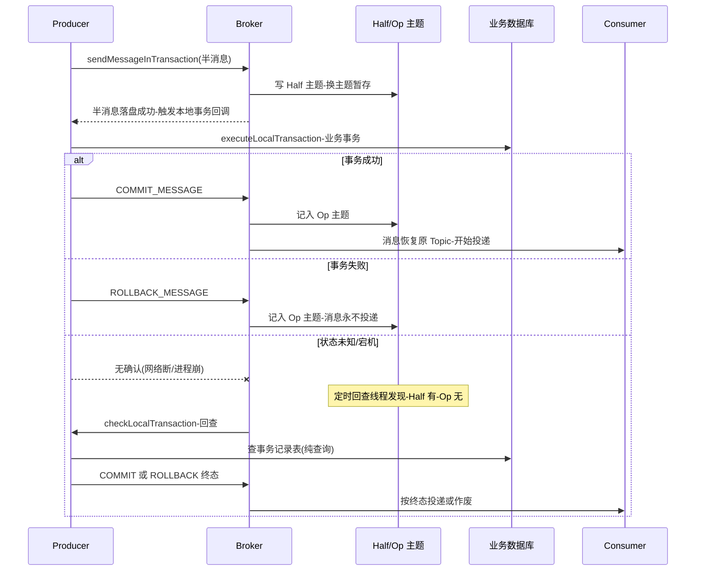
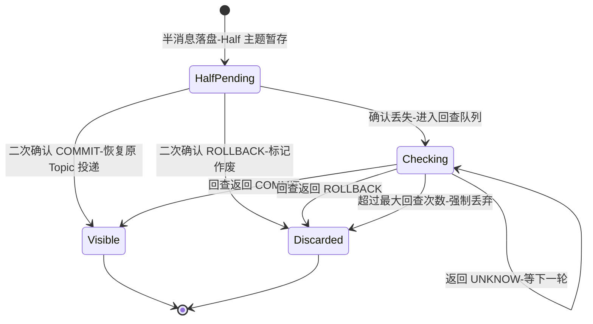

# RocketMQ 事务消息深度解析

> **一句话摘要**:RocketMQ 事务消息 = 半消息(Half,对消费者不可见的暂存)+ 本地事务 + 反向回查(补偿)——它不是分布式事务,而是用「两阶段确认 + 事后反查」把「业务写库」与「事件发布」这对原子性难题收敛到最终一致。

## 🎯 本文核心

**核心机制一句话**:把「先写消息还是先写库」的两难拆成两阶段——消息先以半消息形态落盘(消费者看不见),业务执行本地事务后二次确认;确认丢了,Broker 主动反向回查生产者,由业务用「查证」而不是「重做」来定终局。

**机制链**:发送半消息 → 执行本地事务 → 二次确认(Commit/Rollback)→ 确认丢失时 Broker 定时回查 → 查事务记录表(纯查询、无副作用)→ 超限丢弃(强制 Rollback)→ 消息对消费者可见/消失。

```mermaid
flowchart TD
    P[Producer] -->|1.发送半消息| B[Broker]
    B -->|半消息写入 Half 系统主题-消费者不可见| HB[(Half 主题)]
    B -->|2.半消息落盘确认| P
    P -->|3.执行本地事务| DB[(业务数据库)]
    P -->|4a.二次确认 Commit| B
    P -->|4b.二次确认 Rollback| B
    B -->|Commit: 恢复原 Topic-对消费者可见| C[Consumer]
    B -->|Rollback: 标记删除-永不投递| DEL[消息作废]
    HB -.5.确认丢失-定时回查.-> B
    B -.6.回查事务状态.-> P
```

事件驱动架构里最容易翻车的位置,就是「业务库的事务边界」与「事件的发布边界」不一致:库提交了、事件没发出去,下游永远不知道这件事发生了;事件发出去了、库回滚了,下游凭空处理了一个不存在的事实。事务消息就是给这条缝隙打的补丁。

---

## 一、问题定义:为什么「本地事务 + 发消息」天生不原子

把候选方案摆出来,问题就清楚了:

| 方案 | 流程 | 断点在哪 |
|---|---|---|
| 先写库,事务内发消息 | DB 事务中调 MQ 发送 | 发送是网络调用,拖长 DB 事务;发送成功但 DB 回滚 → 幽灵事件 |
| 先发消息,再写库 | 先投递后落库 | 库失败 → 下游消费到不存在的事实 |
| 本地消息表 | 业务同库存一条待发记录,异步扫表发 MQ | 可靠但要自建表/扫描/补偿,每条业务都要接入 |
| 事务消息 | 半消息 → 本地事务 → 二次确认/回查 | Broker 内置了「本地消息表」的角色 |

**追问:为什么不选「本地消息表」就够了,还要事务消息?** 本地消息表确实是最通用的解法,但它是每套业务都要重复自建的基建:建表、扫描任务、失败重试、人工补偿入口。RocketMQ 事务消息本质上是**把本地消息表下沉进了 Broker**——Half 系统主题就是那张「待确认表」,回查机制就是那个「扫描任务」,业务只剩两个回调要实现。代价是绑定了 RocketMQ 的特定 API,且回查只回答「事务成功没有」,不负责业务补偿本身。

**再追问:那事务消息为什么不干脆做成 XA 那样的强一致?** 因为消息链路的每一段(Broker 确认、网络、消费)都存在不可消除的中间态窗口,强一致要把所有参与方锁在同步协议里,消息中间件的高吞吐定位完全容不下。官方口径也是「最终一致」:半消息到二次确认之间,下游要么看不到事件,要么看到的事件一定对应一个已提交的事实——**不存在不一致,只存在延迟**。

---

## 二、半消息机制:对消费者「隐身」的消息

### 2.1 机制:换主题暂存,而不是锁起来

半消息的核心实现没有魔法:Broker 收到事务消息后,**把消息的主题与队列信息替换掉**,存进两个内部系统主题(源码口径,4.x/5.x 通用):

- `RMQ_SYS_TRANS_HALF_TOPIC`:所有待确认半消息都暂存到这里,原 Topic/QueueId 被挪进消息属性携带;
- `RMQ_SYS_TRANS_OP_HALF_TOPIC`:记录已被二次确认(Commit 或 Rollback)的半消息位点,相当于「已处理清单」。

回查线程扫描 Half 主题时,用 Op 主题做差集:**在 Half 不在 Op 的,才是真正悬而未决的半消息**。

**为什么这么设计,而不是给消息加个「不可见」标志位?** 因为 ConsumeQueue 是纯顺序索引,消费路径上做「逐条判断可见性」等于给全量消费加一个属性过滤分支;换主题暂存让正常消费路径零改动、零开销,把复杂度完全圈在回查线程里——与第一篇 CommitLog 混存是同一个设计思想:**让主路径保持愚笨而快,聪明逻辑放旁路**。

### 2.2 时序全景:正常路径与回查路径



**本地事务回调的纪律**:`executeLocalTransaction` 里只做「提交本地事务并返回终态」这一件事。它由半消息发送成功**同步触发**,如果业务在这里面又去调外部服务、又发别的消息,等于把两阶段协议又嵌套了一层不确定性——回查时的查证逻辑将无法自洽。

### 2.3 事故复盘:半消息堆积把消费延迟放大成 P0

一次公开技术社区同型的线上事故复述:某业务改造时把大量「非关键」通知类消息也换成了事务消息,大促当天 Producer 频繁 Full GC,本地事务回调超时,大量半消息停留在「无确认」状态。表象是下游消费延迟飙升,排查初期误判为消费端性能不足,盲目扩了消费者毫无效果;直到有人注意到系统主题的堆积曲线与发送端 GC 曲线同频,才定位到半消息在等回查。复盘结论:回查间隔与次数有默认上限,半消息恢复确认前的这段时间,下游只能干等;**事务消息是「关键路径专用」工具,拿它当普通发送用,等于把所有事件都挂上了回查延迟的尾部风险**。

---

## 三、反向回查:用「查证」代替「重做」

### 3.1 机制要点:谁回查、查什么、什么时候放弃

回查的三个实现要点,每一个都直接对应一条业务纪律:

**要点一:回查的实现 = 查事务记录表,纯查询、无副作用。** `checkLocalTransaction` 被触发时,Broker 只需要业务回答「当时那笔事务成了没有」。正确姿势是查一张**事务记录表**(业务库中随本地事务同事务写入的一行状态记录:事务 ID + 状态),返回 COMMIT/ROLLBACK/UNKNOW。错误姿势是在回查里「顺便把没做成的事再执行一遍」——回查可能并发触发多次,重做逻辑会被重复执行,且它破坏了「回查只读」的语义。

```java
// 事务记录表是回查可靠性的根基(伪代码)
public LocalTransactionState checkLocalTransaction(MessageExt msg) {
    String txId = msg.getUserProperty("txId");
    // 纯查询:随本地事务同事务写入的状态行
    TxRecord record = txRecordDao.findByTxId(txId);
    if (record == null) {
        return LocalTransactionState.ROLLBACK_MESSAGE;  // 查无此事-按失败处理
    }
    switch (record.getStatus()) {
        case COMMITTED: return LocalTransactionState.COMMIT_MESSAGE;
        case ROLLED_BACK: return LocalTransactionState.ROLLBACK_MESSAGE;
        default: return LocalTransactionState.UNKNOW;   // 不确定-让 Broker 稍后再问
    }
}
```

**要点二:UNKNOW 不是安全牌,是「再给一次机会」。** 每次返回 UNKNOW,半消息继续留在 Half 主题等下一轮回查;回查有最大次数限制(默认 15 次,公开口径),超限后 Broker **强制 Rollback 丢弃**。这个「超限丢弃」的语义必须刻进业务设计里:它意味着「不表态」最终会被裁决为「失败」。如果一笔事务事实上成功但记录表写入延迟,超过回查次数后事件会被丢弃,下游漏掉这个事件——所以事务记录表必须与业务事务**同库同事务**写入,保证回查时一定能查到确定状态。

**追问:为什么超限后是丢弃而不是「一直保留等业务来认领」?** 因为无限保留等于放弃裁决:Half 主题会变成只进不出的沼泽,回查线程被海量僵尸半消息拖垮,殃及所有正常事务消息的回查时效。超限丢弃是用「有限代价的可预期失败」换「整个回查系统的健康」——丢弃后业务侧可以靠事务记录表对账发现「事务成功但事件未发出」,补发事件即可,这是一个可控的对账动作,而不是不可控的系统退化。

**打破砂锅问到底:回查一定能找到「当时」的那次事务吗?** 前提是查证依据是**持久化的状态**,而不是内存或临时判断。如果业务把事务状态放在本地缓存、或用「现在重查一下业务结果」代替状态记录,就会踩中「不可重放」的坑:本地事务是幂等查询还好,若是「查不到=没做过」的推断,遇到数据被后续流程修改,回查就会给出错误终态。所以事务记录表设计的本质,是给那次本地事务留下一个**可长期重放的证据**。

### 3.2 半消息的一生:一个状态机看懂裁决过程



这张图里最值得盯住的是 `Checking --> Discarded` 的两条边:一条是业务主动 ROLLBACK(体面收场),一条是超限强制丢弃(被裁决)。两者的下游动作相同——消息消失;但业务含义完全不同,后者必须靠事务记录表对账才能被发现。

### 3.3 生产者的「身份」:回查找的是哪个进程

回查是 Broker 主动回调**生产者进程**,这要求两点:①发送事务消息的生产者必须配置**唯一且稳定的 ProducerGroup**——Broker 靠组名找到回查目标;②同一组的多个实例必须实现**相同的回查逻辑**,因为回查可能命中组内任意一个存活实例,而不是「当初发消息的那个」。实例 A 发的半消息,可能由实例 B 被回查——这就是为什么查证必须依赖共享的事务记录表,而不是本地变量。第一篇讲过的「至少一次 + 幂等」在这里同样成立,而且更强:**回查协议从设计上就假设了「发消息的进程可能已经不在了」**。

---

## 四、与 Kafka 事务的机制差异:两套哲学

| 维度 | RocketMQ 事务消息 | Kafka 事务(EOS) |
|---|---|---|
| 要解决的问题 | 业务本地事务与消息发送的原子性 | 流处理「消费-处理-产出」跨分区/跨会话的原子性 |
| 核心机制 | 半消息暂存 + 业务回调 + 反向回查 | 事务协调器 + 多分区写事务标记 + 消费者隔离级别 |
| 参与者 | Broker 与业务进程来回交互 | 全部在 Kafka 内部闭环,业务无感 |
| 一致性语义 | 最终一致(有回查延迟窗口) | 读已提交(Read Committed)下的原子多写 |
| 失败恢复 | Broker 主动回查业务「查证」 | 协调器 epoch 隔离僵尸生产者,自动中止/提交 |
| 业务侵入 | 必须实现两个回调 + 事务记录表 | 用事务 API 即可,但仅覆盖「到 Kafka 为止」的链路 |

**设计哲学的分野**:Kafka 的事务解决的是「**自己家**的数据原子可见」——一批消息要么对消费者整体可见、要么整体不可见,它不关心你的数据库;RocketMQ 解决的是「**你家**的数据库与我家队列的一致」——把业务拉进协议,用回查把「业务的最终状态」问出来。所以「Kafka 事务更强/RocketMQ 事务更弱」是问错了问题:**两者的事务对象根本不同**。想让「DB 写入 + 事件发布」原子化,Kafka 的方案照样要绕回本地消息表或 Change Data Capture(如基于 binlog 的事件发布);RocketMQ 只是把这个行业难题内建成了产品能力。

**为什么不选「Seata/全局事务 + 普通消息」替代事务消息?** 全局事务(XA/TCC/AT)能保证多库强一致,但消息发布仍然悬在事务边界外;而全局事务的锁与协调开销会把事件驱动架构最看重的「上游吞吐」拖进同步协议。合理组合是:数据库强一致用本地事务兜住,跨服务一致性用事件驱动 + 事务消息,两把钥匙开两把锁。

---

## 五、量级演进:事务消息的适用边界随量级收窄

| 档位 | 事务消息占比建议 | 约束来源 | 思考方式 |
|---|---|---|---|
| 日十万级 | 可以全量事务化 | 半消息/回查开销远未触顶 | 简单驱动:统一用事务消息,减少心智负担 |
| 日千万级 | 只有关键链路事务化 | 回查线程与 Half 主题开始有水位压力 | 分级驱动:按事件关键度拆分普通/事务通道 |
| 日亿级+ | 事务消息仅保留在资金/履约等强约束链路 | 回查吞吐、事务记录表写入都是新增瓶颈 | 隔离驱动:事务链路独立 Broker 组,普通事件走旁路 |

逐档展开约束来源与核心问题:

- **日十万级**,约束来源是「几乎没有」——回查与半消息开销在此量级可以忽略。这一档的核心问题是「统一机制降低出错概率」,而不是「优化开销」。
- **日千万级**,约束来源是回查频率与本地事务耗时开始互相放大:本地事务慢 → 半消息滞留多 → 回查堆积 → 半消息可见性延迟进一步放大。这一档的核心问题是「控制事务链路的时长与占比」,而不是「继续叠加事务消息」。
- **日亿级+**,约束来源是事务记录表的写入吞吐与回查回调的网络往返,它们把业务库与 Broker 耦合成一个故障域。这一档的核心问题是「把强一致范围收敛到最小集」,而不是「全链路事务化」。

**自下而上推边界**:每条事务消息的存储成本 ≈ 两条消息(Half 暂存 + 确认后原 Topic)+ 回查的网络往返;对任意量级的链路来说,这一档的核心问题是「事务消息的固定开销占预算的比例还有多少」,而不是「单条消息还能不能再快一点」。**触发升级的信号**:Half 主题堆积曲线抬头、回查回调 P99 超过秒级、事务记录表写入延迟影响业务主链路——出现任一,先把非关键事件降级为普通消息,再考虑隔离部署。

## 六、源码/关键路径

| 路径 | 关键类/机制(公开源码口径) | 发生了什么 |
|---|---|---|
| 发送半消息 | `TransactionMQProducer.sendMessageInTransaction` | 同步发送,消息带 `TRAN_MSG=true` 属性,Broker 识别后换主题暂存 |
| Broker 暂存 | `EndTransactionProcessor` + `TransactionalMessageService` | 半消息写 Half 主题,确认操作写 Op 主题 |
| 本地事务回调 | `TransactionListener.executeLocalTransaction` | 半消息落盘成功后同步触发,返回 COMMIT/ROLLBACK/UNKNOW |
| 二次确认 | Producer 发 `END_TRANSACTION` 请求 | Commit:恢复原 Topic 转投;Rollback:标记删除 |
| 回查扫描 | `TransactionalMessageCheckService` | 定时扫描 Half 主题,对 Half 有/Op 无的条目发起回查 |
| 回查回调 | `TransactionListener.checkLocalTransaction` | 查事务记录表返回终态;UNKNOW 则等下轮,超限(默认 15 次,公开口径)强制 Rollback |
| 回查寻址 | Broker 按 ProducerGroup 回调 | 组内任一存活实例接住回查,要求全组回查逻辑一致 |

## 七、业内惯例/生产实践

1. **事务记录表是标配,不是可选**:与业务事务同库同事务写入(txId + 状态 + 时间),回查、对账、补偿全靠它;没有它的事务消息等于裸奔。
2. **回查逻辑必须无状态、可重入、幂等**:组内任意实例可被回查,多次回查必须给出同一答案。
3. **只把「不发不行」的事件事务化**:通知类、日志类事件用普通消息 + 下游补偿,不要让全量事件背上回查延迟。
4. **监控三个专项指标**:Half 主题堆积量、回查次数分布(多次才终态的比例)、超限丢弃数——超限丢弃数大于零就要人工介入对账。
5. **Consumer 端幂等依然必须**:事务消息解决的是「发不发」,不解决「收几次」;至少一次的投递语义贯穿始终。
6. **升级窗口**:Producer 发布时先灰度,半消息机制的排查难度高于普通消息,新链路先在低峰期验证回查路径。

## 八、什么时候用/不用:事务消息的决策边界

| 场景 | 推荐 | 理由 |
|---|---|---|
| 订单创建 → 发布订单已创建事件(库与事件必须同生共死) | 明确推荐事务消息 | 半消息 + 回查恰好覆盖「业务成功 ⇒ 事件必达」 |
| 资金扣减 → 发布扣减完成事件 | 推荐事务消息 + 事务记录表 + 对账兜底 | 关键链路,超限丢弃必须有对账闭环 |
| 通知/营销/日志类事件 | 不用事务消息,普通消息即可 | 丢失可容忍,不值得付双写与回查代价 |
| 需要多服务多库强一致 | 不选事务消息,选全局事务或 Saga | 事务消息只管「库→事件」这一段,不是分布式事务框架 |
| 下游只容忍「精确一次」 | 事务消息 + 消费端幂等组合 | 事务消息不改变至少一次投递,幂等不可省 |
| 已有成熟本地消息表体系 | 可以不迁移 | 事务消息与本地消息表语义等价,迁移收益看运维成本 |

## ⚖️ Trade-off:事务消息用便利换走了什么

| 得到 | 付出(代价) |
|---|---|
| 「业务成功 ⇒ 事件必达」开箱即用 | 双写开销:Half 暂存 + 确认转投,存储与 IO 近乎翻倍 |
| 回查替代业务补偿的「重做」 | 回查延迟窗口:确认丢失时,下游要等回查周期才能见到事件 |
| 协议由 Broker 内建,业务只剩两个回调 | 锁定 ProducerGroup 语义:组内逻辑必须一致,发布耦合度上升 |
| 超限丢弃保证回查系统健康 | 「不表态 = 失败」的裁决:慢事务可能被误杀,必须配对账 |
| 与本地事务自然衔接 | 只覆盖「库→事件」一段:跨服务一致性仍需 Saga/事件驱动自身保证 |

## ❓ 你们可能会问

**Q1:本地事务执行成功,但二次确认的网络包丢了,会发生什么?**
A:半消息滞留 → 到点被回查 → 业务查事务记录表返回 COMMIT → 消息补投。这正是回查存在的意义:确认丢失不影响最终一致,只增加一个回查周期的延迟。

**Q2:UNKNOW 到底什么时候该用?**
A:只在「此刻查证无法得出确定结论」时用——例如事务记录表本身短暂不可用。它不该被当成「先返回再说」的默认值:每一次 UNKNOW 都消耗一次回查机会,默认 15 次用完即被强制丢弃。

**Q3:回查返回 ROLLBACK 会不会把业务也回滚掉?**
A:不会。回查只裁决「消息发不发」,对数据库零作用力。业务失败后的数据恢复是本地事务自己(或业务补偿)的事——这也是「回查必须纯查询」的原因:它是只读的裁判,不是可写的执行者。

**Q4:半消息在 Half 主题里,运维工具能看到内容吗?**
A:能看到(它就是普通的系统主题消息),这正是排查半消息堆积的入口:按系统主题查堆积与最早未确认位点,配合 Op 主题判断哪些还在等待裁决。

## 🤔 思考与开放问题

- **回查协议的通用化**:「事后向状态拥有者查证」这个模式,其实适用于一切跨边界确认场景(支付回调、对账任务)。如果把事务记录表抽象成标准「事务日志」组件,回查思想能否从 MQ 上升到架构层?
- **未定论的取舍**:超限丢弃是「系统健康优先」,但代价是把不确定性转嫁给了对账。丢弃阈值多少次才对,社区没有定论——它本质是业务对「误杀概率 vs 沼泽风险」的容忍度函数。
- **反思**:事务消息最大的误区仍是把它当分布式事务。每次选型前先问自己:我要保证的是「事件必达」还是「多方强一致」?答案不同,工具完全不同。

## 💡 实战提示

- 💡 事务记录表的第一列永远是 txId,并且和业务事务**同库同事务**写入——这是回查可靠性的全部根基,其余都是细节。
- 💡 看到「下游延迟突然变大」先查 Half 主题堆积再扩容:半消息等待回查的延迟和消费能力无关,扩消费者是无效动作。
- 💡 给回查回调单独配线程池与超时,避免它和普通发送共享资源;回查被拖慢会放大成全量事务消息的可见性延迟。
- 💡 上线前做一次「回查演练」:手工 kill 掉发送进程模拟确认丢失,验证回查路径能拿到正确终态——这条路径平时不跑,第一次跑往往在生产事故里。

## 🎯 核心带走

**核心一句话**:事务消息 = 半消息暂存(换主题隐身)+ 本地事务(同步回调)+ 反向回查(查证代替重做,超限强制丢弃),把「库与事件的原子性」收敛为最终一致。

**机制链复述**:半消息落盘(Half 主题)→ `executeLocalTransaction` 提交本地业务事务 → 二次确认转投原 Topic 或作废 → 确认丢失时按 ProducerGroup 回查 `checkLocalTransaction` → 查事务记录表(纯查询)给终态 → UNKNOW 重试至超限丢弃(默认 15 次,公开口径)。

**失效点/边界**:回查延迟窗口(确认丢失时下游延迟可见)、超限丢弃(慢事务可能被误杀,需对账兜底)、只覆盖「库→事件」段(跨服务一致仍要 Saga/幂等消费)。与 Kafka 事务的差异是问题对象不同,不是强弱之分。

---

## 📌 数据与事实声明

- 写于 2026-09-15,机制以 RocketMQ 4.x 为主(5.x 事务消息机制未变),系统主题名与回调接口为公开源码口径。
- 回查间隔、最大回查次数(默认 15 次)等为社区公开默认配置,可配置项以部署版本实际配置为准。
- 量级建议与开销描述为行业认知口径,具体收益与损耗请以自身链路压测为准。
- 事故案例为公开技术社区高频问题的匿名化复述,不指向任何特定公司或环境。

## 📚 参考资料

| 资料 | 说明 |
|---|---|
| Apache RocketMQ 官方文档·事务消息篇 | 事务消息使用方式与语义的权威口径 |
| Apache RocketMQ 源码(TransactionalMessageService/TransactionalMessageCheckService) | Half/Op 主题与回查线程的实现原文 |
| Kafka 官方文档·Transactions | EOS 机制与 Read Committed 语义对照 |
| 《RocketMQ 技术内幕》 | 事务消息两阶段与回查的源码级分析 |
| 分布式系统一致性公开课程/论文(2PC、Saga) | 事务消息所属的最终一致谱系的理论背景 |
