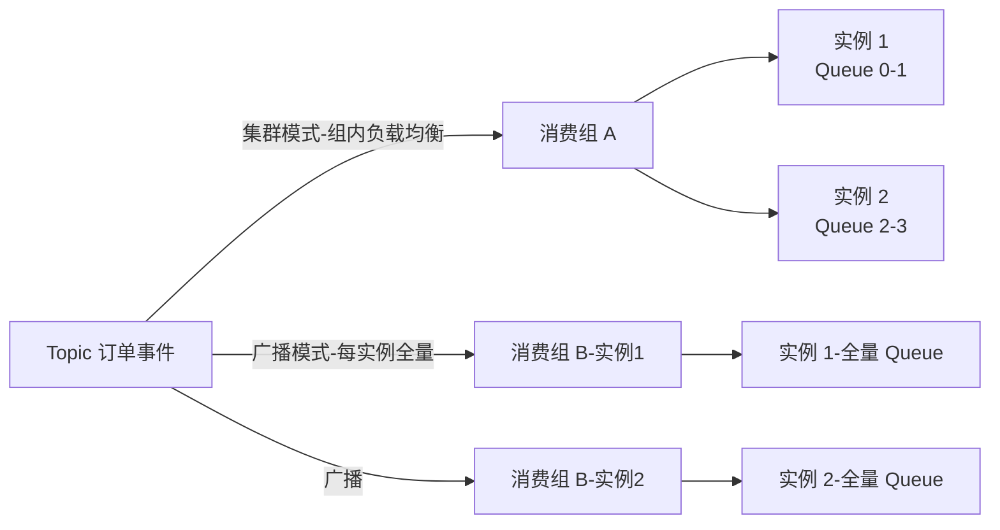
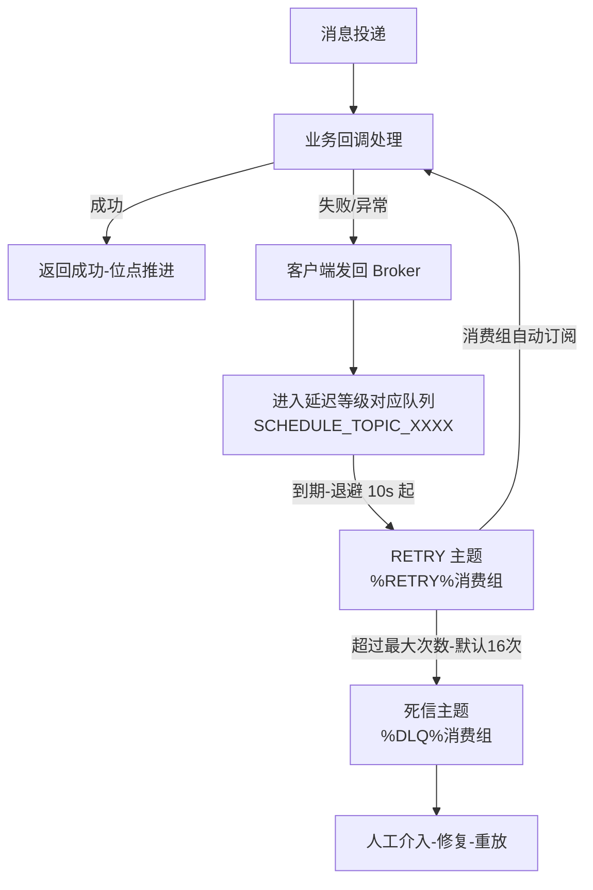
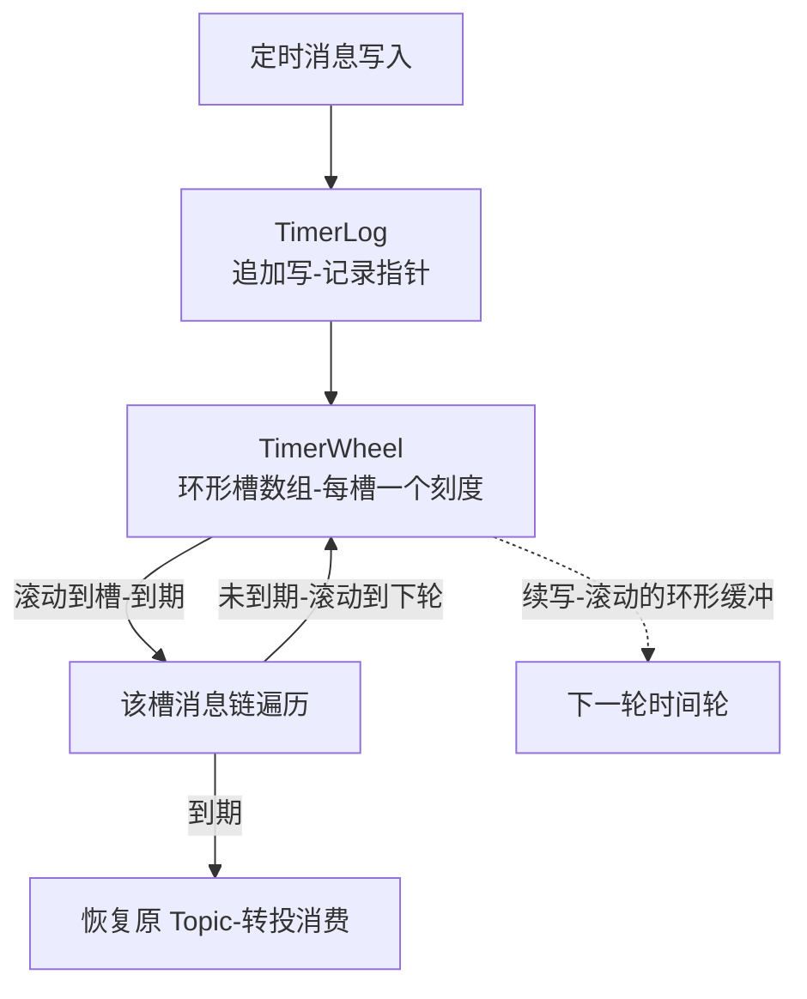

# RocketMQ 消费模式与延迟消息深度解析

> **一句话摘要**:消费侧的全部机制都在回答「一条事件该给谁、给几次、什么时候给」——集群/广播决定给谁(位点存哪),重试/死信决定给几次(失败后换主题再排队),延迟消息决定什么时候给(4.x 十八个等级的定时主题,5.x 时间轮的任意精度)。

## 🎯 本文核心

**核心机制一句话**:RocketMQ 不做「直接消费失败处理」,而是把一切失败与延时都翻译成「换一个系统主题重新排队」——重试进 `%RETRY%组名`,退避靠延迟等级,超限进 `%DLQ%组名`,定时靠 `SCHEDULE_TOPIC_XXXX`(4.x)或时间轮(5.x);消费语义的每个环节都是存储模型(第一篇)在消费侧的复用。

**机制链**:消费组订阅 → 队列重平衡分配 → 长轮询拉取 → 业务确认或返回失败 → 失败消息退避重试(RETRY 主题+延迟等级)→ 超限落死信(DLQ)→ 延迟消息走定时主题/时间轮到期转正 → 位点按集群(Broker 端)或广播(本地)提交。

上一篇解决了「事件发得出去、发得对」,这一篇解决「事件收得下来、收得准时」——事件驱动架构的最后一公里,往往比发送侧更容易出事故,因为消费速率是业务代码决定的,中间件只能帮你排队,不能替你消化。

---

## 一、集群与广播:位点存哪,决定了你得到什么

### 1.1 机制:一个开关,三处行为分叉

消费模式在客户端一个配置项(`MessageModel.CLUSTERING / BROADCASTING`),但它牵动三条完全不同的机制链:

| 维度 | 集群消费 | 广播消费 |
|---|---|---|
| 投递语义 | 组内一条消息只被一个实例处理 | 每个实例都处理全量消息 |
| 位点存储 | Broker 端(按消费组集中管理) | 消费者**本地文件** |
| 失败重试 | Broker 端重试队列 + 死信 | 客户端本地重试,无 Broker 重试/死信 |
| 位点回溯 | 可重置位点、可按时间回溯 | 本地位点,回溯要逐实例操作 |
| 典型场景 | 业务处理(订单、库存) | 配置刷新、本地缓存失效通知 |

**设计思想——为什么位点存储位置是分水岭?** 位点即状态,状态放哪决定谁替你兜底。集群模式的位点集中在 Broker,于是 Broker 有能力替消费组做「重试调度、死信隔离、位点重置」这些需要全局视野的事;广播模式位点散在每台机器,中间件对「谁消费到哪了」失去全局视野,自然也给不了重试与死信这些集中式服务——广播把可靠性责任完全还给了业务自身。这不是功能缺失,是「无中心状态下无法提供中心化服务」的机制必然。

**追问:广播模式为什么不做「每实例独立重试队列」?** 因为广播的消费组实例数是开放的:实例随时增减,若每个实例在 Broker 端各挂一套重试队列,Broker 要为「可能永远不会再来消费的僵尸实例」保管队列与死信;而广播语义下每实例都要全量处理,重试本来就是实例私事,放客户端本地循环即可。Broker 只为「有明确身份(消费组+队列分配)」的集群模式提供托管,这个边界划得非常克制。

**再追问:什么场景下广播是错误选择?** 判断依据是「下游处理是否需要全量 + 是否可幂等 + 失败是否可容忍」。配置刷新类天然满足;但把「订单事件」用广播消费,以为能简化订阅,结果是每台机器处理全量订单、本地磁盘存位点、机器换名位点丢失——三个月后运维会回来找写这个配置的人。业内共识:**广播只用于「实例级副作用」(刷新本地缓存/本地监控),业务数据流转一律集群模式**。

### 1.2 队列分配:消费并行的天花板在第一篇就定好了

集群模式下,Rebalance 线程按分配策略(默认平均分配,另有环形/机房就近等,公开口径)把 Queue 分给组内实例。两个硬约束值得刻进容量规划:**实例数超过 Queue 数的部分空闲**;Rebalance 期间队列在实例间迁移,存在秒级的「重复消费窗口」(旧实例位点未提交、新实例从头拉),这是幂等要求的又一个来源。

---

## 二、重试队列与死信:失败不是异常,是又一次排队

### 2.1 机制:RETURNS_CONSUME_FAILURE 之后发生什么

业务回调返回失败(或抛异常)后,消息并不原地重试,而是走一条「换主题再排队」的链路:

关键细节(源码与公开文档口径):重试消息先按「下一次重试对应的延迟等级」写入 `SCHEDULE_TOPIC_XXXX`,到期后转入 `%RETRY%+消费组名` 主题——**每个消费组自动订阅自己的 RETRY 主题**,所以重试对业务代码透明;累计失败超过 `maxReconsumeTimes`(默认 -1,即 16 次)后进入 `%DLQ%+消费组名`,死信主题**不会被自动消费**,必须人工处理或工具重放。

**退避为什么用延迟等级实现?** 因为第一篇的延迟机制已经能把消息「推迟到指定时刻」,重试退避直接复用:第 1 次重试等 10s、第 2 次 30s、第 3 次 1m……逐级拉长到 2h 封顶(默认序列,公开口径)。一次机制建设,两处收益——这是「存储模型即平台」的又一次兑现。

**打破砂锅问到底:为什么重试要「换主题」,而不是在原队列里原地重发?** 原地重发会把「毒丸消息」(永远处理失败的消息)卡在队列头部,阻塞同队列的正常消息——顺序消费场景尤其致命。换到 RETRY 主题后,正常消息的位点照常推进,失败消息在自己的管道里按退避节奏慢慢来;死信同理,把「需要人工干预」的消息隔离出主链路。这是队列论里经典的「隔离坏消息」策略,代价是多两次写放大与一条额外的订阅关系。

### 2.2 事故复盘:一次死信无人认领导致的资金对账差异

一次公开技术社区同型的真实复盘:某下游服务改造时删掉了一个消费组,但没人处理它的死信主题里已积压的死信;一个月后对账发现一批事件「消费组收过却没有落库」。排查路径:先查消费位点(显示已消费)→ 再查业务库(无记录)→ 最后在废弃消费组的 DLQ 主题里找到这批消息,时间戳正好是改造当晚。根因是消费回调里有一段依赖已下线服务的逻辑,改造后必然失败,重试 16 次后集体进死信,而告警只配了「堆积量」,没配「死信量」。复盘沉淀:死信必须有**独立告警 + 认领责任表**(哪个消费组的死信归谁处理),死信重放前先验证业务代码已修复——**死信重放等于再次执行业务逻辑,带病重放等于二次事故**。

---

## 三、延迟消息:从十八个等级到任意精度

### 3.1 4.x:十八个固定等级与定时主题

4.x 的延迟消息用「预定义等级 + 定时主题」实现:消息带 `DelayTimeLevel`(1~18,对应 1s/5s/10s/30s/1m/2m/3m/4m/5m/6m/7m/8m/9m/10m/20m/30m/1h/2h,公开口径),Broker 写入时**替换主题**为 `SCHEDULE_TOPIC_XXXX`,queueId = 等级-1;定时调度服务(`ScheduleMessageService`,内部就是一个按等级分队列的定时轮询器)扫描到期的消息,恢复原主题重新投递。

**为什么是这十八个等级?** 它们是「订单超时关闭/重试退避/延迟通知」类业务的高频延时集合,更是**实现约束的产物**:每个等级一个 ConsumeQueue,调度器按队列顺序扫描,等级固定意味着「每条消息的到期时间在写入时即可确定且单调递增」,扫描永远近似顺序读。等级可任意自定义的话,同一队列内到期时间乱序,调度器要么全量重扫要么引入更复杂的结构——4.x 用「牺牲灵活性」换「实现极简 + 扫描高效」。

**追问:为什么 4.x 不支持任意精度延迟?** 不是没想到,是底层结构不支持:定时主题按「等级」组织,只有十八把「刻度」,不存在「推迟到 2026-09-15 20:15:00」的表达方式。同时长延迟消息(2h 级)与大量短延迟混存时,长延迟消息会长期占据队列头部之前的区间,扫描效率随分布恶化——这是定时主题方案的天然边界。

### 3.2 5.x:时间轮把延迟从「刻度」升级为「任意时刻」

5.x 引入基于**时间轮(TimerWheel)+ 日志(TimerLog)**的定时消息:到期时间任意指定(秒级精度,默认最大延迟 3 天,公开口径可调),机制上与 Kafka/Netty 的时间轮同源——

- **TimerWheel**:环形槽数组,每槽代表一个时间刻度,槽内挂着「落到这个刻度的消息链」;
- **TimerLog**:所有定时消息的追加日志,槽只存指针——还是「混存 + 轻索引」那套哲学,时间轮是 ConsumeQueue 思想在时间维度上的翻版;
- 到期滚动时,未到期的消息**重新挂到更远的槽**(轮数滚动),到期的恢复原主题转正。

**设计思想**:时间轮的本质是「把按时间排序转化为按刻度分桶」——插入 O(1)、到期批量处理,完美匹配消息中间件「写多、到期密集」的负载。它用「精度(秒级)与窗口(默认 3 天)」两个新边界,换掉了「十八个等级」的旧边界;业务从「凑等级」变成「写时刻」,订单超时这类场景不再需要用 30m 凑合 25m 的需求。

**再追问:长延迟会占用存储吗,到期前消息在哪?** 到期前它就是一条普通落盘消息(在定时内部主题的日志里),占磁盘不占内存——所以「最大延迟窗口」是个**容量参数**而不仅是功能参数:窗口越长,定时日志占用的磁盘预算越大,容量规划要把这部分算进去。

### 3.3 事故复盘:延迟等级被「顺手复用」放大的超时故障

一次复盘过的线上事件:订单超时关闭用延迟等级 16(30m,公开口径),后来某团队为省事,把「支付结果延迟补偿查询」也用同一等级实现。大促当天支付通道变慢,补偿查询消息量放大数倍,而等级 16 的队列里两类消息混排——订单关闭消息被补偿查询的洪峰挤压,到期投递延迟从秒级劣化到分钟级(实际取决于 Broker 负载,业内认知口径),大量订单在支付成功后仍被「超时关闭」,触发客诉。排查时先看的是支付网关,绕了一大圈才定位到共享延迟等级的队列调度。复盘动作:延迟用途按业务拆分等级、给延迟消息投递延迟加监控、把「延迟等级是全 Broker 共享的公共资源」写进接入规范。教训:**延迟等级不是业务的私有定时器,是全集群共享的调度刻度**。

---

## 四、消费语义拼图:至少一次下的重复与幂等

把本篇机制合并同类项,「消息可能重复」的来源至少有三处:位点异步提交(进程崩溃)、Rebalance 迁移窗口、重试消息与原消息并存(业务已成功但返回失败)。三处都无法在中间件侧消除——**事件驱动链路的「精确一次」从来不是消息队列提供的,而是「至少一次投递 + 业务幂等」拼出来的**。幂等实现业内常用三件套:业务唯一键去重表、状态机校验(只在合法状态迁移时生效)、乐观锁版本号;选哪种取决于业务是否有天然状态机。

## 五、量级演进:消费侧的三道坎

| 档位 | 消费形态建议 | 约束来源 | 思考方式 |
|---|---|---|---|
| 日十万级 | 单消费组、默认参数、集群模式 | 业务处理速度远大于消息产生速度 | 默认值驱动:开箱配置即够,别调参 |
| 日千万级 | Queue 数与实例数对齐、重试/死信告警、幂等去重表 | 消费吞吐 = 实例数 x 单实例并发 x 单条耗时 | 吞吐驱动:扩实例前先量单条耗时 |
| 日亿级+ | 按业务拆消费组/分域、延迟与重试链路独立 Broker、死信专属值班 | Broker 级共享资源(延迟刻度/重试管道)成为公共瓶颈 | 隔离驱动:共享资源按故障域切分 |

逐档展开约束来源与核心问题:

- **日十万级**,约束来源是「几乎没有」——瓶颈只会出在业务代码本身。这一档的核心问题是「把幂等和监控这些纪律建好」,而不是「优化中间件参数」。
- **日千万级**,约束来源是消费吞吐的乘法公式与共享队列的互相挤压(见延迟等级事故)。这一档的核心问题是「消费能力跟上产生速度 + 失败消息有出口」,而不是「盲目加机器」。
- **日亿级+**,约束来源是延迟刻度、重试管道、死信处置这些 Broker 级共享资源的容量上限。这一档的核心问题是「按故障域隔离共享资源」,而不是「继续堆消费实例」。

**自下而上推边界**:消费侧的总吞吐上限 = min(拉取吞吐, 业务处理吞吐);拉取吞吐受队列数与网络封顶,业务处理吞吐受单条耗时与并发度封顶——绝大多数场景先饱和的是后者。对任意消费链路来说,这一档的核心问题是「先饱和的是拉取还是处理」,而不是「参数还能不能再调优」。**触发升级的信号**:堆积恢复时间持续大于业务容忍窗、重试比例抬头(业务劣化的前兆)、延迟消息投递延迟偏离设定值——任一出现,先做业务侧优化(批量化/异步化),再考虑扩容与分域。

## 六、源码/关键路径

| 路径 | 关键类/机制(公开源码口径) | 发生了什么 |
|---|---|---|
| 重平衡 | `RebalancePushImpl.doRebalance` + 分配策略类 | 按策略把 Queue 分给组内实例,触发队列拉取的启停 |
| 失败入重试 | `ConsumeMessageConcurrentlyService` 失败处理 | 失败消息发回 Broker,按重试次数映射延迟等级 |
| 重试转投 | Broker 端 `ScheduleMessageService` + RETRY 主题 | 定时到期后转入 `%RETRY%+组名`,消费组自动订阅 |
| 死信落位 | `DLQ` 主题创建逻辑 | 超过 `maxReconsumeTimes`(默认 16 次,公开口径)写入 `%DLQ%+组名`,不自动消费 |
| 4.x 延迟 | `ScheduleMessageService` + `SCHEDULE_TOPIC_XXXX` | 每等级一个 ConsumeQueue,定时扫描到期消息恢复原主题 |
| 5.x 延迟 | `TimerMessageStore`(TimerWheel/TimerLog) | 写槽与日志,到期滚动转投;精度秒级,默认窗口 3 天(公开口径) |
| 位点管理 | 集群 `RemoteBrokerOffsetStore` / 广播 `LocalFileOffsetStore` | 集群定时上报 Broker,广播写本地文件 |

## 七、业内惯例/生产实践

1. **消费实例数 = Queue 数向上取整对齐**,多余实例纯空闲;扩容前先确认 Queue 数量上限与扩 Queue 的运维约束。
2. **死信告警独立于堆积告警**:死信意味着「业务确定失败且重试耗尽」,堆积可能只是慢,死信必须有人认领。
3. **重试比例是业务健康度的先行指标**:正常业务重试率应该极低,抬头即排查下游依赖,别等死信。
4. **延迟用途拆等级/拆集群**:高价值延迟(订单超时)与高频延迟(补偿轮询)不共用同一等级,大促前评估延迟消息总量。
5. **广播消费加白名单管理**:接入前评审「是否真的需要实例级全量」,广播的消息量 = 单队列消息量 x 实例数,成本随扩容线性放大。
6. **消费位点回溯(按时间重放)是数据修复利器**,但重放前必须确认下游幂等——重放的就是一次全量重复投递。

## 八、什么时候用/不用:消费模式与延迟方案选型

| 场景 | 推荐 | 明确推荐理由 |
|---|---|---|
| 业务数据处理(订单/库存/账务) | 集群消费 | 位点托管、失败重试、死信隔离全由 Broker 兜底 |
| 配置/缓存失效通知 | 广播消费 | 天然需要每实例执行,失败可容忍 |
| 订单超时关闭等延时任务(4.x 集群) | 延迟消息(就近等级) | 到期转投即可,精度要求让位于运维简单 |
| 秒级精度延时(5.x 集群) | 定时消息(时间轮) | 任意时刻指定,免去凑等级的业务折衷 |
| 超过默认窗口的超长延迟(如 7 天+) | 不选消息延迟,用定时任务+状态表 | 超出中间件延迟窗口,数据库扫描方案更可控 |
| 要求严格顺序 + 失败重试 | 顺序消费 + 分区锁重试 | 注意顺序消费的重试会阻塞该队列,毒丸风险更高 |
| 大规模延迟+重试混跑 | 物理隔离 Broker 组 | 共享调度资源按故障域切分,防挤压 |

## ⚖️ Trade-off:消费侧每个便利背后的代价

| 设计选择 | 换来的 | 付出(代价) |
|---|---|---|
| 集群模式位点存 Broker | 重试/死信/回溯全套托管 | 依赖 Broker 可用性,位点集中是潜在单点 |
| 广播模式位点存本地 | 零 Broker 依赖、天然隔离 | 无重试无死信,扩缩容位点管理全自助 |
| 失败换主题重试 | 毒丸隔离,主队列不被阻塞 | 写放大 + 消费端要处理重复(重试与原消息并存) |
| 4.x 十八等级延迟 | 实现极简、扫描高效 | 精度粗、等级共享,高峰互相挤压 |
| 5.x 时间轮定时 | 任意精度、秒级刻度 | 新增组件复杂度、默认 3 天窗口与磁盘容量约束 |
| 默认 16 次重试 | 尽力自愈,减少人工 | 每次重试都是重复执行,业务必须幂等 |

## ❓ 你们可能会问

**Q1:重试 16 次是「恰好 16 次」吗,能改吗?**
A:默认 16 次是默认值不是铁律,`maxReconsumeTimes` 可按消费组设置;但调小要确认业务在更少机会内能自愈,调大要确认重复执行的副作用可控——这个数字本质是「自愈期望 vs 重复代价」的调节旋钮。

**Q2:死信里的消息还能救回来吗?**
A:可以,用管控工具把死信消息重放(转发回原主题或指定主题);但重放前必须先修复失败根因并验证幂等,否则等于把毒丸再喂一遍。

**Q3:延迟消息到期了,为什么下游还没收到?**
A:到期只是「开始转投」,投递还要过 Broker 负载与消费端拉取节奏;高峰期转投与消费排队都会叠加延迟。监控「投递延迟偏离度」(实际可见时刻-设定到期时刻)比监控「消息量」更能反映延迟链路健康度。

**Q4:广播模式机器换了主机名,位点丢了怎么办?**
A:位点文件与实例标识绑定,标识变化等于新消费者,默认从当前最大位点(或配置的初始策略)开始——中间的窗口就是漏消费窗口。所以广播场景实例标识要稳定,且只用于「漏了无所谓」的副作用场景。

## 🤔 思考与开放问题

- **延迟与重试的统一**:4.x 用延迟等级实现重试退避,5.x 用时间轮实现任意延迟——重试退避会不会在后续版本也直接建在时间轮上,让「等级」彻底成为历史接口?
- **值得讨论的边界**:死信「人工认领」在消息量亿级时代不可持续,自动重放与根因识别能否闭环?目前业内没有成熟答案。
- **反思**:本篇所有机制都在说同一件事——中间件提供的是「有序的失败」,不提供「成功」;把失败排队,把成功留给业务。理解了这个分工,消费侧的所有参数选择都会变得直觉化。

## 💡 实战提示

- 💡 上线任何新消费组,先在测试环境演练一次「必然失败」的消息,确认它按预期走进死信而不是静默丢失——重试链路平时不跑,第一次跑别在生产。
- 💡 监控面板给「重试比例」「死信量」「延迟投递偏离度」各留一个位置,这三个指标比消费 TPS 更早暴露业务劣化。
- 💡 用延迟消息做补偿轮询时,给补偿次数设上限并在业务侧记录,避免「支付一直不成功 → 补偿消息无限循环」的自激振荡。
- 💡 消费端幂等去重表的唯一键用「业务事件 ID」而不是消息 msgId:重试与原消息的 msgId 不同,业务 ID 才是跨投递稳定的那个。

## 🎯 核心带走

**核心一句话**:消费侧 = 分配(集群/广播决定位点存哪与给谁)+ 排队(失败换主题:RETRY 退避、DLQ 隔离)+ 定时(4.x 十八等级定时主题,5.x 时间轮任意精度),全部机制都是「至少一次投递 + 换个队列再试」的组合。

**机制链复述**:Rebalance 分队列 → 长轮询拉取 → 成功推进位点;失败 → 按延迟等级写 SCHEDULE 主题 → 转入 `%RETRY%组名` 重试 → 超过默认 16 次进 `%DLQ%组名` 等人工;延迟消息 4.x 按等级入定时主题、5.x 入时间轮槽,到期恢复原主题转投。

**失效点/边界**:广播无重试死信(位点自助)、重试与 Rebalance 必然产生重复(幂等不可省)、4.x 延迟等级全 Broker 共享(高峰互相挤压)、5.x 定时有默认窗口与容量代价(公开口径)。记住「中间件排队失败、业务负责成功」这个分工。

---

## 📌 数据与事实声明

- 写于 2026-09-15,机制以 RocketMQ 4.x 为主、5.x 定时消息(TimerWheel)单独标注,以官方文档与公开源码为基准。
- 延迟等级序列(1s~2h 共 18 级)、重试默认 16 次、5.x 默认秒级精度与 3 天最大窗口等为社区公开默认口径,均可配置,以部署版本为准。
- 量级建议与延迟劣化描述为行业认知口径,请以自身业务压测与监控实测为准。
- 事故案例为公开技术社区高频问题的匿名化复述,不指向任何特定公司或环境。

## 📚 参考资料

| 资料 | 说明 |
|---|---|
| Apache RocketMQ 官方文档·消费模式/延迟消息/消息重试 | 集群广播语义、等级序列、重试参数的权威口径 |
| Apache RocketMQ 源码(ScheduleMessageService/TimerMessageStore/RebalancePushImpl) | 定时调度、时间轮、重平衡的实现原文 |
| Apache RocketMQ 5.x 发布说明与设计文档 | 定时消息(时间轮)能力与默认窗口说明 |
| 《RocketMQ 技术内幕》 | 消费重试与定时机制的源码级分析 |
| 时间轮算法公开资料(Kafka/Netty 时间轮设计) | TimerWheel 结构的理论来源 |
