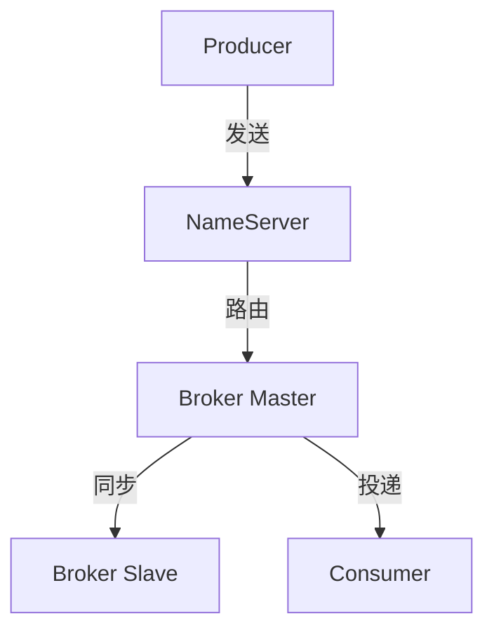

# 深入理解 RocketMQ 事件机制系列

> RocketMQ 事件机制：NameServer / Broker / Producer / Consumer 深度解析。

## 系列导航表

| 序号 | 篇目 | 深度 | 一句话定位 |
|---|---|---|---|
| 1 | RocketMQ 架构与消息模型 | 特性 | NameServer + Broker + Topic/Queue |
| 2 | RocketMQ 事务消息 | 特性 | 半消息 + 本地事务 + 回查 |
| 3 | RocketMQ 消费模式 | 特性 | 集群消费 + 广播 + 延迟消息 |

## 全局心智模型

## 四层进阶路径

- L1 入门：从零开始认识事件驱动架构
- L2 特性：Kafka 机制 + RocketMQ 机制
- L3 专题：亿级消息堆积实战
- L4 整合：从零实现事件驱动框架 Demo

## 篇目状态

| 篇目 | 状态 |
|---|---|
| 1_RocketMQ架构与消息模型-特性.md | ✅ 已落地 |
| 2_RocketMQ事务消息-特性.md | ✅ 已落地 |
| 3_RocketMQ消费模式与延迟消息-特性.md | ✅ 已落地 |