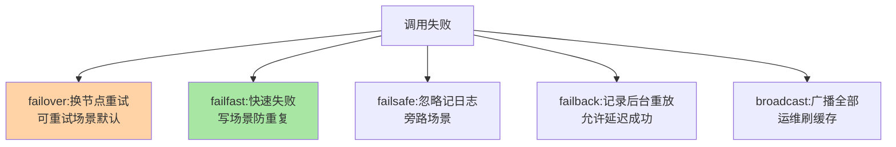
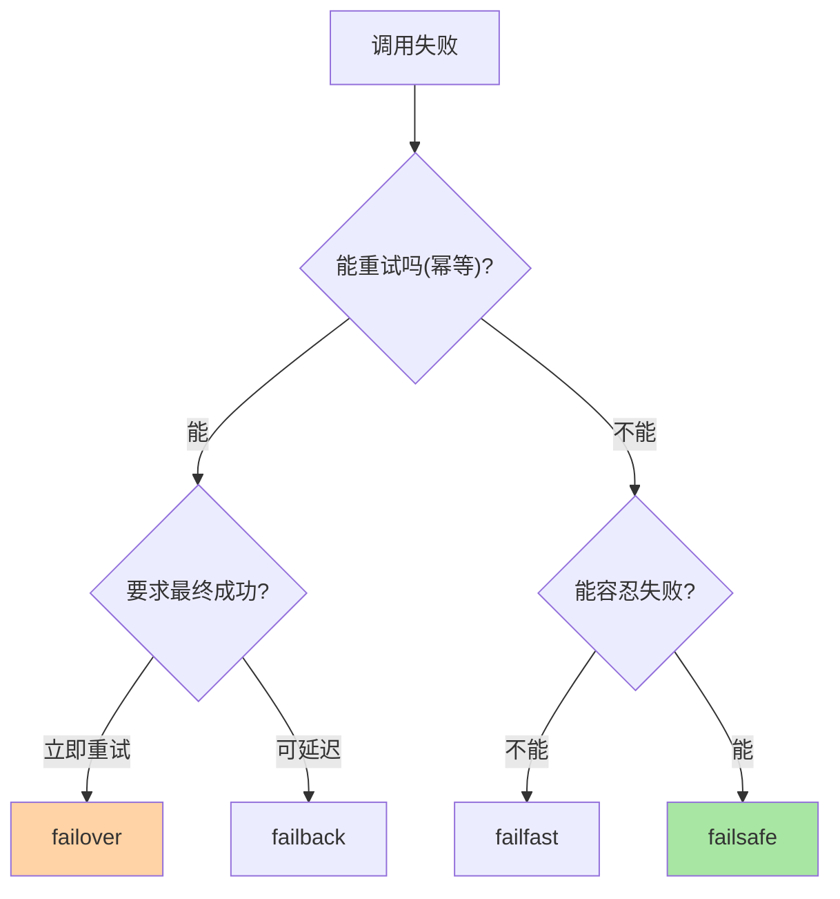

# 集群容错是什么：失败之后的处置学

> 一句话：集群容错是**调用失败之后的处置策略**——集群里有多个实例，一次调用失败后「换一个重试 / 立刻报错 / 忽略继续 / 记下来后台重放」，不同选择对应不同的业务语义，这就是容错策略。

> **本文核心**：容错解决的是「失败后的语义选择」问题。**机制链**：调用发起 → 失败发生（异常/超时）→ 容错策略接管（按策略处置）→ 最终结果（成功/业务异常/忽略）——策略的选择取决于**业务对失败的容忍语义**：能重试吗？重试安全吗（幂等）？失败能忽略吗？

## 一句话摘要

为什么需要显式的容错策略：**分布式调用的失败是常态**（网络抖动、实例发布、依赖超时——生产环境失败率稳定存在），而「失败后怎么办」的默认行为（抛异常给用户）往往不是业务想要的。五大经典策略各答一问：**failover**（失败了换一个再来——可重试读场景）、**failfast**（立刻失败不重试——写场景防重复）、**failsafe**（失败忽略记日志——旁路场景）、**failback**（失败记录后台定时重放——允许延迟成功的场景）、**broadcast**（广播全部实例——刷缓存类运维操作）。策略没有优劣，**与业务语义错配才是事故**。

## 一、为什么失败处置需要「策略化」

裸调用的失败处理只有两种朴素形态：抛异常（用户看到报错）或者自己 try-catch（每个调用点手写一遍逻辑）——前者体验差，后者逻辑散落且易错。策略化把「失败处置」从业务代码中**抽出来变成可配置的框架能力**：调用方声明业务语义（可重试/不可重试/可忽略），框架按策略执行——这是 RPC 框架从「通信工具」演进到「治理载体」的标志性能力之一。

## 5W 速记卡

| 维度 | 一句话 |
|---|---|
| What | 调用失败后的策略化处置机制（五大策略族） |
| Why | 分布式失败是常态，处置语义需要声明式管理 |
| When | RPC/HTTP 调用的集群层配置、失败率异常排查 |
| Where | RPC 框架集群层 / 微服务调用框架 |
| How | 失败捕获 → 策略分派 → 重试/报错/忽略/重放 |

## 二、五大策略族谱

五大策略的**分拣轴**是两个问题：**「能重试吗」**（幂等性决定）与**「能容忍失败吗」**（业务重要性决定）——能重试且重要 → failover；不能重试 → failfast；能容忍失败 → failsafe；要求最终成功但可延迟 → failback。两个问题答完，策略自然收敛（篇 6 的决策树就是这两问的展开）。

两轴分拣的策略决策：

## 三、与熔断降级的区别：失败的两层防线

| 维度 | 集群容错（本系列） | 熔断降级（互指 stability） |
|---|---|---|
| 处置对象 | 单次调用的失败 | 持续的失败率/依赖故障 |
| 处置动作 | 换节点/报错/忽略/重放 | 停止调用走兜底 |
| 时间尺度 | 单次调用内 | 统计窗口级 |
| 触发关系 | 每次失败都经过 | 失败率超阈值才触发 |

**容错是「每次失败的第一响应」，熔断是「失败率超标的整体刹车」**——重试风暴正是两者的交叉事故——容错的「处置收益」与熔断的「整体保护」之间的权衡是稳定性设计的经典命题（都失败 → 都重试 → 雪上加霜），熔断的存在就是为了在容错重试之上加一层整体保护。

## 四、典型场景与误区

**典型场景**：读接口 failover（换实例重试，用户无感）、支付下单 failfast（绝不自动重试，防重复扣款）、日志上报 failsafe（失败不影响主流程）、消息通知 failback（延迟送达可接受）。

**误区与不适用**：① 全局默认 failover 不看场景——写操作自动重试是重复扣款类事故的源头；② 把容错当故障修复——容错只处置单次失败，持续故障要靠熔断与扩容；③ failsafe 无监控——「忽略」的失败不进监控就是静默丢失，旁路也要有失败率看板。

## 五、💡 实战提示

- 💡 每个接口声明容错策略时先答两问：能重试吗（幂等）？能忽略吗（业务容忍）？
- 💡 写操作默认 failfast，要重试必须显式确认幂等
- 💡 failsafe 的「忽略」必须带失败率监控，无监控的忽略是静默丢数据

## 六、你们可能会问

**Q1：重试和容错是什么关系？**
重试是容错策略的一种执行手段（failover/failback 都含重试）——「容错」是处置语义框架，「重试」是其中最常用也最危险的手段（幂等前提）。

**Q2：失败率多少算正常？**
无统一数字——按接口 SLA 定（核心交易 0.01% 级、边缘功能 1% 级都可能是合理值），关键是**基线对比**：失败率突增即事件，绝对值只看趋势。

**Q3：框架默认策略是什么？**
Dubbo 默认 failover（重试 2 次）——默认值面向「读多写少」的通用假设，写密集业务必须显式改配置，这是容错配置审计的第一检查项。

## 七、开放问题

- 容错策略的「业务语义自动推断」（按接口读写特征推荐策略）在部分框架中开始出现，声明式治理的自动化程度在提升。

## 八、自测三问

1. 五大策略各答什么问题？两个分拣轴是什么？
2. 容错与熔断的时间尺度与触发关系差异？
3. 为什么「全局默认 failover」是事故源？

下一篇讲「容错策略全景」：五策略的参数与组合细节。

## 📎 核心带走

- **核心一句话**：集群容错 = 失败后的策略化处置，按「能否重试 × 能否忽略」两轴选策略
- **机制链**：调用 → 失败捕获 → 策略分派 → 重试/报错/忽略/重放 → 结果语义
- **失效点/边界**：策略与业务语义错配即事故；容错不解决持续故障（那是熔断扩容的领地）

## 📌 数据与事实声明

- 写于 2026-09-08，策略族谱以 Dubbo 集群容错公开文档为代表口径
- 免责：以各框架官方文档为准

## 📚 参考资料

| 类型 | 标题 | 来源 |
|---|---|---|
| 官方文档 | Dubbo 集群容错 | dubbo.apache.org |
| 关联系列 | 本仓库 stability / rpc 系列 | docs/architecture/ |
| 社区沉淀 | 容错策略公开文章 | 技术社区公开文章 |
