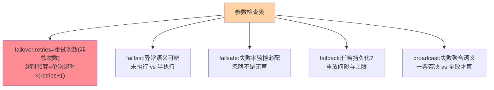

# 容错策略全景：五大策略的参数与组合

> 篇 1 给了族谱，这篇下到参数层：每个策略的**关键参数、边界行为、组合方式**——把「知道名字」升级为「会配置会排查」。

> **本文核心**：五大策略的参数面——failover（retries 次数 + 节点切换范围）、failfast（零重试 + 异常语义）、failsafe（忽略 + 日志与监控）、failback（重放间隔 + 最大重试）、broadcast（任一失败语义 + 并行度）。**机制链**：策略选择 → 参数注入 → 失败捕获 → 按参数处置 → 结果与监控上报。**组合纪律**：策略与超时、熔断、降级分层配置，单层参数永不解决多层问题。

## 一句话摘要

参数要点速览：**failover 的 retries**（默认 2 = 总共 3 次调用，含义是「重试次数」不是「总次数」——最常见的配置误读）；**failfast 的异常语义**（快速失败抛出的异常类型与业务异常的区分，调用方要能分辨「未执行」与「执行了一半」）；**failsafe 的监控兜底**（忽略不等于无声，失败率指标必须有）；**failback 的重放边界**（任务持久化与否决定宕机后丢不丢）；**broadcast 的失败聚合**（任一失败即失败 vs 全部失败才失败，语义按运维场景定）。**组合观**：容错策略 × 超时 × 重试退避 × 熔断是四层联动，配置任何一层都要检查其余三层的配合。

## 一、为什么参数层面事故频发

容错参数的事故模式高度重复：**retries 语义误读**（以为是总次数，实际多打了一倍）、**超时与重试叠加**（3 秒超时 × 3 次重试 = 用户等 9 秒，无退避的串行重试把超时放大数倍——超时预算要含重试）、**failback 任务内存堆积**（重放失败无限堆积打爆内存）——参数层的坑不在难，在**联动关系不显式**，本篇把联动关系讲透。

## 5W 速记卡

| 维度 | 一句话 |
|---|---|
| What | 五大策略的关键参数、边界行为与联动关系 |
| Why | 参数误读与层间不联动是容错事故的主因 |
| When | 容错配置评审、失败率异常排查、超时预算设计 |
| Where | RPC 框架集群层配置 |
| How | 逐策略过参数 + 四层联动检查表 |

## 二、逐策略参数卡

**failover 深挖**：retries 重试时会**避开已失败节点**（换节点是 failover 与普通重试的本质区别——失败节点仍在候选集的重试是「原地重试」，对瞬时故障有效对坏节点无效）；**failfast 深挖**：快速失败的价值是「失败语义干净」——调用方明确知道「请求未被执行」，可以安全地做用户提示或人工重试；**failback 深挖**：重放任务的存储层级（内存队列 = 进程重启即丢；持久化 = 复杂度升级）是它与 MQ 削峰（互指 MQ 系列）的边界——「需要持久化重放」的需求应该直接上 MQ。

## 三、四层联动检查表

| 层 | 关键参数 | 联动检查 |
|---|---|---|
| 超时 | 单次调用超时 | 总预算 = 单次 ×（重试+1），必须小于用户可等待时长 |
| 容错策略 | retries/语义 | 重试是否安全（幂等）？节点是否切换？ |
| 重试退避 | 退避间隔 | 串行无退避 = 抖动放大器 |
| 熔断 | 失败率阈值 | 重试失败计入失败率吗（不折算则熔断永远不触发） |

**联动事故的经典剧本**：超时 3s × 重试 2 次（failover）+ 重试失败计入失败率 + 熔断阈值 50%——下游抖动时用户等 9 秒、失败率被重试放大、熔断迟迟不触发——**四层各自「正确」，组合成灾**。配置评审必须四层一张表过——单层参数的「局部最优」与全局联动的取舍，是容错配置的核心权衡。

## 四、与超时重试（RPC 调用视角）的区别：参数归属对照

| 维度 | 集群容错（本系列） | 超时重试配置（互指 rpc 系列） |
|---|---|---|
| 视角 | 失败处置语义 | 调用参数设计 |
| 重试含义 | 换节点的集群语义 | 次数与退避的参数语义 |
| 关系 | 语义层决定参数层 | 参数层实现语义层 |

本系列讲「为什么这么处置」，rpc 篇 9 讲「参数怎么配」——同一事物的语义层与参数层，互指不重写。

四层联动的配置全景：

## 五、典型场景与误区

**典型场景**：容错配置审计（四层联动表逐项过）、失败率突增排查（先分清「策略处置后的最终失败」与「处置过程中的中间失败」）、新服务上线清单（容错策略显式声明，不裸用默认值）。

**误区与不适用**：① retries 数值越大越稳——重试放大流量（3 倍流量打向故障下游），次数与退避、熔断联动着配；② broadcast 用于业务写——广播的「部分成功」语义对业务是灾难，它只适合运维类幂等操作（刷缓存、刷配置）；③ failback 当 MQ 用——无持久化的重放队列扛不住宕机，该上 MQ 就上 MQ。

## 六、💡 实战提示

- 💡 retries 语义口诀：retries=2 是「失败后再试 2 次」总共 3 发——配置评审必查项
- 💡 超时预算公式贴在配置注释里：总时长 = 单次 × (retries+1) + 退避
- 💡 容错配置四层联动表进上线 checklist，单层正确不算对
- 💡 策略选型推荐口径：何时用什么——读接口 failover、写接口 failfast、旁路 failsafe、延迟敏感通知 failback、运维广播 broadcast，全局默认只做兜底

## 七、你们可能会问

**Q1：重试的退避策略有哪些？**
固定间隔（简单）、指数退避（1s/2s/4s，防重试风暴的主流）、加抖动（指数+随机，防同步重试共振）——重试次数多时指数+抖动是默认推荐。

**Q2：failover 的节点切换范围能限制吗？**
能——部分框架支持「同机房优先重试」「隔离已失败节点」类参数；切换范围本质是重试的「候选集策略」，与均衡的候选集管理同源（互指 LB 系列）。

**Q3：容错策略能按接口细配吗？**
能且应该——策略与参数按「接口的业务语义」配置（读接口 failover 2 次、支付接口 failfast 0 次），全局默认只做兜底，接口级显式声明是规范。

## 八、开放问题

- 容错参数的「自适应调整」（按下游健康度动态调 retries/超时）在部分框架试点，「静态配置 + 动态兜底」的边界是活跃议题。

## 九、自测三问

1. retries 的真实语义与超时预算公式？
2. 四层联动检查表的四层各查什么？
3. failback 与 MQ 的边界在哪里？

下一篇讲「failover/failfast/failsafe」三大主力策略的机制细节。

## 📎 核心带走

- **核心一句话**：容错参数层的事故主因是「语义误读 + 层间不联动」，四层一张表是解药
- **机制链**：策略选择 → 参数注入（retries/超时/退避） → 失败捕获处置 → 与熔断限流的折算联动
- **失效点/边界**：failback 不扛宕机（持久化需求找 MQ）；broadcast 只适合幂等运维操作

## 📌 数据与事实声明

- 写于 2026-09-08，参数语义以 Dubbo 公开文档为代表口径（retries 默认 2）
- 免责：以各框架官方文档为准

## 📚 参考资料

| 类型 | 标题 | 来源 |
|---|---|---|
| 官方文档 | Dubbo 集群容错参数 | dubbo.apache.org |
| 关联系列 | 本仓库 rpc 系列 / MQ 系列（互指） | docs/ |
| 社区沉淀 | 容错参数实践公开文章 | 技术社区公开文章 |
