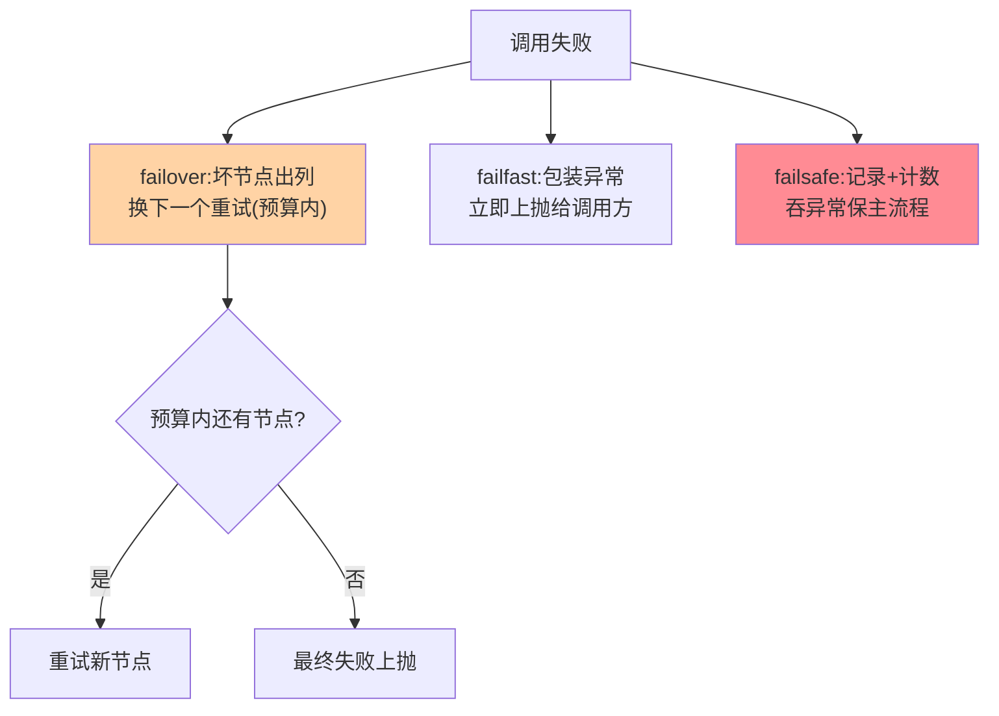

# failover、failfast 与 failsafe：三大主力策略的机制细节

> 五大策略里，failover/failfast/failsafe 覆盖了九成生产场景。这篇下到机制层：failover 的换节点逻辑、failfast 的失败语义、failsafe 的忽略边界——以及三者各自的「坑位图」。

> **本文核心**：三主力策略的机制本质——**failover 是「失败转移」**（失败后从候选集剔除坏节点、换下一个重试，核心是候选集管理与重试预算），**failfast 是「失败即结果」**（零重试，把失败语义干净地交给调用方），**failsafe 是「失败即日志」**（吞掉异常保主流程，用监控换知情权）。**机制链**：失败捕获 → 策略分派 → failover：剔坏换好+预算控制 / failfast：包装异常上抛 / failsafe：记录+计数+继续。

## 一句话摘要

逐个深挖：**failover** 的两个机制要件——「节点切换」（失败节点出列，重试打向新节点，对节点级故障有效）与「重试预算」（retries 上限 + 超时预算联动，防重试风暴）；**failfast** 的价值在「语义干净」——调用方拿到的异常明确表示「请求未被执行」，可以安全地提示用户或转人工，写操作的安全垫；**failsafe** 的边界在「知情权交易」——用「主流程不受影响」换「失败被吞」，监控是这笔交易的必要对价。三者的选择由业务语义决定（篇 1 的两轴），机制细节决定「选对之后配对」。

## 一、为什么三大主力值得单独拆

五大策略里其余两个（failback/broadcast）是特定场景工具，三大主力是「通用默认候选」——也是配置事故的高发区：failover 的 retries 误读（篇 2）、failfast 被误配成写操作自动重试的反面（该 failfast 的地方配了 failover）、failsafe 忘配监控（静默丢数据）——**机制细节决定配置质量**，这篇按「机制 → 坑位 → 配置要点」三段式逐个拆。

## 5W 速记卡

| 维度 | 一句话 |
|---|---|
| What | failover（失败转移）/ failfast（快速失败）/ failsafe（失败安全）的机制细节 |
| Why | 三者覆盖九成生产场景，也是配置事故高发区 |
| When | 策略配置、失败排查、框架选型对比 |
| Where | RPC 框架集群层 |
| How | 候选集管理 / 异常语义包装 / 忽略+监控的组合 |

## 二、三大主力的机制流水线

**failover 的候选集管理**细节：失败节点「本次调用内」出列（下次调用重新入列——节点可能只是瞬时抖动），重试优先打向「未尝试过」的节点；**failfast 的异常包装**细节：框架异常（未执行）与业务异常（可能已执行）必须类型可辨——调用方据此决定「安全重试」还是「先查询确认」；**failsafe 的记录细节**：日志（可追溯）+ 指标（可告警）+ 采样（可复盘）三件套，缺一就是黑洞。

failover 重试预算的时间线：

## 三、与 failback 的区别：同步与异步的对照

| 维度 | failover/failfast/failsafe | failback（篇 4） |
|---|---|---|
| 处置时机 | 同步（调用线程内） | 异步（后台重放） |
| 结果语义 | 立刻有结果（成功/失败/忽略） | 延迟成功（可能） |
| 调用方感知 | 全程感知 | 无感（只管提交） |

三大主力是「同步处置」（结果当场确定），failback 是「异步补偿」（结果延迟兑现）——同步/异步的分野是容错策略的第一分类轴。

## 四、典型场景与误区

**典型场景**：读接口 failover 配置（retries=2 + 换节点 + 超时预算联动）、下单接口 failfast（异常类型区分「未受理」与「结果未知」——后者要查询确认而非盲目重试）、埋点上报 failsafe（本地采样 + 失败率看板）。

**误区与不适用**：① failover 对非幂等接口——重复提交事故的机制根源（篇 5 展开幂等绑定）；② failfast 后调用方无脑重试——「快速失败」的价值被下游的重试抵消，链路上的策略要全局审视；③ failsafe 吞掉业务异常——failsafe 只该吞「基础设施类失败」，业务校验失败（参数错）不该被吞。

## 五、💡 实战提示

- 💡 failover 的节点切换验证：kill 一台实例压测，确认流量无感切换
- 💡 failfast 的异常类型设计进接口规范：调用方按类型决定重试安全
- 💡 failsafe 的失败率看板与主流程监控同级——旁路失败也是故障
- 💡 快速失败与彻底重试的取舍随接口语义定：语义不确定性高的场景，failfast+查询确认优于盲目重试

## 六、你们可能会问

**Q1：failover 重试时怎么避免再打到同一个坏节点？**
调用内失败节点标记出列 + （进阶）跨调用的失败节点短窗口隔离（故障实例摘除的轻量版，互指 service-discovery 健康检查）——两层机制配合，重试命中率显著提升。

**Q2：failsafe 会不会吞掉该让用户知道的失败？**
会——所以 failsafe 只适用于「用户无感知」的旁路（埋点/通知/审计），面向用户的任何失败都不该 failsafe，这是策略选型的红线。

**Q3：三策略能组合吗？**
链路上可以分层组合——入口 failover（读重试）→ 内层写操作 failfast（防重复）→ 旁路 failsafe（上报），一次用户请求里三种策略各司其职；同一次调用内不可组合（策略互斥）。

## 七、开放问题

- 策略的「按异常类型细分处置」（连接异常换节点、业务异常直接上抛）在部分框架已实现，「策略粒度从接口级到异常级」是精细化的演进方向。

## 八、自测三问

1. failover 的两个机制要件是什么？与原地重试的区别？
2. failfast 的「异常类型可辨」为什么重要？
3. failsafe 的「知情权交易」用什么换什么？必要对价是什么？

## 📎 核心带走

- **核心一句话**：failover 换节点重试（预算控制）、failfast 零重试保语义干净、failsafe 吞异常用监控换知情
- **机制链**：失败捕获 → failover：剔坏换好+预算 / failfast：包装上抛 / failsafe：记录+计数+继续
- **失效点/边界**：failover 只对幂等安全；failfast 会被下游重试抵消；failsafe 只限用户无感知的旁路

## 📌 数据与事实声明

- 写于 2026-09-08，机制以 Dubbo 集群容错公开文档为代表口径
- 免责：以各框架官方文档为准

## 📚 参考资料

| 类型 | 标题 | 来源 |
|---|---|---|
| 官方文档 | Dubbo Failover/Failfast/Failsafe | dubbo.apache.org |
| 关联系列 | 本系列篇 4/5（failback 与幂等） | docs/architecture/service-governance/ |
| 社区沉淀 | 容错策略机制公开文章 | 技术社区公开文章 |
