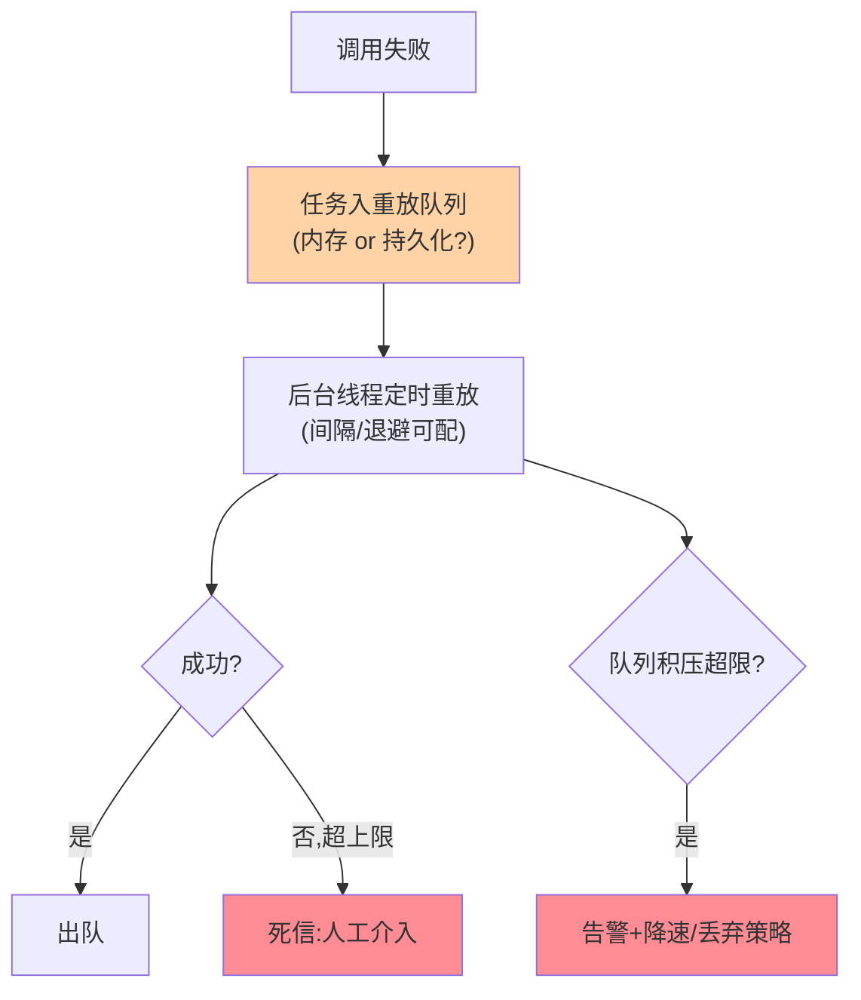
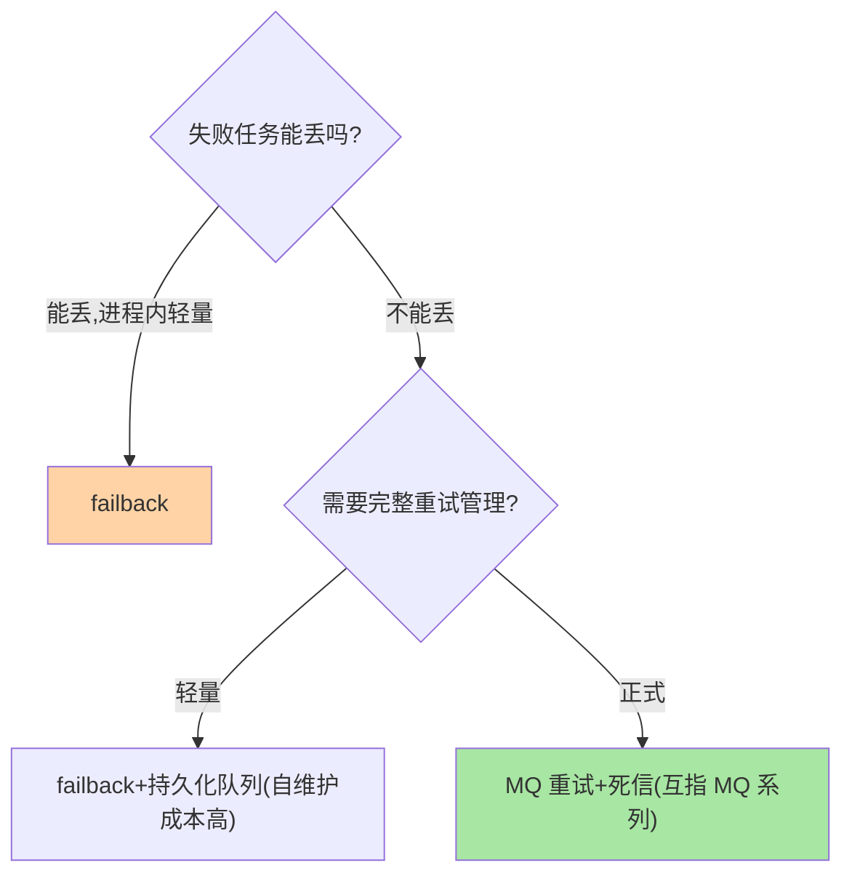

# failback 失败恢复：后台重放的机制与边界

> 「这次失败了没关系，记下来过会儿再试」——failback 把失败处置从同步转为异步：调用方无感返回，失败任务进后台队列定时重放。自由是有代价的：这篇讲清重放机制的边界与「该上 MQ 的信号」。

> **本文核心**：failback = **失败记录 + 后台定时重放**，用「延迟」换「调用方无感」。**机制链**：调用失败 → 任务入重放队列（内存/持久化）→ 后台线程按间隔重放 → 成功出队 / 超限进死信。**边界三问**：任务能丢吗（内存队列重启即丢）？重放次数上限（无限重试的堆积）？重放的幂等前提（与篇 5 同源）——**三问任何一问答不下来，该用 MQ 而不是 failback**。

## 一句话摘要

failback 的机制三件：**记录**（失败任务入队——记录的持久化层级决定宕机语义：内存队列进程重启即丢、持久化队列复杂度升级）、**重放**（后台线程按固定间隔或退避策略重试，重放次数与上限可配）、**出队/死信**（成功出队；超过上限进死信待人工）。它与 failsafe 的本质差异：failsafe「接受失败」，failback「不接受失败但接受延迟」——**适用域是「最终必须成功、实时性要求不高」的场景**（消息通知、缓存刷新、审计上报）。

## 一、为什么需要异步补偿

同步重试（failover）的天花板：重试占用调用线程（用户在等）、重试次数有限（预算控制）、下游长时间故障时同步重试全灭。**异步补偿把这三个约束同时解开**：重放不占调用方线程（用户先拿到「已受理」）、重放次数与周期可以宽得多（后台慢慢试）、下游恢复后自动补齐——「延迟成功」是一类真实需求，异步补偿机制随框架演进成熟（通知类、刷新类、同步类任务），failback 就是这类需求的机制化。

## 5W 速记卡

| 维度 | 一句话 |
|---|---|
| What | 失败记录 + 后台定时重放的异步补偿策略 |
| Why | 「必须成功但可延迟」场景需要无感异步补偿 |
| When | 消息通知、缓存刷新、对账重试、审计补传 |
| Where | RPC 框架 failback 实现 / 自研重放队列 |
| How | 入队 → 定时重放 → 成功出队 / 超限死信 |

## 二、重放流水线与边界三问

**边界三问展开**：**① 任务能丢吗**——内存队列进程重启即丢，能丢（下次重试补充）才可用内存队列；不能丢就要持久化，而持久化重放 ≈ 一个简陋 MQ——**直接用 MQ 更成熟**。**② 重放有上限吗**——无限重放会堆积（下游长期故障时内存爆），上限 + 死信是标配。**③ 重放幂等吗**——重放 = 重复执行，下游不幂等就是重复副作用（篇 5 的绑定关系）。

## 三、与 MQ 异步补偿的区别：MQ 对照

| 维度 | failback（框架内） | MQ 重试机制（互指 MQ 系列） |
|---|---|---|
| 持久化 | 通常内存（丢得起才用） | 天然持久化 |
| 重放管理 | 框架内置简版 | 完整（重试队列/死信/可视） |
| 耦合度 | 与调用同进程 | 独立基础设施 |
| 适用 | 轻量、可丢、进程内 | 不可丢、需追溯、跨进程 |

**分界口诀：丢得起用 failback，丢不起上 MQ**——failback 常被误当轻量 MQ 用，宕机丢任务的事故由此而来。

## 四、典型场景与误区

**典型场景**：审计日志补传（丢一条可接受，重放提升完整率）、缓存刷新任务（下次刷新自然覆盖）、第三方通知重试（通知类接口配 failback + 重放间隔）、对账补偿的轻量形态（重规模对账走批处理更合适）。

**误区与不适用**：① 支付回调处理用 failback——不可丢，用 MQ；② 重放无上限无监控——下游故障 + failback 重放 = 自我放大攻击，上限与告警必配；③ failback 队列当业务队列——业务消息的生产消费关系用 MQ 表达，框架内重放队列只是「容错的延长线」。

选型决策（丢得起/丢不起）：

## 五、💡 实战提示

- 💡 部署 failback 前答边界三问：能丢吗？有上限吗？幂等吗？——答不全就上 MQ
- 💡 重放队列深度与重放成功率进监控，积压即告警
- 💡 重放间隔用退避（失败越多间隔越长），固定短间隔会打爆恢复中的下游

## 六、你们可能会问

**Q1：failback 与失败队列的重试有性能隔离吗？**
重放线程与业务线程应隔离（线程池分离）——重放风暴挤占业务线程是配置事故；进阶方案是重放限速（令牌桶控制重放速率，互指 stability）。

**Q2：重放成功后调用方知道吗？**
默认不知道（异步语义）——需要回执的场景（通知送达确认）要自建回调/状态查询，这已经超出容错范畴进入「任务系统」设计，用 MQ 或任务平台更合适——这一边界也是容错机制向任务系统演进的自然分界。

**Q3：failback 与 failover 能叠加吗？**
可以——同步阶段先 failover 快速重试，重试预算耗尽仍失败再转 failback 入队（「先同步尽力、后异步兜底」的两段式），部分框架支持此类组合配置。

## 七、开放问题

- 框架内重放队列与外部 MQ 的「自动升降级」（内存队列积压自动转投 MQ）是容错与消息设施的融合方向，尚无标准实现。

## 八、自测三问

1. 重放流水线的三件（记录/重放/死信）各有什么配置要点？
2. 「丢得起用 failback，丢不起上 MQ」的判定依据是什么？
3. failback 的三重风险（堆积/放大/不幂等）分别怎么防？

## 📎 核心带走

- **核心一句话**：failback = 失败入队 + 后台重放，用延迟换无感，边界三问（能丢/有上限/幂等）定生死
- **机制链**：失败捕获 → 入队（持久化层级决策） → 定时重放（退避） → 成功出队 / 超限死信
- **失效点/边界**：内存队列不扛宕机；无限重放会自我放大——上限、监控、退避三件套必配

## 📌 数据与事实声明

- 写于 2026-09-08，机制以 Dubbo failback 公开文档为代表口径
- 免责：以各框架官方文档为准

## 📚 参考资料

| 类型 | 标题 | 来源 |
|---|---|---|
| 官方文档 | Dubbo Failback / RocketMQ 重试与死信 | dubbo.apache.org、rocketmq.apache.org |
| 关联系列 | 本仓库 MQ 系列 / 本系列篇 5 幂等 | docs/ |
| 社区沉淀 | 异步补偿实践公开文章 | 技术社区公开文章 |
