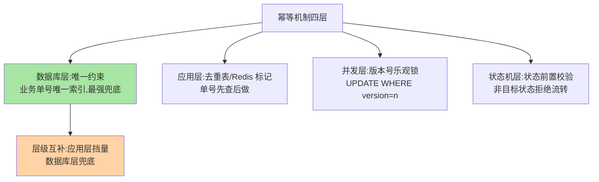
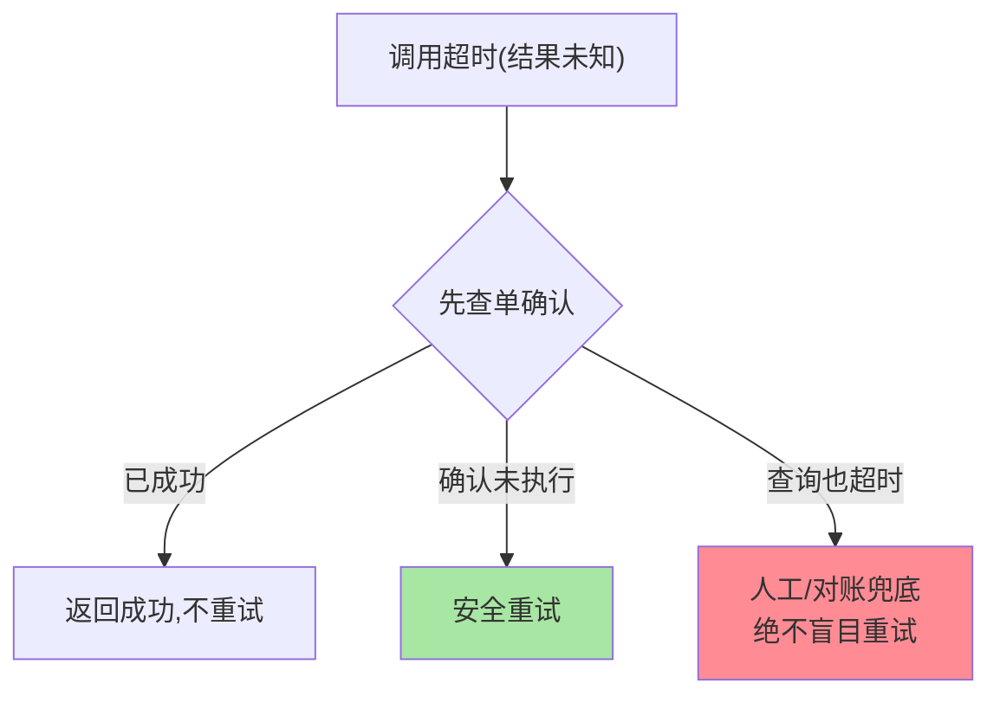

# 重试与幂等：自动重试的安全前提

> 重试是最常用的容错手段，也是最危险的——**它把一次调用变成 N 次**。如果那不是个幂等操作，重试就是重复扣款、重复发货的制造机。这篇讲清重试与幂等的绑定关系、幂等的实现层级与「重试安全」的判定方法。

> **本文核心**：自动重试的安全前提是**幂等**——同一操作执行 N 次与执行 1 次效果相同。**机制链**：判定接口幂等性（天然幂等/需机制保证/不幂等）→ 不幂等则二选一（关自动重试 / 加幂等机制）→ 幂等机制按层级选（数据库唯一约束 / 版本号乐观锁 / 去重表 / 状态机）。**重试安全的完整判定**：接口幂等 + 失败语义可辨（未执行才可重试，执行中失败不可盲目重试）。

## 一句话摘要

自动重试的安全前提是幂等：同一操作执行 N 次与 1 次效果相同。重试安全的完整判定 = 接口幂等 + 失败语义可辨（未执行才可重试，结果未知先查单），幂等靠「应用去重挡量 + 状态机校验 + 数据库唯一约束兜底」多层组合保证。

## 一、为什么重试危险

一次「下单」调用的时间线：请求到达 → 扣库存 → 创建订单 → 调用支付通道**超时**。真相可能是：支付通道已成功处理、只是响应没回来——此时自动重试 = 第二次扣款。**超时 ≠ 失败**（结果未知），这是重试危险的根源：只有「确定未执行」的失败才可安全重试，而分布式调用里「确定未执行」常常不可知——**幂等机制正是为了把「结果未知」变成「重复无害」**。

## 5W 速记卡

| 维度 | 一句话 |
|---|---|
| What | 重试的安全前提（幂等）与幂等的实现层级 |
| Why | 重试把一次调用变 N 次，不幂等即重复副作用 |
| When | 重试策略配置评审、写接口设计、对账差异排查 |
| Where | 数据库约束/应用层/协议层 |
| How | 唯一约束/版本号/去重表/状态机四类机制按层选用 |

## 二、幂等的四个实现层级

四层的分工：**数据库唯一约束**是最后防线（并发穿透应用层也插不进重复行）、**应用层去重**是第一道闸（挡住绝大多数重复请求、少打数据库）、**版本号乐观锁**管「同一单的并发更新」、**状态机校验**管「非法流转」（已支付的订单再收支付请求直接拒绝）——**生产级幂等是多层组合**，单层都有被穿透的路径。

结果未知场景的查询确认模式：

## 三、重试安全的完整判定

重试前两问：**① 接口幂等吗**——天然幂等（查询类）直接可重试；写类必须先有幂等机制；**② 失败语义可辨吗**——「连接被拒/超时未送达」可重试，「对端已受理但结果未知」要查询确认（如支付查单接口）而不是盲目重试。**两问合成决策矩阵**：幂等 + 未执行 → 自动重试；幂等 + 结果未知 → 查询确认后决定；不幂等 → 关闭自动重试或先补幂等——**这个矩阵应该进每个写接口的设计文档**。

## 四、与数据库事务重试的区别：MySQL 对照

| 维度 | 调用层重试（本篇） | 数据库锁重试（互指 MySQL 锁系列） |
|---|---|---|
| 重试对象 | 远程调用 | 本地事务（死锁回滚） |
| 前提 | 接口幂等 | 事务可重入（回滚干净） |
| 层级关系 | 应用层跨服务 | 数据层进程内 |

MySQL 死锁重试同样要求「事务整体可重入」（回滚后重跑无副作用）——与跨服务重试要求幂等同构，**「重试安全 = 操作可重复」的原理跨层通用**。

## 五、典型场景与误区

**典型场景**：支付回调幂等（单号唯一约束 + 状态机：已处理直接返回成功）、消息消费幂等（消费去重表，重投不重复处理——互指 MQ 系列）、接口设计评审（写接口必答「重试安全吗」两问）。

**误区与不适用**：① 「我加了 try-catch 就安全」——捕获异常不改变重复副作用，幂等是数据性质不是代码结构；② Redis 去重当唯一防线——Redis 与数据库的一致性窗口（标记成功但落库失败）会漏重，数据库唯一约束必须是兜底层；③ 幂等键用自增 ID——调用方重试时生成新 ID，去重形同虚设——幂等键必须来自业务语义（单号）且调用方重试时复用。

## 六、💡 实战提示

- 💡 写接口设计模板必含两行：幂等键是什么？失败语义是否可辨？
- 💡 幂等三层组合标配：应用去重挡量 + 状态机校验流转 + 数据库唯一约束兜底
- 💡 重试配置评审与幂等评审合并进行——分离评审必漏
- 💡 幂等强度与重试激进度成正比：幂等越强重试可越激进，反之收敛——这层取舍写进接口设计文档

## 七、你们可能会问

**Q1：天然幂等操作有哪些？**
查询类（读不影响状态）、按绝对值设置类（SET key=value，重复执行结果一致）、删除类（删不存在的行无害）——天然幂等的接口可放心自动重试。

**Q2：幂等键的生命周期怎么管？**
按业务窗口定（订单号天然永久唯一；「防重提交」类键通常 24 小时过期）——窗口过短防不住迟到重试，过长则存储膨胀，按业务重复风险窗口定。

**Q3：分布式锁能当幂等用吗？**
锁解决「并发互斥」不解决「重复执行」——锁释放后的重试照样重复执行；锁 + 去重标记组合才构成幂等——把锁当幂等是高频误用。

## 八、开放问题

- 「接口幂等性声明」的标准化（OpenAPI 扩展声明 idempotency key 语义，如 Stripe 的 Idempotency-Key 头）正在跨厂商扩散，协议级幂等是演进方向。

## 九、自测三问

1. 「超时 ≠ 失败」为什么是重试危险的根源？
2. 幂等四层各自的分工？为什么必须组合？
3. 重试安全决策矩阵的四种组合分别怎么处置？

## 📎 核心带走

- **核心一句话**：自动重试的安全前提是幂等——同一操作执行 N 次效果与 1 次相同，四层机制组合保证
- **机制链**：接口幂等性判定 → 失败语义可辨 → 幂等机制选层（应用挡量/状态机/唯一约束兜底） → 重试放行
- **失效点/边界**：幂等键必须业务语义化且重试复用；Redis 去重不能当唯一防线；锁不是幂等

## 📌 数据与事实声明

- 写于 2026-09-08，幂等分层为业界工程共识的归纳；Stripe Idempotency-Key 为公开 API 设计口径
- 免责：以各组件官方文档为准

## 📚 参考资料

| 类型 | 标题 | 来源 |
|---|---|---|
| 关联系列 | 本仓库 MySQL 锁系列 / MQ 系列 | docs/ |
| 公开设计 | Stripe API Idempotency 设计 | stripe.com/docs（公开） |
| 社区沉淀 | 幂等设计公开文章 | 技术社区公开文章 |
