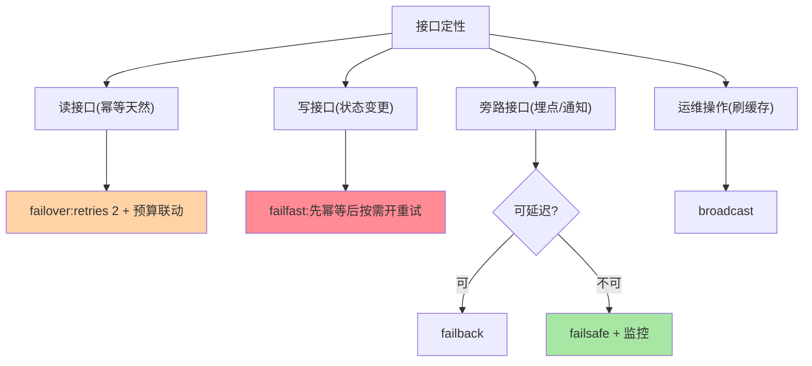

# 容错策略选型：按业务语义的两问决策

> 全系列收束篇：五大策略怎么选、怎么与超时熔断联动、怎么落成配置规范——选型的全部输入只有两问：**能重试吗？能忽略吗？**

> **本文核心**：选型 = 业务语义到策略的映射。**机制链**：接口定性（读/写/旁路/延迟型）→ 两问判定（幂等可重试？失败可忽略？）→ 策略确定 → 参数联动（超时预算/退避/熔断折算） → 接口级显式声明 + 监控验收。**全局默认只做兜底，接口级显式声明是规范**。

## 一句话摘要

接口定性到策略的映射表：**读接口**（幂等天然）→ failover + 重试预算；**写接口**（不幂等风险）→ failfast + 幂等机制后按需开重试；**旁路接口**（埋点/通知）→ failsafe 或 failback（按可否延迟）；**运维广播**（刷缓存）→ broadcast；**延迟敏感通知** → failback。**联动三查**：超时预算含重试、重试失败折算熔断统计、failsafe/failback 带监控——策略选对只是起点，联动配对才是完整方案（篇 2 的四层联动在选型层的落地）。

## 一、为什么选型要「按接口」而不是「按应用」

一个应用内接口的失败语义天差地别：查询接口失败可重试、支付接口失败绝不能自动重试、埋点失败可以忽略——**应用级统一策略必然大面积错配**。接口级声明看似配置量大，实则是「把业务语义写进配置」的必要成本——语义只有接口的开发者最清楚，选型评审的本质就是让这层语义显式化。

## 5W 速记卡

| 维度 | 一句话 |
|---|---|
| What | 两问决策 + 接口定性映射 + 联动三查的选型框架 |
| Why | 失败语义只有业务最清楚，选型即语义显式化 |
| When | 接口设计评审、容错配置审计、失败事故复盘 |
| Where | 容错配置规范 + 配置中心下发 |
| How | 定性 → 两问 → 映射 → 联动 → 监控验收 |

## 二、决策树与映射表

映射表的关键行是**写接口**：默认 failfast（语义干净）→ 补齐幂等机制（篇 5）→ 幂等确认后再评估开重试的收益（写重试的收益场景少：瞬时网络抖动且下游幂等已保证）——**「写操作先 failfast，幂等是开启重试的钥匙」是选型的核心纪律**。

链路重试放大的乘法效应：

## 三、与稳定性三件套的区别：联动选型对照

| 维度 | 容错策略选型（本篇） | 熔断限流选型（互指 stability） |
|---|---|---|
| 决策输入 | 接口失败语义 | 依赖重要性与容量 |
| 配置层级 | 接口级显式声明 | 依赖级 + 全局 |
| 联动点 | 重试失败计入熔断统计 | 熔断打开时容错策略旁路 |

联动要点：**熔断打开期间重试暂停**（不然每次调用都先吃满重试预算再失败，延迟与流量双放大）——两套配置必须互相感知，联动检查表（篇 2）在选型层的体现。

## 四、典型场景与误区

**典型场景**：新服务接口设计评审（每个写接口过重试安全两问）、容错配置审计（扫描全局默认策略 + 未显式声明的接口清单）、事故复盘归因（重复扣款 → 写接口 failover + 无幂等的配置错配定位）。

**误区与不适用**：① 选型一步到位——接口语义会演进（查询变计算、旁路变关键），策略声明要随接口变更评审；② 策略声明只写不查——配置审计扫描（未声明接口清单、写接口重试扫描）是规范生效的手段；③ 忽视调用链上下游的策略叠加——上游 failover × 下游 failover = 重试放大（2×3=6 倍流量），链路级重试预算要全局算。

## 五、💡 实战提示

- 💡 接口设计文档模板加一节「容错声明」：策略 + 幂等键 + 失败语义
- 💡 链路重试预算全局算：上下游重试次数相乘，超过 4 倍必须收敛
- 💡 容错配置进配置中心统一管理，禁止散落代码硬编码
- 💡 重试收益与放大风险的权衡随链路层级递增：越靠底层重试越要收敛

## 六、你们可能会问

**Q1：写接口什么情况下可以开重试？**
三个条件同时满足：幂等机制已验证（对账无重复数据）、失败语义可辨（只对「未执行」类失败重试）、重试预算已联动（超时/退避/熔断检查过）——三条件的评审记录是开重试的凭证。

**Q2：策略配置的灰度怎么做？**
策略变更先对部分调用方/接口灰度（配置中心按维度下发），观察失败率与重试率变化再全量——容错配置的变更风险不低于业务代码，灰度纪律同源。

**Q3：怎么审计存量接口的策略声明？**
静态扫描（配置中心全量导出）+ 接口清单比对：未声明接口清单、写接口开重试清单、全局默认策略命中清单——三张清单就是审计报告的骨架。

## 七、开放问题

- 「容错即代码」（策略声明进接口定义文件，随 API 规范一起管理与下发）是治理规范化的演进方向，IDL 级容错声明尚无标准。

## 八、自测三问

1. 接口定性到策略的映射表能复述吗？
2. 写接口开重试的三个条件是什么？
3. 链路重试放大（上下游相乘）怎么算怎么防？

## 📎 核心带走

- **核心一句话**：容错选型 = 接口定性 × 两问判定 × 联动三查，接口级显式声明、全局默认只兜底
- **机制链**：接口定性 → 两问（能重试/能忽略） → 策略映射 → 超时退避熔断联动 → 监控验收
- **失效点/边界**：写操作先 failfast，幂等是重试的钥匙；链路重试预算要全局相乘核算

## 📌 数据与事实声明

- 写于 2026-09-08，选型框架为容错治理实践的归纳
- 免责：具体配置按业务语义评审

## 📚 参考资料

| 类型 | 标题 | 来源 |
|---|---|---|
| 关联系列 | 本系列篇 2/5 / stability 系列 | docs/architecture/service-governance/ |
| 官方文档 | Dubbo 集群容错配置 | dubbo.apache.org |
| 社区沉淀 | 容错选型公开实践 | 技术社区公开文章 |
