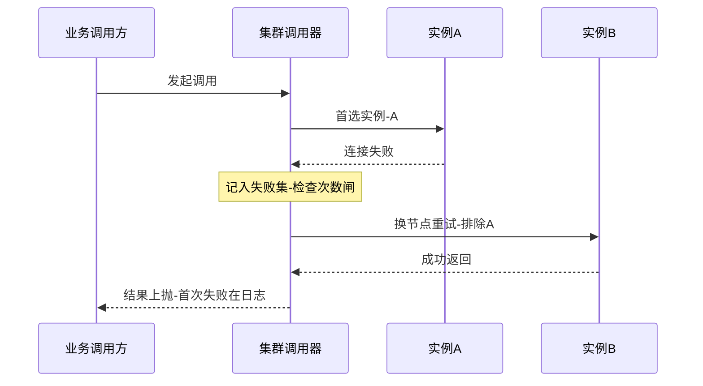
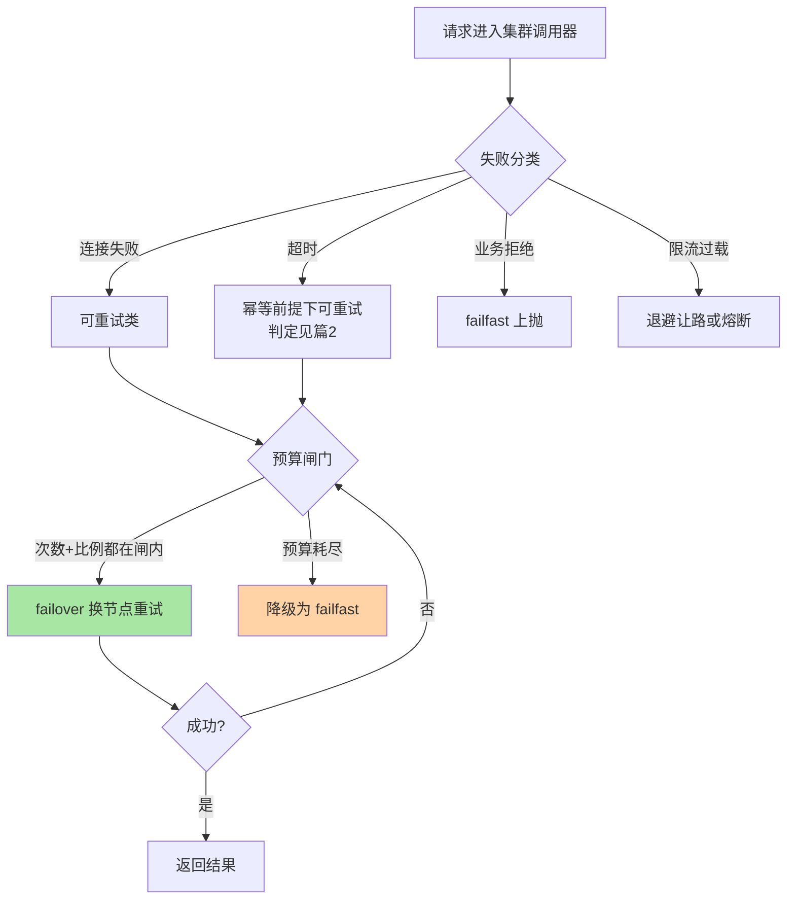

# 容错策略实现与重试预算深读：兜底谱系与花钱的纪律

> **本文核心**：集群容错的策略谱系（failover/failfast/failsafe/failback/broadcast）在实现上是同一层抽象的五张面孔——**集群调用器拦截请求、按策略循环处理候选实例、把结果或异常按语义上抛**，策略间的差异只在「失败后的下一步动作」。真正决定生产行为的不是选哪个策略，而是**重试的预算**：重试是用额外的请求量买成功率，错误率 p 下重试放大呈级数增长（每次重试把上游错误率按 1/(1-p) 级别放大，叠加多层调用链是乘法传染），所以生产级重试必须上**双闸预算**——每请求次数闸（最多重试几次）+ 全局比例闸（重试量占总量上限，超闸自动降级为不重试，公开口径：主流框架的预算机制即此形态），再加退避与抖动防同步洪峰。**机制链**：失败分类（可重试/不可重试/限流退避）→ 策略分派（关键路径：集群拦截→候选循环→语义上抛）→ 重试预算双闸核算 → 退避与抖动 → 与超时/熔断/幂等的联动（幂等详见本系列篇 2）。

## 一句话摘要

「失败重试」四个字在入门层是策略选择，在特性层是**两本账**：一本是策略实现账——五种容错策略共享同一个调用器骨架，差异只在失败后的分支动作，读懂骨架就能读懂任何框架的容错源码；另一本是重试预算账——重试不是成功率函数而是成本函数，级数放大的请求量与多层传染的retry风暴会把一个百分之几的错误率放大成容量事故，**双闸预算（次数闸+比例闸）就是把「要不要重试」从开发者直觉变成系统纪律**。本文的立场：预算缺位的重试配置等于没有配置——它只在错误率低时看起来正常，恰好在故障时爆炸。

## 前置阅读

- 入门层篇 2《容错策略全景》、篇 3《failover 与 failfast 与 failsafe》（策略语义的入门图景）
- 入门层篇 5《重试与幂等》（幂等作为重试安全前提的概念引入——本系列篇 2 深入展开）
- stability 系列熔断与限流篇（本文的邻接机制：熔断管「停止调用」，本文管「怎么重试」）

## 目标导向

本文是什么：容错策略实现骨架与重试预算机制的深读。功能：读懂框架容错层源码、设计重试配置、核算重试放大账。收益：从「抄一份重试参数」到「能算放大账、能按预算纪律配置」的工程判断力。必看场景：重试风暴复盘、容错策略配置评审、跨层调用链的 retry 传染分析。

## 一、失败分类：重试安全的第一分叉

一切容错策略的输入是「一次失败」，但失败不是同质的东西——**按「重发是否安全、重发是否有用」分四类**：连接失败（请求未到达，重发安全且有用）、超时（请求状态未知，重发是否有用取决于操作幂等性——安全性的完整判定在篇 2）、业务错误（明确拒绝，重发无用且冒犯）、限流/过载错误（重发有害——对方在说「别发了」，立即重试是对限流的最坏响应）。四类的分派纪律：连接失败→放心重试；超时→幂等前提下重试（篇 2）；业务错误→failfast 上抛；过载→退避让路或熔断让路。业内惯例是错误分类器显式声明「可重试错误码清单」，清单随依赖契约一起评审（生产实践共识：清单外一律不重试）。**实现里最常见的灾难是把四类混在一个「失败」里统一重试**——业务拒绝被重试三次、限流响应被重试三次，重试量恰好打在系统最脆弱的方向上。错误分类是容错层的关键路径起点，这一层分错，后面全错。

## 5W 速记卡

| 维度 | 一句话 |
|---|---|
| What | 五种容错策略的调用器骨架、失败分类、重试双闸预算与退避抖动 |
| Why | 重试是级数放大的成本函数，预算缺位的重试在故障时爆炸 |
| When | 重试配置设计、retry 风暴复盘、容错层源码阅读、容量核算 |
| Where | 集群调用器层（策略循环）+ 错误分类器 + 预算闸门 |
| How | 失败分类 → 策略分派 → 次数闸+比例闸 → 退避抖动 → 联动熔断与幂等 |

## 二、策略实现：一个骨架，五张面孔

五种容错策略在主流框架（公开口径的通用形态）里共享同一层抽象——**集群调用器**：真实调用被拦截进策略层，策略层维护候选实例列表、按语义循环、把最终结果或异常上抛给业务调用方。关键路径骨架：

```text
集群调用器关键路径:
  invoke(请求) ->
    拿候选实例列表(来自发现层, 常配合负载均衡初选)
    → 按策略循环:
        failover:  失败换下一个候选, 重试次数闸内循环, 全败才抛
        failfast:  失败立即抛(仅可能做一次极廉价重试)
        failsafe:  失败吞掉, 记日志+指标, 返回空/默认值
        failback:  失败登记进异步队列, 先返回占位, 定时任务重放
        broadcast: 全部候选都调一遍, 聚合结果/收集异常
    → 上抛结果或聚合异常
```

骨架读透之后，实现级的差异点浮出来三处。failover 的完整时序如下：



**差异一：候选排除语义**——failover 重试换节点时要把已失败节点排除（同一节点二次重试通常无意义），实现里是「失败集」的维护；广播策略天然不排除。**差异二：异常聚合语义**——广播的全败判定（部分成功算成功还是失败）、failover 的末次异常上抛（业务拿到的是第 N 次失败的异常，前 N-1 次在日志里），这些语义决定上层排障的体验。**差异三：异步化程度**——failback 是唯一内建异步的策略（占位返回+定时重放），它的重放队列是**有界资源**：队列满时的丢弃策略、重放失败的终态处理，是 failback 实现的两个隐藏决策点，默认实现常常没给配置口——生产里 failback 丢单事故多源于此。



## 三、重试预算：把重试从直觉变成纪律

重试的放大账要算三层。**第一层：单点放大**——错误率 p 的依赖上，重试 R 次的期望请求量是 1+p+p²+…（几何级数），错误率越高放大越陡：p=10% 时每次调用平均发出约 1.11 个请求（量级估算），p=50% 时是 2 个——**重试在低错误率时是近乎免费的保险，在高错误率时是级数放大器**。**第二层：多层传染**——A 调 B、B 调 C，各层都配 failover 3 次：C 的错误率传到 B 的失败判定时已被重试「稀释」（B 看到的失败率低了），但 B 的请求量被放大了；A 再放大一次——**端到端的请求放大是各层放大系数的乘积**，三层各 1.1 倍的温和配置叠到入口就是 1.33 倍的突增（量级估算），叠加扇出（一个入口请求并行调 N 个下游）再乘 N。**第三层：与容量对撞**——放大出的额外请求恰好落在故障时段，下游最缺容量的时刻收到最多的重试流量——这是 retry 风暴的标准剧本：重试把「局部慢」放大成「全局瘫」。

三笔账的治理答案是**双闸预算**。**次数闸**（每请求）：最多重试次数按「单次重试的边际成功率」定——p=10% 时第二次重试的边际收益已减半，常规配置 1-2 次重试封顶（行业认知）；次数是防御单请求的成本上限。**比例闸**（全局）：重试请求占总量设上限（公开口径：主流 RPC 框架的重试预算机制形态为「重试量不超过基线流量的某个百分比，超限则后续请求不再重试」）——比例闸是防御全系统的放大总量：错误率飙升时重试预算被快速耗尽，系统自动退化为「不重试」的直通模式，**用微小的成功率损失换容量不失守**。预算耗尽的降级动作要可观测（重试预算耗尽计数是故障定位的关键线索）。

```mermaid
stateDiagram-v2
    [*] --> 预算正常: 重试按配置执行
    预算正常 --> 预算消耗: 错误率抬升-重试量上升
    预算消耗 --> 预算正常: 错误回落-窗口内恢复
    预算消耗 --> 预算耗尽: 重试占比超全局闸
    预算耗尽 --> 预算恢复: 冷却窗口后重置
    预算耗尽 --> 熔断联动: 持续耗尽-触发熔断
    style 预算正常 fill:#a8e6a3
    style 预算耗尽 fill:#ffd3a5
```

**退避与抖动**是预算的执行细节：重试间隔指数退避（给下游喘息窗口）+随机抖动（防大量客户端同步重试形成周期洪峰）。实现里退避的基值与上限要和**超时预算联动**（本系列篇 2）：重试间隔吃掉的是总超时预算——「退避 2 秒但总超时 1 秒」的配置意味着第二次重试永远来不及发生，配置形同虚设。

## 与「熔断」的区别

| 维度 | 重试预算（本文） | 熔断器（stability 系列） |
|---|---|---|
| 回答的问题 | 这次失败要不要再试 | 这个依赖还要不要继续调 |
| 作用粒度 | 单请求与全局比例 | 依赖维度整体 |
| 失败响应 | 换节点/退避后再试 | 直接快速失败走降级 |
| 恢复机制 | 预算窗口重置/错误回落 | 半开探测分阶恢复 |
| 协作关系 | 预算持续耗尽是熔断的输入信号 | 熔断打开后重试自动失效 |

两者是上下游：重试预算耗尽（重试救不回来）是熔断打开的合理触发信号之一，熔断打开后重试被短路（不再浪费预算）——**重试管微观的「再给一次机会」，熔断管宏观的「停止浪费机会」**，配置评审时两者要一起看而不是各配各的。

## 不同量级的思考：架构约束驱动解法

- **十万级 QPS、单层调用（简单服务）**：约束来源是「放大系数小到看不见」——单层 failover 2 次在 p=1% 时的请求放大仅百分之一二（量级估算），预算闸形同虚设；思考方式是「监控驱动」——重试成功率与重试触发率两个指标建起来，正常就别动。这一档的核心问题是「重试触发率有没有在监控」，而不是「要不要上预算机制」
- **百万级 QPS、两三层调用（常规微服务链）**：约束来源是「放大系数开始相乘」——层间传染让端到端放大进入两位数百分比，叠加发布窗口的错误毛刺可感；思考方式是「公式驱动」——放大账 = 各层(1+p+p²+…)的乘积 × 扇出数，配置评审按端到端乘积算而不是按单层看。这一档的核心问题是「端到端放大乘积算过没有」，而不是「每层重试次数配得少不少」
- **千万级 QPS、扇出架构（平台级）**：约束来源是「放大与容量在故障时刻对撞」——任何错误率抬升都会被重试+扇出乘法放大成容量冲击，重试预算从优化项变成保命项；思考方式是「节奏驱动」——预算参数分场景分档（常态/大促/发布窗口）、降级链路演练、预算耗尽的自动退让要制度化。这一档的核心问题是「预算耗尽的退让路径演练过没有」，而不是「预算比例设多少最准」
- **亿级 QPS、全域调用面（超大规模）**：约束来源是「retry 策略的全局博弈」——各团队各自配重试，层间乘积无人能算全，重试治理必须升维成组织机制；思考方式是「架构驱动」——重试预算做成平台内建（SDK/网格统一执行，应用不可绕过）、跨层传染有全局可算的预算账、策略变更有平台级灰度。这一档的核心问题是「重试策略收编进平台没有」，而不是「各团队参数配齐没有」

思考方式总结：十万级靠「两个指标」，百万级靠「放大乘积」，千万级靠「分档演练」，亿级靠「平台收编」——约束来源从「放大不可见」逐档迁移到「乘积可感、对撞可惧、博弈失控」，思考方式跟着约束走。解法是思考的产物，不是数字的排列。

**自下而上与触发升级**：先测档位再选思考——重试触发率、端到端放大系数、故障期重试占比三个实测值决定你实际站在哪一档，不预支上一档的预算复杂度，也不滞留在下一档的侥幸里。触发升级的信号：故障复盘发现重试放大了事故、调用链层数或扇出增加、出现跨团队的 retry 传染疑案——任一信号出现，思考方式必须随档升级（监控驱动→公式驱动→节奏驱动→架构驱动）。锚点始终是约束来源：放大系数与容量对撞这些物理层变了，解法才跟着变——业务翻倍只是信号，约束迁移才是升级的依据。

## 反方案：为什么不「失败就重试到成功为止」？

有配置主张「重试次数设大一点、间隔设短一点，成功率最高」——单请求视角成立，系统视角三处塌方：**级数账**：重试到成功的请求量随错误率级数上升，p=30% 时「重试到成功」平均每请求发出约 1.4 个请求且方差巨大（量级估算），错误率越高越疯狂；**毒瘤账**：对已过载的依赖重试=攻击它，「重试到成功」把下游的过载锁死成永久过载；**延迟账**：重试到成功的尾延迟无上界，调用方线程与连接被无限占用——**重试的全部风险恰好都藏在「到成功为止」这个直觉里**，双闸预算（次数+比例）就是对这份直觉的系统级否决。

## 四、典型场景与误区

**典型场景**：读接口的容错配置（failover 1-2 次+失败集排除，幂等天然安全）；写接口的容错配置（failfast 或「幂等保障下的受限 failover」，判定链在篇 2）；通知/审计类调用（failsafe+完整指标——吞掉的每个失败都要可见）；异步补偿场景（failback+有界队列+重放终态处理）；跨团队链路的 retry 治理（预算平台化+传染账对齐）。

**常见误区**：① **「重试次数越多越稳」**——次数闸防单请求成本失控，边际成功率递减使重试 3 次以上的收益趋零而风险陡增；② **「重试和熔断各配各的」**——预算持续耗尽应联动熔断，分开配置等于两个机制互相不知情；③ **「failsafe 是安全选项」**——它安全地吞掉请求，吞掉量无监控就是静默丢单，failsafe 的纪律是「吞掉必须可见」；④ **「限流错误也重试」**——立即重试限流响应是对过载系统的二次攻击，限流类错误要走退避或直接上抛；⑤ **「重试参数全司一刀切」**——读与写、核心与非核心、幂等与非幂等的重试策略应该不同，一刀切参数必有一半场景配错。

## 五、事故与实践叙事

**事故一：三层重试叠加的放大风暴**。某交易链路入口、中台、下游各自配置 failover 2 次（每层配置独立评审、从无对账）——一次下游数据库抖动错误率抬到两位数，入口流量监控显示请求量凭空放大近三成，下游在被重试流量二次冲击后彻底过载，熔断器在错误率登顶后才打开，恢复时间比无重试基线预估多出一截（行业通病原型，量级为叙事设定）。复盘把「跨层放大乘积」纳入配置评审清单：每层重试策略登记进依赖台账、链路放大系数按乘积核算、下游过载信号（限流/熔断状态）向上游重试层透传——上游感知到「下游在喊停」即停手。**教训**：重试预算是链路属性不是单点属性，逐层独立配置的预算加起来可能等于没有预算。

**事故二：failsafe 静默吞掉审计事件**。某团队对审计上报类调用配置了 failsafe（业务上认为审计丢几条无碍）——数月后合规检查发现审计断档，排查发现上游某次重构把序列化改坏，所有审计调用 100% 失败被 failsafe 静默吞掉，业务调用方毫无感知，失败日志淹没在常规告警噪音里（行业通病原型）。整改给 failsafe 加了三条纪律：吞掉量进独立指标并有阈值告警、连续失败率超阈值自动升级为 failfast（宁可报错不可静默）、吞掉事件的样本落盘可追补。**教训**：failsafe 的「安全」是业务连续性安全，不是数据完整性安全——它把失败的处理责任从运行时转移到了监控面，监控面没接住就是裸奔。

**实践叙事：重试预算机制的灰度上线**。某平台把散落各处的手工重试配置收编为 SDK 内建的重试预算机制（次数闸 1 次+比例闸按服务分档），灰度方式是「先只观测不生效」：预算机制旁路运行两周，对比「假如有预算闸」会拦截的重试量与实际放大量，用数据说服各团队迁移；全量后把「预算耗尽计数」接入故障定位面板——此后两次下游故障中，预算耗尽的时间点成为定位「错误率从何时开始抬升」的最精确锚点（团队内部观测，行业认知口径）。**预算机制的隐藏价值在故障定位：它把「系统在什么时候开始不对劲」变成了一个可查询的指标**。

## 六、设计思想：预算化——一切「免费兜底」都要花记账

重试预算背后是更一般的架构思想：**凡是「用资源换指标」的兜底机制，都要有显式预算**——重试用请求量换成功率、缓存预热用启动时间换稳定性、降级用功能裁剪换可用性，全都该有「最多花多少」的闸门。没有预算的兜底机制在常态下看似免费，成本恰好在系统最脆弱时兑现（故障期重试放大、雪崩期缓存重建风暴）。从「失败就重试」的朴素直觉，到「重试配退避」的第一代治理，再到「双闸预算」的纪律化，这条演进线的每一步都是被事故推着走的——**兜底机制的参数表里必须有一列「最大代价」**，写不出这一列的机制，说明设计者还没想清楚它在最坏情况下要花什么。把这个检查加进机制评审，比任何具体的参数推荐都更长效。

## 七、追问链

**质疑者第一层**：比例闸耗尽后全局停重试，会不会把「本来一次重试就能救回的请求」也牺牲了？——会，这正是预算的设计意图：预算耗尽意味着系统已处于「重试普遍无效」的状态（错误率高到边际成功率趋零），此时继续重试是纯浪费+加害；牺牲「个别可救请求」换「全局不失守」是预算的定价。真正要防的是预算参数配错（比例闸过小导致常态就耗尽）——**预算耗尽率进常态监控**，常态耗尽说明闸配错了而不是系统坏了。

**质疑者第二层**：failback 的异步重放会不会绕过预算闸？——会，这是 failback 实现的真实暗坑：重放发生在后台定时任务里，如果重放不受预算约束，异步通道就成为重试的旁路——过载期的 failback 队列堆积+重放洪水是 retry 风暴的异步变体。纪律：重放请求与同步重试共享同一本预算账，队列有界+溢出策略显式配置（降级丢弃要可见）。

**质疑者第三层**：服务网格/云网关把重试做进基础设施层后，应用层还需要自己配重试吗？——位置迁移、职责分层：基础设施重试（网格/网关）适合传输层失败（连接/超时），业务语义的失败分类（哪些错误码可重试）仍要应用供给策略；两层都配重试则放大乘积翻倍——**重试必须单点化：同一跳的重试只能发生在一层**，这是网格时代的重试治理新纪律，也是老问题的新形态。

## 你们可能会问

**Q1：重试次数和比例闸的具体数值怎么定？**
次数按边际成功率定：p 与一次重试成功率对表（p=1% 量级重试 1 次边际收益接近全额，p=10% 量级已减半，行业认知），常规读接口 1-2 次封顶；比例闸按容量冗余定：「允许重试把流量放大的最大百分比=冗余容量」，大促前按容量预案调小。两个数都要有监控验证而不是抄默认值。

**Q2：怎么发现链路里存在 retry 传染？**
两个抓手：压测账（全链路压测对比单层压测的请求量系数，放大超预期即有传染）；故障复盘账（对齐各层重试配置台账，算乘积——台账缺失本身就是发现）。

**Q3：重试成功率的指标怎么定义才有用？**
拆成两段：首次失败率（依赖的真实健康度）与重试成功率（重试的边际价值）——只看最终成功率会把「重试救回来的」和「本来就没坏的」混在一起，重试配置的调优依据是重试成功率的趋势而非最终成功率的绝对值。

**Q4：failover 排除失败节点后列表空了怎么办？**
语义分档：候选全部试尽则上抛末次异常（failover 的自然语义），不要回退到「再试一遍已失败节点」——那是把 failover 变成原地重试；空列表异常上层按降级逻辑处理（互指 stability 系列降级篇）。

## 💡 实战提示

- 💡 失败分类先行：连接失败重试、超时看幂等（篇 2）、业务拒绝上抛、限流退避——分类错则全链错，错误分类器是容错层的关键路径起点
- 💡 决策口径：重试配置必配双闸（次数闸防单请求、比例闸防全局放大），预算耗尽要联动熔断并进故障面板；同一跳的重试只能发生在一层
- 💡 选型推荐：读接口 failover 1-2 次+失败集排除；写接口幂等前提下受限 failover；审计通知类 failsafe 但「吞掉必须可见」；异步补偿 failback 但队列有界且重放共享预算
- 💡 评审清单：跨层放大乘积对账（依赖台账登记各层重试策略）、预算耗尽率常态监控、退避与超时预算联动检查

## 自测三问

1. 五种容错策略共享的实现骨架与三处实现差异？（答：集群调用器拦截→候选循环→语义上抛；差异在候选排除语义（failover 排除失败集）、异常聚合语义（广播的部分成功判定）、异步化程度（failback 的有界队列与重放终态））
2. 重试放大的三层账与双闸预算？（答：单点级数放大（1+p+p²+…）、多层传染（各层放大系数乘积）、与容量对撞（故障期重试流量最大）；双闸=每请求次数闸+全局比例闸，耗尽降级为不重试）
3. 限流/过载类错误为什么不能立即重试？（答：对方在表达「别发了」，立即重试是对限流的最坏响应——放大过载、延长故障；正确动作是退避让路或熔断让路，并把过载信号向上游透传）

## 开放问题

- 跨层预算的可计算性：链路级放大乘积的自动核算（依赖图谱+各层策略台账联动）尚无成熟工具，当前靠评审纪律。
- 过载信号的标准化透传：限流/负载状态向上游重试层的传递（类似显式拥塞通知）在各框架间语义不一。

## 📎 核心带走

- **核心一句话**：容错策略=一个调用器骨架的五张面孔，重试治理=双闸预算下的花钱纪律——重试是级数放大的成本函数，预算缺位的重试配置在故障时必然爆炸
- **机制链**：失败分类 → 策略分派（关键路径：拦截→候选循环→上抛）→ 次数闸+比例闸 → 退避抖动与超时联动 → 预算耗尽联动熔断 → 链路放大乘积对账
- **失效点/边界**：错误分类错位让重试打在最脆弱方向；跨层传染使单层预算失效；failsafe 吞掉量无监控即静默丢单；failback 异步重放绕过预算成为旁路；多层各自重试是放大乘积的失控源

## 📌 数据与事实声明

- 写于 2026-09-23，机制以主流 RPC 框架容错文档与重试预算公开机制（公开口径）为基准；放大与比例数字均为量级估算（行业认知），以实测为准
- 免责：各框架默认策略与参数以所用版本源码为准；事故叙事为行业通用模式的原型化脱敏重述，不指向任何真实公司

## 📚 参考资料

| 类型 | 标题 | 来源 |
|---|---|---|
| 官方文档 | 主流 RPC 框架集群容错章节 / gRPC 重试与预算机制 | 各官方站点 |
| 原理书 | 《数据密集型应用系统设计》DDIA 故障与重试相关章节 | 公开出版 |
| 关联文章 | 入门层篇 2/3/5、本系列篇 2、stability 系列熔断限流降级篇 | 本仓库 |
