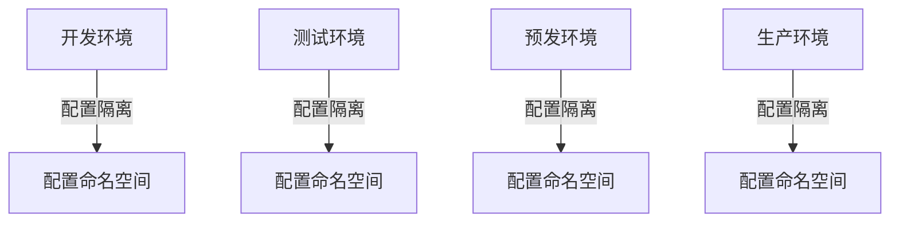

# 配置中心灰度发布与多环境管理实战

## 一句话摘要

配置中心的灰度发布是**变更安全的第一道防线**。本文讲透灰度发布 + 多环境管理的生产实践。

## 灰度发布流程

## 灰度发布核心机制

### 1. 灰度规则
- 按租户灰度
- 按地域灰度
- 按用户比例灰度
- 按机器标签灰度

### 2. 灰度验证
- 监控指标对比（错误率/RT）
- 业务指标对比（下单量/支付率）
- 日志对比（异常日志）

### 3. 回滚机制
- 一键回滚到上一版本
- 自动回滚（错误率 > 阈值）
- 手动回滚（业务确认）

## 多环境管理

### 环境隔离

### 环境配置策略
- DEV：宽松配置，调试友好
- TEST：接近生产，验证配置
- PRE：生产配置，全量验证
- PROD：严格配置，变更受控

## 踩坑记录

1. **灰度比例跳变**：1% → 100% 中间无 10%，直接全量
2. **回滚不及时**：发现错误后 5 分钟才回滚，业务已受损
3. **环境配置混淆**：DEV 误配 PROD 配置
4. **无灰度验证**：直接全量，线上故障

## 灰度发布 Checklist

- [ ] 灰度规则已配置
- [ ] 监控指标已对比
- [ ] 回滚方案已准备
- [ ] 通知相关团队

## 量级考量

| 量级 | 灰度策略 |
|---|---|
| < 1000 QPS | 10% → 50% → 100% |
| 1000-10000 QPS | 1% → 10% → 50% → 100% |
| > 10000 QPS | 0.1% → 1% → 10% → 50% → 100% |

## 📌 数据与事实声明

- 灰度比例基于行业实践
- 踩坑来自生产环境经验
