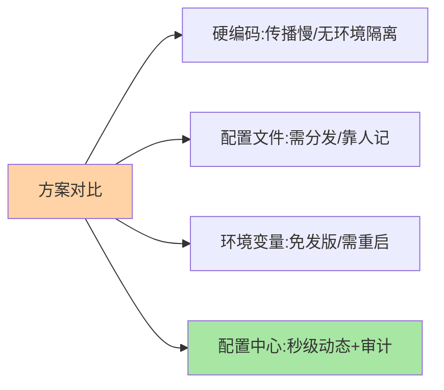

# 配置管理演进：从硬编码到配置中心

> 一句话：配置管理的演进史就是「变化传播速度」的进化史——硬编码改配置要发版，配置文件要登录机器，配置中心把传播做到秒级动态推送。

> **本文核心**：四级演进各解决一层的痛——**硬编码**（改配置 = 发版）、**配置文件随包分发**（环境差异靠人肉维护）、**环境变量/外部化**（不发版但要重启）、**配置中心**（集中管理 + 动态推送 + 版本审计）。**机制链**：配置变化需求出现 → 传播路径的耗时与风险随演进逐级下降 → 配置中心达到「秒级、无侵入、可审计」的治理形态。

## 一句话摘要

四级演进的驱动逻辑：**配置的本质是「会变的参数」**，变化频率越高，对传播速度的要求越高。硬编码时代「改个超时时间 = 一次完整发布」；配置文件时代环境差异靠人记（生产配置误带到测试的经典事故）；环境变量解决了外部化但仍需重启；**配置中心的三件套**——集中管理（一份事实源）、动态推送（秒级生效不重启）、版本审计（谁改的为什么）——把配置从「部署产物」升级为「治理资产」。

## 一、为什么配置值得一个中心

「配置而已，文件放那儿不就行了？」——配置文件方案在微服务规模下的三重失效：**散**（百个实例 × 十份配置文件，改一遍要跨机器）、**慢**（改配置要发布或登录）、**险**（无审计无回滚，改错了不知道谁改的）。配置爆炸的量化视角：实例数 × 环境数 × 配置项数 = 配置管理面积，微服务规模下这个数字轻松过万——**过万的变更面必须平台化治理**，这就是配置中心的必要性论证。

## 5W 速记卡

| 维度 | 一句话 |
|---|---|
| What | 配置的集中管理 + 动态推送 + 版本审计平台 |
| Why | 配置管理面积随微服务规模爆炸，文件方案三重失效 |
| When | 任何「会变的参数」的管理（超时/开关/阈值/密钥） |
| Where | 独立集群（Nacos/Apollo/Spring Cloud Config） |
| How | 配置写入中心 → 订阅推送 → 客户端热生效 |

## 二、四级演进的全景

每一级的「传播耗时」量级：硬编码（小时到天，发版周期）、配置文件（小时，需逐机或重新分发）、环境变量（分钟，重启窗口）、配置中心（**秒级，推送即生效**）——演进的本质是把「配置变更」从发布流程中剥离出来，变成独立的轻量操作。

## 三、与注册中心的区别：两种数据的对照

| 维度 | 配置中心 | 注册中心（互指 service-discovery） |
|---|---|---|
| 数据性质 | 持久参数（需版本可回滚） | 易失实例状态（可重建） |
| 一致性倾向 | 强（配错是事故） | 可容忍旧列表（AP 常见） |
| 变更频率 | 低频高价值 | 高频（实例上下线） |
| 典型代表 | Apollo/Nacos-配置 | Nacos-注册/ZooKeeper |

Nacos 二合一的架构里，两种数据走不同协议（配置偏 CP、临时注册偏 AP）——**语义分离、协议分离**（互指 service-discovery 篇 6 的混合模式）。

四种方案的能力对比：

## 四、典型场景与误区

**典型场景**：动态开关（大促限流阈值、功能开关秒级生效）、多环境差异管理（命名空间隔离开发/测试/生产）、敏感配置（数据库密码加密存储 + 权限管控）、变更审计（谁在什么时候改了什么）。

**误区与不适用**：① 什么配置都进中心——高频变化的大对象、秒级跳动的数据会打爆推送链路（低频、全局敏感参数才配进中心）；② 配置中心当数据库——它是「小而关键的控制面参数」的家；③ 以为动态推送万能——配置热生效依赖代码层的刷新监听（@RefreshScope 类机制），写死在启动逻辑里的配置推了也不生效。

## 五、💡 实战提示

- 💡 配置分级的口诀：频繁变的进中心、不变的进代码，敏感的必须加密 + 权限
- 💡 每条生产配置改前想「回滚路径」，改后验证「真的生效了」
- 💡 配置项命名进规范（应用-模块-语义），命名混乱的配置集无法治理
- 💡 集中化程度与推送压力的权衡：低频敏感参数进中心，高频大对象留在本地——配置边界的决策口径

## 六、你们可能会问

**Q1：K8s ConfigMap 能替代配置中心吗？**
部分替代——ConfigMap 解决「配置与镜像分离」，但动态推送（需挂载刷新或重启）与审计灰度的成熟度弱于专业配置中心；K8s 体系内小规模够用，多环境复杂治理仍以专业中心为主（互指 K8s 系列）。

**Q2：配置中心挂了应用会怎样？**
客户端有本地快照（与注册中心同构的兜底设计）——已拉取的配置继续生效，业务不受影响；影响的是「变更推送」（配置改不了），所以配置中心的高可用要求低于注册中心，但快照机制同样是标配。

**Q3：怎么防止配置改错引发事故？**
三道闸：变更审批（流程）、灰度下发（先一台验证）、快速回滚（版本化）——配置事故的复盘几乎都缺了其中一道。

## 七、开放问题

- 配置的「意图化」（声明期望状态由平台推导具体配置）与 GitOps 模式（配置即代码、变更走 PR）正在重塑配置管理形态，配置中心的边界随之演化。

## 八、自测三问

1. 四级演进的传播耗时量级各是多少？演进的本质是什么？
2. 配置中心与注册中心的数据性质差异？
3. 「动态推送万能」的误区错在哪？

下一篇讲「配置中心核心模型」：配置项、命名空间、分组、环境四要素。

## 📎 核心带走

- **核心一句话**：配置中心 = 集中管理 + 动态推送 + 版本审计，把配置从部署产物升级为治理资产
- **机制链**：配置变化需求 → 传播路径逐级缩短 → 集中/动态/审计三件套 → 秒级生效
- **失效点/边界**：只管低频敏感参数；热生效依赖代码层刷新监听；三道闸（审批/灰度/回滚）缺一即险

## 📌 数据与事实声明

- 写于 2026-09-08，演进框架为业界共识口径
- 免责：以各组件官方文档为准

## 📚 参考资料

| 类型 | 标题 | 来源 |
|---|---|---|
| 关联系列 | 本仓库 service-discovery / K8s 系列 | docs/architecture/、docs/devops/ |
| 官方文档 | Apollo / Nacos 配置管理概念 | apolloconfig.com、nacos.io |
| 社区沉淀 | 配置管理实践公开文章 | 技术社区公开文章 |
