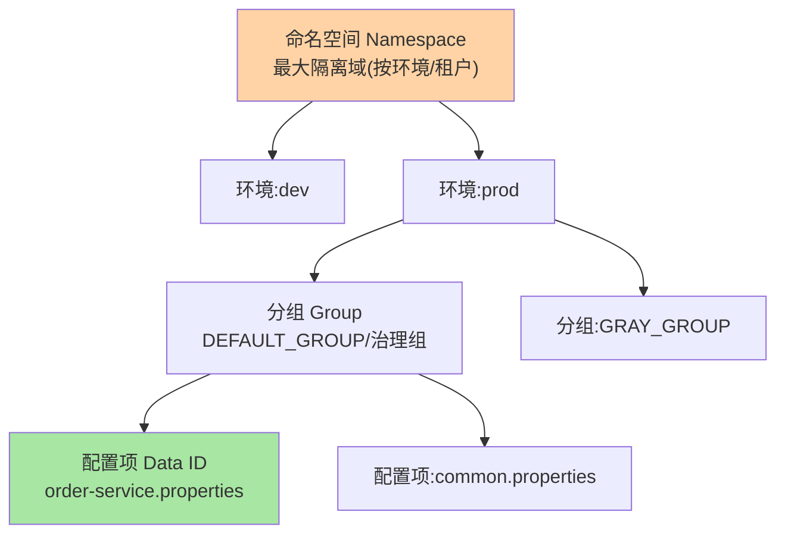
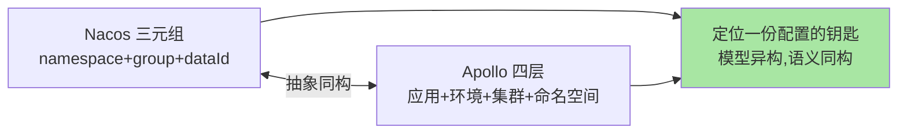

# 配置中心核心模型：四要素与配置的组织学

> 「这份配置属于哪个应用、哪个环境、哪一组」——配置中心的四要素模型（配置项/命名空间/分组/环境）回答的就是配置的**归属与隔离**问题。模型立住，存储、推送、灰度（后面三篇）才有挂靠对象。

> **本文核心**：四要素的定位——**配置项（Data ID）**：配置的最小单元（通常一个应用一份配置文件）；**命名空间（Namespace）**：最大隔离域（隔离环境或租户）；**分组（Group）**：同命名空间内的用途分組（默认组 vs 治理组）；**环境（Environment）**：dev/test/prod 的物理隔离。**机制链**：应用启动按「命名空间 + 分组 + Data ID」三元组定位配置 → 拉取 + 订阅 → 按环境隔离保证「测试流量读不到生产配置」。

## 一句话摘要

四要素的层级关系：**命名空间 > 环境 > 分组 > 配置项**（各组件的切分略有差异——Nacos 用「命名空间/分组/DataID」三元组、Apollo 用「应用/环境/集群/命名空间」四层，抽象同构）。核心设计问题两个：**环境隔离怎么做**（同 namespace 不同 cluster vs 不同 namespace，物理与逻辑隔离的取舍）与**配置项怎么归属**（按应用归属是主流——配置的生命周期跟随应用，跨应用共享配置用公共配置项+引用机制）。

## 一、为什么模型先于功能

配置中心的三大功能（存储/推送/灰度）全部作用在「某个配置」上——**「某个」的定位就是模型**：没有清晰的归属与隔离模型，推送会串环境、灰度会串应用、审计对不上对象。配置事故的高发形态「改了测试配置影响生产」正是模型错配（环境隔离失效）的直接后果——模型是配置安全的第一道闸。

## 5W 速记卡

| 维度 | 一句话 |
|---|---|
| What | 配置项/命名空间/分组/环境的归属隔离模型 |
| Why | 定位配置是一切配置操作的前提，模型错配即事故 |
| When | 配置规划、环境隔离设计、配置事故排查 |
| Where | 各配置中心的组织模型层 |
| How | 三元组或四层定位一份配置，环境隔离保证不串 |

## 二、四要素的层级全景

**隔离粒度的取舍**：环境隔离用「独立命名空间」（物理隔离最彻底）还是「同命名空间独立分组/集群」（逻辑隔离省资源）——测试/生产必须强隔离（物理），开发内子环境可逻辑隔离；**共享配置**（日志格式、通用线程池参数）用「公共配置项 + 多应用引用」，避免复制粘贴 N 份后的「改一漏 N-1」。

## 三、与 ConfigMap 的区别：K8s 对照

| 维度 | 配置中心模型 | K8s ConfigMap/Namespace |
|---|---|---|
| 隔离模型 | 命名空间+分组+DataID | Namespace+资源名 |
| 动态能力 | 推送秒级热生效 | 挂载需刷新/重启 |
| 治理面 | 审计/灰度/权限成体系 | 平台基础能力 |

K8s 的 Namespace 是资源隔离域（与配置中心的命名空间同名异义）——两者组合使用时（ConfigMap 同步到配置中心或反向）要显式映射规则，防「同名不同义」的隔离开裂。

## 四、典型场景与误区

**典型场景**：多应用共享公共配置（引用机制 + 变更广播提醒）、按租户隔离（SaaS 场景租户即命名空间）、配置版本对比（环境间 diff 找配置漂移——「生产为什么和测试不一样」的标准排查法）。

**误区与不适用**：① 环境隔离靠自觉——「记得改 DataID 后缀」类人工纪律必然失效，隔离必须结构化（模型层强制）；② 一个配置文件无限膨胀——单配置项过长导致「改一个值 diff 全文件」，按变更语义拆分配置文件；③ 跨环境复制配置不校验——「复制 dev 配置到 prod 再改」漏改即事故，发布流程要有环境间 diff 强制环节。

配置模型的演进对照（三元组与四层）：

## 五、💡 实战提示

- 💡 环境/命名空间规划先行：隔离矩阵（谁与谁必须隔离）画清楚再建配置
- 💡 公共配置 + 引用是治理利器，但引用链要短（套娃引用是灾难）
- 💡 环境间配置 diff 做成例行巡检——配置漂移的照妖镜
- 💡 模型选型推荐：何时用什么粒度——环境强隔离用独立命名空间，开发子环境用分组逻辑隔离，公共参数用共享配置+引用

## 六、你们可能会问

**Q1：配置项的粒度怎么定？**
按「变更语义」拆——一起变更的配置放一个文件（一个业务的连接池参数），变更节奏不同的拆开（开关类与连接类分开），粒度服务于变更安全。

**Q2：多应用共享配置怎么处理变更风险？**
共享配置的变更是「一对多广播」——发布流程要带「影响应用清单 + 灰度下发」（先改一个应用验证，再广播全量），共享是便利与风险的权衡。

**Q3：配置模型和特性开关平台什么关系？**
功能开关（feature flag）是配置的一个语义子类（布尔开关 + 生效规则）——简单开关用配置中心即可，复杂的按人群/比例开关（AB 平台）是独立产品，边界在「规则复杂度」。

## 七、开放问题

- 配置模型与「策略即代码」的融合（配置声明进代码仓库走 PR 评审、中心只做运行时分发）的 GitOps 形态，正在改变「配置归属」的定义。

## 八、自测三问

1. 四要素的层级关系与各组件实现差异？
2. 环境隔离「物理 vs 逻辑」的取舍原则？
3. 共享配置的「改一漏 N-1」问题怎么解？

下一篇讲「配置存储与订阅机制」：客户端与服务端的数据链路。

## 📎 核心带走

- **核心一句话**：四要素模型（命名空间/环境/分组/配置项）回答配置的归属与隔离，是配置安全的第一道闸
- **机制链**：三元组/四层定位配置 → 隔离模型保证不串环境 → 共享配置用引用机制 → diff 巡检防漂移
- **失效点/边界**：隔离必须结构化不能靠自觉；单配置项按变更语义拆分；环境间复制必须强校验

## 📌 数据与事实声明

- 写于 2026-09-08，模型以 Nacos/Apollo 官方文档为口径
- 免责：以各组件官方文档为准

## 📚 参考资料

| 类型 | 标题 | 来源 |
|---|---|---|
| 官方文档 | Nacos 配置模型 / Apollo 设计 | nacos.io、apolloconfig.com |
| 关联系列 | 本仓库 K8s 系列（ConfigMap 对照） | docs/devops/kubernetes/ |
| 社区沉淀 | 配置模型设计公开文章 | 技术社区公开文章 |
