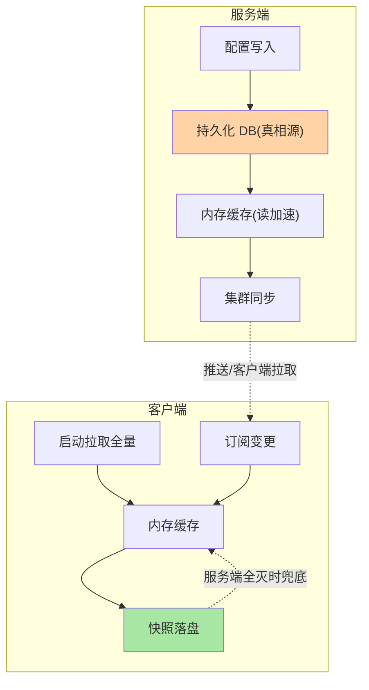
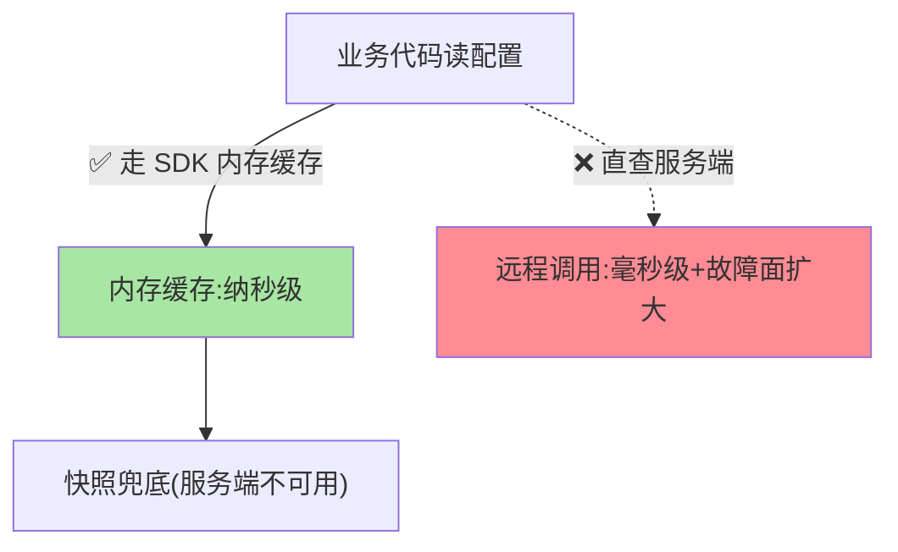

# 配置存储与订阅：客户端与服务端的数据链路

> 配置中心的两端：服务端把配置存好（持久化 + 集群一致），客户端把配置拿到并盯住变化（拉取 + 订阅）。这篇把两端的机制与本地快照兜底讲清。

> **本文核心**：存储端与订阅端的双边机制。**机制链**：服务端——配置写入 → 持久化存储（DB）+ 内存缓存 → 集群间同步；客户端——启动拉取全量 → 建立订阅（长轮询/长连接）→ 本地缓存 + 快照落盘 → 变更回调刷新。**兜底设计**：服务端不可用时候照供配置——与注册中心快照同构的可用性架构。

## 一句话摘要

**服务端存储**：配置写入数据库（持久真相源）+ 内存缓存（读加速），集群节点间同步保证各节点视图一致（CP 倾向，配错是事故——互指 service-discovery 篇 6 的语义差异）。**客户端订阅**：启动时按三元组拉取配置进内存 + **快照落盘**（本地文件缓存），随后建立变更监听——**快照是可用性的底牌**：配置中心集群全灭时，本地快照让应用重启也能拿到最近配置。

## 一、为什么两端要分开设计

存储端关心「不丢、一致、可审计」，客户端关心「快、稳、断网可用」——两端的失败语义完全不同：服务端丢数据是事故，客户端拿不到配置（有快照）可以容忍。**按端拆解机制**，每端的复杂度都可控；混在一起谈「配置中心机制」则两边都说不清。

## 5W 速记卡

| 维度 | 一句话 |
|---|---|
| What | 服务端存储（DB+缓存+同步）与客户端订阅（拉取+监听+快照） |
| Why | 两端失败语义不同，机制分开设计 |
| When | 配置读取异常排查、快照机制设计、配置中心迁移 |
| Where | 配置中心服务端集群 + 应用客户端 SDK |
| How | DB 真相源 + 内存缓存；首拉全量 + 变更订阅 + 快照落盘 |

## 二、双边机制全景

**快照的关键语义**：落盘的是「最近一次成功拉取的配置」——配置中心全灭时，应用重启读快照（而非启动失败）；恢复后客户端重连校验（配置指纹比对）再更新。快照文件本身要纳入安全考量（含敏感配置时加密或限制文件权限）。

客户端配置读取的路径取舍：

## 三、与注册中心订阅的区别：语义对照

| 维度 | 配置订阅 | 服务订阅（互指 service-discovery 篇 4） |
|---|---|---|
| 订阅对象 | 配置键（三元组） | 服务实例列表 |
| 变更频率 | 低频高价值 | 高频（实例上下线） |
| 客户端动作 | 热刷新监听器 | 刷新负载均衡候选集 |
| 兜底 | 快照落盘 | 缓存快照 |

推拉结合的机制同源（推送保新鲜、拉取保可靠）——**「订阅」作为一种客户端模式在两个域复用**，学透一个另一个自动通——缓存快照的资源占用与可用性收益之间的取舍，两个域给出了相同的答案：值得。

## 四、典型场景与误区

**典型场景**：配置中心集群迁移（快照与 DB 的迁移顺序设计）、客户端灰度升级（SDK 版本兼容矩阵）、断网演练（拔配置中心验证应用靠快照存活）。

**误区与不适用**：① 快照文件不设权限——敏感配置明文落盘是安全漏洞（加密或权限管控必选其一）；② 客户端绕过 SDK 直查服务端接口——绕过缓存与快照的兜底链路；③ 配置读取放高频调用路径——配置读走内存缓存（纳秒级），直查远端是性能事故。

## 五、💡 实战提示

- 💡 快照目录纳入部署规范：磁盘可写、权限收敛、容量预留
- 💡 客户端 SDK 版本与服务端兼容矩阵例行核对（协议演进有过不兼容先例）
- 💡 配置读取一律走 SDK 缓存接口，代码评审拦截直查远端
- 💡 快照策略选型推荐：何时用什么——含敏感配置用加密快照，一般配置限制文件权限即可，双保险用于高敏场景

## 六、你们可能会问

**Q1：配置的内存缓存与快照什么时候不一致？**
服务端变更已推送、本地快照尚未重写（窗口毫秒级）——一致性影响可忽略；真正要防的是「推送失败 + 快照过期」的长期不一致，客户端对账（定时指纹比对）兜底。

**Q2：多配置中心（双活）怎么保证客户端拿对？**
客户端 SDK 支持多集群地址 + 数据同步（服务端间双向同步）——「同数据双中心写入」要全局锁或分片归属，双活配置中心是进阶架构（多数场景主备足够）。

**Q3：配置变更的客户端回调失败怎么办？**
回调异常不应阻断配置更新本身（先更新缓存再回调，回调异常仅记日志告警）——「配置生效」与「业务响应配置变化」解耦，是 SDK 设计的细节红线。

## 七、开放问题

- 配置客户端与 Mesh/服务网格的 sidecar 化融合（配置分发下沉基础设施）在云原生形态下演进中，SDK 的长期形态值得跟踪。

## 八、自测三问

1. 服务端与客户端各自的失败语义差异？
2. 快照落盘的关键语义与安全考量？
3. 「配置生效」与「业务回调」为什么必须解耦？

下一篇讲「动态刷新与推送机制」：长轮询与推拉结合的实现。

## 📎 核心带走

- **核心一句话**：存储端保「不丢一致」，客户端保「快稳断网可用」——快照落盘是客户端的底牌
- **机制链**：写入 DB 真相源 → 内存缓存 + 集群同步 → 客户端首拉 + 订阅 → 快照落盘兜底
- **失效点/边界**：快照含敏感配置要加密限权；配置读取必须走 SDK 缓存，直查远端是事故

## 📌 数据与事实声明

- 写于 2026-09-08，机制以 Nacos/Apollo 客户端实现的共识口径归纳
- 免责：以各组件官方文档为准

## 📚 参考资料

| 类型 | 标题 | 来源 |
|---|---|---|
| 官方文档 | Nacos 客户端 / Apollo 客户端设计 | nacos.io、apolloconfig.com |
| 关联系列 | 本仓库 service-discovery 系列（订阅模式同构互指） | docs/architecture/service-governance/ |
| 社区沉淀 | 配置客户端设计公开文章 | 技术社区公开文章 |
