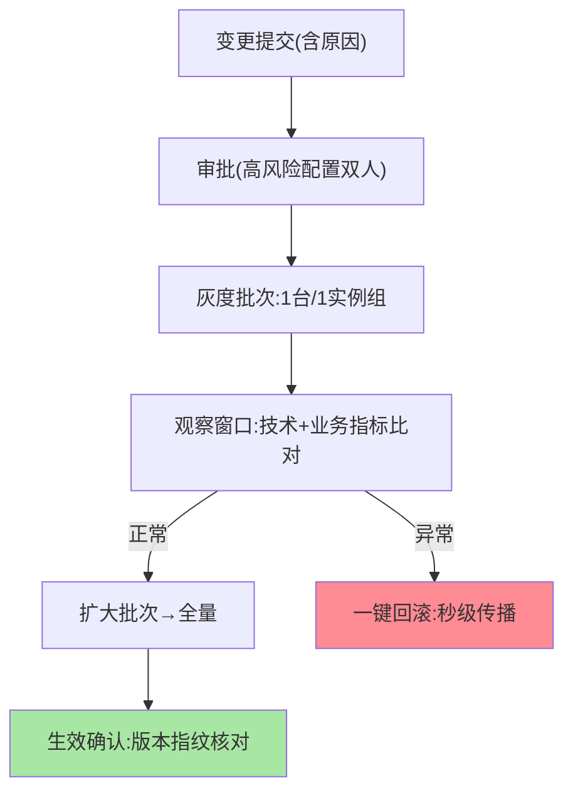
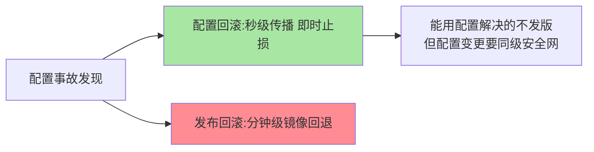

# 配置灰度与版本回滚：变更的安全网

> 配置变更是最高频的线上变更——高频意味着必须有一张安全网：**灰度下发**（先推一台验证再全量）与**版本回滚**（一键回到上个已知好版本）。这篇讲配置变更安全网的三个组成。

> **本文核心**：安全网三件——**版本化**（每次变更自动留版本，含变更人/时间/内容），**灰度下发**（按实例维度分批推送，先小批次观察指标再全量），**快速回滚**（一键切回历史版本，秒级传播）。**机制链**：变更提交 → 审批 → 灰度批次推送 → 指标观察（错误率/业务指标） → 全量或回滚。配置变更的风险与发布同源，安全网机制与发布治理同构（互指 graceful-shutdown 篇 4 的发布策略）。

## 一句话摘要

三件套的工程细节：**版本化**是基础（无版本就无回滚，版本元数据含变更人与原因——审计的原料）；**灰度下发**的关键是「观察什么」——技术指标（错误率、延迟）+ 业务指标（配置对应的业务行为），且**自动比对灰度批次与全量批次的差异**；**回滚**的要点是「快与准」——秒级传播（走同一推送链路）+ 回滚后确认生效（客户端版本指纹核对）。**配置回滚比发布回滚快两个量级**（秒级 vs 分钟级），这是「能用配置解决就不发版」的成本逻辑。

## 一、为什么配置变更需要与发布同级的安全网

「改个配置而已」的风险错觉：配置变更直接改变线上行为（限流阈值改错 = 流量失控），且**变更频率远高于发布**（每天 N 次 vs 每周 N 次）——高频 × 直达生效 = 变更风险的常态化。发布治理的成熟机制（灰度、回滚、审批）对配置完全适用——**配置变更就是「不发版的发布」**，按发布标准管理它。

## 5W 速记卡

| 维度 | 一句话 |
|---|---|
| What | 版本化 + 灰度下发 + 快速回滚的变更安全网 |
| Why | 配置变更高频且直达生效，风险需要与发布同级的安全网 |
| When | 生产配置变更流程、配置事故复盘 |
| Where | 配置中心的变更治理层 |
| How | 版本留痕 → 审批 → 灰度批次 → 指标观察 → 全量/回滚 |

## 二、变更安全网的流程全景

**灰度批次的观察窗口**设计：技术指标自动比对（灰度批 vs 全量批的错误率差异超阈值即阻断全量），业务指标按配置语义配置（开关类看转化、阈值类看流量）——**「观察什么」在变更前定义**，事后找指标是灰度失效的主因。**生效确认**容易被忽略：推送成功 ≠ 客户端生效（回调失败、热刷新不支持），版本指纹核对（客户端上报当前配置版本）才是闭环。

回滚时效的量级对比：

## 三、与发布灰度的区别：发布对照

| 维度 | 配置灰度 | 发布灰度（互指 graceful-shutdown） |
|---|---|---|
| 变更载体 | 配置项 | 代码包/镜像 |
| 传播速度 | 秒级 | 分钟级 |
| 回滚成本 | 极低（版本切换） | 高（回滚镜像） |
| 风险显性度 | 低（常被轻视） | 高（流程完备） |

配置灰度的「快」是双刃剑——快与稳的权衡要靠安全网机制兜住：快意味着恢复快，也意味着**犯错更快**——发布级的安全流程（审批/灰度/确认）在配置侧只能加强不能省略。

## 四、典型场景与误区

**典型场景**：紧急回滚演练（配置事故的恢复时效实测——回滚机制的演进方向是更快与更准）、高风险配置双人审批（限流阈值、数据源地址类）、变更窗口治理（低频配置错峰变更，高频配置带自动阻断）。

**误区与不适用**：① 灰度批次只看技术指标——配置的业务影响（开关打开后转化率异常）要业务指标兜底；② 回滚靠翻历史版本页面手动复制——回滚必须是一键原子操作（人肉回滚的耗时就是事故的延长）；③ 版本无限保留——版本保留策略（如 90 天）与审计需求对齐。

## 五、💡 实战提示

- 💡 变更模板强制带「影响面 + 观察指标 + 回滚预案」三字段
- 💡 高危配置清单化（改前双人、改后必验），清单进治理规范
- 💡 回滚演练季度化：实测「从决定回滚到全量生效」的真实耗时
- 💡 选型决策口径：何时用什么安全级别——低危配置走标准流程，高危清单配置双人审批+灰度必检，紧急开关走快速通道+事后补审

## 六、你们可能会问

**Q1：灰度批次的指标比对怎么做自动化？**
配置中心与监控联动：灰度批次打标 → 监控按标对比对两批次指标 → 差异超阈值自动阻断全量推送——「自动阻断」的阈值按指标基线波动范围设定。

**Q2：多个配置项要一起变更（关联变更）怎么办？**
关联变更打包成「变更单」原子下发（部分生效比全不生效更危险）——关联关系在配置建模时声明（互指核心模型篇的变更语义拆分）。

**Q3：回滚会不会有延迟问题（旧配置不兼容新代码）？**
会——「新代码依赖新配置」的场景，回滚配置到旧版本可能导致新代码异常——**配置与代码的版本兼容矩阵**要纳入发布管理（配置版本与代码版本配对升级/回滚）。

## 七、开放问题

- 配置变更的自动风险识别（按配置语义预测影响面、自动生成观察指标清单）是变更安全的智能化方向，语义理解是技术门槛。

## 八、自测三问

1. 安全网三件套各自的工程细节？
2. 灰度批次的观察窗口要「变更前定义什么」？
3. 配置回滚的「快」为什么是双刃剑？

## 📎 核心带走

- **核心一句话**：配置变更安全网 = 版本化 + 灰度下发 + 一键回滚，按发布标准管理配置变更
- **机制链**：提交审批 → 灰度批次 → 双指标观察 → 全量/回滚 → 版本指纹确认生效
- **失效点/边界**：观察指标变更前定义；回滚必须原子一键；配置与代码的兼容矩阵纳入发布管理

## 📌 数据与事实声明

- 写于 2026-09-08，流程框架为配置治理实践的归纳
- 免责：具体流程按组织变更管理规范评审

## 📚 参考资料

| 类型 | 标题 | 来源 |
|---|---|---|
| 关联系列 | 本仓库 graceful-shutdown 系列（发布灰度互指） | docs/architecture/service-governance/ |
| 官方文档 | Apollo 发布机制 / Nacos 灰度配置 | apolloconfig.com、nacos.io |
| 社区沉淀 | 配置变更治理公开文章 | 技术社区公开文章 |
