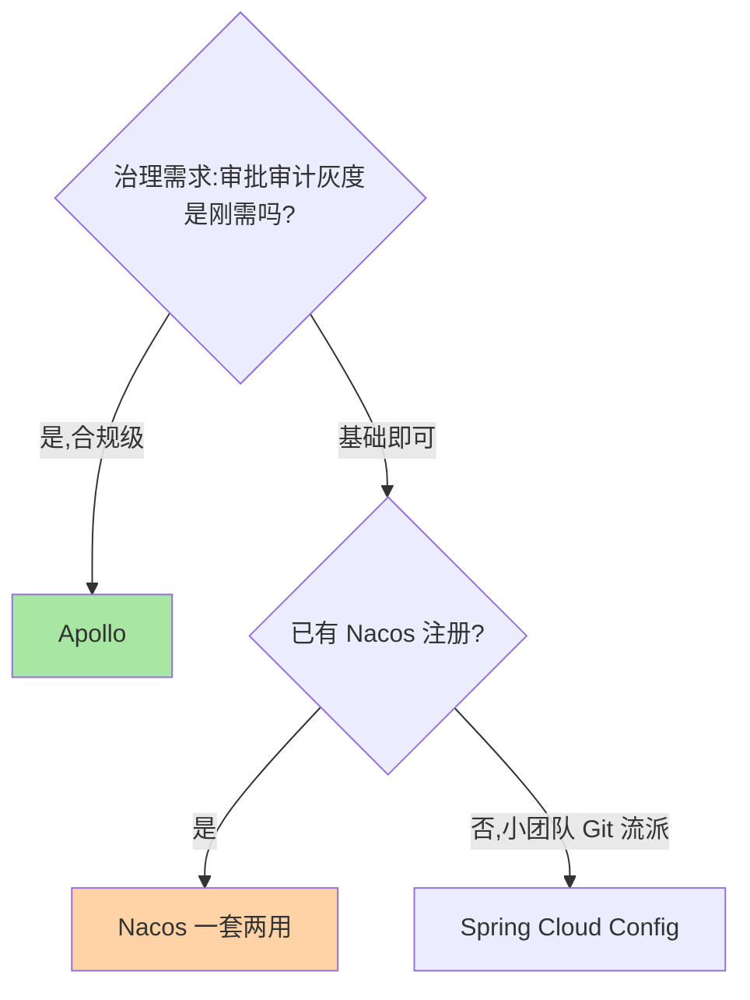
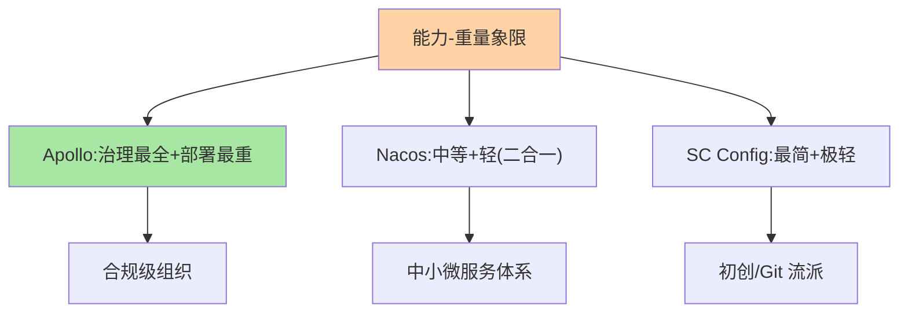

# 主流配置中心对比：三个组件的设计哲学

> Nacos、Apollo、Spring Cloud Config 常被放进同一张选型表——它们是「三种配置治理哲学」的代表：二合一轻量、企业级治理重装、极简 Git 化。对比的目的是看清每种哲学为谁付出了什么。

> **本文核心**：三组件按「治理完备度 × 部署重量 × 生态绑定」三轴区分：**Apollo**——企业级治理最完备（发布审批/灰度/权限/审计全内置），部署最重；**Nacos**——注册配置二合一（一套集群两用），治理能力中等，与国内微服务生态绑定深；**Spring Cloud Config**——Git 化极简（配置即代码），功能薄、无推送 UI，适合小团队起步。**机制链**：团队规模与治理需求 → 治理完备度要求 → 部署重量承受度 → 生态匹配 → 组件选择。

## 一句话摘要

逐个看：**Apollo** 的设计哲学「配置治理是独立域」——发布流程（编辑/发布权限分离）、多环境多集群模型、灰度发布、变更审计全内置，代价是两套系统（ConfigService + AdminService + Portal）的部署运维重量；**Nacos** 的哲学「一套基座两用」——注册与配置共享集群，治理能力够用级（无独立发布审批流），胜在部署轻与生态热度；**Spring Cloud Config** 的哲学「配置即代码」——Git 仓库即存储（天然版本化），无推送能力（依赖 MQ/Bus 补）、无 UI 治理面，适合「配置变更走 PR 流程」的小团队。**没有最好只有最配**——治理需求决定完备度要求，运维能力决定部署重量上限。

## 一、为什么配置中心选型分歧大

注册中心选型有明显的收敛趋势（Nacos/etcd 两强），配置中心却长期三足鼎立——因为**配置治理需求的跨度极大**：十人团队要的「改个配置不重启」与万人组织要的「双人审批 + 多环境矩阵 + 合规审计」是两个世界的产品需求——三个组件分别服务了需求光谱的不同段，分歧本身就是需求光谱的映射。

## 5W 速记卡

| 维度 | 一句话 |
|---|---|
| What | Nacos/Apollo/SC Config 的三轴对比 |
| Why | 治理需求光谱宽，三组件各占一段 |
| When | 配置中心选型、存量评估 |
| Where | 架构评审 |
| How | 治理完备度 × 部署重量 × 生态绑定三轴定位 |

## 二、对比矩阵与三轴定位

| 维度 | Apollo | Nacos | Spring Cloud Config |
|---|---|---|---|
| 治理完备度 | ★★★★★（审批/灰度/审计全内置） | ★★★（基础治理） | ★★（Git 版本化） |
| 部署重量 | 重（多组件） | 轻（与注册共用集群） | 极轻（Git+服务） |
| 推送实时性 | 秒级（推拉结合） | 秒级（长轮询→2.x 长连接） | 依赖 Bus/MQ 触发 |
| 生态绑定 | 大型企业实践深厚 | 国内微服务生态/Spring Cloud Alibaba | Spring 原生 |
| 权限审计 | 细粒度（项目/环境/命名空间级） | 基础 | 依赖 Git |

**三句话解读**：① Apollo 的重是「治理完备的对价」，合规诉求强的中大型组织物有所值；② Nacos 的二合一是「部署轻的对价」，治理深度不足时需外围补（审批走工单、审计走日志）；③ SC Config 的 Git 化是「配置即代码的极致」，但推送与治理面要自建。

三组件的能力-重量定位：

## 三、与注册中心选型的区别：方法论对照

| 维度 | 配置中心选型（本篇） | 注册中心选型（互指 service-discovery 篇 9） |
|---|---|---|
| 决策第一轴 | 治理完备度需求 | 一致性取向 |
| 权重因子 | 合规与审批要求 | 数据构成与生态 |
| 演进趋势 | GitOps 融合 | Mesh 控制面融合 |

方法论同构（画像 → 轴心 → 组件），**决策轴不同**——配置中心的第一轴是「治理完备度需求」，由组织规模与合规要求决定。

## 四、典型场景与误区

**典型场景**：金融合规组织（Apollo：双人审批 + 全审计是刚需）、中小微服务体系（Nacos：一套集群解决注册配置）、初创团队（SC Config：配置进 Git，PR 即变更管理）、混合形态（核心配置 Apollo、服务注册 Nacos——两套并用按需分工）。

**误区与不适用**：① 用组件热度替代需求匹配——三个组件都活跃，热度差是社区形态不是能力差；② 忽视运维重量——Apollo 的多组件部署对小团队是真实的负担；③ 以为选了 Apollo 就自动有治理——审批流要配组织结构、权限要配角色，治理能力是「配置出来的」。

## 五、💡 实战提示

- 💡 选型先答「审批与审计是不是刚需」——这一问直接分出 Apollo 与其他
- 💡 已有 Nacos 注册的团队优先评估一套两用，治理缺口用流程补
- 💡 混合部署（多配置中心）要规划配置同步与唯一事实源，防止双源漂移

## 六、你们可能会问

**Q1：K8s 原生方案（ConfigMap + GitOps）会替代专业配置中心吗？**
部分场景会——GitOps 形态（Argo 类）覆盖「配置即代码 + 自动同步」，但热推送、灰度下发、细粒度权限仍是专业中心的强项；两者在「动态推送需求强度」上分野。

**Q2：从 SC Config 迁移到 Nacos/Apollo 的成本？**
客户端 SDK 换接（配置读取方式变化）+ 配置数据迁移（格式转换）+ 双跑验证——量级与发布类迁移相当，按「先读后写」的迁移纪律执行。

**Q3：Apollo 的「重」能裁剪吗？**
可以单模块部署（Portal + ConfigService 精简形态），但裁剪掉的是治理能力（AdminService 承载发布管理）——裁剪前确认治理需求的下限。

## 七、开放问题

- 三组件的能力边界在互相渗透（Nacos 补治理、Apollo 上云托管、SC Config 加推送），选型结论的有效周期在缩短——按年复核——组件互相渗透是配置中心生态多年演进的常态，选型要预判演进方向。

## 八、自测三问

1. 三轴对比的轴心是什么？三个组件各代表什么哲学？
2. 「治理完备度需求」由什么决定？
3. Nacos 二合一的「部署轻」对价是什么？

## 📎 核心带走

- **核心一句话**：Apollo 重治理、Nacos 轻二合、SC Config 极简 Git 化——按治理需求光谱对号入座
- **机制链**：组织规模与合规要求 → 治理完备度需求 → 部署重量承受度 → 生态匹配 → 组件选择
- **失效点/边界**：治理能力是配置出来的不是选出来的；多配置中心必须规划唯一事实源

## 📌 数据与事实声明

- 写于 2026-09-08，组件能力以官方文档为准；能力对比为当前版本的快照口径
- 免责：组件演进快，选型前复核当前版本

## 📚 参考资料

| 类型 | 标题 | 来源 |
|---|---|---|
| 官方文档 | Apollo / Nacos / Spring Cloud Config | apolloconfig.com、nacos.io、spring.io |
| 关联系列 | 本仓库 service-discovery 篇 9（选型方法论对照） | docs/architecture/service-governance/ |
| 社区沉淀 | 配置中心选型公开实践 | 技术社区公开文章 |
