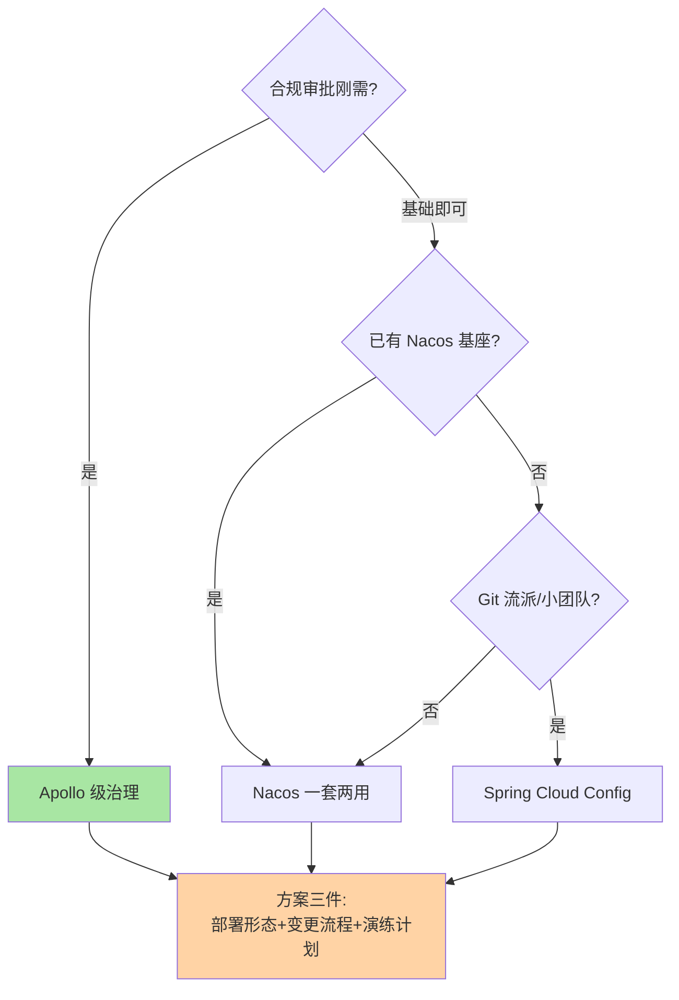
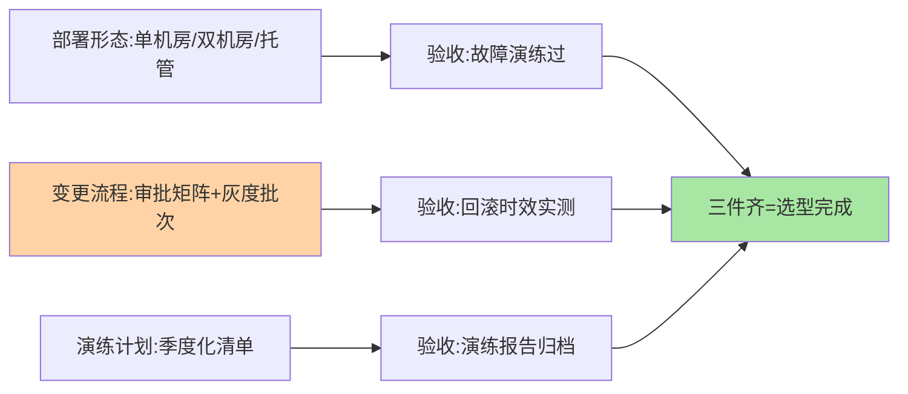

# 配置中心选型决策：治理需求定方案

> 全系列收束篇（机制侧）：选型不是挑组件，是**把组织的治理需求翻译成方案**——治理完备度、部署重量、生态匹配三轴走一遍，输出「组件 + 部署形态 + 治理流程」的完整方案。

> **本文核心**：选型三步——**① 画治理需求画像**（团队规模、合规要求、变更频率、多环境复杂度）；**② 三轴定位**（治理完备度需求 × 部署重量承受 × 生态匹配，组件对照见篇 6）；**③ 输出完整方案**（组件 + 部署形态 + 变更流程 + 审计要求）——「用 Apollo」与「Apollo 双机房 + 高危双人审批 + 季度回滚演练」是两个答案。**机制链**：需求画像 → 轴心定位 → 组件候选 → 治理流程设计 → 演练验收。

## 一句话摘要

画像五问：**① 合规审批是刚需吗**（金融/支付类是，直接指向 Apollo 级治理）；**② 已有基座吗**（已有 Nacos 注册优先评估一套两用）；**③ 多环境多集群复杂度**（环境矩阵越大，模型能力要求越高）；**④ 团队运维栈**（Java/Go/云托管偏好）；**⑤ 变更频率与规模**（日均变更量决定流程自动化要求）。三轴定位后，**治理流程设计是方案的另一半**——组件只提供能力，审批流、高危清单、演练计划要组织自己配。

## 一、为什么配置中心选型常被轻视

「配置中心嘛，随便选一个能用就行」——轻视的代价在一年后显现：合规审计时拿不出变更记录、配置事故复盘时没有灰度与回滚、多环境矩阵大到模型失控。**配置治理的成熟度是组织工程成熟度的镜子**——选型过程本身就是一次治理需求的盘点，跳过盘点直接选组件，等于跳过了治理规划。

## 5W 速记卡

| 维度 | 一句话 |
|---|---|
| What | 画像五问 + 三轴定位 + 完整方案输出的选型框架 |
| Why | 选型输出是治理方案而非组件名 |
| When | 配置中心建设、存量治理升级 |
| Where | 架构评审 |
| How | 画像 → 定位 → 组件 → 流程 → 演练 |

## 二、决策树与方案输出

**方案三件**的展开：**部署形态**（单机房/双机房/云托管——按爆炸半径定）、**变更流程**（审批矩阵：哪些配置双人、哪些自动化、灰度批次怎么分）、**演练计划**（回滚时效实测、配置中心故障演练、灰度阻断验证）——三件齐了才叫方案，选型会才算开完。

选型产出三件的验收闭环：

## 三、与注册中心选型的区别：对照

| 维度 | 配置中心选型（本篇） | 注册中心选型（互指篇 9） |
|---|---|---|
| 第一驱动 | 合规与治理需求 | 数据构成与一致性 |
| 方案重心 | 变更流程设计 | 部署与客户端兜底 |
| 演练焦点 | 回滚时效/灰度阻断 | 摘除风暴/分区行为 |

两者是「同一套基座的两种数据面」，选型常联动评估（一套两用的经济性）——**联动评估时先各自独立成案，再合并部署形态**。

## 四、典型场景与误区

**典型场景**：支付合规组织（Apollo + 双人审批 + 全审计，监管要求直接映射选型）、快速成长的电商（Nacos 起步，治理缺口用工单流程补，规模化后再评估 Apollo）、多技术栈集团（按技术栈分域配置中心，统一审计面聚合）。

**误区与不适用**：① 组件选型替代治理设计——没有审批流的 Apollo 只是多组件部署；② 一步到位上重型方案——治理流程没跟上，重组件的能力空转；③ 忽视配置量增长——配置项数量随业务膨胀，模型的扩展性（命名空间规划）在选型期就要预留。

## 五、💡 实战提示

- 💡 选型会产出三件（部署形态/变更流程/演练计划），只定组件名不算完成
- 💡 治理需求画像每年复盘：组织变了、合规变了，配置治理要跟着变
- 💡 迁移评估用「先读后写」纪律，配置双跑期比注册中心更长（数据可回滚价值高）

## 六、你们可能会问

**Q1：云托管配置中心（MSE 类）怎么选？**
托管解决部署重量（三轴之一消解），治理能力随产品规格——选托管时把「部署重量」轴换成「厂商锁定与出口成本」评估，其余两轴照走。

**Q2：自建 vs 托管的决策点？**
团队运维能力、合规对数据主权的要求、成本结构（托管按量 vs 自建固定）——三个维度打分，无明显倾斜时优先托管（把运维精力还给业务）。

**Q3：多套配置中心并存怎么收敛？**
与注册中心并存的收敛策略同源（互指 service-discovery 篇 9）：新服务强制统一、存量随大版本迁移、过渡期同步映射——并存不可怕，无治理的并存才可怕。

## 七、开放问题

- 配置中心与策略引擎/特性开关平台的融合（配置、开关、AB 实验统一治理面）是平台化的演进方向，边界在重新绘制。

## 八、自测三问

1. 画像五问是什么？哪一问的权重最高？
2. 「方案三件」是哪三件？
3. 联动评估（与注册中心）的评估顺序？

## 📎 核心带走

- **核心一句话**：配置中心选型 = 治理需求画像 × 三轴定位，输出「组件 + 部署形态 + 治理流程」的完整方案
- **机制链**：画像五问 → 三轴定位组件 → 方案三件设计 → 演练验收 → 年度复盘
- **失效点/边界**：治理能力是配置出来的；并存多套要收敛；选型结论按组织演进年度复核

## 📌 数据与事实声明

- 写于 2026-09-08，选型框架为治理实践的归纳
- 免责：具体决策按组织现状评审

## 📚 参考资料

| 类型 | 标题 | 来源 |
|---|---|---|
| 关联系列 | 本系列篇 6 对比矩阵 / service-discovery 篇 9 | docs/architecture/service-governance/ |
| 官方文档 | Apollo / Nacos / 云托管产品文档 | 各官方站点 |
| 社区沉淀 | 配置中心选型公开实践 | 技术社区公开文章 |
