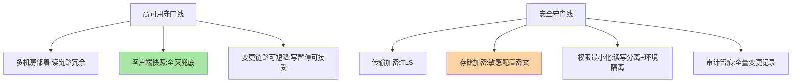

# 配置中心高可用与安全：敏感配置的守门线

> 配置中心存着数据库密码、第三方密钥、核心开关——它既是高可用组件（挂了配置改不了），又是敏感资产仓库（泄露即事故）。这篇讲高可用部署与安全治理的双守门线。

> **本文核心**：高可用侧——**部署多机房 + 客户端快照兜底**（与注册中心同构，配置中心可容忍「暂时改不了」不可容忍「读不到」）；**安全侧四道闸**——**传输加密**（TLS）、**存储加密**（敏感配置密文存储）、**权限管控**（读写分离 + 环境隔离的权限）、**审计留痕**（全量变更记录）。**机制链**：敏感配置 → 加密存储 → 权限校验读取 → TLS 传输 → 客户端解密使用 → 全程审计。

## 一句话摘要

高可用要点：配置中心的可用性语义分两半——**读（配置下发）要求高**（全灭时靠客户端快照撑，但快照有限期）、**写（变更管理）可短降**（变更流程可暂停）——部署形态按「读不中断」设计（多机房、通知链路冗余）。安全要点：**敏感配置的判定清单**（密码/密钥/证书/内网地址）先行，加密方案选型（服务端加密 vs 客户端加密——服务端加密防「库被拖」不防「平台管理员」，最高敏感用客户端加密 KMS 方案）、**权限最小化**（生产配置读写分离，读也要控——配置内容本身是情报）。

## 一、为什么配置中心的安全是「守门线」

配置中心的敏感度常被低估：**一份配置 = 一张系统地图**（数据源、下游地址、开关状态全在里面）——拖库或越权读取的泄露价值极高；而配置变更权限失控（人人可改生产配置）等于「全站行为的改写权开放」。配置中心的安全等级应按「它管的配置的最高敏感度」定——多数组织的配置中心实际达到「核心数据库同级」的敏感度，防护却常停留在「内网随便读」。

## 5W 速记卡

| 维度 | 一句话 |
|---|---|
| What | 多机房高可用部署 + 加密/权限/审计四道安全闸 |
| Why | 配置中心既是高可用组件又是敏感资产仓库 |
| When | 建设期安全设计、敏感配置接入、权限审计 |
| Where | 服务端集群 + 传输链路 + 客户端 |
| How | TLS + 密文存储 + 最小权限 + 全量审计 |

## 二、双守门线全景

**高可用的语义分层**（与注册中心的差异点）：注册中心挂了影响「新发现」（客户端缓存顶住），配置中心挂了影响「新变更」（客户端快照顶住且时效更长——配置变化频率低，快照保鲜期天然长）——**配置中心的全灭容忍度实际更高**，部署成本可以比注册中心略省，但「读链路」的多机房冗余仍是底线。

## 三、与 Vault 的区别：加密选型对照

| 维度 | 服务端加密 | 客户端加密（KMS） |
|---|---|---|
| 防护范围 | 防库被拖、防接口越权读 | 防平台管理员在内的全链路 |
| 密钥管理 | 平台持有 | 应用/KMS 持有 |
| 复杂度 | 低（配置加密开关） | 高（密钥分发与轮换） |
| 适用 | 一般敏感（密码类） | 最高敏感（支付密钥类） |

**判定口诀：防拖库用服务端加密，防内鬼用客户端加密**——大多数组织到服务端加密 + 权限管控已够；支付级密钥走 KMS 客户端加密——安全投入与敏感等级的权衡按数据分级定，不追最高配。

## 四、典型场景与误区

**典型场景**：敏感配置接入改造（明文密码迁移到加密配置）、权限矩阵设计（按「应用 × 环境 × 读写」三维授权）、审计接入 SIEM（变更事件进安全监控联动告警）、密钥轮换（加密配置的密钥轮换流程——轮换后全量重加密）。

**误区与不适用**：① 敏感配置进 Git 仓库「临时放一下」——Git 历史永久留存，删了也在；② 权限只管写不管读——配置内容是情报，读权限同样最小化；③ 审计只在配置中心——配置的「使用侧」（谁拉取了什么）也是审计面（防拖库式拉取）。

加密方案的演进分层：

## 五、💡 实战提示

- 💡 敏感配置判定清单进安全规范：密码/密钥/证书/内网拓扑四类必加密
- 💡 权限矩阵按「应用 × 环境 × 读写」三维建模，生产读权限默认收紧
- 💡 密钥轮换流程先于加密方案上线——没有轮换方案的加密是定时炸弹

## 六、你们可能会问

**Q1：客户端加密后，配置中心还能做灰度回滚吗？**
能——加密不改变版本化机制（密文也是配置值），回滚切版本照常；变化是「平台侧不可见明文」，灰度验证依赖应用侧上报的生效指标而非平台看内容。

**Q2：配置泄露的应急响应是什么？**
按泄露路径分级：Git 泄露（密钥作废轮换 + 历史清理）、平台越权（权限收紧 + 拉取审计回溯）、传输截获（TLS 覆盖检查 + 轮换）——泄露应急预案与密钥轮换能力是前置条件。

**Q3：审计要记到什么粒度？**
变更侧：谁、何时、改了什么配置、改了什么内容（diff）；读取侧：谁、何时、拉取了哪些配置——两级审计才完整，只记变更会漏「拖库式读取」。

## 七、开放问题

- 机密管理专用设施（Vault/KMS 类）与配置中心的边界在收敛——「一般配置进配置中心、机密进密管、引用打通」的分层是当前演进共识，统一产品形态尚未定型——机密管理的分层架构是近年的演进共识方向。

## 八、自测三问

1. 配置中心的可用性语义两半是什么？全灭容忍度为何高于注册中心？
2. 服务端加密与客户端加密各防什么？判定口诀？
3. 审计的两级（变更/读取）各防什么泄露路径？

## 📎 核心带走

- **核心一句话**：配置中心 = 高可用（多机房 + 快照）与安全（加密/权限/审计四闸）的双守门线，按所管配置的最高敏感度定防护等级
- **机制链**：敏感判定清单 → 加密选型（防拖库/防内鬼） → 权限三维最小化 → 双级审计 → 密钥轮换闭环
- **失效点/边界**：Git 临时放敏感配置等于永久泄露；只管写不管读是权限半成品；无轮换方案的加密是定时炸弹

## 📌 数据与事实声明

- 写于 2026-09-08，安全机制为业界共识与最佳实践归纳
- 免责：具体方案按组织安全规范评审

## 📚 参考资料

| 类型 | 标题 | 来源 |
|---|---|---|
| 官方文档 | Apollo/Nacos 安全特性 / HashiCorp Vault | 各官方站点 |
| 关联系列 | 本仓库 K8s Secrets（平台级机密对照） | docs/devops/kubernetes/ |
| 社区沉淀 | 配置安全公开实践 | 技术社区公开文章 |
