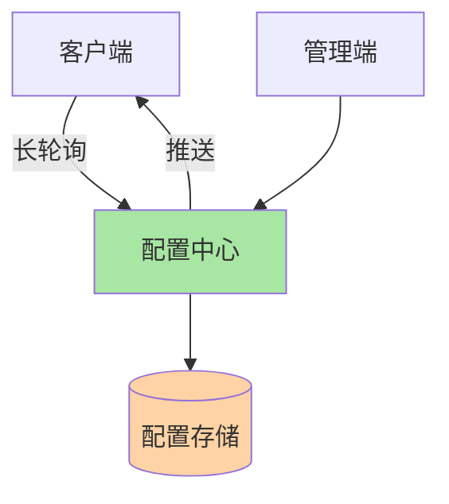

# 从零实现配置中心：存储 + 长轮询推送

## 一句话摘要

手撸一个配置中心的核心：存储模型 + 长轮询推送 + 灰度 + 版本管理。从实现理解配置中心的本质。

## 架构设计



## 核心模块

### 1. 存储模型
- 配置项：key + value + 版本
- 命名空间：隔离不同环境
- 分组：隔离不同业务

### 2. 长轮询推送
- 客户端发起长轮询请求
- 服务端 hold 连接直到变更
- 变更后推送新配置

### 3. 灰度发布
- 按规则（租户/地域/比例）分流
- 灰度配置独立存储

### 4. 版本管理
- 每次变更记录版本
- 支持回滚到任意版本

## 实现要点

```python
# 伪代码：长轮询推送核心逻辑
def long_poll(client_id, config_key, timeout=30s):
    last_version = get_client_version(client_id, config_key)
    
    # 等待变更
    change = wait_for_change(config_key, last_version, timeout)
    
    if change:
        return change.new_value
    else:
        return timeout_response
```

## 数据一致性

- 双写期：旧配置 + 新配置同时生效
- 对账期：校验新旧配置一致性
- 切换期：读切到新配置
- 回退期：新配置异常 → 切回旧配置

## 踩坑记录

1. **长轮询超时**：hold 连接过多，服务端资源耗尽
2. **版本冲突**：并发修改同一配置，后写覆盖先写
3. **灰度规则复杂**：规则过多，匹配慢
4. **推送丢失**：网络抖动导致客户端未收到推送

## 量级考量

| 量级 | 架构调整 |
|---|---|
| < 1000 配置项 | 单机即可 |
| 1000-10000 | 主从复制 |
| > 10000 | 分片 + 集群 |

## 📌 数据与事实声明

- 实现基于配置中心核心机制
- 踩坑来自生产环境经验
