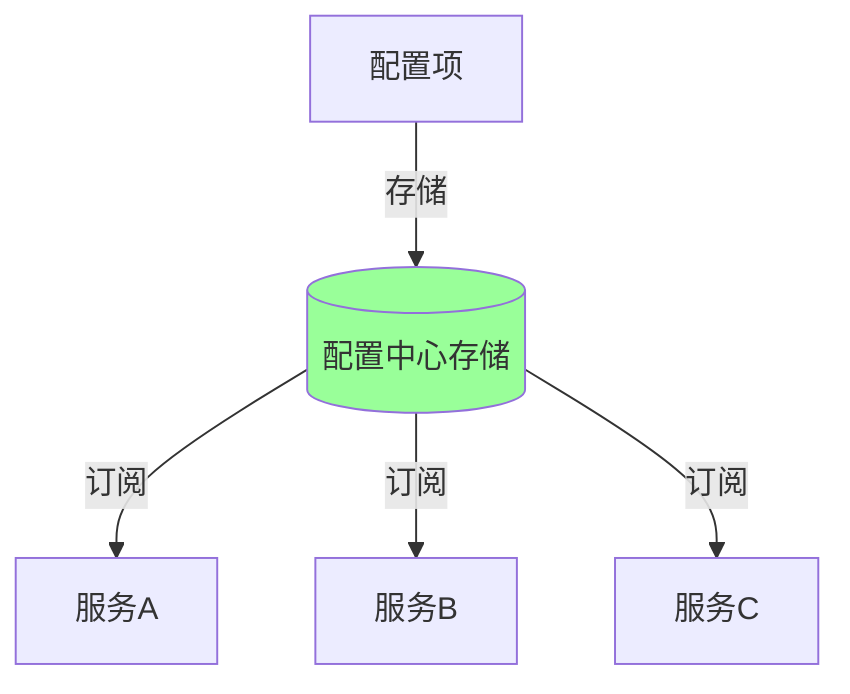
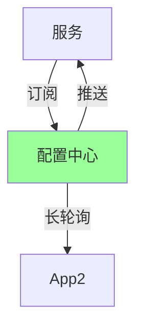
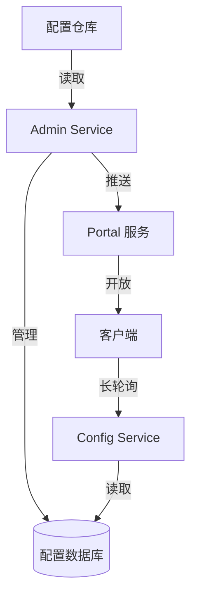

# 配置中心存储与订阅机制

> **一句话摘要**：配置中心 = 集中存储 + 订阅推送——从硬编码到配置中心，核心是「存储 + 推送」。
> **本文核心**：**配置 = 存储层 + 订阅层 + 推送层**。

前置阅读：[配置管理演进](../入门层/从零开始认识配置中心系列/1_配置管理演进-入门.md)。本篇深入配置中心的存储和订阅推送机制。

## 1. 背景：为什么需要集中存储

硬编码的问题是：
- 配置分散在各个服务中
- 修改需要重启
- 无法动态调整

配置中心的核心：把配置从应用中剥离，集中存储，动态推送。



## 2. 核心机制：存储层

### 2.1 存储模型

```mermaid
flowchart TD
    Namespace[命名空间] --> Group[分组]
    Group --> DataId[数据ID]
    DataId --> Version[版本]
    Version --> Content[配置内容]
    
    Note over Namespace,Content: 层级: 命名空间 > 分组 > 数据ID > 版本
```

**配置项四要素**：
- **命名空间**：环境隔离（dev/test/prod）
- **分组**：业务分组（order/order-gateway）
- **数据ID**：配置标识
- **版本**：每次修改递增

### 2.2 存储实现

```java
// 配置存储接口
public interface ConfigStore {
    // 保存配置
    void save(ConfigItem item);
    // 获取配置
    ConfigItem get(String dataId, String group, String namespace);
    // 删除配置
    void delete(String dataId, String group);
    // 获取版本
    long getVersion(String dataId, String group);
}

// 基于数据库的实现
public class DBConfigStore implements ConfigStore {
    public void save(ConfigItem item) {
        // 写入数据库
        db.insert("config", item);
    }
    
    public ConfigItem get(String dataId, String group, String namespace) {
        // 读取数据库
        return db.select("config", dataId, group, namespace);
    }
}
```

## 3. 核心机制：订阅推送

### 3.1 订阅模型



**两种订阅方式**：
- **推送模式**：配置变化主动通知（实时）
- **长轮询模式**：客户端定期查询（兼容性）

### 3.2 长轮询实现

```java
// 长轮询实现
public class LongPollingListener {
    public void listen(String dataId, ConfigCallback callback) {
        while (true) {
            ConfigItem item = center.get(dataId);
            if (item.getVersion() > lastVersion) {
                callback.onChange(item);  // 配置变化
                lastVersion = item.getVersion();
            }
            Thread.sleep(500);  // 轮询间隔
        }
    }
}
```

### 3.3 推送实现

```java
// 推送实现
public class PushManager {
    public void onConfigChanged(ConfigItem item) {
        // 1. 通知所有订阅者
        for (Client client : subscribers) {
            client.push(item);
        }
        // 2. 更新版本
        item.incrementVersion();
    }
}
```

## 4. 落地实践：Apollo 配置中心

### 4.1 Apollo 架构



### 4.2 Apollo 客户端

```java
// Apollo 客户端
@ApolloConfigChangeListener
public void onChange(ConfigChangeEvent changeEvent) {
    for (String key : changeEvent.changedKeys()) {
        ConfigChange change = changeEvent.getChange(key);
        // 处理配置变化
        handleConfigChange(key, change.getNewValue());
    }
}
```

### 4.3 动态刷新

```java
// Spring 集成 Apollo
@Component
public class ConfigBean {
    @Value("${timeout:3000}")
    private int timeout;
    
    // 配置变化自动刷新
    @ApolloConfigChangeListener
    public void onChange(ConfigChangeEvent event) {
        // 更新 bean 属性
    }
}
```

## 5. 落地实践：Nacos Config

### 5.1 Nacos 配置

```yaml
# Nacos Config 配置
spring:
  cloud:
    nacos:
      config:
        server-addr: nacos1:8848
        namespace: prod
        group: DEFAULT_GROUP
        file-extension: yaml
```

### 5.2 动态刷新

```java
// Nacos 动态刷新
@RefreshScope
@RestController
public class OrderController {
    @Value("${timeout:3000}")
    private int timeout;
}
```

## 6. 生产视角：配置存储与推送踩坑

- **踩坑 1**：推送延迟——客户端感知不到配置变化
- **踩坑 2**：推送丢失——配置变化通知丢失
- **踩坑 3**：版本冲突——并发修改导致覆盖
- **踩坑 4**：大配置推送——推送耗时影响性能

**生产最佳实践**：

1. 配置变更记录审计日志
2. 推送确认机制
3. 版本号管理
4. 灰度发布配置
5. 监控推送延迟

## 7. 典型场景

| 场景 | 方案 | 理由 |
|---|---|---|
| 小规模 | 长轮询 | 简单可靠 |
| 大规模 | 推送 | 实时性好 |
| 金融 | 推送 + 确认 | 数据安全 |
| 多环境 | 命名空间 | 环境隔离 |
| 动态调参 | 推送 + 监听 | 实时生效 |

## 8. 与相邻概念的区别

- **配置中心 vs 配置管理**：配置中心是基础设施，配置管理是流程
- **推送 vs 长轮询**：推送实时但复杂，长轮询简单但有延迟
- **配置中心 vs 服务发现**：存储配置 vs 存储服务地址
- **灰度配置 vs 全量配置**：灰度是逐步放量

## 9. 你们可能会问

- **推送和长轮询怎么选？** 推送性能好，长轮询兼容性强
- **推送丢失怎么处理？** 确认机制 + 版本号
- **配置中心挂了怎么办？** 客户端缓存兜底
- **如何保证配置安全？** 加密存储 + 权限控制

## 10. 一句话总结 + 5W 速记卡 + 自测三问

**一句话总结**：配置中心 = 存储层 + 订阅层 + 推送层——集中存储 + 动态推送。

**5W 速记卡**：

| 维度 | 内容 |
|---|---|
| What | 配置存储 + 订阅推送 |
| Why | 动态生效 |
| When | 配置变更时 |
| Where | 所有服务 |
| How | 推送/长轮询 |

**自测三问**：

1. 你的配置推送延迟是多少？
2. 推送丢失怎么处理？
3. 配置中心挂了怎么办？

---

**特性层完结**：配置中心存储与订阅机制已建立。

**🎯 核心带走**：

- **核心一句话**：配置中心 = 集中存储 + 订阅推送
- **链条复述**：存储 → 订阅 → 推送 → 生效
- **失效点与边界**：推送延迟/丢失；配置中心单点

💡 **实战提示**：推送确认 + 版本号 = 可靠配置推送。

**开放问题**：配置中心能替代数据库吗？答案是：不能——配置中心管配置，数据库管数据。

**决策（何时用）**：需要动态配置用配置中心；配置固定用硬编码。
