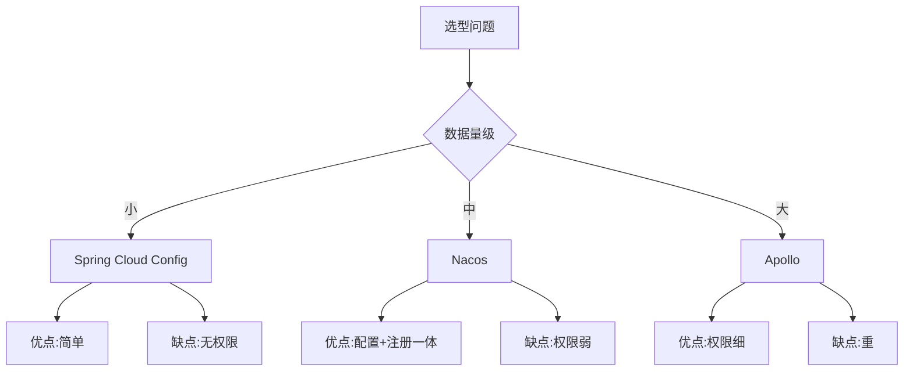
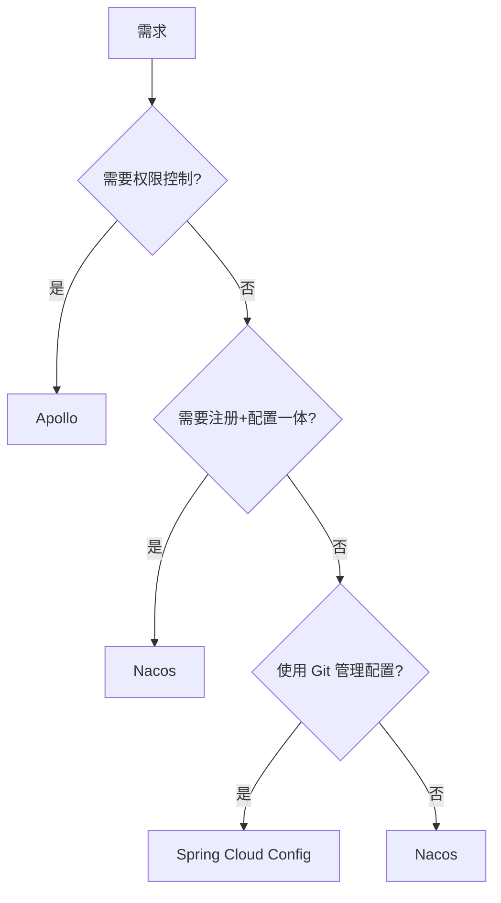

# Nacos vs Apollo vs Spring Cloud Config 选型深度对比

## 一句话摘要

配置中心选型不是比功能多，而是比**谁的模型更贴合你的业务**。Nacos 配置管理强、Apollo 权限细、Spring Cloud Config 简单 —— 三者场景不同。

## 三者核心差异

## 详细对比

| 维度 | Nacos Config | Apollo | Spring Cloud Config |
|---|---|---|---|
| 存储 | 内置 Derby + MySQL | MySQL | Git/ SVN |
| 推送 | 长轮询 | 长轮询 | Git Hook |
| 权限 | 弱 | 强（角色/权限） | 无 |
| 灰度 | 支持 | 支持 | 不支持 |
| 版本回滚 | 支持 | 支持 | Git 版本 |
| 集群 | Nacos 集群 | Apollo 集群 | Config Server 集群 |
| 运维成本 | 低 | 中 | 低 |
| 社区活跃度 | 高（中台系） | 中（携程系） | 高（Spring 系） |

## 选型决策树

## 各场景推荐

| 场景 | 推荐 | 理由 |
|---|---|---|
| 中台/内部系统 | Nacos | 配置+注册一体，运维简单 |
| 金融/多租户 | Apollo | 权限控制细，灰度能力强 |
| 小项目/创业 | Config | 简单，Git 管理版本 |
| 混合架构 | Nacos + Apollo | 核心配置 Apollo，通用配置 Nacos |

## 生产踩坑

1. **Nacos 权限弱**：生产环境必须加外围权限控制
2. **Apollo 重**：需要 MySQL + 独立部署，运维成本高
3. **Config 无推送**：依赖 Git Hook，实时性差
4. **灰度配置**：Apollo 灰度最成熟，Nacos 需要二次开发

## 迁移策略

## 📌 数据与事实声明

- 对比基于 2026 年各项目最新版本
- 选型决策树基于业务场景，非技术偏好
