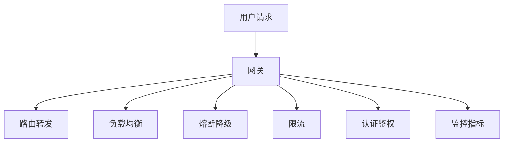

# 高并发网关实战：流量治理与性能优化

## 一句话摘要

网关是流量入口，高并发场景下网关的性能和治理能力直接影响系统稳定性。本文讲透高并发网关的流量治理 + 性能优化实战。

## 网关核心能力

## 流量治理

### 1. 路由转发
- 按路径路由
- 按头部路由
- 按权重路由

### 2. 负载均衡
- 轮询
- 加权轮询
- 最少活跃
- 一致性哈希

### 3. 熔断降级
- 异常检测
- 自动熔断
- 降级策略

### 4. 限流
- 全局限流
- 单服务限流
- 按租户限流

## 性能优化

### 1. 连接复用
- HTTP/2 多路复用
- Keep-Alive 连接池
- 长连接减少握手

### 2. 异步处理
- 异步 I/O
- 事件驱动
- 非阻塞调用

### 3. 缓存
- 响应缓存
- 路由缓存
- 配置缓存

### 4. 压缩
- Gzip 压缩
- Brotli 压缩
- 减少传输量

## 灰度发布实战

- 按比例灰度
- 按租户灰度
- 按标签灰度

## 踩坑记录

1. **网关单点**：网关宕机 = 全站不可用
2. **限流误杀**：正常流量被限流
3. **熔断频繁**：误判导致服务不可用
4. **路由错误**：流量路由到错误服务

## 监控指标

| 指标 | 阈值 | 告警级别 |
|---|---|---|
| P99 RT | > 50ms | WARNING |
| 错误率 | > 0.1% | CRITICAL |
| QPS | > 阈值 | WARNING |
| 连接数 | > 阈值 | WARNING |

## 量级考量

| 量级 | 网关方案 |
|---|---|
| < 1000 QPS | Nginx |
| 1000-10000 QPS | Kong / Hango |
| > 10000 QPS | Hango + K8s |

## 📌 数据与事实声明

- 踩坑来自生产环境经验
- 监控阈值需按业务调整
