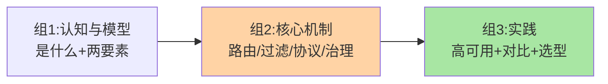

# 网关系列导读：统一入口的治理学

> 入门层 9 篇导读。讲清系列定位、3 组关系、阅读路径、与相邻系列的关系——**不重复入门层定义**。

## 一、这个系列讲什么

微服务后每个服务都直接暴露？鉴权写 N 遍、限流各管各、监控拼不齐——**网关把「入口治理」收拢成一个点**：路由转发、过滤链（鉴权/限流/日志）、协议转换、高可用扩展。本系列讲网关的核心模型与选型。边界先划清：**网关与 Nginx 的分工**——Nginx 是流量转发优先的接入层，网关是治理优先的入口平台（大型体系两者并用）；**L4/L7 分层的转发机制**归 load-balancing（互指），本系列聚焦治理能力。

## 二、3 组关系

## 三、子主题地图

| 组 | 篇目 |
|---|---|
| 1 认知 | 1 是什么与为什么 · 2 核心模型 |
| 2 机制 | 3 路由 · 4 过滤链 · 5 协议转换 · 6 限流与鉴权 |
| 3 实践 | 7 高可用与扩展 · 8 主流对比 · 9 选型决策 |

## 四、阅读路径

| 读者类型 | 推荐路径 |
|---|---|
| 入门读者 | 1 → 2 → … → 9 |
| 机制速查 | 3 → 4 → 5 |
| 选型视角 | 7 → 8 → 9 |

## 五、与相邻系列的关系

- **load-balancing**：L7 转发机制互指，网关聚焦治理面
- **stability**：网关是限流的重要执行点（治理点视角），互指
- **service-auth**：网关鉴权与服务间鉴权的分层，互指

## 📌 数据与事实声明

- 写于 2026-09-08；机制描述为业界共识口径
- 免责：以各组件官方文档为准

## 📚 参考资料

| 类型 | 标题 | 来源 |
|---|---|---|
| 规划大纲 | 本系列规划 | `_internal/gateway/`（内部） |
| 关联系列 | 本仓库 load-balancing / stability 系列 | docs/architecture/service-governance/ |
