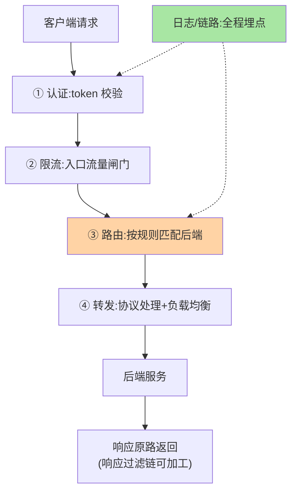

# 网关是什么：统一入口的治理收拢

> 一句话：网关是**微服务的统一入口与治理收拢点**——所有外部请求先进网关，鉴权、限流、路由、日志在入口一次性完成，后端服务只管业务。

> **本文核心**：网关解决「横切关注点重复建设」的问题——没有网关时，鉴权/限流/日志在每个服务各写一遍（N 个服务 N 套逻辑，改一处发 N 次）。**机制链**：客户端 → 网关（认证 → 限流 → 路由 → 转发）→ 后端服务；响应原路返回——横切逻辑全部收拢在网关的过滤链里。为什么「需要」：横切关注点的收拢价值 + 出入口安全边界 + 流量治理的统一观测点。

## 一句话摘要

网关的三大价值：**① 横切收拢**——鉴权、限流、灰度、日志在入口一处实现（一次建设全服务受益，变更一次生效）；**② 安全边界**——外部只知网关，后端拓扑隐藏（攻击面收敛到入口）；**③ 统一观测**——所有进出流量经网关，入口级监控天然完整。代价同样要认清：**网关是全站单点路径**（它的故障半径是全部外部流量）——高可用与性能是网关建设的硬约束，这也是它「能力丰富」背后必须精打细算的原因。

## 一、为什么横切逻辑必须收拢

无网关的横切困境：鉴权逻辑写在五个服务里，JWT 校验方式升级要发五个服务；限流各服务自配，全局视角的流量配比没人管；入口日志格式各异，全链路追踪拼不齐。**横切关注点的本质是「与业务无关、与入口相关」**——与入口相关的逻辑放在入口，是架构上的归位（与「限流归稳定性域」的机制归位同理，互指 stability）。收拢后还有一层红利：**治理策略的变更从「发版级」降为「配置级」**。

## 5W 速记卡

| 维度 | 一句话 |
|---|---|
| What | 微服务统一入口：路由转发 + 横切治理（鉴权/限流/日志） |
| Why | 横切逻辑重复建设、安全边界缺失、观测不统一 |
| When | 所有外部流量入口、内部入口治理收拢 |
| Where | 客户端与后端服务之间（L7 层） |
| How | 过滤链按序执行（认证→限流→路由→转发） |

## 二、请求在网关的一生



过滤链的**顺序即语义**：认证在限流前（未认证请求不计入业务限流）还是后（先挡量再认证，防认证接口被打）——顺序是策略问题没有绝对答案，但**必须显式设计**（默认顺序的盲用是网关配置事故的高发源）。

## 三、与 Nginx 的区别：转发优先 vs 治理优先

| 维度 | Nginx（接入层） | API 网关（治理层） |
|---|---|---|
| 设计重心 | 流量转发极致（C 语言性能） | 治理能力丰富（插件生态） |
| 动态能力 | reload 为主（动态化演进中） | 配置热更、动态路由 |
| 治理面 | 弱（日志/基础限流） | 强（鉴权/限流/灰度/可观测成体系） |
| 典型组合 | 前置接入层 | 业务入口治理层 |

大型体系两者并用：Nginx 在最前扛量卸载 TLS，网关在后做业务治理——「转发归 Nginx、治理归网关」的分工边界清晰（L4/L7 协作互指 LB 篇 6）。

「何时引入网关」的选型决策：

```mermaid
flowchart TD
    Q{"横切逻辑重复度"} -->|"低(≤3服务,鉴权简单)"| NG2["Nginx 足够,网关暂缓"]
    Q -->|"高(服务增多+横切复杂)"|" 
    Q --> GW["引入网关收拢治理"]
    style GW fill:#a8e6a3
    style NG2 fill:#ffd3a5
```

## 四、典型场景与误区

**典型场景**：对外 API 开放平台（鉴权 + 配额 + 计费计量）、App/H5 统一入口（协议适配 + 灰度分流）、内部服务入口治理（统一认证 + 按团队限流）。

**误区与不适用**：① 网关里写业务逻辑——网关只做横切治理，业务规则进网关 = 治理层被业务绑死；② 内部服务间调用也全走网关——东西向流量走网关会造性能瓶颈（网关管南北向，东西向靠 RPC/网格，互指 rpc 系列）；③ 忽视网关自身的高可用与容量——它是全站入口，单点网关是把全站可用性押在一个组件上。

## 五、💡 实战提示

- 💡 过滤链顺序显式设计并文档化，禁止「默认顺序」盲用
- 💡 网关容量按峰值流量的 2-3 倍规划，它没有「降级到不可用」的余地
- 💡 网关与后端的故障隔离：后端故障不能拖垮网关（线程池/连接池隔离）

## 六、你们可能会问

**Q1：小项目需要网关吗？**
按横切逻辑的重复度判断——三个服务以内、鉴权简单，Nginx 足够；服务增多、横切逻辑复杂化后引入网关是自然演进，「为用而用」的早期网关是负担——引入时机与复杂度的权衡以横切重复度为标尺。

**Q2：BFF 和网关什么关系？**
BFF（Backend for Frontend）是「面向端的服务聚合层」（业务编排），网关是「入口治理层」（横切逻辑）——两者常叠加部署（网关在前统一治理，BFF 在后做端适配），职责不同不可互替。

**Q3：网关会拖慢请求吗？**
会增加一跳（毫秒级）——治理能力的成本就是这一跳；关键在网关自身的吞吐与稳定性建设（异步化、连接池、水平扩展），「慢」不是网关的宿命，失控才是。

## 七、开放问题

- 网关与 Service Mesh 入口网关（Istio IngressGateway 类）的边界在融合——治理能力的下沉使「网关」从产品形态演进为「入口治理能力」，形态之争仍在进行。

## 八、自测三问

1. 网关的三大价值与一个硬约束是什么？
2. 过滤链「顺序即语义」举例说明？
3. 网关与 Nginx 的分工边界一句话？

下一篇讲「网关核心模型」：路由与过滤器两要素。

## 📎 核心带走

- **核心一句话**：网关 = 统一入口的横切治理收拢点，鉴权/限流/路由/日志一次建设全站受益
- **机制链**：客户端 → 认证 → 限流 → 路由 → 转发 → 后端 → 响应过滤链 → 返回
- **失效点/边界**：网关是全站单点路径（高可用硬约束）；只管南北向；业务逻辑禁入

## 📌 数据与事实声明

- 写于 2026-09-08，机制描述为业界共识口径
- 免责：以各网关官方文档为准

## 📚 参考资料

| 类型 | 标题 | 来源 |
|---|---|---|
| 关联系列 | 本仓库 LB / stability / rpc 系列 | docs/architecture/ |
| 官方文档 | Spring Cloud Gateway / Kong / APISIX | 各官方站点 |
| 社区沉淀 | 网关架构公开文章 | 技术社区公开文章 |
