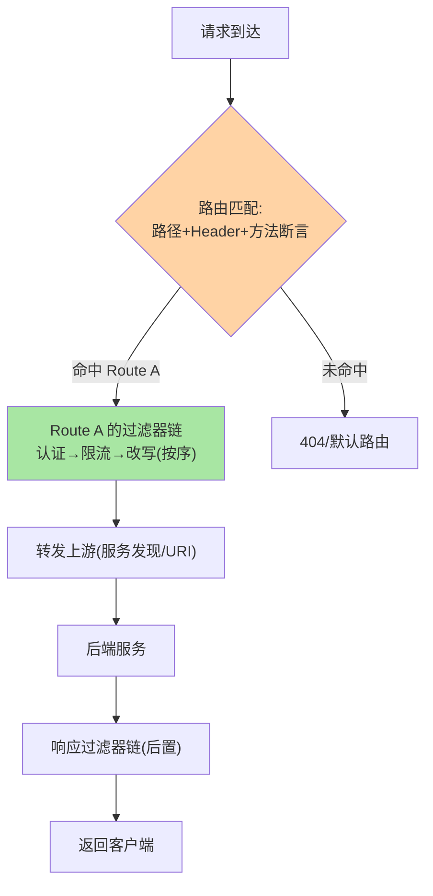
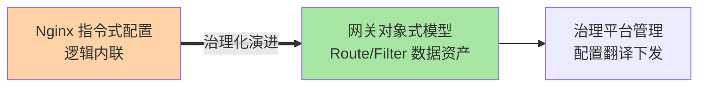

# 网关核心模型：路由与过滤器的两要素

> 各家网关产品功能列表长短不一，内核模型却高度一致：**路由（请求去哪）+ 过滤器（请求怎么被加工治理）**。两要素理解到位，任何网关的配置语言都能快速上手。

> **本文核心**：两要素模型——**路由（Route）**：匹配规则（路径/Header/方法）+ 目标上游（URI/服务名），回答「去哪」；**过滤器（Filter）**：请求/响应生命周期内的加工与治理插件（鉴权/限流/改写），回答「怎么治理」。**机制链**：请求 → 路由匹配（命中一条 Route）→ 该路由挂载的过滤器链按序执行 → 转发上游 → 响应过滤器加工返回。两要素的正交组合是网关配置模型的本体。

## 一句话摘要

路由要素拆解：**匹配条件**（路径模式/方法/Header 断言组合，谓词式声明）、**目标上游**（直连 URI 或服务发现集成——与注册中心联动实现动态上游，互指 service-discovery）、**路由属性**（超时/重试/权重——路由级治理参数）。过滤器要素拆解：**生命周期位置**（前置 pre/后置 post/错误 error）、**排序**（链上执行顺序，Ordered）、**作用域**（全局 or 路由级）——「断言 + 过滤器」的组合式设计（Spring Cloud Gateway 的模型表述）是现代网关的通用范式。

## 一、为什么两要素模型能统一

从 Zuul 到 Spring Cloud Gateway 到 Kong/APISIX/Envoy，配置语言各异但内核同构——**「匹配 → 过滤 → 转发」是代理类系统的本质循环**。两要素模型的价值：① 学习成本收敛（懂模型即可快速上手任意网关）；② 治理平台化基础（平台管理路由与过滤器策略，翻译成各家配置）；③ 排障框架统一（「路由没命中？过滤器谁改了请求？」两问定位多数网关问题）。

## 5W 速记卡

| 维度 | 一句话 |
|---|---|
| What | 路由（匹配+上游）与过滤器（生命周期+排序）两要素 |
| Why | 两要素是代理类网关的内核同构，学习与治理的基础 |
| When | 网关配置、问题排查、治理平台设计 |
| Where | 网关配置模型层 |
| How | 请求 → 路由匹配 → 过滤器链 → 转发 → 响应过滤器 |

## 二、请求在两要素模型中的流转

**路由匹配的次序语义**：多路由都可命中时按「声明顺序/优先级」取第一条——路由表膨胀后「谁排在前面」成为隐性逻辑，治理平台的顺序管理与冲突检测（互指 service-routing 篇 2 的优先级模型，同构问题）是规模化必修课。

## 三、与反向代理配置的区别：Nginx 对照

| 维度 | 网关两要素模型 | Nginx location 配置 |
|---|---|---|
| 抽象层级 | 结构化对象（Route/Filter） | 指令集（location + rewrite） |
| 过滤器编排 | 显式链与排序 | include/指令顺序隐式 |
| 动态化 | 配置热更原生 | reload 演进中 |
| 治理面 | 插件生态 + API 驱动 | 配置文件驱动 |

Nginx 是「指令式配置」的极致，网关是「对象式模型」的治理化——从指令到对象的演进与「条件路由 → 标签路由」同构（配置逻辑 → 数据资产）——抽象层级与治理灵活度的取舍在两类工具上呈现同一条演进曲线。

两要素的演进定位：

## 四、典型场景与误区

**典型场景**：按 Header 灰度路由（断言组合 + 权重路由）、统一鉴权过滤器（全局过滤器 + 路由级白名单）、请求改写（路径重写/协议头注入——过滤器的前置加工）、响应加工（统一响应包装/脱敏）。

**误区与不适用**：① 过滤器链过长——每个过滤器都是延迟与故障点，链上过滤器数量要治理（合并/下线低价值过滤器）；② 路由级与全局过滤器职责混淆——全局放横切、路由级放定制，混用则排查困难；③ 忽视过滤器异常传播——链中一个过滤器抛异常的行为（中断？降级？）要显式定义。

## 五、💡 实战提示

- 💡 路由命名规范 + 顺序管理进治理平台，路由表膨胀前立规矩
- 💡 过滤器链压测：链上每个过滤器的耗时分位值要可见
- 💡 新过滤器上线先「观察模式」（只记日志不生效），验证后启用
- 💡 选型决策口径：何时用什么过滤器作用域——横切逻辑（认证/日志）全局级，业务相关定制（特定路由改写）路由级，边界模糊时宁路由级勿全局

## 六、你们可能会问

**Q1：路由和过滤器谁先执行？**
路由匹配在前（确定走哪条链），过滤器在后（该链上的治理逻辑）——先「定位」后「加工」，次序颠倒的模型不存在。

**Q2：一个请求能命中多条路由吗？**
标准模型是命中一条（按序取先）；部分网关支持路由聚合（多上游复制分发，如 mirror 镜像流量）——聚合是扩展能力不是默认语义。

**Q3：动态路由的实现机制？**
路由表从配置中心/注册中心/watch 机制加载（内存路由表热更新）——「配置变更 → 路由表刷新」的链路与配置中心推送同构（互指 config-center 篇 4）。

## 七、开放问题

- 网关配置模型的标准化（各家 Route/Filter 模型的互译）是治理平台多网关管理的痛点，Envoy 的 xDS 协议正在成为事实上的下发标准。

## 八、自测三问

1. 两要素各自回答什么问题？
2. 路由匹配的次序语义带来什么治理要求？
3. Nginx 指令式与网关对象式的演进类比？

下一篇讲「路由机制」：匹配规则与动态路由的细节。

## 📎 核心带走

- **核心一句话**：网关内核 = 路由（去哪）+ 过滤器（怎么治理）两要素的正交组合
- **机制链**：请求 → 路由断言匹配 → 过滤器链按序执行 → 转发上游 → 响应后置过滤器
- **失效点/边界**：路由次序是隐性逻辑要平台管理；过滤器链长度需治理；过滤器异常行为要显式定义

## 📌 数据与事实声明

- 写于 2026-09-08，模型以 Spring Cloud Gateway/Envoy/Kong 的通用范式归纳
- 免责：以各网关官方文档为准

## 📚 参考资料

| 类型 | 标题 | 来源 |
|---|---|---|
| 官方文档 | Spring Cloud Gateway / Envoy / APISIX | 各官方站点 |
| 关联系列 | 本仓库 service-routing / config-center 系列 | docs/architecture/service-governance/ |
| 社区沉淀 | 网关模型公开文章 | 技术社区公开文章 |
