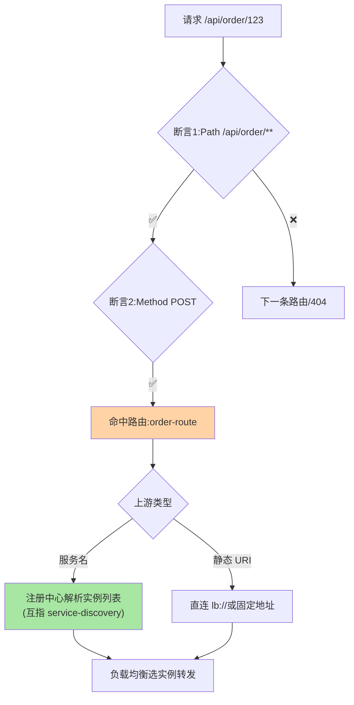

# 网关路由机制：匹配规则与动态路由

> 篇 2 立了模型，这篇深入路由的执行细节：**匹配规则怎么写**（路径/Header/方法的断言组合）、**上游从哪来**（静态 URI 与服务发现集成）、**路由怎么动态化**（热更新与灰度分流）。

> **本文核心**：路由机制三块——**匹配规则**（断言组合：路径模式 > Header > 方法 > 权重，按序取先）、**上游解析**（静态 URI vs 服务名 → 注册中心动态解析，互指 service-discovery）、**动态路由**（路由表热更新：配置中心推送 → 内存路由表刷新，互指 config-center 篇 4）。**机制链**：请求 → 断言逐条求值 → 命中路由 → 上游解析（服务名转实例） → 负载均衡选实例转发。

## 一句话摘要

**匹配规则**的工程要点：断言组合是「与」关系（Path + Method + Header 全满足才命中）、顺序即优先（先特例后通则——`/api/order/vip` 在 `/api/order/**` 之前）、通配与正则的性能差异（前缀匹配 O(1) 级、正则回溯风险——路由表规模大时正则数量要治理）。**上游解析**：静态 URI 简单但无弹性；集成服务发现后「服务名 → 实例列表」动态解析（上游健康随注册中心联动）——**动态上游是网关与微服务体系集成的标志能力**。**灰度分流**：权重断言（按比例分流量）与 Header 断言（按标记定向）组合，实现网关侧的灰度（互指 service-routing 篇 5 泳道）。

## 一、为什么路由是网关的第一机制

网关的一切治理都作用于「某条路由命中的流量」——路由是治理的**作用域定位器**：限流按路由配、鉴权按路由豁免、灰度按路由分流量。路由机制的精确性直接决定治理的精确性——「路由配错了」意味着「治理打错了靶子」。

## 5W 速记卡

| 维度 | 一句话 |
|---|---|
| What | 断言匹配 + 上游解析 + 动态路由的完整路由机制 |
| Why | 路由是网关治理的作用域定位器 |
| When | 网关配置、路由不命中排查、灰度分流设计 |
| Where | 网关路由表 + 注册中心 + 配置中心联动 |
| How | 断言组合按序求值 → 上游解析 → 均衡转发 |

## 二、路由匹配与上游解析全景

**断言顺序的性能账**：断言按「高筛选力优先」排列（区分度高的断言放前，快速排除非目标流量）——万级路由表场景，前缀树/哈希索引化的路由匹配是网关内核优化点（配置语言层面感知不到，容量规划要感知）。

## 三、动态路由与灰度分流

动态路由链路：**治理平台/配置中心变更路由表 → 推送到网关 → 内存路由表原子刷新**（互指 config-center 篇 4 的推送机制同构）——刷新的原子性（不能出现半新半旧路由表）与回滚路径是动态路由的工程红线。**灰度分流**的组合：权重断言（`Weight` 组按比例分流，同组内按权重）+ Header 断言（`X-Gray: true` 定向）——网关侧灰度是泳道体系的入口环节（互指 service-routing 篇 5）。

动态路由的刷新链路：

## 四、与微服务内部路由的区别：治理层对照

| 维度 | 网关路由（本篇） | 内部服务路由（互指 service-routing） |
|---|---|---|
| 流量类型 | 南北向（外部→内部） | 东西向（服务→服务） |
| 匹配特征 | 路径/域名/Header | 调用方/版本/标签 |
| 生态 | 网关产品 | RPC 框架/网格 |

南北向与东西向的路由机制同源（条件匹配 + 定向），治理语义不同（入口安全 vs 内部治理）——**两层路由的组合即全链路泳道**（篇 5 的互指闭环）。

## 五、典型场景与误区

**典型场景**：多版本 API 并存路由（/v1/ /v2/ 路径区分，老版本限流收缩）、按域名多租户路由（Host 断言分租户入口）、金丝雀发布入口（权重断言 1% → 观察 → 放量）。

**误区与不适用**：① 路由顺序靠追加——新路由总加在末尾，特例被通则拦截（「配置了不生效」的常见根因）；② 正则路由滥用——回溯型正则在路由表命中路径上是 CPU 黑洞（ReDoS 风险）；③ 灰度权重不设会话粘滞——同用户在灰度边界反复横跳（体验割裂），粘滞策略配合（互指 LB 篇 3/4）。

## 六、💡 实战提示

- 💡 路由表治理：先特例后通则的排序规范 + 冲突检测进发布流程
- 💡 正则断言白名单化：允许的 pattern 模式清单化，禁任意正则
- 💡 灰度路由与泳道染色共用标记体系，两套路由一套标记语言——标记的统一是入口治理多年演进收敛的成果
- 💡 上游选型决策口径：何时用什么——固定第三方用静态 URI、内部服务用服务名+服务发现、多版本分流用权重断言
- 💡 匹配方式的取舍：正则表达力强但性能与安全有代价，能用前缀/精确匹配不用正则

## 七、你们可能会问

**Q1：路由不命中的排查路径？**
三步：看请求实际到达的特征（网关日志打印断言输入）→ 对照路由表求值顺序模拟 → 检查断言引用的 Header 是否真的存在（大小写/前缀丢失是高频原因）——`_` 调试端点（部分网关提供）可直接模拟匹配。

**Q2：路由变更的原子刷新怎么保证？**
路由表整体替换（新旧表切换原子引用）而非逐条修改——半新半旧的路由表会出现「部分流量走新逻辑」的诡异态。

**Q3：网关路由和服务注册中心断联会怎样？**
静态上游不受影响；服务名上游用「最后一次解析结果」缓存继续转发（与配置快照同构的兜底），缓存过期策略决定容忍时长。

## 八、开放问题

- 路由声明与 OpenAPI 规范的融合（API 定义即路由来源）在 API 网关产品中推进，「API 优先」的路由治理是声明式的下一站。

## 九、自测三问

1. 断言组合的求值语义与排序原则？
2. 静态上游与服务名上游的差异？
3. 动态路由刷新的原子性为什么是红线？

## 📎 核心带走

- **核心一句话**：路由机制 = 断言组合按序匹配 + 上游解析（静态/服务发现）+ 路由表热更新
- **机制链**：请求 → 断言求值 → 命中路由 → 上游解析 → 均衡转发；变更 → 推送 → 原子刷新路由表
- **失效点/边界**：先特例后通则是秩序；正则是性能风险；灰度路由要配粘滞

## 📌 数据与事实声明

- 写于 2026-09-08，机制以 Spring Cloud Gateway/Envoy 的共识口径归纳
- 免责：以各网关官方文档为准

## 📚 参考资料

| 类型 | 标题 | 来源 |
|---|---|---|
| 官方文档 | Spring Cloud Gateway Route / Envoy 匹配 | 各官方站点 |
| 关联系列 | 本仓库 service-routing / service-discovery 系列 | docs/architecture/service-governance/ |
| 社区沉淀 | 网关路由实践公开文章 | 技术社区公开文章 |
