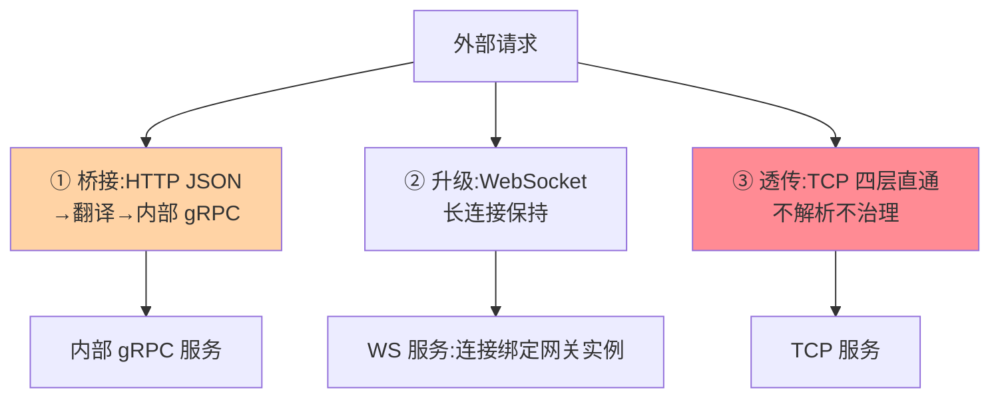
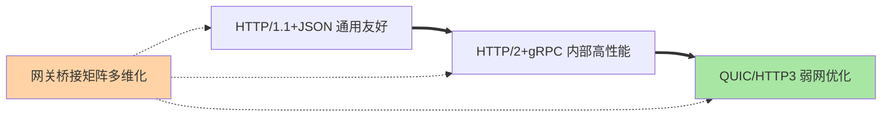

# 网关协议转换：HTTP、gRPC、WebSocket 的翻译官

> 外部用 HTTP、内部用 gRPC——谁来做协议翻译？网关的协议转换能力让「对外协议」与「对内协议」解耦。这篇讲协议转换的形态、流量的特殊处理与选型考量。

> **本文核心**：协议转换三类场景——**协议桥接**（外部 HTTP → 内部 gRPC，网关做 JSON/Protobuf 翻译与路径映射，如 gRPC-JSON 转码）、**协议升级**（HTTP → WebSocket 长连接升级，连接态保持）、**协议透传**（TCP/UDP 四层直通不做解析，互指 LB 篇 6）。**机制链**：入站协议解析 → 内容翻译（编解码/字段映射）→ 出站协议编码 → 流量语义保持（流式/双工）。

## 一句话摘要

三类场景的要点：**桥接**（HTTP↔gRPC）的价值是「内部纯 gRPC、外部友好 HTTP」——翻译层要处理字段映射（Protobuf 命名规范 vs JSON）、错误语义映射（gRPC status → HTTP status）、流式转换（gRPC stream ↔ HTTP chunked/SSE）；**升级**（WebSocket）的关键在**连接态**——升级请求后的长连接绑定在同一网关实例上，网关扩缩容与发布要处理连接排空（互指优雅上下线篇 2）；**透传**（数据库协议/TCP 私有协议）网关只做四层转发，不做语义治理——治理能力的边界就是解析能力的边界。

## 一、为什么协议转换有价值

没有协议转换时：外部友好性与内部性能二选一（对外也 gRPC 则客户端成本高，对内也 HTTP 则性能差）；多端协议适配在各服务重复建设。**网关承担翻译官后**：内部统一选型最优协议（gRPC 高性能），外部按端友好（Web 用 HTTP/JSON、移动端可 gRPC/Web），翻译成本集中一处——协议的「内外解耦」是网关治理收拢的延伸。

## 5W 速记卡

| 维度 | 一句话 |
|---|---|
| What | 协议桥接/升级/透传三类转换能力 |
| Why | 对外友好与对内最优的协议解耦 |
| When | 对外 API 开放、多端接入、长连接场景 |
| Where | 网关的编解码与连接管理层 |
| How | 入站解析 → 内容翻译 → 出站编码 → 流量语义保持 |

## 二、三类转换的全景

**桥接的翻译细节**是主要复杂度：字段命名（camelCase vs snake_case 映射）、错误模型（gRPC 16 个 status 与 HTTP 状态码的映射表）、**流式语义**（gRPC 双向流对 HTTP 的 SSE/chunked 表达——流式不桥接好的话体验残缺）。**透传的边界**要认清：四层直通后，「七层治理」（按内容限流/鉴权）全部失效——透传是性能选择，也是治理放弃。

## 三、与消息队列协议适配的区别：边界对照

| 维度 | 网关协议转换（同步请求响应） | MQ 协议适配（异步消息） |
|---|---|---|
| 语义 | 请求-响应翻译 | 消息格式与投递语义 |
| 状态 | 连接态（WS）或无状态 | 消息持久化与确认 |
| 位置 | 网关 | 消息中台/适配层 |

协议翻译在同步与异步域各有一套（同步在网关、异步在消息适配层）——**「翻译官」的位置由交互语义决定**。

协议栈的演进全景：

## 四、典型场景与误区

**典型场景**：对外开放平台（外部 REST → 内部 gRPC，gRPC-JSON 转码配置化）、IM/推送长连接（WebSocket 网关 + 连接态管理）、数据库审计代理（TCP 透传 + 旁路镜像分析——透传与旁路观测的组合）。

**误区与不适用**：① 全量桥接不考虑流式——流式接口桥接不当会退化为「攒完整响应」的伪流式；② WS 连接无排空机制——网关发布时大量长连接瞬断（客户端重连风暴）；③ 透传后宣称有七层治理——透传即放弃解析，安全组/防火墙能力要前置补位。

## 五、💡 实战提示

- 💡 协议转换的翻译规则（字段映射/错误映射）配置化并版本管理，禁止散落代码
- 💡 WS 网关容量按连接数规划（与请求吞吐模型不同），发布必配连接排空
- 💡 透传端口明确标注「无七层治理」，避免误配治理规则不生效

## 六、你们可能会问

**Q1：gRPC-JSON 转码的性能损耗有多大？**
编解码翻译有开销（JSON↔Protobuf 转换 + HTTP/1.1↔HTTP/2 桥接），量级通常为个位数毫秒——对外流量的延迟容忍度下可接受；极致性能场景客户端直连 gRPC（跳过转换）。

**Q2：SSE 和 WebSocket 在网关上的处理差异？**
SSE 是单向服务端推（HTTP 长响应，网关按流式响应处理即可）；WebSocket 是双向全双工（连接升级 + 双向转发 + 连接态管理）——双向性决定了 WS 的网关复杂度显著更高。

**Q3：协议转换和 BFF 什么关系？**
职责重叠区存在——简单协议翻译在网关（配置化转码），含业务语义的聚合适配在 BFF（互指 gateway 篇 1）——「翻译深度」是两者的分界：纯协议翻译归网关，涉及业务组装归 BFF。

## 七、开放问题

- HTTP/3(QUIC) 的入口普及让网关的「协议栈层」扩展（UDP 承载的可靠传输），桥接矩阵从 2×2 变多维，网关协议栈的抽象重构是活跃方向——转换层的通用性投入与专用性能之间的取舍随协议代际反复调整。

## 八、自测三问

1. 三类转换场景各自的要点与复杂度来源？
2. WS 长连接的「连接态」给网关带来什么额外要求？
3. 透传的治理代价是什么？

## 📎 核心带走

- **核心一句话**：协议转换 = 桥接（翻译）/升级（连接态）/透传（放弃解析）三类，让内外协议各自最优
- **机制链**：入站解析 → 内容翻译（字段/错误/流式映射） → 出站编码 → 连接态与流量语义保持
- **失效点/边界**：流式桥接不当退化伪流式；WS 无排空则发布风暴；透传即放弃七层治理

## 📌 数据与事实声明

- 写于 2026-09-08，机制以 Envoy/APISIX/Nginx 的共识口径归纳
- 转码开销为量级经验口径
- 免责：以各网关官方文档为准

## 📚 参考资料

| 类型 | 标题 | 来源 |
|---|---|---|
| 官方文档 | Envoy gRPC-JSON transcoder / APISIX 协议代理 | 各官方站点 |
| 关联系列 | 本仓库 LB 篇 6 / rpc 系列 | docs/architecture/ |
| 社区沉淀 | 协议转换实践公开文章 | 技术社区公开文章 |
