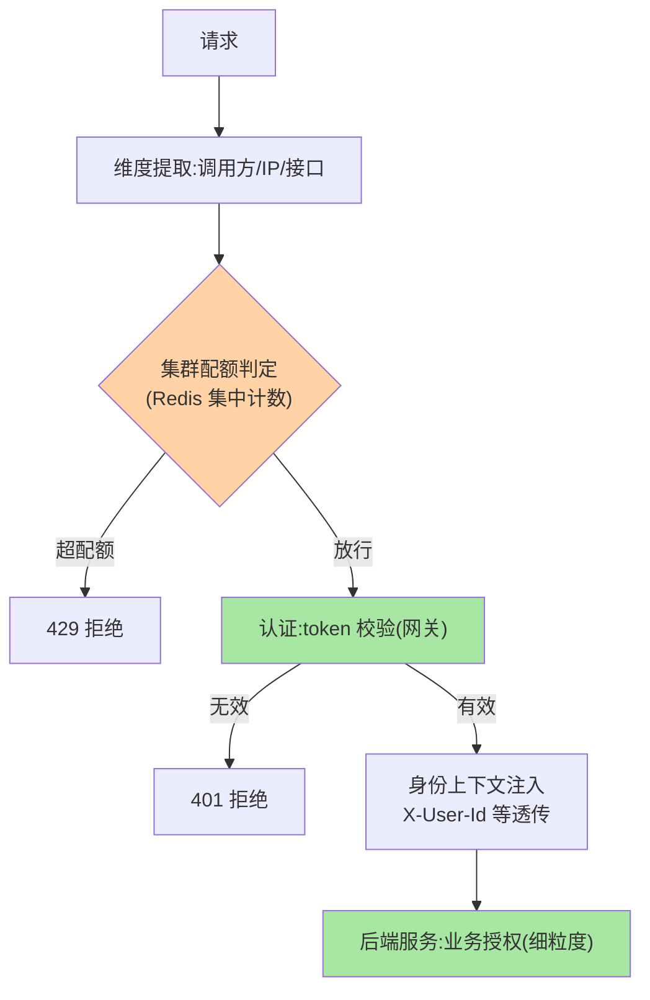
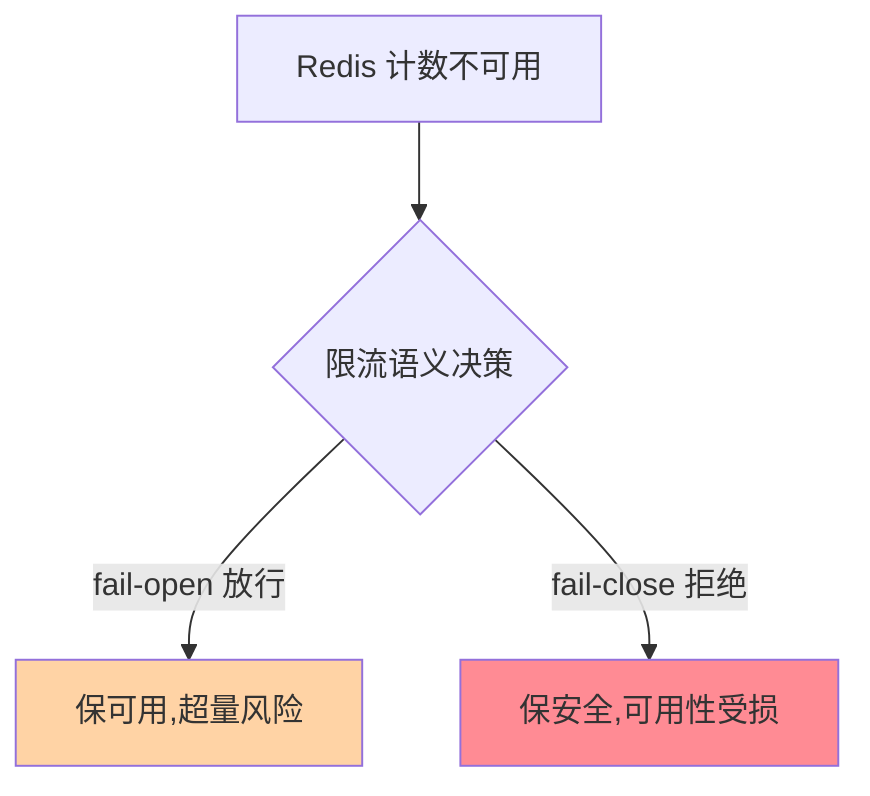

# 网关的限流与鉴权：入口治理的两大件

> 网关作为「治理点」最有价值的两个能力：**限流**（入口流量闸门，保护全站）与**鉴权**（统一认证，一次校验全站信任）。这篇讲两者在网关位置的独特语义——与进程内实现不同在哪。

> **本文核心**：网关限流与鉴权的「入口语义」——**限流**：网关视角是「按调用方/接口的全局配额」（多实例限流需要集群口径），与进程内限流（单实例自保）互补；**鉴权**：网关做「认证」（你是谁，token 校验一次），服务做「鉴权」（你能干什么，业务授权留原地）——认证收拢、授权下沉是分层原则。**机制链**：限流——请求 → 维度提取（调用方/IP/接口） → 集群配额判定 → 放行/拒绝；鉴权——token 解析验证 → 身份上下文注入 → 下游透传信任。

## 一句话摘要

**网关限流的独特性**：集群口径（网关多实例，限流计数要集中——Redis 集中式计数或网关间同步）、维度丰富（按调用方 API Key / 按 IP / 按接口 / 按租户组合配额）、位置意义（在业务前挡掉超量流量，保护的是整个后端集群——与进程内限流「自保」语义不同，互指 stability 篇 3）。**网关鉴权的分层原则**：认证（authentication，验证身份）收拢在网关（token 一次校验，注入身份头透传下游），授权（authorization，权限判断）留在服务（业务权限语义只有业务懂）——「网关认证 + 服务授权」是微服务安全的标准分层（互指 service-auth 系列）。

## 一、为什么入口位置的限流鉴权最特殊

同一套限流算法（令牌桶）部署在不同位置，语义完全不同：进程内限流是「自保」（我扛不住就拒），网关限流是「配额」（每个调用方允许用多少）——**位置决定视角**。鉴权同理：网关的认证是「全站一次性信任建立」，服务的授权是「业务级细粒度判断」——把授权也塞进网关（网关查业务权限表）会让治理层被业务逻辑入侵（篇 1 的红线）。

## 5W 速记卡

| 维度 | 一句话 |
|---|---|
| What | 网关位置的集群限流 + 认证/授权分层 |
| Why | 入口位置的限流与鉴权有独特的全局语义 |
| When | 配额设计、认证架构、限流失效排查 |
| Where | 网关过滤链（限流/认证过滤器）+ Redis/身份服务 |
| How | 维度提取 → 集群配额判定；token 验证 → 身份透传 |

## 二、入口限流与认证分层全景

**集群限流的实现账**：集中计数（Redis）性能与可用性依赖（Redis 挂了限流失效——fail-open 还是 fail-close 要决策：失败开放保可用但超量风险、失败关闭保安全但可用性受损——按业务语义定）；**身份透传的安全红线**：身份头（X-User-Id 类）必须是「网关到内网」可信链路注入，外网伪造同类头直接丢弃——信任边界清晰是透传的前提（互指 service-auth 篇 2）。

## 三、与进程内限流/鉴权的区别：位置语义对照

| 维度 | 网关限流 | 进程内限流（互指 stability） |
|---|---|---|
| 视角 | 调用方配额（全局口径） | 实例自保（本机容量） |
| 计数 | 集中（Redis/网关同步） | 本地内存 |
| 兜底关系 | 第一道闸 | 最后防线 |

鉴权：网关认证（粗、一次）+ 服务授权（细、业务）——**两者缺一**：只有网关认证则细粒度权限失守，只有服务认证则校验重复建设。

集群限流的 Redis 故障语义决策：

## 四、典型场景与误区

**典型场景**：开放平台配额（API Key + 每调用方 QPS/日配额，超量计费或拒绝）、登录态统一（网关校验 JWT，服务从透传头取用户——服务零认证代码）、防刷限流（IP 维度 + 指纹维度的组合闸门）。

**误区与不适用**：① 网关限流阈值 = 实例容量——网关配额是「业务分配」（各调用方分多少），容量保护另有进程内限流，两套口径别混；② 认证信息缓存永久——token 吊销（登出/封禁）与缓存 TTL 的矛盾（吊销即时性 vs 缓存性能），按安全等级选短期缓存或黑名单；③ 身份头透传到外网响应——内部身份头要在响应侧剥离，防信息泄露。

## 五、💡 实战提示

- 💡 集群限流的 Redis 故障语义（fail-open/close）显式决策并演练
- 💡 认证过滤器放限流后的策略要压测验证（未认证洪峰的量级评估）
- 💡 身份头命名带内部前缀（X-Internal-*）并在入口清洗外部同名头

## 六、你们可能会问

**Q1：网关做鉴权（授权）不行吗？**
行但代价是治理层被业务入侵——权限模型（谁能访问什么数据）是业务域知识，塞进网关的过滤器后每次权限调整都动网关；例外是「粗粒度授权」（调用方级别 API 权限）适合网关。

**Q2：限流维度怎么组合？**
多维度并行限流（调用方总额度 + 单接口细分额度 + IP 防刷），维度间独立计数——单一维度必被绕过（换 IP/换接口），组合维度是实战形态。

**Q3：认证失败和限流拒绝的顺序？**
先限流后认证可防认证服务被打（DoS 向量），先认证后限流可精确按用户配额——安全与精细的取舍按威胁模型定，且顺序要显式配置（篇 1 的顺序即语义）。

## 七、开放问题

- 零信任架构推进「服务间也认证」后，网关认证的「边界信任」角色在演变——从「边界守门」到「持续验证的一环」，网关认证的定位值得跟踪——边界信任到持续验证的演进是安全架构的代际命题。

## 八、自测三问

1. 网关限流与进程内限流的视角差异与兜底关系？
2. 「认证收拢、授权下沉」的分层原则怎么理解？
3. 集群限流的 Redis 故障语义（open/close）怎么决策？

## 📎 核心带走

- **核心一句话**：网关限流是集群配额闸门、网关认证是全站信任建立——入口位置赋予两者全局语义
- **机制链**：维度提取 → 集群配额判定 → 认证校验 → 身份注入透传 → 服务业务授权
- **失效点/边界**：Redis 挂时限流语义要显式决策；身份头信任边界要清洗；授权下沉不可上收

## 📌 数据与事实声明

- 写于 2026-09-08，机制为网关治理的共识口径归纳
- 免责：以各网关官方文档为准

## 📚 参考资料

| 类型 | 标题 | 来源 |
|---|---|---|
| 关联系列 | 本仓库 stability / service-auth 系列 | docs/architecture/service-governance/ |
| 官方文档 | Envoy RateLimit / 网关认证文档 | 各官方站点 |
| 社区沉淀 | 网关限流鉴权公开实践 | 技术社区公开文章 |
