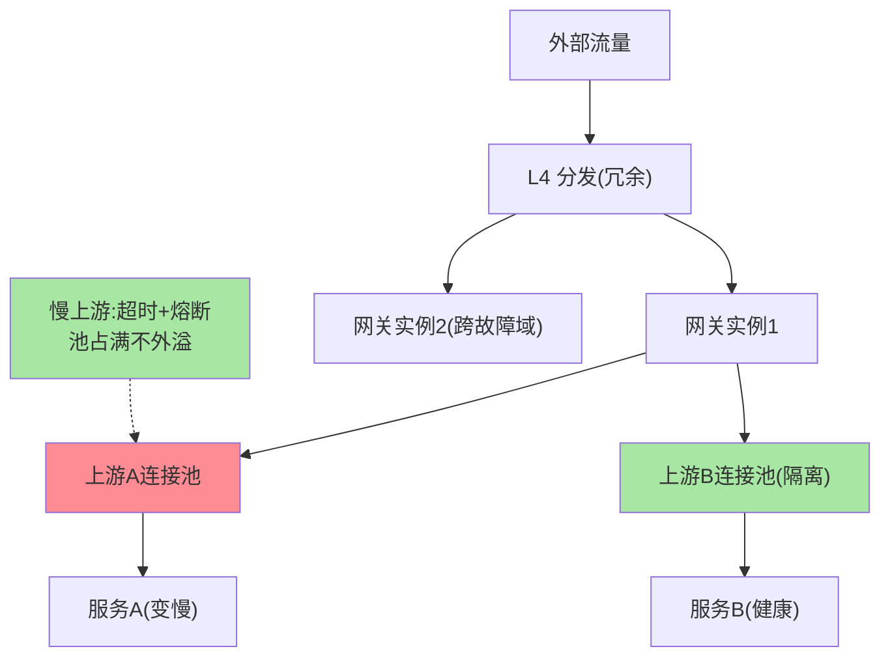
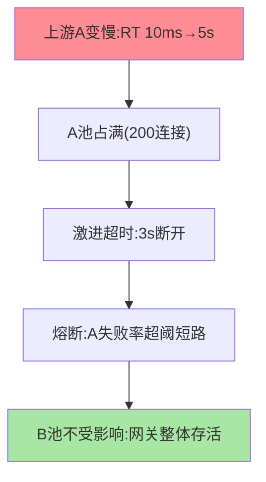

# 网关高可用与扩展：入口不能倒

> 网关的故障半径是全部外部流量——「入口不能倒」是网关建设的第一约束。这篇讲网关的高可用部署、容量扩展与故障隔离三大件。

> **本文核心**：高可用三件——**部署层**（多实例 + 跨故障域 + 前置 L4 分发，无状态化水平扩展）、**容量层**（按峰值 2-3 倍冗余 + 弹性扩缩 + 连接数与 QPS 双维度容量模型）、**隔离层**（上游故障不能拖垮网关：连接池/线程池隔离、慢上游超时熔断——互指 stability）。**机制链**：流量 → L4 分发 → 网关集群（无状态水平扩） → 上游隔离池 → 后端；上游故障被隔离在连接池粒度，网关整体存活。

## 一句话摘要

**无状态化**是网关水平扩展的前提：会话状态外置（JWT 自含/集中 session）、路由表从配置中心加载（本地无独占状态）——扩展即加实例。**容量模型的双维度**：QPS（请求吞吐）与并发连接数（长连接场景 WS/SSE 的连接容量是独立维度，内存与句柄约束）——纯 QPS 规划在长连接场景必然失准。**故障隔离**是网关可用性的核心命题：某上游变慢时，网关的连接池被慢请求占满 → 拖垮对其他健康上游的转发——**连接池按上游隔离 + 慢上游快速超时/熔断**是标准防线（与稳定性三件套联动，互指 stability）。

## 一、为什么网关的可用性约束最硬

普通服务故障半径是自身功能，网关故障半径是**全部外部流量**（比数据库更前的一层）。三个推论：**冗余度最高**（多实例跨机房，前置 L4 再冗余一层）；**变更最谨慎**（网关变更=全站流量变更，灰度与回滚纪律最严）；**降级预案最全**（网关挂了的兜底：L4 直通静态页、DNS 切备用入口——「入口不可倒」要有字面意义的预案）。

## 5W 速记卡

| 维度 | 一句话 |
|---|---|
| What | 部署冗余 + 容量模型 + 上游故障隔离的网关高可用体系 |
| Why | 网关故障半径是全部外部流量，约束最硬 |
| When | 网关建设、容量规划、上游故障排查 |
| Where | L4 分发 + 网关集群 + 连接池隔离层 |
| How | 无状态扩实例 + 双维度容量 + 隔离池与熔断 |

## 二、高可用与隔离全景

**慢上游拖垮网关的机制**：网关到上游 A 的连接池（如 200 连接）被慢请求逐渐占满 → 对 A 的新请求排队等连接 → 网关工作线程跟着阻塞 → **线程被 A 独占后，对健康上游 B 的转发无线程可用**——「一个坏邻居拖垮整栋楼」。隔离防线：每上游独立连接池（故障半径限池内）+ 激进超时（上游超时短于全局）+ 熔断（失败率超阈值直接短路该上游，互指 stability 篇 4）。

## 三、与普通服务高可用的区别：约束对照

| 维度 | 网关高可用 | 普通服务高可用 |
|---|---|---|
| 故障半径 | 全部外部流量 | 单服务功能 |
| 冗余要求 | 2-3 倍容量 + 跨机房 | 按服务 SLA |
| 变更纪律 | 最严格（全站影响） | 常规灰度 |
| 降级预案 | L4 直通/备用入口 | 功能降级 |

网关的高可用等级 = 全站最高级——「入口组件按最高标准建设」是容量与流程的通则。

故障隔离的机制链验证：

## 四、典型场景与误区

**典型场景**：大促扩容（网关弹性扩 + 连接数容量复核）、网关发布（实例逐台摘流量滚动 + 长连接排空——互指 graceful-shutdown 篇 2）、上游事故演练（制造慢上游验证隔离与熔断生效）。

**误区与不适用**：① 容量只看 QPS 忽略连接数——长连接网关的内存/句柄瓶颈先于 QPS 到达；② 连接池全局共享「省资源」——隔离性换资源利用率的取舍在入口层永远不划算——这是隔离粒度设计的经典代价权衡；③ 网关单机房部署——机房级故障时全站入口消失，跨机房是底线不是加分项。

## 五、💡 实战提示

- 💡 容量双维度看板：QPS + 活跃连接数 + 网关资源（CPU/内存/句柄）三列同屏
- 💡 上游隔离配置进网关默认模板：独立连接池 + 上游超时 < 全局超时
- 💡 网关发布用「摘流量 → 排空连接 → 升级 → 回流量」四步，禁滚动直更
- 💡 冗余决策口径：何时用什么等级——全站入口跨机房 2-3 倍冗余，内部二级入口同机房 2 倍起，纯内部辅助入口可降级管理

## 六、你们可能会问

**Q1：网关需要多少实例？**
按峰值流量 / 单实例安全吞吐 × 冗余系数（2-3），且最少跨 2 个故障域各至少 2 实例——容量计算与部署底线取大者。

**Q2：网关自身的限流怎么做？**
对内是「自保限流」（进程内，超容量先拒绝——网关过载保护），对上是「配额限流」（篇 6 的调用方配额）——网关是两者叠加的形态，自保优先级最高（自己倒了什么都保不了）。

**Q3：上游全部变慢怎么办？**
隔离池保证网关存活（各池独立占满互不影响）+ 全局过载保护（并发总量超限后快速失败 + 返回兜底页面）——「上游全挂时网关活着并快速拒绝」比「网关一起挂」好得多。

## 七、开放问题

- 网关弹性（按流量自动扩缩）与连接态（长连接）的矛盾——连接迁移技术成熟前，有状态入口的弹性仍受约束，是无状态化持续演进的动力。

## 八、自测三问

1. 「慢上游拖垮网关」的机制链是什么？三层防线？
2. 容量模型的双维度是什么？长连接场景为什么必须双看？
3. 网关发布的四步纪律是什么？

## 📎 核心带走

- **核心一句话**：网关高可用 = 无状态水平扩展 + 双维度容量 + 上游故障隔离，入口按全站最高标准建设
- **机制链**：L4 分发 → 网关集群跨域部署 → 每上游独立连接池 → 慢上游超时熔断隔离 → 全局过载保护兜底
- **失效点/边界**：隔离换资源的交易在入口层不做；长连接容量独立规划；发布必走摘流量排空

## 📌 数据与事实声明

- 写于 2026-09-08，机制为网关运维的共识口径归纳；「2-3 倍冗余」为经验口径
- 免责：以各网关官方文档为准

## 📚 参考资料

| 类型 | 标题 | 来源 |
|---|---|---|
| 关联系列 | 本仓库 stability / graceful-shutdown 系列 | docs/architecture/service-governance/ |
| 官方文档 | Envoy 熔断与连接池 / Nginx upstream | 各官方站点 |
| 社区沉淀 | 网关高可用公开实践 | 技术社区公开文章 |
