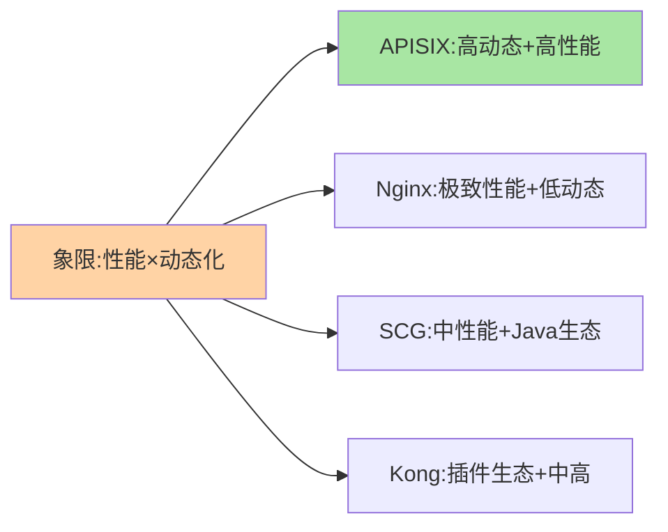

# 主流网关对比：四个组件的设计哲学

> Nginx、Spring Cloud Gateway、Kong、APISIX——四个常被对比的组件，代表「四种网关哲学」：转发极致、Java 生态原生、插件市场、云原生动态。看清每种哲学的取舍，选型就不再纠结。

> **本文核心**：四组件按「性能模型 × 扩展语言 × 治理面形态」三轴区分：**Nginx**——C 语言转发极致、配置静态（reload）、扩展靠 Lua/OpenResty；**Spring Cloud Gateway**——Java 生态原生（Spring 体系无缝）、JVM 性能中上、Java 团队友好；**Kong**——插件市场成熟（Lua）、多协议、管理面产品化；**APISIX**——云原生动态（etcd 存储、热插拔插件）、性能与动态兼得、国内生态活跃。**机制链**：技术栈与团队语言 → 性能与动态化要求 → 治理面形态 → 组件选择。

## 一句话摘要

逐个看：**Nginx** 是「转发性能的标杆」（C 事件驱动），治理能力靠 OpenResty（Lua）扩展——性能极致、开发门槛高、配置静态化是它的三张面孔；**Spring Cloud Gateway** 是「Java 微服务体系的无缝选择」——基于 WebFlux 响应式、Route/Filter 模型（篇 2）与 Spring 全家桶天然集成，JVM 网关的性能天花板是它的边界；**Kong** 是「插件市场的先驱」——Lua 插件生态庞大、管理 API 产品化、多协议（HTTP/TCP/gRPC）；**APISIX** 是「云原生动态化代表」——etcd 存配置（变更毫秒级热生效）、插件热插拔（多语言 Plugin Runner/WASM）、Apache 顶级项目。**性能排序（转发基准）Nginx ≈ APISIX > Kong > SCG**，但「性能差」多数场景不是决定因素——团队语言与治理面形态才是。

## 一、为什么网关选型比想象中重要

网关是「十年基建」（与注册中心同级的长期组件）——选错的重构成本极高（全站入口迁移）：路由配置、插件逻辑、客户端对入口的依赖全部要迁。**选型的正确姿势**：按团队技术栈（谁维护网关）+ 性能/动态化要求 + 治理面需求三轴对照，而不是按 benchmark 排名。

## 5W 速记卡

| 维度 | 一句话 |
|---|---|
| What | 四大网关的三轴对比（性能模型/扩展语言/治理面） |
| Why | 网关是十年基建，选型按团队与需求而非排名 |
| When | 网关选型、存量评估 |
| Where | 架构评审 |
| How | 语言栈 → 性能与动态要求 → 治理面 → 组件 |

## 二、对比矩阵与定位

| 维度 | Nginx/OpenResty | Spring Cloud Gateway | Kong | APISIX |
|---|---|---|---|---|
| 性能模型 | 极高（C 事件驱动） | 中上（JVM 响应式） | 高（Nginx+Lua） | 高（Nginx+Lua+etcd 动态） |
| 扩展语言 | Lua | Java | Lua（多语言 Runner） | Lua/多语言/WASM |
| 动态化 | reload 演进中 | 配置热更 | 管理 API 热更 | etcd 毫秒级热更 |
| 治理面 | 弱（需自建） | Spring 生态 | 插件市场+管理 UI | Dashboard+etcd 声明式 |
| 团队语言 | C/Lua | Java | Lua/运维 | 运维/多语言 |

```mermaid
flowchart TD
    Q1{"团队主力语言?"}
    Q1 -->|"Java"| SCG["Spring Cloud Gateway<br/>(生态无缝优先)"]
    Q1 -->|"多语言/运维"| Q2{"动态化要求高?"}
    Q2 -->|"是(频繁路由变更)"|" 
    Q2 -->|"转发极致+配置稳定"| NGX["Nginx/OpenResty"]
    Q2 -->|"是"| AX["APISIX"]
    Q1 -->|"插件生态优先"| KG["Kong"]
    style AX fill:#a8e6a3
    style SCG fill:#ffd3a5
```

**三句话解读**：① Java 团队选 SCG 是「维护成本最低」而非「性能最优」的选择；② 动态化要求高（路由频繁变更/多环境热切）是 APISIX 的主场；③ Nginx 在「配置稳定 + 转发极致」的接入层位置不可替代（与网关分层并用，篇 1 的分工）。

## 三、与消息中间件选型的区别：方法论对照

| 维度 | 网关选型（本篇） | MQ 选型（互指 MQ 系列） |
|---|---|---|
| 第一权重 | 团队维护语言 | 消息语义（顺序/事务） |
| 性能关注 | 转发延迟与连接数 | 吞吐与堆积能力 |
| 演进风险 | 形态融合（mesh 入口） | 云托管替代 |

方法论同构（团队 × 语义 × 演进），权重不同——**网关选型里「谁来维护」的权重最高**（十年基建的日常维护者决定成败）。

性能-动态象限定位：



## 四、典型场景与误区

**典型场景**：Java 微服务团队（SCG 起步，入口量级大后评估 APISIX）、多语言大组织（APISIX/Kong 统一入口 + 插件治理）、纯接入层（Nginx + OpenResty 定制）、云原生深度用户（Envoy/网关托管）。

**误区与不适用**：① benchmark 崇拜——各组件在合理配置下都够用，维护成本才是分水岭；② 用插件数量选型——插件质量与自身需求的匹配度比数量重要；③ 忽视管理面——没有治理面的网关（裸 Nginx）在大组织里会演成「配置黑盒群」。

## 五、💡 实战提示

- 💡 选型评审先答「谁维护」——语言栈对齐省下的是十年的维护成本
- 💡 混合形态是常态：Nginx 接入 + 网关治理，别追求「一个组件打天下」
- 💡 组件 POC 用真实流量回放（而非合成压测），路由与插件的真实行为才作数

## 六、你们可能会问

**Q1：云托管网关（API Gateway 类产品）怎么比？**
托管消解「部署与维护」成本，代价是厂商锁定与定制边界——选型三轴的「治理面形态」轴变为「产品能力面」，团队语言轴弱化为「对接成本」。

**Q2：Envoy 在这四个之外是什么定位？**
Envoy 是「数据面内核」（Istio 的转发核心、各大托管网关的底座）——它更多作为「被产品化的引擎」而非「直接使用的网关」，xDS 动态模型是它对行业的最大贡献。

**Q3：从 SCG 迁到 APISIX 的典型动因？**
性能瓶颈（JVM 网关吞吐天花板）、多语言团队治理、动态化要求升级——三个动因常同时出现，且都发生在「入口流量与治理复杂度双增长」的拐点。

## 七、开放问题

- 网关形态与 Service Mesh 入口（IngressGateway）的融合持续——「网关产品」与「网格入口能力」的边界十年内可能重画，选型要预留出口。

## 八、自测三问

1. 四组件的三轴差异？性能排序与「性能不是决定因素」怎么理解？
2. 「谁维护」的权重为什么最高？
3. 混合形态（Nginx + 网关）的分工边界？

## 📎 核心带走

- **核心一句话**：四组件四哲学——Nginx 转发极致、SCG 生态原生、Kong 插件市场、APISIX 云原生动态，按团队与需求对号
- **机制链**：团队语言栈 → 性能与动态化要求 → 治理面形态 → 组件选择 → POC 真实流量验证
- **失效点/边界**：benchmark 不是选型依据；管理面的缺失会演成配置黑盒；预留 mesh 融合的出口

## 📌 数据与事实声明

- 写于 2026-09-08，组件能力以官方文档为准；性能排序为公开基准的量级口径
- 免责：组件演进快，选型前复核当前版本

## 📚 参考资料

| 类型 | 标题 | 来源 |
|---|---|---|
| 官方文档 | Nginx / Spring Cloud Gateway / Kong / APISIX / Envoy | 各官方站点 |
| 关联系列 | 本仓库 LB / service-discovery 系列 | docs/architecture/ |
| 社区沉淀 | 网关选型公开实践 | 技术社区公开文章 |
