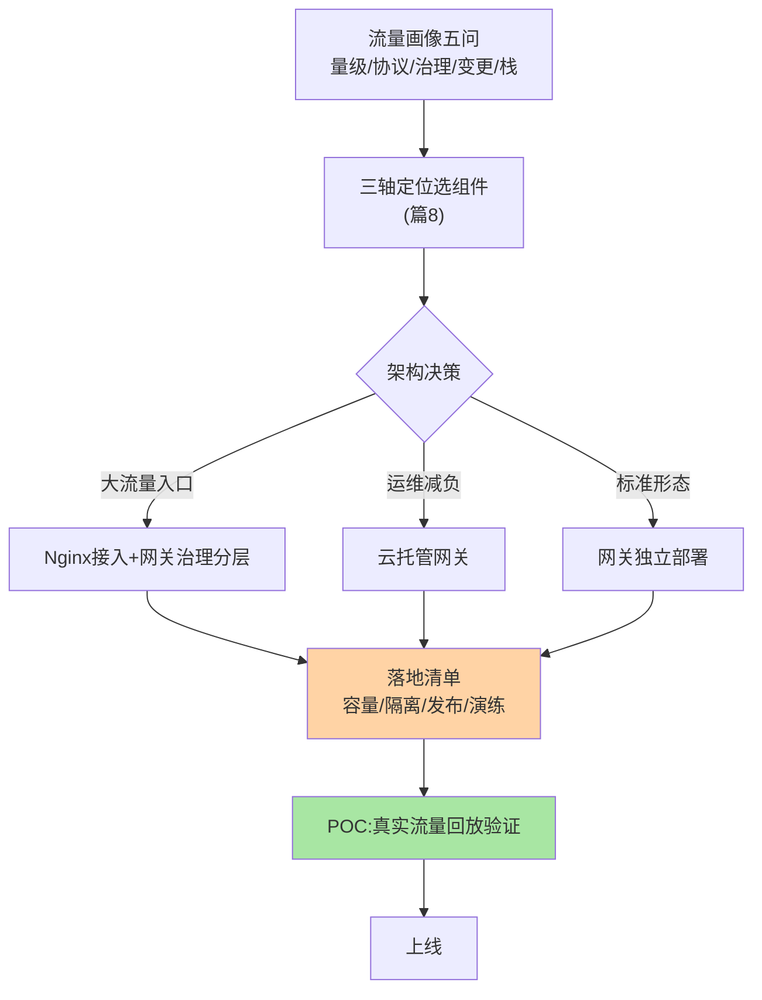
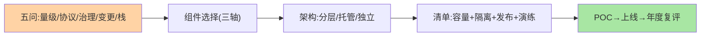

# 网关选型决策：从流量画像到落地清单

> 全系列收束篇：网关选型 = **流量画像 → 三轴定位 → 分层架构决策 → 落地清单**——与组件对比（篇 8）配合使用，产出「组件 + 架构 + 流程」的完整方案。

> **本文核心**：流量画像五问——**① 流量量级**（QPS/连接数峰值）、**② 协议构成**（HTTP/gRPC/WS/TCP）、**③ 治理需求**（鉴权限流灰度的复杂度）、**④ 变更频率**（路由与插件的变更节奏）、**⑤ 团队维护栈**。三轴定位（篇 8）选组件后，**架构决策**（是否 Nginx+网关分层、是否云托管）与**落地清单**（容量/演练/灰度纪律）补全方案。**机制链**：画像 → 组件 → 架构 → 清单 → POC 验证 → 上线。

## 一句话摘要

画像五问到方案的映射：**量级**决定部署规格与是否需要 L4 分层；**协议构成**决定组件能力域（WS/TCP 支持度）；**治理需求**决定插件与治理面要求；**变更频率**决定动态化要求（APISIX 类主场）；**维护栈**决定语言对齐（SCG/Nginx-OpenResty/APISIX 的分野）。**落地清单**是方案的落地形态：容量模型（双维度，互指篇 7）、上游隔离默认配置、发布纪律（摘流量排空）、演练计划（慢上游隔离/配置热更/回滚时效）——五问一张表、三件一份清单，选型会即结。

## 一、为什么网关选型要「先画流量」

组件对比（篇 8）给的是「性格」，流量画像给的是「需求」——不看画像直接选组件，常见的错配：长连接业务选了连接管理弱的方案、高频路由变更选了静态配置组件、Java 小团队上了 Lua 生态（维护断层）。**流量画像是需求的量化翻译**：五问都有数据答案，选型从「我觉得」变成「数据说」。

## 5W 速记卡

| 维度 | 一句话 |
|---|---|
| What | 流量画像五问 + 三轴定位 + 架构决策 + 落地清单 |
| Why | 网关是十年基建，选型需要量化需求与完整方案 |
| When | 网关建设、入口重构、流量形态变化时复评 |
| Where | 架构评审 |
| How | 五问 → 组件 → 架构 → 清单 → POC → 上线 |

## 二、选型流程全景

**架构决策的判断**：接入流量超单层网关舒适区（万级 QPS 以上或超大连接数）考虑 L4+L7 分层；运维能力不足或云深度用户选托管（评估锁定成本）；标准量级独立部署最简。**POC 环节**不可省——真实流量回放（不是合成压测）暴露路由规则、插件行为、故障语义的真实差异。

## 三、与注册中心选型的区别：决策对照

| 维度 | 网关选型（本篇） | 注册中心选型（互指 service-discovery 篇 9） |
|---|---|---|
| 画像重心 | 流量形态与协议 | 数据构成与一致性 |
| 架构决策 | L4/L7 分层与托管 | 集群形态与客户端兜底 |
| 演练焦点 | 慢上游隔离/发布排空 | 摘除风暴/分区行为 |

两者同属「入口级基建」，选型框架同构、决策轴不同——**画像→定位→清单的三段式是治理基建选型的通用模板**。

五问到方案的映射全景：

## 四、典型场景与误区

**典型场景**：从零建设（画像 → SCG/APISIX → 独立部署 → 清单齐备）、入口重构（旧 Nginx 群 → 现代网关，双跑迁移）、流量形态突变（新增长连接业务，容量模型双维度复评 + 组件能力复检）。

**误区与不适用**：① 选型只开一次会——流量画像随业务变，选型结论按年复评（协议构成与量级的变化常推翻旧结论）；② 清单只有组件部署——容量模型、发布纪律、演练计划是方案的主体（组件只占 20%）；③ POC 用理想流量——合成压测测不出「真实流量形态下插件的行为差异」。

## 五、💡 实战提示

- 💡 画像五问做成表单随选型会下发，会前填完会中评审
- 💡 落地清单的「发布纪律」与「演练计划」是组织级规范，不随组件更换失效
- 💡 POC 覆盖三场景：正常流量回放、慢上游注入、配置热更——三个都过才算选完

## 六、你们可能会问

**Q1：已有 Nginx 体系，要换现代网关吗？**
按画像重新答五问：若横切治理需求仍简单（Nginx 够用），不换；治理需求增长（鉴权/灰度/多团队路由自治）是换的核心动因——「为现代而现代」的迁移是负收益——先进性与维护成本的取舍以画像数据为准绳。

**Q2：网关选型与 API 治理规范什么关系？**
联动设计——路由命名、插件使用、灰度流程都进 API 治理规范，网关是规范的执行载体：先有规范草案再选组件（组件能力对齐规范，而非规范迁就组件）。

**Q3：多网关并存（历史遗留）怎么治理？**
同注册中心并存的收敛策略：新入口统一组件、存量定退役计划、过渡期统一监控面——「并存可治理」的底线是入口清单与流量的全局可见。

## 七、开放问题

- 网关与网格入口、CDN 边缘、微服务治理面的四层融合（「入口治理」的边界外扩）——网关选型正在从「选产品」演进为「设计入口治理架构」，决策框架比结论更长寿。

## 八、自测三问

1. 画像五问是什么？各自映射到方案的哪个部分？
2. 架构决策的三个分支（分层/托管/独立）怎么选？
3. POC 为什么必须用真实流量回放？

## 📎 核心带走

- **核心一句话**：网关选型 = 流量画像五问 × 三轴定位 × 架构决策 × 落地清单，POC 真实流量验证收口
- **机制链**：画像量化 → 组件定位 → 架构分层决策 → 清单（容量/隔离/发布/演练） → POC → 上线 → 年度复评
- **失效点/边界**：画像变了结论要复评；清单主体是流程不是组件；规范先行组件后选

## 📌 数据与事实声明

- 写于 2026-09-08，选型框架为治理基建选型的通用模板归纳
- 免责：具体决策按组织流量画像评审

## 📚 参考资料

| 类型 | 标题 | 来源 |
|---|---|---|
| 关联系列 | 本系列篇 8 / service-discovery 篇 9（模板同构） | docs/architecture/service-governance/ |
| 官方文档 | 各网关产品选型文档 | 各官方站点 |
| 社区沉淀 | 网关选型公开实践 | 技术社区公开文章 |
