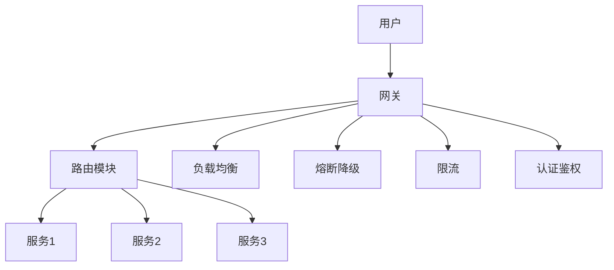

# 从零实现高性能网关

## 一句话摘要

手撸一个高性能网关的核心：路由 + 负载均衡 + 熔断 + 限流 + 灰度。从实现理解网关的本质。

## 架构设计



## 核心模块

### 1. 路由模块
- 路径匹配
- 头部匹配
- 权重路由

### 2. 负载均衡
- 轮询
- 加权轮询
- 最少活跃
- 一致性哈希

### 3. 熔断降级
- 异常检测
- 自动熔断
- 降级策略

### 4. 限流
- 令牌桶
- 漏桶
- 全局限流
- 单服务限流

## 实现要点

```python
# 伪代码：网关核心路由逻辑
def route_request(request):
    # 1. 匹配路由规则
    route = match_route(request.path, request.headers)
    
    # 2. 负载均衡选择实例
    instance = load_balance(route.instances)
    
    # 3. 熔断检查
    if circuit_breaker.is_open(instance):
        return fallback()
    
    # 4. 限流检查
    if rate_limiter.is_limited(instance):
        return rate_limit_response()
    
    # 5. 转发请求
    return forward(request, instance)
```

## 灰度发布实现

```python
# 伪代码：灰度路由
def gray_route(request):
    user = get_user(request)
    
    # 按灰度比例
    if user.gray_percentage < 10:
        return route_to_gray(request)
    else:
        return route_to_production(request)
```

## 踩坑记录

1. **路由性能**：路由规则多，匹配慢
2. **熔断误判**：正常流量触发熔断
3. **限流精度**：令牌桶精度不足
4. **灰度冲突**：多个灰度规则冲突

## 量级考量

| 量级 | 网关架构 |
|---|---|
| < 1000 QPS | 单机网关 |
| 1000-10000 QPS | 网关集群 |
| > 10000 QPS | 网关集群 + 缓存 |

## 📌 数据与事实声明

- 实现基于网关核心机制
- 踩坑来自生产环境经验
