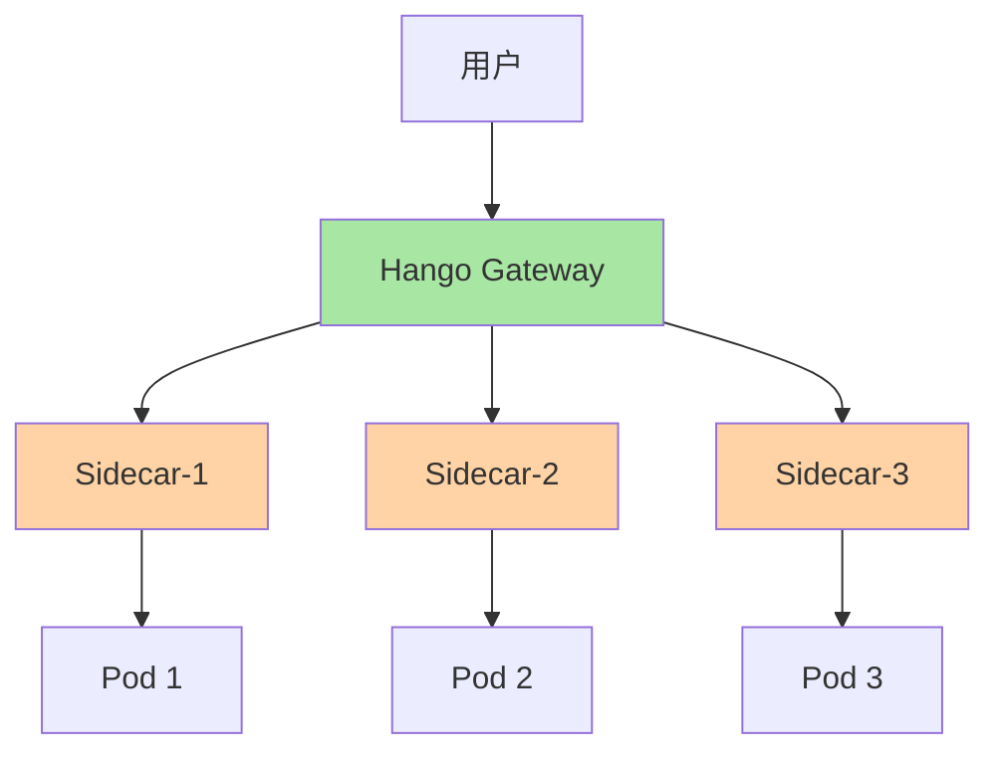
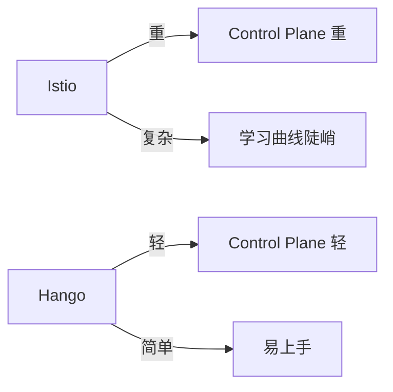

# Hango Gateway：云原生新一代网关架构深度解析

## 一句话摘要

Hango Gateway 是云原生时代的新一代网关，将**流量治理下沉到 Sidecar**，实现与业务解耦的流量管控。本文讲透 Hango 的架构设计 + 与传统网关的对比。

## 什么是 Hango Gateway

Hango 是华为云开源的云原生网关，基于 Envoy + xDS 协议构建，核心设计理念：**将流量治理从网关下沉到 Sidecar**。

## 核心架构

### 1. 控制面（Control Plane）
- 统一配置管理
- 路由规则下发
- 策略编排

### 2. 数据面（Data Plane）
- Envoy Proxy
- xDS 协议通信
- 本地流量治理

### 3. Sidecar 模式
- 每个服务一个 Sidecar
- 流量治理下沉到服务级别
- 业务代码无感知

## 与传统网关对比

| 维度 | 传统网关 (Nginx/Kong) | Hango Gateway |
|---|---|---|
| 治理位置 | 网关集中式 | Sidecar 分布式 |
| 灵活性 | 低（全局规则） | 高（按服务/按租户） |
| 性能 | 高（单机性能强） | 中（Sidecar 开销） |
| 复杂度 | 低 | 高（需要 K8s） |
| 适用场景 | 中小规模 | 大规模微服务 |

## Hango 核心能力

### 1. 流量路由
- 按权重路由
- 按头部路由
- 按地域路由

### 2. 灰度发布
- 按比例灰度
- 按租户灰度
- 按标签灰度

### 3. 熔断降级
- 异常检测
- 自动熔断
- 降级策略

### 4. 限流
- 全局限流
- 单服务限流
- 按租户限流

## 与 Istio 对比

| 维度 | Istio | Hango |
|---|---|---|
| Control Plane | 重（Pilot/Citadel等） | 轻 |
| 部署复杂度 | 高 | 中 |
| 学习曲线 | 陡峭 | 平缓 |
| 多语言支持 | 好 | 好 |
| 社区活跃度 | 高 | 中 |

## 适用场景

### 推荐使用 Hango
- 已有 K8s 集群
- 微服务数量 > 20
- 需要细粒度流量治理
- 多团队协作

### 不推荐使用 Hango
- 小规模应用（< 10 服务）
- 无 K8s 环境
- 简单路由需求

## 踩坑记录

1. **Sidecar 资源开销**：每个 Pod 多一个 Sidecar，资源消耗增加
2. **xDS 协议复杂**：配置下发有延迟，实时性不如直接改网关
3. **调试困难**：流量经过 Sidecar，排查问题需要跨两个组件
4. **版本兼容**：Envoy 版本升级需谨慎

## 量级考量

| 量级 | 网关方案 |
|---|---|
| < 10 服务 | Nginx/Kong |
| 10-50 服务 | Hango Gateway |
| > 50 服务 | Hango + K8s |

## 📌 数据与事实声明

- Hango Gateway 为华为云开源项目
- 踩坑来自社区反馈
