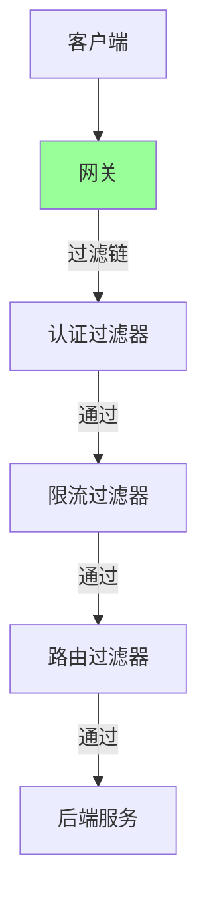
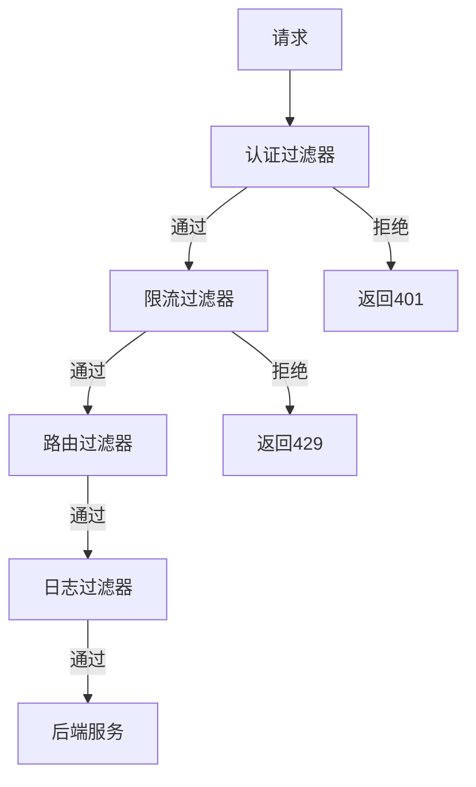

# 网关过滤链机制

> **一句话摘要**：网关过滤链 = 责任链模式——请求经过一系列过滤器，每个过滤器负责特定逻辑。
> **本文核心**：**过滤链 = 责任链 + 过滤规则 + 执行顺序**。

前置阅读：[网关核心模型](../入门层/从零开始认识网关系列/2_网关核心模型-入门.md)。本篇深入过滤链的实现机制。

## 1. 背景：为什么需要过滤链

网关是南北流量的统一入口——所有请求都经过网关：



过滤链让网关的治理逻辑可插拔、可扩展。

## 2. 核心机制：责任链模式

### 2.1 责任链结构



### 2.2 过滤器接口

```java
// 过滤器接口
public interface GatewayFilter {
    // 执行过滤
    void doFilter(Request request, Response response, FilterChain chain);
    // 获取执行顺序
    int getOrder();
}

// 认证过滤器
public class AuthFilter implements GatewayFilter {
    @Override
    public void doFilter(Request request, Response response, FilterChain chain) {
        if (!authenticate(request)) {
            response.setStatus(401);
            return;
        }
        chain.doFilter(request, response); // 继续下一级
    }
    
    @Override
    public int getOrder() { return 1; } // 优先级最高
}
```

### 2.3 过滤器链执行

```java
// 过滤器链
public class DefaultFilterChain implements FilterChain {
    private List<GatewayFilter> filters;
    private int index = 0;
    
    public void doFilter(Request request, Response response) {
        if (index < filters.size()) {
            GatewayFilter filter = filters.get(index++);
            filter.doFilter(request, response, this);
        } else {
            // 所有过滤器通过，转发到后端
            forward(request, response);
        }
    }
}
```

## 3. 落地实践：Nginx 过滤链

### 3.1 Nginx 配置

```nginx
# Nginx 过滤链配置
http {
    # 认证
    auth_request /auth;
    
    # 限流
    limit_req_zone $binary_remote_addr zone=api:10m rate=10r/s;
    
    # 路由
    location /api/ {
        limit_req zone=api burst=20;
        proxy_pass http://backend;
    }
}
```

### 3.2 Nginx 过滤器

```nginx
# Nginx 自定义过滤器
# 1. 认证
access_by_lua_block {
    local token = ngx.var.http_authorization
    if not verify(token) then
        ngx.exit(401)
    end
}

# 2. 限流
limit_req zone=api burst=20 nodelay;

# 3. 日志
access_log /var/log/nginx/access.log;
```

## 4. 落地实践：Spring Cloud Gateway

### 4.1 过滤器类型

```java
// Spring Cloud Gateway 过滤器
@Bean
public RouteLocator customRouteLocator(RouteLocatorBuilder builder) {
    return builder.routes()
        .route("auth_route", r -> r.path("/api/**")
            .filters(f -> f
                .filter(new AuthFilter())      // 认证
                .filter(new RateLimitFilter())  // 限流
                .filter(new LogFilter())        // 日志
            )
            .uri("lb://backend"))
        .build();
}
```

### 4.2 网关过滤器

```java
// 自定义网关过滤器
public class AuthFilter implements GlobalFilter {
    @Override
    public Mono<Void> filter(ServerWebExchange exchange, GatewayFilterChain chain) {
        String token = exchange.getRequest().getHeaders().getFirst("Authorization");
        if (!verify(token)) {
            exchange.getResponse().setStatusCode(HttpStatus.UNAUTHORIZED);
            return exchange.getResponse().setComplete();
        }
        return chain.filter(exchange);
    }
    
    @Override
    public int getOrder() { return -1; } // 优先级
}
```

## 5. 生产视角：过滤链踩坑

- **踩坑 1**：过滤器顺序不对——认证在限流之后，限流被绕过
- **踩坑 2**：过滤器阻塞——影响整个网关性能
- **踩坑 3**：过滤器异常未处理——请求卡住
- **踩坑 4**：过滤器重复执行——多次认证

**生产最佳实践**：

1. 过滤器顺序：认证 → 限流 → 路由 → 日志
2. 非阻塞 IO
3. 异常处理
4. 幂等设计
5. 监控过滤器耗时

## 6. 典型场景

| 场景 | 过滤器顺序 | 理由 |
|---|---|---|
| 常规API | 认证→限流→路由→日志 | 标准流程 |
| 高并发 | 限流→认证→路由→日志 | 先限流保护 |
| 安全优先 | 认证→安全→限流→路由 | 安全第一 |
| 可观测 | 入口日志→认证→限流→路由→出口日志 | 全链路追踪 |

## 7. 与相邻概念的区别

- **网关过滤链 vs 中间件**：网关是入口层，中间件是通用层
- **网关过滤链 vs 过滤器链**：网关的过滤链更具体
- **网关 vs 反向代理**：网关有更多治理功能
- **过滤链 vs 插件**：过滤链是链式结构

## 8. 你们可能会问

- **过滤器能跳过吗？** 能——通过条件判断
- **过滤器顺序怎么定？** 按优先级排序
- **过滤链性能如何？** 通常 < 1ms 额外延迟
- **网关和微服务治理怎么分工？** 网关管入口，微服务管内部

## 9. 一句话总结 + 5W 速记卡 + 自测三问

**一句话总结**：网关过滤链 = 责任链模式——认证→限流→路由→日志。

**5W 速记卡**：

| 维度 | 内容 |
|---|---|
| What | 责任链模式的过滤器序列 |
| Why | 可插拔的治理逻辑 |
| When | 请求进入网关时 |
| Where | 所有网关入口 |
| How | 认证→限流→路由→日志 |

**自测三问**：

1. 你的过滤器顺序是什么？为什么？
2. 过滤器阻塞怎么处理？
3. 过滤器异常怎么处理？

---

**特性层完结**：网关过滤链机制已建立。

**🎯 核心带走**：

- **核心一句话**：过滤链 = 认证→限流→路由→日志——责任链模式
- **链条复述**：请求 → 认证 → 限流 → 路由 → 日志 → 后端
- **失效点与边界**：顺序不对导致安全漏洞

💡 **实战提示**：过滤器顺序：认证优先 → 限流保护 → 路由转发 → 日志记录。

**开放问题**：过滤链能动态配置吗？答案是：能——如 Spring Cloud Gateway 的过滤器工厂模式。

**决策（何时用）**：所有网关入口必须有过滤链；安全优先时认证最先执行。
