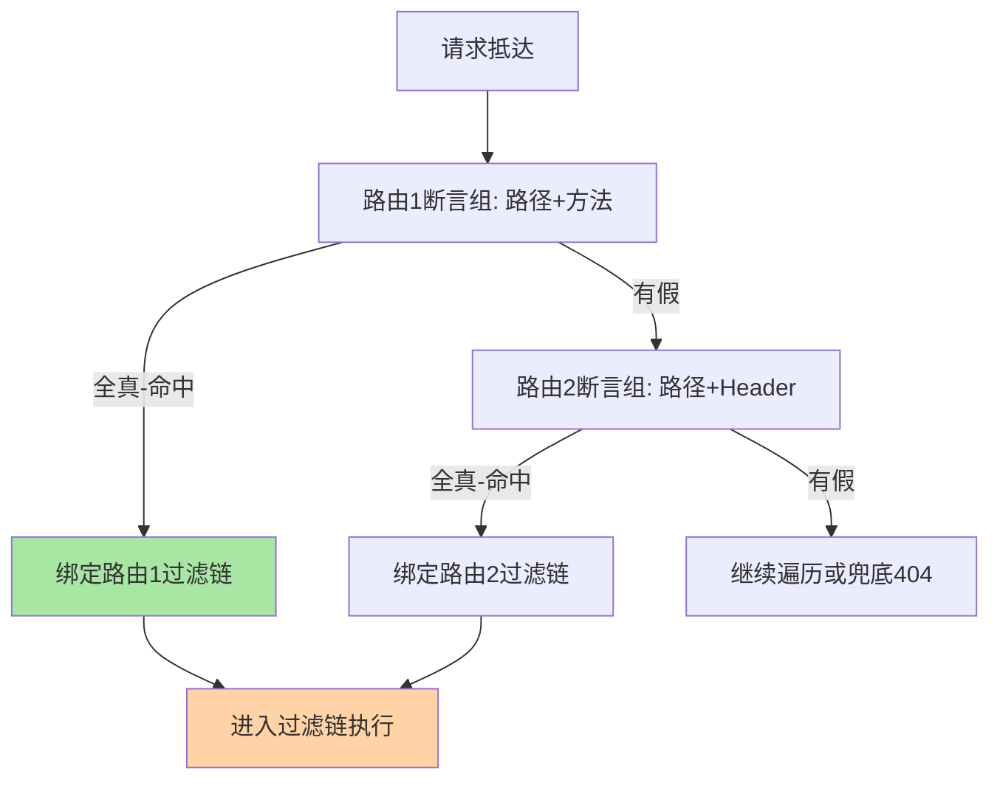
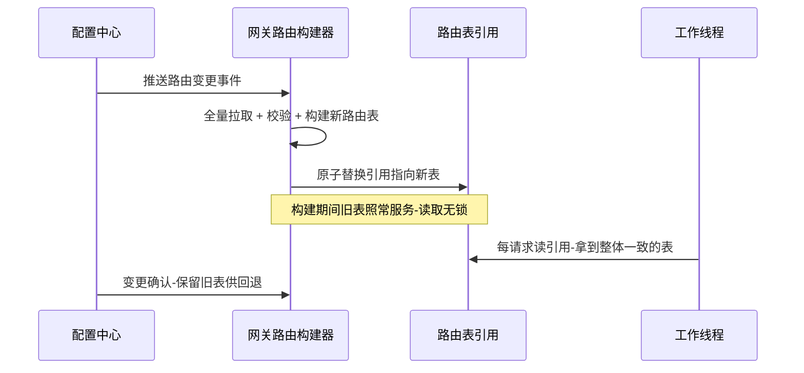
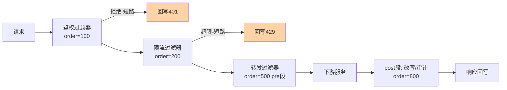

# 网关路由与过滤器链深读：规则匹配与责任链的执行账本

> **本文核心**：网关把两个正交问题拆给两个机制——「请求去哪」由**路由**回答（规则匹配 + 原子切换的查表问题），「路上做什么」由**过滤器链**回答（有序责任链 + 前置后置两段执行的编排问题）。路由匹配的冲突仲裁遵循「精确 > 前缀 > 正则、显式 order > 定义顺序」，热更新靠「配置推送 → 重建路由表 → 原子引用替换」实现不停机变更；过滤链的精髓是「短路语义」（任何一个前置过滤器都能终止请求）与「pre/post 两段式」（转发前的校验增强、转发后的改写审计各归其位）。**机制链**：请求抵达 → 路由断言逐条匹配（精确/前缀/正则/权重）→ 冲突仲裁选出唯一路由 → 绑定该路由的过滤链 → 前置过滤逐个执行（鉴权/限流/染色，任一可短路）→ 反向代理转发下游 → 后置过滤（响应改写/审计埋点）→ 响应回写客户端。

## 一句话摘要

路由是「查表 + 仲裁」：断言逐条评估、按优先级选出唯一目标，实现原理的核心账是**匹配延迟随规则数的增长曲线**（线性遍历在千级规则时进入毫秒档，索引化/分组预处理把它压回微秒档）；过滤链是「有序执行 + 短路」：order 决定次序、短路决定治理语义，实现原理的核心账是**链上过滤器数量与单请求延迟的叠加关系**。热更新是两者共同的工程命门——「重建 + 原子替换」比「原地修改」多花一次构建时间，换来读取路径完全无锁，这是生产实践里用空间换安全的标准交易。

## 前置阅读

- [网关路由机制（入门）](../../入门层/从零开始认识网关系列/3_路由机制-入门.md)
- [网关过滤链机制（入门）](../../入门层/从零开始认识网关系列/4_过滤链机制-入门.md)
- RPC 篇 8《服务路由与灰度》（调用方视角的定向分发，与网关的南北向路由互为镜像）

## 目标导向

本文是什么：网关路由匹配与过滤链的机制级深读。功能：算清匹配延迟账、理解短路语义、掌握热更新的原子切换范式。收益：路由规则治理与过滤链排障的实现级判断力。必看场景：路由规则冲突排查、过滤链顺序设计评审、网关配置热更异常复盘。

## 5W 速记卡

| 维度 | 一句话 |
|---|---|
| What | 断言匹配选路由 + 有序责任链执行治理动作 |
| Why | 路由决定「去哪」、过滤链决定「路上做什么」，二者正交才能各自演进 |
| When | 规则冲突排查、链顺序设计、热更新异常、匹配延迟劣化 |
| Where | 网关请求生命周期的前半程（转发之前） |
| How | 断言匹配 → 仲裁 → 绑定过滤链 → 前置短路执行 → 转发 → 后置收尾 |

## 一、先把两问拆开：路由与过滤链各自的具体问题

抽象谈「路由 + 过滤链」容易变成架构图朗诵，落到实现是六个可观察的具体问题。路由侧三个：**匹配顺序**（两条规则都能命中时听谁的）、**热更时效**（规则变更后多少请求还走旧表）、**匹配延迟**（规则量涨十倍后单次匹配花多久）。过滤链侧三个：**次序约定**（限流应该在鉴权前还是后）、**短路语义**（哪个环节有权终止请求）、**异常传播**（某个过滤器抛错时响应从哪里出来）。这六个问题的工程答案构成网关请求生命周期前半程的全部实现细节——本篇按「先路由后过滤链」的执行顺序逐一拆解。

## 二、路由匹配的实现原理：从线性遍历到索引化

### 2.1 断言模型：路由是「谓词 + 目标」的二元组

现代网关（Spring Cloud Gateway、Kong 路由、Envoy 的一阶匹配）普遍把路由定义为「断言集合 + 目标 URI + 过滤链引用」的二元组。请求进来，按顺序评估每条路由的断言集合——路径断言、方法断言、Header 断言、权重断言——**全部断言为真才算命中**。这个模型的关键路径是清晰的：

```text
单次路由匹配的执行路径:
  for route in routes:
    if all(predicate.match(exchange) for predicate in route.predicates):
      return route          # 第一条全真即返回——顺序即优先级
  return NOT_FOUND          # 兜底: 404 或默认路由
```



**「顺序即优先级」是最简仲裁规则，也是最大的隐患源**——它把正确性责任转嫁给了规则编写者。成熟的实现会叠加显式优先级字段（order/smaller-first），并在配置加载期做「遮蔽检测」（高优先级规则完全覆盖低优先级规则时告警），把冲突从运行期事故提前到配置期警告。

### 2.2 匹配延迟账：规则量级决定数据结构选型

线性遍历的匹配成本是 O(规则数 × 断言数)。单条断言评估是字符串比较或正则执行（正则比字符串比较贵一个数量级）。把账算到量级上：几十条路由的线性遍历在微秒档，毫秒级 QPS 下开销可忽略；**规则涨到千级（多团队共享网关的常态），每次请求的匹配预算进入毫秒档，匹配本身成了转发延迟的显著构成**。索引化的三板斧：路径断言按前缀树组织（一次树下行代替逐条比较）、静态前缀与正则分组（先精确/前缀快速通道、不命中再进正则慢通道）、按 Host 分桶（多域名网关先定位桶再桶内匹配）。业内惯例是「精确 > 前缀 > 正则」三级通道——把最贵的正则评估留给最少见的请求。

反直觉的一点：**权重路由（灰度分流）不参与匹配加速**——它是「命中后的二段分流」，在选中的路由内按权重随机数决定目标集群。把权重当断言写进匹配循环，会破坏「先匹配后分流」的语义分层，也让匹配索引失真。

### 2.3 热更新：重建 + 原子替换

路由变更不能靠重启。主流实现的范式是「事件驱动重建 + 原子引用切换」：



这个设计的设计思想值得展开：**「读多写少 + 读取要求一致性快照」的数据结构，天然适合不可变对象 + 引用替换**。旧路由表在最后一个在途请求离开前不能销毁（引用计数或 GC 兜底），新表构建失败时旧表继续服务（构建失败不等于服务失败）——这两条是热更新不出事故的底线。落地时的坑在「部分生效」：多实例网关集群的变更推送有先后，秒级窗口内不同实例路由表不一致——对「发布后立即验证」的自动化流程，要加「全实例版本对账」环节（互指本系列篇 2 的集群一致性账）。

## 三、过滤器链：责任链的两种形态

### 3.1 次序、短路、两段式

过滤链是责任链模式的直接应用，但网关语境下有三个精确语义。**次序**：每个过滤器带 order，链按 order 升序执行——安全类（鉴权）在前、治理类（限流/染色）居中、增强类（改写/埋点）在后，业内惯例的默认次序是「先拒后治再增强」，把最便宜的拒绝放在最前面省下游开销。**短路**：前置过滤器返回终止信号（如 401/429）时跳过后续全部过滤器直接回写——短路权就是治理权，谁排在前面谁先有机会拒绝流量。**两段式**：转发之前是 pre 段（校验/增强/选路参数），转发之后是 post 段（响应改写/审计/指标埋点）——异常在 pre 段抛出走错误回写，在 post 段抛出只能记录不能改变已发出的下游状态。



### 3.2 与 Nginx 阶段化模型的区别

| 维度 | 阶段化模型（Nginx） | 责任链模型（动态网关） |
|---|---|---|
| 组织单位 | 固定 11 个处理阶段 | 可插拔过滤器序列 |
| 扩展方式 | 模块编译进二进制 | 配置/插件运行期挂载 |
| 顺序语义 | 阶段序固定 + 阶段内模块序 | order 全局排序 |
| 热变更 | reload 重载配置 | 引用替换即时生效 |

阶段化模型的阶段顺序（读请求体 → 访问控制 → 内容处理 → 日志）由内核钉死，扩展必须写 C 模块随二进制发布；责任链模型的链本身是数据，配置即代码。**代价面同样明确**：责任链的灵活换来顺序错误的可能性——阶段化模型里「日志后于内容处理」是内核保证，责任链里要靠 order 约定与加载期校验自己守住。选型时按「扩展频率」定：变更以月计的接入层用 Nginx 阶段化省心，变更以天计的业务网关用责任链买灵活。

### 3.3 异步链：并发模型的分水岭

同步链（Servlet Filter Chain）一请求一线程，过滤器里的任何阻塞调用（远程鉴权、Redis 限流）都占用一个线程；异步/反应式链（WebFlux、Envoy filter 链）用少量事件线程驱动大量在途请求，过滤器返回的是「未完成的承诺」，阻塞调用改为回调/响应式流。**这本账在连接量级上才显出意义**：万级并发连接，同步模型需要万级线程（线程栈内存 + 上下文切换成本双升），异步模型几百个事件线程即可承载——但代价是所有过滤器必须无阻塞编码，一处同步阻塞调用就拖垮整个事件循环。选型决策由此而来：连接量小、逻辑多为 CPU 密集的用同步链（心智简单、栈追踪清晰）；长连接多、IO 密集的用异步链（容量经济性好），团队要先过「反应式编码纪律」这道门槛。

## 四、不同量级的思考：约束驱动解法

- **十万级（日请求十万、峰值千级 QPS）**：这一档的核心问题是「正确与可运维」，而不是「匹配性能与容量」——线性遍历、单实例网关、配置文件 reload 都够用；约束来自团队规模（没有专人维护网关），思考方式是**简化驱动**：规则数控制、全量重启式发布、能不索引就不索引。
- **百万级（日请求百万、峰值万级 QPS）**：这一档的核心问题是「规则治理与热更新时效」，而不是「单机吞吐」——多团队共享带来的规则膨胀要求加载期冲突检测与分桶索引；约束来自组织协作（规则变更频率上升、误配概率放大），思考方式是**治理驱动**：规则 review 流程、变更对账、灰度下发。
- **千万级（日请求千万、峰值十万级 QPS）**：这一档的核心问题是「匹配延迟进入转发预算的显著份额」与「网关集群自身的容量经济学」——索引化、连接模型（异步化）、就近转发成为必答题；约束来自物理资源（连接数、线程数、内存），思考方式是**容量驱动**：每条断言的评估成本进预算表，匹配路径按纳秒级优化。

## 五、典型场景与误区

**典型场景**：多团队共享网关的路由治理（order 约定 + 冲突检测 + 分桶索引）；灰度分流（权重路由 + 用户标签断言，全链路玩法互指 service-routing 特性层）；协议适配（路径改写 + Header 增强过滤器组合）；BFF 聚合前置（路由 + 编排过滤器）。

**常见误区**：① **「路由顺序无关紧要」**——依赖「先定义先匹配」的隐式约定，插入新规则即冲突；② **「过滤器越全越好」**——链上每个过滤器都进关键路径，十个各花 1ms 的过滤器就是 10ms 的固定税；③ **「热更新是瞬时的」**——构建与推送都有延迟，多实例窗口内不一致，自动化验证要等全实例版本对齐；④ **「短路就是 return」**——反应式链里短路要正确设置响应并完成链传播，漏了 post 段埋点指标就缺一块；⑤ **「正则随意写」**——回溯型正则在恶意路径下可被打成 CPU 放大器，路由断言里的正则要有长度与回溯上限。

## 六、事故与实践叙事

**事故一：新路由遮蔽旧路由，核心接口整批 404**。某平台网关新增一条「/api/v2/**」前缀路由时，误将 order 排到了「/api/v2/order/**」精确路由之前——前缀路由断言全真、精确路由永不可达，订单接口整批 404 持续十余分钟（发布校验只测了新接口）。复盘落了两个机制：加载期遮蔽检测（新增路由覆盖既有路由的请求空间即阻断下发），发布后自动化用「旧接口探活」而非只探新接口。**教训**：路由表的变更风险不在新规则本身，而在它与存量规则的空间重叠关系。

**事故二：过滤器顺序倒置，限流形同虚设**。某网关把限流过滤器 order 排在鉴权之后（本意「先确认身份再计数」），鉴权依赖的远程鉴权服务抖动时响应变慢，大量请求堆积在鉴权过滤器内——它们都已通过路由匹配、却未到达限流环节，下游被打挂时网关限流器读数还是「正常」。复盘把「最便宜的检查放最前」定为链顺序铁律，并为鉴权路径单独加了并发闸门。**教训**：过滤链的顺序不是编码风格问题，是故障传播路径问题——排在前面的过滤器是流量的第一道闸门，它自己不能先成为瓶颈。

**实践叙事：路由表对账机制**。某中台网关团队在配置中心与各网关实例之间建立了「路由表版本 + 内容摘要」双对账：实例定期上报本地路由表摘要，控制面对账不一致即告警并触发重推。上线后多次在「推送丢失」演变成「部分实例行为不一致」之前拦截住。这是把「最终一致」变成「可观测的最终一致」的标准做法——机制简单，价值在把隐式状态显性化。

## 七、设计思想：两个正交机制的复利

路由与过滤链拆成两个独立机制，是「关注点分离」在流量入口层的具体化：路由回答拓扑问题（去哪），过滤链回答策略问题（做什么），**正交才能各自演进**——路由规则天天变不影响过滤器代码，过滤器插件化升级不动路由配置。这背后更一般的设计思想是：**把「决策」与「执行」分离，决策数据化（规则即配置），执行框架化（链即引擎）**。这套范式在 service-routing 的规则引擎、在 K8s 的 admission webhook、在 CI 的 pipeline stage 里反复重现——学会一次，迁移处处。

## 八、追问链

**质疑者第一层**：为什么不用「if-else 硬编码」而要搞规则表？规则表本质也是代码写死的求值逻辑——差别不在能不能表达，在**变更主体与变更频率**：硬编码的变更是研发发布（以天计、要回归），规则表的变更是配置推送（以分钟计、可灰度可回退）。当「谁在改」与「多久改一次」升级，表达形式的升级就是回报——这也是所有「规则引擎化」重构的通用判断题。

**质疑者第二层**：再深一层，原子替换真的无锁吗？并发读引用时新旧表会不会交错？——读取路径确实无锁（引用读写是原子操作），但「一致性快照」的粒度是整表：一个请求从匹配到转发可能跨越替换时刻，它拿着旧表匹配的路由、可能转发到新表语义下已变更的目标——严格快照一致性需要把「路由表版本」随请求上下文携带并在转发前复核，绝大多数网关不做这一步，因为路由变更的秒级窗口内「新旧语义并存」在业务上可容忍。追问到这一层就明白了：**工程里的「原子」都是选定粒度的原子**。

**质疑者第三层**：路由匹配与 service-routing 的路由规则引擎是不是重复造轮子？——不重复，是同一思想在两个流量方向上的实例：网关路由管南北向（外部 → 集群），断言多为路径/域名等 HTTP 语义；服务路由管东西向（服务 → 服务），断言多为标签/版本/机房等注册元数据语义（互指 service-routing 特性层）。把两边规则引擎强行统一的人，最终都要在「断言语法求同」上耗尽耐心——**方向不同，语义就不同，引擎就该分开**。

## 你们可能会问

**Q1：怎么量化路由匹配的开销？**
在匹配前后打纳秒级埋点，按规则数量级画分布曲线——P99 突增的拐点就是该索引化的时机。另有静态账：规则数 × 断言平均评估成本，配置评审时就能预判。

**Q2：过滤器该写在哪一层——网关还是服务内拦截器？**
决策口径：跨所有下游的共性治理（协议适配、入口限流、统一鉴权）放网关（一处生效全量覆盖）；仅单服务语义的（业务参数校验、租户上下文解析）放服务内。判据是「规则的受益方是谁」——受益方是平台放网关，是业务方放服务。

**Q3：热更新失败怎么兜底？**
构建新表抛错时旧表继续服务 + 告警（降级为「不生效」而不是「不可用」）；控制台保留前后两版内容摘要，支持一键回退重推。最忌讳的是构建失败连带清理了本地缓存——旧表是生命线。

**Q4：路由规则要不要做单测？**
要。规则是数据，但数据也能错——把「断言样例请求 → 期望命中路由」做成规则的单测集，纳入配置发布流水线，是遮蔽检测之外的第二道配置期防线。

## 💡 实战提示

- 💡 链顺序铁律：先便宜后昂贵、先拒绝后治理再增强——鉴权前置、限流紧随、增强收尾
- 💡 决策口径：路由变更走「加载期遮蔽检测 + 发布期灰度 + 存量接口探活」三道关，缺一道就有 404 事故的口子
- 💡 选型推荐：规则以月计的接入层选 Nginx 式阶段化（省心），规则以天计的业务网关选责任链式动态网关（买灵活），以「变更频率」为第一判据
- 💡 匹配延迟进预算表：千级规则先做前缀分组，正则断言必须带上限——这是十万级 QPS 网关的必修课

## 自测三问

1. 路由冲突仲裁的两级规则是什么？（答：显式 order 优先于定义顺序；同优先级下精确 > 前缀 > 正则——且应在加载期做遮蔽检测而不是靠运行期运气）
2. 过滤链的「短路」与「两段式」分别指什么？（答：短路是前置过滤器有权终止请求直接回写；两段式是转发前的 pre 段做校验增强、转发后的 post 段做改写审计，post 段异常只记录不改变已发生的下游状态）
3. 热更新为什么用「重建 + 原子替换」而不是「原地修改」？（答：不可变表 + 引用替换让读取路径无锁且读到整表一致的快照；构建失败时旧表可继续服务——原地修改则要处理半新半旧状态，锁开销与事故面双升）

## 开放问题

- 跨实例路由表版本的一致性证明（推送树的最坏收敛时间上界）尚无统一形式化工具，多数团队靠对账兜底。
- 路由断言与下游服务网格 Sidecar 规则的语义统一（南北向/东西向规则同源描述）仍在演进中。

## 📎 核心带走

- **核心一句话**：网关前半程 = 路由（查表 + 仲裁 + 原子热更）+ 过滤链（有序 + 短路 + 两段式）——路由管去哪、链管做什么，正交才可演进
- **机制链**：断言逐条匹配 → 仲裁选唯一路由 → 绑定过滤链 → 前置过滤（可短路）→ 反向代理转发 → 后置过滤收尾 → 响应回写；热更新走「推送 → 重建 → 原子替换」
- **失效点/边界**：规则遮蔽是路由最大事故源；过滤器顺序错误会让限流失效；热更多实例有秒级不一致窗口；反应式链一处阻塞调用即拖垮事件循环

## 📌 数据与事实声明

- 写于 2026-09-15，机制口径以 Spring Cloud Gateway、Envoy、Nginx 官方文档为基准（公开口径）；延迟与量级数字为内网量级参考，非实测基准
- 免责：各实现的行为细节以官方文档与所用版本源码为准

## 📚 参考资料

| 类型 | 标题 | 来源 |
|---|---|---|
| 官方文档 | Spring Cloud Gateway Route Predicate / GatewayFilter | spring.io |
| 官方文档 | Nginx 请求处理阶段（module phases） | nginx.org |
| 原理书 | 《深入理解 Nginx》第 2 版（阶段化模型） | 公开出版 |
| 关联文章 | 网关入门层篇 3/4、service-routing 特性层 | 本仓库 |
