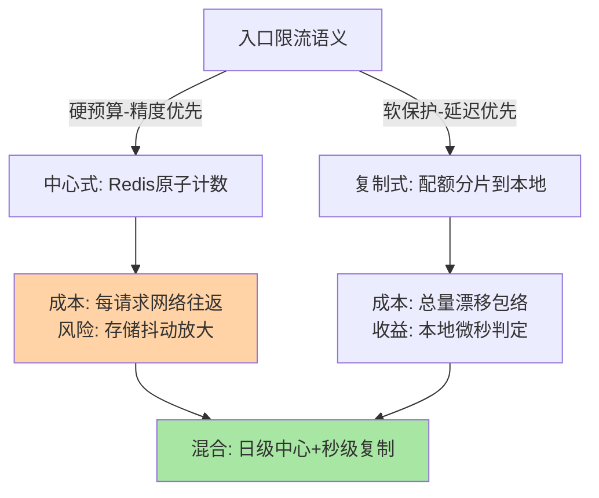
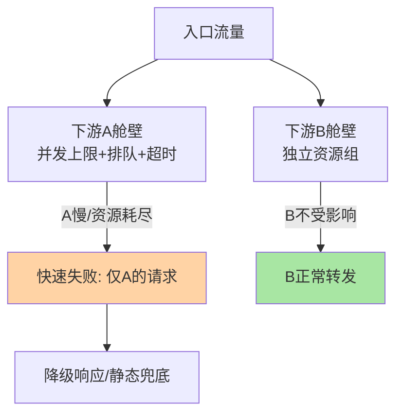
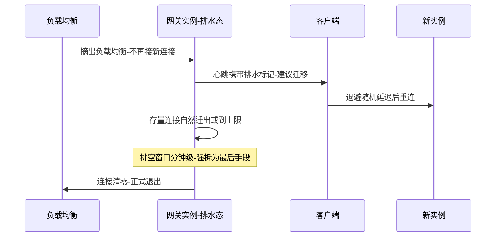

# 网关限流与高可用架构深读：入口闸门的容量与容错账本

> **本文核心**：网关是南北流量的总闸门——在这里，限流的语义从「单实例自保」升级为「集群总量控制」，高可用的语义从「进程不死」升级为「入口不能成为单点 + 故障要能快速排空」。中心式限流（Redis 计数）用一致性换一跳网络延迟，复制式限流（配额分片到本地）用精度换延迟，两者的分界线是「限流精度损失的业务代价」；网关高可用的三根支柱是无状态水平扩展、故障隔离（舱壁 + 背压）、弹性伸缩（扩容追流量），长连接形态（WebSocket/SSE）把「有状态」难题重新带回桌面——连接的建立与排空都成了发布与故障处理的约束项。**机制链**：流量抵达 → 全局限流判定（中心式计数/本地配额扣减）→ 舱壁隔离（按下游分组线程池/信号量）→ 转发下游 → 超时与重试控制 → 失败快速返回（降级响应/静态兜底）→ 指标上报驱动 HPA 扩容。

## 一句话摘要

入口限流 ≠ 实例限流：网关面对的是「全站总预算」，实现路线在**中心式**（强精度、每次判定多一跳网络、限流存储抖动直接放大成全站 429）与**复制式**（本地配额分片、微秒级判定、总量有 ±分片粒度 的漂移）之间做精度-延迟交易；网关高可用的本质是**把网关变成「可随时替换的零件」**——无状态化让任意实例可摘除，舱壁隔离让单下游故障不传染，快速失败让过载时「拒得干净」而不是「拖死全场」。长连接是唯一例外：连接亲和性让滚动发布变成连接排空问题（互指本主题 graceful-shutdown 系列的 drain 思想）。

## 前置阅读

- [网关的限流与鉴权（入门）](../../入门层/从零开始认识网关系列/6_网关的限流与鉴权-入门.md)
- [网关高可用与扩展（入门）](../../入门层/从零开始认识网关系列/7_网关高可用与扩展-入门.md)
- 限流算法系列《令牌桶与滑动窗口》（算法本体在 stability 域，本篇只谈「放哪里执行」）
- [网关路由与过滤器链的实现原理](1_网关路由与过滤器链的实现原理-深度.md)（限流过滤器在链上的位置）

## 目标导向

本文是什么：网关限流的分布式执行架构与网关自身高可用的机制级深读。功能：算清中心式与复制式的精度延迟账、掌握舱壁/背压/排空的参数逻辑。收益：入口容量评审与入口故障复盘的实现级判断力。必看场景：大促容量评审、入口限流方案选型、网关集群滚动发布方案设计。

## 5W 速记卡

| 维度 | 一句话 |
|---|---|
| What | 集群总量限流 + 网关自身的高可用架构（扩展/隔离/伸缩/排空） |
| Why | 网关是总闸门——它限不住量则全站裸奔，它自己挂了则全站不可达 |
| When | 大促扩容评审、限流方案选型、网关发布排障、入口过载复盘 |
| Where | 过滤链的限流环节 + 网关集群的部署与调度层 |
| How | 配额分派 → 本地判定 → 舱壁隔离 → 快速失败 → 指标驱动伸缩 |

## 一、入口限流的特殊性：为什么不能照搬实例限流

服务实例限流的默认形态是本地单机令牌桶——阈值按实例容量配，实例间互不通信。这套搬到网关立刻失真：**网关前面还有负载均衡，流量在网关实例间的分布不均匀**（LB 连接亲和、流量倾斜都会造成实例间 QPS 差异数倍），按「每实例 1/N」配本地桶，总量会随分布漂移——倾斜时部分实例提前限流（误伤），均匀时总量超出预算（失守）。入口限流要回答的是「全站每秒最多放行多少」，这是个**全局配额问题**，实现路线由此分岔：要么把判定集中（中心式），要么把配额切分下发（复制式）。

## 二、两条实现路线：中心式与复制式的精度-延迟交易

### 2.1 中心式：Redis 计数的强精度与强耦合

```text
中心式判定关键路径:
  请求 → 限流过滤器 → Redis Lua 原子脚本(取窗口计数+判定+自增)
       → 返回放行/拒绝 → 放行则继续过滤链
  成本: 每请求一跳网络往返(内网 0.5-2ms 量级)
  变体: 批量预取(一次取 N 个名额本地核销, 降低往返频率)
```

中心式的精度上限取决于限流存储的可用性下限——**限流存储抖动时，选择只有两个：fail-open（放行，限流失守）或 fail-close（拒绝，全站 429）**。业内惯例是按业务语义混合：核心交易路径 fail-open + 旁路告警（宁可失守不可自残），非核心路径 fail-close（宁可误伤不可击穿）。批量预取是中心式自救的标准动作：把「每请求一跳」摊薄成「每名额批一跳」，网络成本降一个数量级，代价是实例崩溃时预取名额浪费（总量短时虚高）。

### 2.2 复制式：配额分片的微秒级与漂移量

复制式把全局配额按周期切成份额推给各网关实例（本地令牌桶核销），判定完全本地化。它的精度损失是结构性的：**分片周期内的真实流量分布无法预知，总量漂移被锁在「分片粒度 × 实例数」的包络内**——每秒切一次、百实例集群，最坏漂移就是「百倍秒配额」，把分片周期压到百毫秒级可以把漂移压回个位数百分比。选型的决策口径由此清晰：限流语义是「硬预算」（配额对应下游真实容量上限，如第三方接口按量计费）选中心式买精度；限流语义是「软保护」（防突发冲击，±5% 漂移无害）选复制式买延迟与解耦。混合形态（中心式管日级总预算 + 复制式管秒级突发）在头部平台的生产实践里更常见——两本账分开记，各自用最便宜的机制。



### 2.3 与实例限流的区别

| 维度 | 网关入口限流 | 服务实例限流 |
|---|---|---|
| 语义 | 全站总预算 | 单实例自保 |
| 实现 | 中心式/复制式分布式 | 本地令牌桶 |
| 触发后果 | 兜底响应/静态页 | 熔断降级链路 |
| 阈值依据 | 下游总容量+业务预算 | 单机容量压测值 |

两层并存不冗余：入口限流是「总量守门」（预算语义），实例限流是「最后防线」（容量语义）——入口被绕过（内网调用直连）或预算算错时，实例级还有一道闸（互指 stability 限流算法系列）。

## 三、网关自身的高可用：可替换零件的四根支柱

### 3.1 无状态水平扩展与前置分担

网关实例无状态化（会话外置/无本地缓存依赖）后，高可用退化为「多实例 + 前置 LB 健康摘除」的标准问题——实例故障 LB 摘除、流量其余实例分摊。容量规划的账要按「N-1」算而不是按 N 算：**滚动发布或单实例故障时，剩余实例要扛住峰值流量**，否则发布即过载。这一条在量级评审时最常被漏算——平时 N 实例水位 60% 看着健康，N-1 时 75% 起步，叠加发布期流量毛刺就是过载。

### 3.2 舱壁隔离：不让一个下游拖垮全场

网关聚合了几十上百个下游，「下游 A 慢 → 线程池耗尽 → 所有下游都慢」是网关故障的经典传染链。舱壁隔离按下游分组资源（线程池/信号量/连接池上限），A 组资源耗尽只拒绝 A 的流量。参数逻辑三件套：并发上限（下游可承受并发 + 网关资源预算的较小值）、排队长度（超过即快速失败，排队是延迟放大器）、超时（上游超时必须大于下游 P99，否则网关先放弃下游先返回，白付成本）。背压是舱壁的孪生机制：反应式网关用请求限速（prefetch/reactive pull）实现「下游处理多少、网关才取多少」，把队列显式化——两种形态选一个，关键是「排队上限」必须显式存在，**无限排队 = 把故障延迟化放大**。



### 3.3 弹性伸缩与容量前置

HPA（按 QPS/CPU 扩容）是网关弹性标配，但它的生效速度追不上突发——**扩容是分钟级（拉起实例 + 就绪检查 + LB 挂载），流量尖峰是秒级**。生产实践的成熟组合是「容量前置 + 弹性兜底」：按大促峰值预估常备容量（N-1 口径），HPA 处理计划外波动，触发阈值提前到水位 50-60% 给扩容留时间窗。可预期的大促（有明确开始时间）直接定时预扩容，比任何自动机制都可靠。

### 3.4 长连接网关的特有难题：连接排空

WebSocket/SSE 长连接让网关重新「有状态」——连接绑定实例，滚动发布变成了连接迁移问题。机制链：实例进入排水态 → 停止接受新连接 → 通知客户端重连（应用层心跳感知排水标记）→ 等待存量连接自然迁出或到达上限强拆 → 退出 LB。排空窗口是核心参数：太短强拆比例高（客户端重连风暴），太长发布周期失控。业内惯例是「分钟级排空 + 重连抖动（客户端退避随机化）」组合——重连抖动是防「全量客户端同时回连同一批新实例」的关键，反直觉但重要：**重连风暴的破坏力常大于连接本身的服务中断**。



## 四、不同量级的思考：约束驱动解法

- **十万级（日请求十万、峰值千级 QPS）**：这一档的核心问题是「别过度设计」而不是「分布式限流」——单实例网关 + 本地令牌桶 + 双实例主备即可，中心式 Redis 限流在这一档是负资产（多了一个故障依赖）；约束来自运维预算（没有专人养限流存储），思考方式是**简化驱动**：能本地就不中心，能主备就不集群。
- **百万级（日请求百万、峰值万级 QPS）**：这一档的核心问题是「全站总预算的执行精度」与「下游传染的隔离」——中心式/复制式选型、舱壁分组、N-1 容量口径全部进场；约束来自下游容量差异（强弱下游混部），思考方式是**隔离驱动**：按下游重要性分舱壁、按业务语义定 fail-open/close。
- **千万级（日请求千万、峰值十万级 QPS）**：这一档的核心问题是「网关集群自身的容量经济学与地理分布」——多集群分片（按域名/业务线拆网关集群，爆炸半径隔离）、异地就近接入、长连接的连接容量学（单机连接上限 × 集群规模的联合账）；约束来自物理网络（机房带宽、LB 容量、连接数上限），思考方式是**容量驱动**：连接/QPS/带宽三本账并算，任何一账触顶都是入口故障。

## 五、典型场景与误区

**典型场景**：大促入口限流预案（分级阈值 + 预案演练，变更安全归 stability 域）；开放平台第三方接口配额（中心式硬预算 + 按应用维度计量）；网关集群滚动发布（排空 + 重连抖动）；多下游聚合页面的舱壁配置（强弱下游分组 + 差异化超时）。

**常见误区**：① **「限流存储挂了就放行，反正有实例限流兜底」**——fail-open 前要确认实例限流的阈值口径与入口预算一致，否则兜底形同虚设；② **「排队越长越平滑」**——网关排队是延迟放大器，排队超过下游 P99 就该快速失败，把选择权交回客户端；③ **「网关扩容追突发」**——HPA 分钟级生效追不上秒级尖峰，可预期流量必须前置扩容；④ **「长连接发布直接杀实例」**——无排空的强拆触发全量重连风暴，破坏力大于连接中断本身；⑤ **「N 实例水位 60% 就是健康」**——容量口径必须按 N-1 算，发布窗口才是真实战场。

## 六、事故与实践叙事

**事故一：限流存储抖动，fail-close 把抖动放大成全站不可用**。某平台网关的中心式限流依赖的 Redis 集群网络抖动 30 秒，限流过滤器按 fail-close 处理判定失败——30 秒内全站请求吃 429，抖动本身用户无感，限流层把 30 秒放大成了全站事故。复盘改造：核心交易路径改 fail-open + 旁路告警，非核心路径维持 fail-close；限流存储独立部署并监控「限流判定失败率」为一级指标。**教训**：限流层是治理层，它的故障模式（判定失败）不能等价于业务失败——**闸门失灵时应该失效于「开」而不是「关」，前提是下游容量账算对**。

**事故二：长连接网关滚动发布触发重连风暴**。某消息网关升级时直接逐实例重启，被强拆的数十万客户端在同一秒内重连，且重连目标集中在剩余存活实例——新实例尚未就绪，重连全部打到存量实例，连接数瞬间翻倍击穿上限，二次雪崩。复盘落地：发布前实例置排水态、客户端重连加指数退避 + 随机抖动、LB 侧对新实例做连接数爬坡限制。**教训**：有状态组件的发布是「连接迁移工程」，不是「进程重启」——排空与抖动是迁移的两个轮子，缺一即翻车。

**实践叙事：入口水位的三本账**。某网关团队把入口容量从「QPS 单指标」升级为「QPS/连接数/带宽」三本账并行监控：一次直播活动流量不增 QPS 但连接数翻三倍（长轮询改长连接），靠连接账提前一周发现容量缺口并扩容。抽象出的判断是：**入口的容量约束是多维的，监控哪一维取决于流量形态，漏掉的那一维就是下一次事故**。

## 七、设计思想：治理点前移的代价与回报

网关把限流/隔离/降级从各服务「上移」到入口，本质是**治理点前移**——在最靠近流量的位置用一份配置覆盖全部下游，运维面收敛、策略一致性有保障。但前移的代价同样真实：网关成为全站的关键路径，它自己的可用性预算必须高于任何单一服务（多实例、多机房、独立发布窗口）；治理决策离业务更远（fail-open/close 的选择要按业务语义逐路径定，不能一刀切）。这套「集中 vs 分散」的权衡在服务治理域反复出现——网关限流与实例限流、集中式配置与本地配置、统一鉴权与服务级鉴权，权衡的天平都是同一个：**一致性的收益要大于单点化的风险，且单点化风险要被架构手段（多实例/多活）实际对冲**。

## 八、追问链

**质疑者第一层**：为什么不在每个服务上限流就够，非要在网关多设一道？——服务级限流管住的是「单实例容量」，管不住「全站总量」：一百个实例各自放行 100 QPS，全站就是 1 万 QPS，下游数据库扛不扛得住没人回答——总量预算必须有一个集中记账的位置，网关是天然的记账点（南北向必经）。反过来只有网关限流也不行：内网直连、绕过网关的调用路径都需要实例级最后防线。两层是预算与容量的分工，不是重复。

**质疑者第二层**：复制式配额分片的漂移包络能不能通过「按历史流量加权切分」消掉？——能收敛但不能消掉：加权切分让份额更贴近真实分布，但分片周期内的突发仍然失配，漂移包络的下限由「流量不可预测性」决定而不是算法决定。工程上的真问题是「漂移多少业务能忍」：软保护场景 ±5% 无感，硬预算场景必须中心式——这再次回到语义定价，而不是技术炫技。

**质疑者第三层**：网关要不要做多活（跨机房两套网关集群）？——先算 DNS/LB 的流量引导能力与网关集群的爆炸半径：单集群故障影响全站时，多活的收益是真实的；已有按业务线拆分的多集群（故障域已隔离）时，跨机房多活的边际收益递减，成本（配置同步、会话迁移、演练复杂度）却是全额的。多活决策的本质是「爆炸半径 × 恢复时间」与「建设成本 × 常态复杂度」的对赌，量级没到，多活就是负资产。

## 你们可能会问

**Q1：入口限流的阈值怎么定？**
自下而上加总：下游各接口容量压测值 × 安全系数，扣除非网关路径的流量占比，再按业务优先级分层分配——阈值是「下游容量 + 业务预算」的函数，不是拍脑袋数字。阈值变更要走容量评审，与下游扩缩容联动。

**Q2：fail-open 与 fail-close 按什么粒度配置？**
按「路径 + 业务等级」组合配置：交易写路径 fail-open、读路径可 fail-close、第三方配额类必须 fail-close（超卖即资损）。粒度到接口级才可运营，全局开关是事故放大器。

**Q3：长连接网关的单机连接数上限怎么估？**
文件句柄与内存是显性约束（每连接的缓冲区 × 连接数），隐性约束是心跳包的 CPU 中断成本与事件循环的调度延迟——压测按「连接数 + 消息频率」二维矩阵打，只压连接数不压消息频率会高估容量。公开口径的「单机百万连接」依赖消息频率极低的场景，行业认知仅供参考。

**Q4：舱壁用线程池还是信号量？**
同步栈选线程池（隔离彻底但线程成本高、线程数要预算），反应式栈选信号量/请求限速（轻量但只隔离并发不隔离 CPU）。判据是网关的并发模型，不是个人偏好。

## 💡 实战提示

- 💡 决策口径：硬预算（配额/计费）选中心式买精度，软保护（防突发）选复制式买延迟——混合形态「日级中心 + 秒级复制」是生产实践主流
- 💡 fail-open/close 按接口级配置：交易路径失效于开、配额路径失效于关——全局一刀切是事故放大器
- 💡 选型推荐：容量口径永远按 N-1 算，HPA 阈值提前到水位 50-60%——扩容追不上突发，前置才是主力
- 💡 长连接发布三件套：排水态 + 重连随机退避 + 新实例连接爬坡限制——缺一即重连风暴

## 自测三问

1. 中心式与复制式限流各自的结构性代价是什么？（答：中心式每请求一跳网络往返、限流存储抖动直接放大（fail-open 失守/fail-close 自残）；复制式总量有「分片粒度 × 实例数」包络内的漂移——分界线是限流精度的业务代价）
2. 网关高可用四支柱是什么？（答：无状态水平扩展（N-1 容量口径）、舱壁隔离（按下游分组 + 排队上限 + 超时对齐）、弹性伸缩（前置扩容为主 HPA 为辅）、长连接排空（排水态 + 重连抖动））
3. 为什么「排队上限」必须显式存在？（答：无限排队把故障延迟化放大——请求占着资源等下游、超时后全部作废白付成本；显式上限 + 快速失败把拒绝决策前移，延迟与资源双省）

## 开放问题

- 限流判定与下游真实容量的自动对齐（根据下游 SLO 反推入口阈值）尚无成熟通用实现。
- 跨机房多活的连接迁移协议（客户端无感换机房重连）仍在各厂自研阶段，无公开标准。

## 📎 核心带走

- **核心一句话**：入口限流是全局配额问题（中心式买精度/复制式买延迟，按业务语义定价），网关高可用是把网关做成可替换零件（无状态 + 舱壁 + 前置扩容 + 连接排空）
- **机制链**：流量抵达 → 全局限流判定 → 舱壁隔离 → 转发下游 → 超时重试控制 → 快速失败降级 → 指标上报 → 容量前置/HPA 兜底
- **失效点/边界**：限流存储抖动被 fail-close 放大成全站事故；HPA 追不上秒级突发；长连接强拆触发重连风暴；N 实例水位口径掩盖 N-1 真相

## 📌 数据与事实声明

- 写于 2026-09-15，机制口径以 Spring Cloud Gateway、Envoy、Nginx 官方文档与公开架构资料为基准（公开口径）；延迟/连接容量数字为量级参考与行业认知，非实测基准
- 免责：各实现行为细节以官方文档与所用版本为准

## 📚 参考资料

| 类型 | 标题 | 来源 |
|---|---|---|
| 官方文档 | Spring Cloud Gateway RequestRateLimiter / Redis RateLimiter | spring.io |
| 官方文档 | Envoy Rate Limit Service / Circuit Breaking | envoyproxy.io |
| 关联文章 | 限流算法系列（令牌桶与滑动窗口）、网关入门层篇 6/7 | 本仓库 stability 域 |
