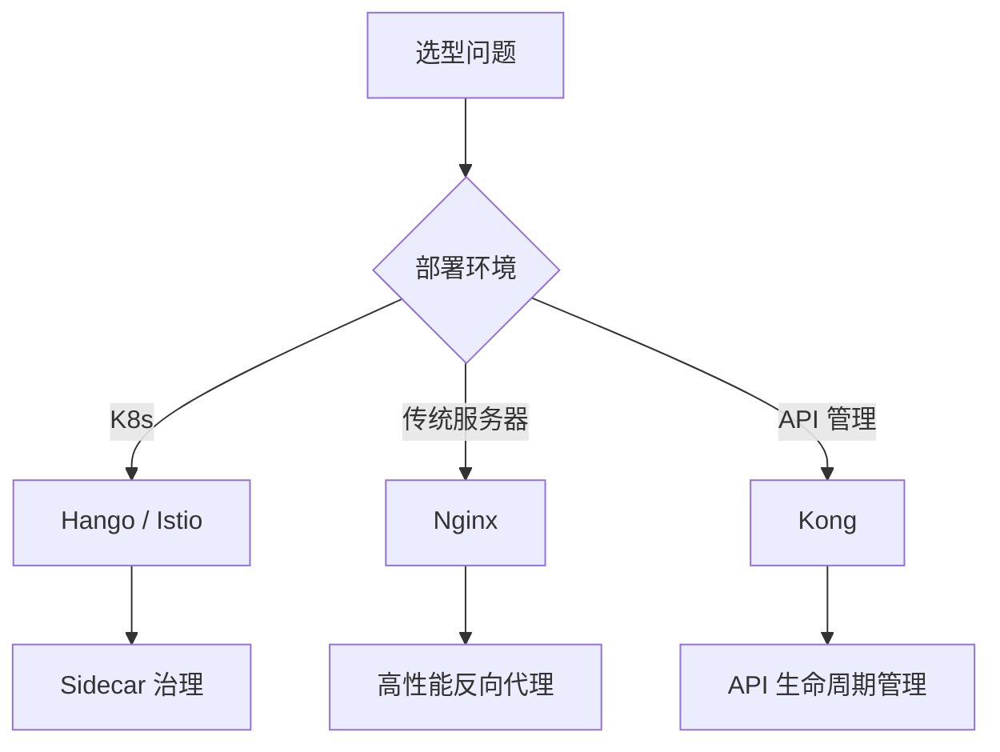
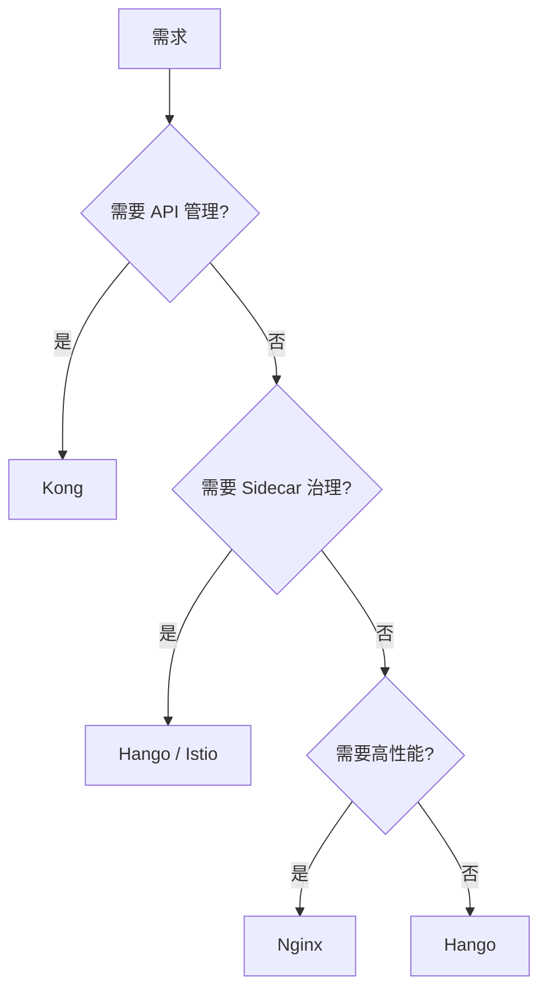
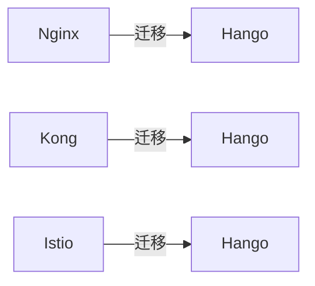

# 云原生网关选型：Hango vs Kong vs Nginx vs Istio Ingress

## 一句话摘要

网关选型不是比功能多，而是比**谁更适合你的部署环境**。Hango 云原生、Kong API 管理、Nginx 性能、Istio Ingress 统一 —— 四者场景不同。

## 四者核心差异

## 详细对比

| 维度 | Hango | Kong | Nginx | Istio Ingress |
|---|---|---|---|---|
| 部署 | K8s + Sidecar | K8s / 传统 | 传统 / K8s | K8s |
| 治理能力 | 强（Sidecar） | 中（插件） | 弱 | 强（Sidecar） |
| 性能 | 中 | 中 | 高 | 中 |
| API 管理 | 无 | 强 | 无 | 无 |
| 学习曲线 | 中 | 低 | 低 | 高 |
| 运维成本 | 中 | 低 | 低 | 高 |
| 社区活跃度 | 中 | 高 | 高 | 高 |

## 选型决策树

## 各场景推荐

| 场景 | 推荐 | 理由 |
|---|---|---|
| K8s 微服务 | Hango | Sidecar 治理，业务无感知 |
| API 开放平台 | Kong | API 生命周期管理 |
| 高性能反向代理 | Nginx | 性能强，简单可靠 |
| 多语言微服务 | Istio | 多语言支持好 |

## 生产踩坑

1. **Hango Sidecar 资源**：每个 Pod 多一个 Sidecar，资源消耗增加
2. **Kong 插件冲突**：插件多，容易冲突
3. **Nginx 配置复杂**：规则多，维护困难
4. **Istio 学习曲线**：概念多，上手慢

## 迁移策略

## 📌 数据与事实声明

- 对比基于 2026 年各项目最新版本
- 选型决策树基于部署环境
