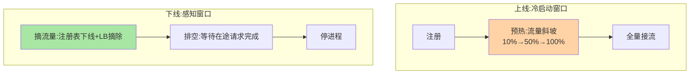
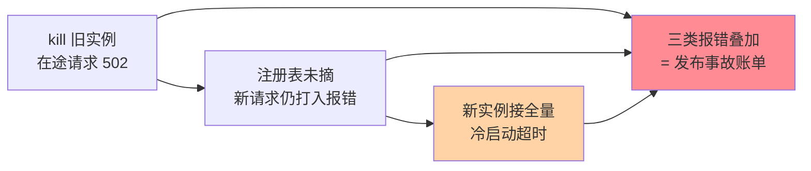

# 优雅上下线是什么：发布不再丢流量

> 一句话：优雅上下线是**实例上线与下线时的流量无损切换机制**——上线先预热再接全量，下线先摘流量再停进程，让「发布」对用户完全无感。

> **本文核心**：两类故障的反面就是优雅上下线的定义——**上线问题**：新实例刚起就接全量流量（JIT 未热、缓存冷、连接池空）→ 大量超时，即「冷启动打挂」；**下线问题**：进程直接被杀，在途请求全断、注册表还挂着死实例 → 报错尖峰。**机制链**：上线 = 注册 → 预热（流量斜坡）→ 全量；下线 = 摘流量（注册表下线/负载均衡摘除）→ 等待在途完成 → 停进程。发布次数 × 每次丢流量 = 累计事故，优雅上下线把发布从「事故来源」变成「无感操作」。

## 一句话摘要

上下线各有一个「时间窗口问题」：**上线窗口**——实例已注册但尚未就绪（ readiness 的应用层版本），流量进入后失败；**下线窗口**——下线动作与流量感知的时间差（注册表传播、调用方缓存刷新都要时间），窗口内的在途请求与新增请求会打到将死实例。优雅上下线的全部机制都是围绕「管理这两个窗口」：上线窗口用**健康门槛 + 预热**填平，下线窗口用**先摘后停 + 排空等待**填平。

## 一、为什么发布总是丢流量

发布丢流量的机制还原：K8s 滚动发布直接 SIGKILL 旧 Pod（无 preStop）→ 在途请求中断（用户收到 502）→ 注册中心还没摘除该实例（心跳未超时）→ 新请求继续打到死实例（再报错）→ 新实例起来直接接全量（冷启动超时）——**一次发布 = 三类报错叠加**。这些不是「发布必有」的代价，是上下线机制缺失的账单。

## 5W 速记卡

| 维度 | 一句话 |
|---|---|
| What | 上线预热与下线摘流的流量无损切换机制 |
| Why | 上下线的时间窗口产生报错尖峰，发布成为事故来源 |
| When | 任何形式的发布、扩缩容、实例迁移 |
| Where | 发布系统 + 注册中心 + RPC/网关层 + K8s 钩子 |
| How | 上线：就绪门槛+预热斜坡；下线：摘流→排空→停进程 |

## 二、上下线窗口与机制对位

**机制的时间参数**相互咬合：下线摘流后要等「调用方感知摘除」（注册表推送 + 缓存刷新，秒级）再停进程——排空等待时长 ≥ 上游最长请求耗时 + 感知延迟；上线预热的斜坡周期按「实例预热成本」定（JIT 类应用更长）——**参数不是拍出来的，是链路时间常数的函数**。

## 三、与发布策略的区别：机制层对照

| 维度 | 优雅上下线（本系列） | 发布策略（互指篇 4 与 stability 篇 10） |
|---|---|---|
| 粒度 | 单实例的进出流量机制 | 批次的编排策略（滚动/蓝绿/金丝雀） |
| 关系 | 原语 | 策略（原语的编排） |

优雅上下线是发布策略的「原语」——滚动发布 = N 次「上线原语 + 下线原语」的编排；原语不可靠，策略全白搭——这是本系列作为发布治理基础的定位。

一次发布的报错时间线（未做优雅时）：

## 四、典型场景与误区

**典型场景**：日常发布（滚动 + 优雅上下线，用户无感）、大促前扩容（新实例预热后接量，防止冷启动拖垮峰值）、故障实例下线（摘流先行，不产生次生报错）。

**误区与不适用**：① 只做 K8s readiness 不做应用层摘流——readiness 只影响 Service endpoint，应用注册中心（RPC 注册表）是另一条链路，双链路要双摘除；② 排空时间拍脑袋——按「上游超时 + 感知延迟」计算，不是固定 30 秒；③ 预热只做流量斜坡不做缓存预热——缓存冷导致的慢查询仍在，预热是「流量 + 数据」双预热。

## 五、💡 实战提示

- 💡 引入时机的决策口径：何时用什么——发布周报有报错尖峰即立项优雅上下线，报错率为零的组织无需过度建设——发布分钟级错误尖峰归零才算做到
- 💡 摘流与停进程之间必须有排空等待，时长 = 上游最长请求 + 感知延迟
- 💡 双链路摘除（K8s endpoint + 应用注册表）缺一不可， checklist 固化

## 六、你们可能会问

**Q1：进程被 kill -9 还能优雅吗？**
不能——优雅的前提是「收到信号后有机会执行清理」；kill -9 跳过一切处理。规范是 kill（SIGTERM）触发优雅流程，kill -9 只留给 SIGTERM 超时不退的兜底。

**Q2：熔断/重试能不能掩盖非优雅上下线？**
部分掩盖（重试救回部分失败）但代价是失败率尖峰 + 重试风暴风险——掩盖不等于解决，且掩盖层本身有成本。

**Q3：Serverless 还需要优雅上下线吗？**
形态变了需求没变——Serverless 的冷启动与实例回收就是「上下线窗口」的极端形态，平台层的预热与排空机制是同一命题的平台化实现。

## 七、开放问题

- 网格与 Serverless 平台把优雅上下线下沉为基础设施能力（自动摘流排空），应用 SDK 的上下线职责在弱化，「原语」的位置迁移是治理架构的演进观察点。

## 八、自测三问

1. 上线窗口与下线窗口的问题机制各是什么？
2. 排空等待时长的计算公式？
3. 「原语与策略」的分层关系怎么理解？

下一篇讲「优雅停机机制」：下线侧的完整动作序列。

## 📎 核心带走

- **核心一句话**：优雅上下线 = 上线（就绪门槛 + 预热）与下线（摘流 + 排空 + 停进程）的窗口管理机制
- **机制链**：上线：注册 → 预热斜坡 → 全量；下线：摘流 → 等排空 → 停进程；双链路（K8s + 注册表）双摘除
- **失效点/边界**：kill -9 无优雅可言；预热是流量与数据双预热；验收指标是发布分钟级错误尖峰

## 📌 数据与事实声明

- 写于 2026-09-08，机制为业界发布治理的共识口径归纳
- 免责：参数按链路时间常数实测

## 📚 参考资料

| 类型 | 标题 | 来源 |
|---|---|---|
| 关联系列 | 本仓库 K8s 系列（preStop/探针互指） | docs/devops/kubernetes/ |
| 官方文档 | Spring Boot graceful shutdown / K8s termination | 各官方站点 |
| 社区沉淀 | 优雅发布公开实践 | 技术社区公开文章 |
