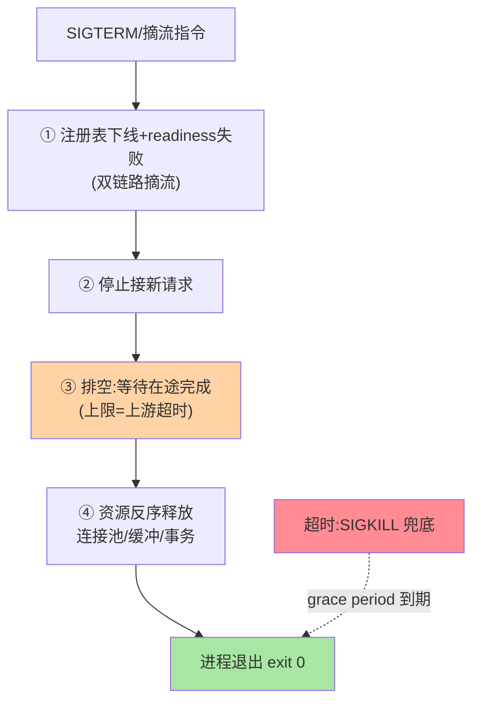

# 优雅停机机制：从收到信号到进程退出的完整序列

> 「停个服务」的动作序列：摘流量 → 停接新请求 → 排空在途 → 关闭资源 → 退出——每步有时限、超时有兜底。这篇把这个序列逐步讲清，并覆盖 K8s 与传统部署两种形态。

> **本文核心**：优雅停机的五步序列——**① 触发**（SIGTERM / 发布系统摘流指令）；**② 摘流量**（从注册表下线 + 健康检查置失败 + LB 摘除）；**③ 停止接新**（端口关闭或应用层拒绝新请求）；**④ 排空**（等待在途请求完成，受超时预算约束）；**⑤ 释放退出**（关连接池/刷缓冲/flush，进程退出）。**机制链**：信号 → 摘流 → 拒新 → 排空 → 资源释放 → exit(0)；总时长受 K8s terminationGracePeriodSeconds 约束，超时被 SIGKILL 兜底。

## 一句话摘要

五步中的关键细节：**摘流要双链路**（注册表下线管 RPC 流量 + readiness 置失败管 K8s Service 流量——两条流量来源两条摘除）；**排空的边界**是「最长在途请求时长」（排空等待 < 上游超时才有意义——上游都放弃了你还 processing 就是浪费）；**资源释放的顺序**与依赖相反（先停接新、再处理存量、最后关依赖连接——反序关闭原则）。K8s 形态的对应：preStop 钩子做②③，terminationGracePeriod 覆盖④，SIGKILL 兜底⑤的超时。

## 一、为什么停机是个「序列」而不是一个动作

「停服务 = 杀进程」的三笔账：在途请求中断（用户侧报错）、注册表残留死实例（其他服务继续调用失败）、资源状态丢失（缓冲未刷、事务未提交）——三笔账分别对应序列的③④⑤步。**序列化停机的本质是把「突然死亡」改为「有序谢幕」**——每步都有明确目标、时限与完成判据。

## 5W 速记卡

| 维度 | 一句话 |
|---|---|
| What | 摘流 → 拒新 → 排空 → 释放 → 退出的五步停机序列 |
| Why | 杀进程的三笔账（中断/残留/丢失）需要有序化解 |
| When | 发布下线、扩缩容回收、实例迁移 |
| Where | 应用 shutdown 钩子 + K8s preStop/grace period |
| How | 信号触发 → 双链路摘流 → 排空等待 → 反序释放 |

## 二、五步序列的时序全景

**摘流的「先与快」**是序列的灵魂：摘流越早（第一步就做），后续步骤的时间越从容——「先摘流再干别的」与「先干别的最后摘流」是优雅与事故的分界。**排空的进度可见**：排空期打印在途请求数（日志/指标），运维能看到「排空进度条」而不是盲等。

## 三、与故障转移的区别：主动被动对照

| 维度 | 优雅停机（主动） | 故障转移（互指 cluster-fault-tolerance） |
|---|---|---|
| 触发 | 计划内（发布/缩容） | 计划外（故障） |
| 摘流方式 | 主动注销（干净） | 被动摘除（心跳超时） |
| 报错窗口 | 趋近零 | 存在（感知延迟） |

同样的「实例消失」，主动与被动的报错窗口差两个量级——**计划内动作必须走优雅通道**，容错机制只兜计划外。

grace period 的时间预算分解：

## 四、典型场景与误区

**典型场景**：K8s 发布（preStop sleep + endpoint 摘除 + 应用 shutdown hook 组合）、缩容回收（自动伸缩的实例回收路径同样要走序列）、滚动升级（每实例停机都是一次完整序列的执行）。

**误区与不适用**：① preStop 只 sleep 不摘流——sleep 只是延迟 SIGTERM，注册表还在（RPC 流量照打）——preStop 内要显式调摘流动作；② 排空无上限——慢请求无限等，grace period 到期被 SIGKILL（前功尽弃）——排空等待必须显式上限——「等待的充分性」与「退出的及时性」之间的取舍由 grace period 总预算裁决；③ 资源释放顺序随缘——先关数据库连接再排空请求 = 在途请求拿不到连接。

## 五、💡 实战提示

- 💡 五步序列写成应用模板（shutdown hook 统一封装），业务只填钩子
- 💡 grace period = 摘流感知 + 排空上限 + 资源释放 + 余量，逐段计算配置
- 💡 停机序列每步打点（耗时/在途数），排空超时告警
- 💡 grace period 的决策口径：何时用什么值——排空上限 = 上游 P99 超时 + 摘流感知 + 余量，默认 30s 是起点不是终点

## 六、你们可能会问

**Q1：消息消费者怎么优雅停机？**
额外两步：先停止消费拉取（不接新消息）→ 等已拉取消息处理完（或提交 offset）→ 再退出——消费未提交即退出会导致重复消费（互指 MQ 系列的语义）。

**Q2：排空期间上游还在发新请求怎么办？**
说明摘流不彻底（某链路未摘）——排空期新请求计数可见时告警，治本是摘流双链路的完备性检查。

**Q3：优雅停机做完了还有必要容错吗？**
必要——优雅停机覆盖计划内，故障（OOM、节点宕机、被 kill -9）仍是计划外；两层是「计划内序列 + 计划外兜底」的完整拼图。

## 七、开放问题

- 平台化停机（K8s/Serverless 的原生 drain 能力）逐步接管序列的①②③步，应用只保留④⑤——停机职责的「平台化分割」是长期演进方向。

## 八、自测三问

1. 五步序列各步的目标与完成判据？
2. 「摘流先行」为什么是序列的灵魂？
3. 资源反序释放的原则是什么？

## 📎 核心带走

- **核心一句话**：优雅停机 = 信号触发的五步序列（摘流/拒新/排空/释放/退出），先摘流是灵魂
- **机制链**：SIGTERM → 双链路摘流 → 拒新 → 排空（上限=上游超时） → 反序释放 → exit；超时 SIGKILL 兜底
- **失效点/边界**：preStop 必须显式摘流；排空要有上限与进度可见；消费者额外两步

## 📌 数据与事实声明

- 写于 2026-09-08，序列为 Spring Boot/K8s 优雅停机的共识口径归纳
- 免责：参数按链路时间常数实测

## 📚 参考资料

| 类型 | 标题 | 来源 |
|---|---|---|
| 官方文档 | Spring Boot Graceful Shutdown / K8s Pod 终止 | 各官方站点 |
| 关联系列 | 本仓库 cluster-fault-tolerance / MQ 系列 | docs/ |
| 社区沉淀 | 优雅停机公开实践 | 技术社区公开文章 |
