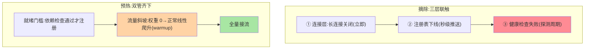
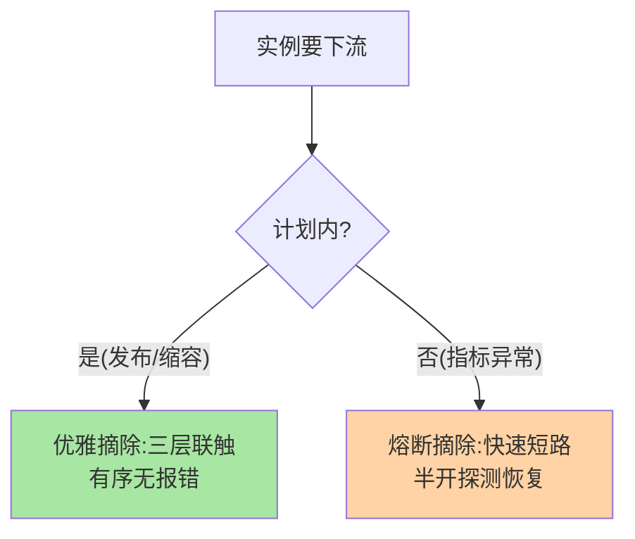

# 摘除与预热：上下线两侧的流量整形

> 摘除（下线侧：让流量别再来）与预热（上线侧：让实例慢慢接流量）是流量整形的一对镜像操作。这篇讲两者的机制、参数与联动。

> **本文核心**：**摘除机制**的三个层次——注册表下线（RPC 流量）、健康检查置失败（探针/网关流量）、连接层关闭（长连接清退），三层的感知速度不同要分层触发；**预热机制**的两种实现——**流量斜坡**（按时间权重递增，Nginx weight/ Dubbo warmup 参数）与**就绪门槛建议**（应用自报就绪，依赖项确认）。**机制链**：摘除——三层次联触发 → 感知传播 → 流量归零；预热——注册（权重从 0 起）→ 按斜坡升权 → 达标转全量。

## 一句话摘要

**摘除的层次感**：注册表下线传播依赖订阅推送（秒级）、健康检查失败传播依赖探测周期（十秒级）、连接层关闭立即生效——三层同时触发（先快后慢），流量归零时间由最慢层决定。**预热的本质是「能力爬坡」**：新实例的 JIT 编译、缓存填充、连接池建立都需要时间与流量刺激——流量斜坡（Dubbo 的 warmup 参数：启动后 N 毫秒内权重从低到正常线性爬升）让「接流量」与「涨能力」同步；**就绪门槛**是预热的另一面：依赖检查（DB 连通、缓存就绪、本地缓存预填）不通过不注册——「预热 + 门槛」双管齐下才有干净的上线。

## 一、为什么摘除与预热要「分层」

单层摘除的漏洞：只摘注册表 → 网关流量还在（网关有自己的上游缓存）；只摘健康检查 → RPC 直连流量还在——**流量来源有多条，摘除就要有多层**。预热同理：只有斜坡没有门槛，实例「还没准备好就开始接」；只有门槛没有斜坡，「准备好了就被全量打」——两侧的分层是对窗口问题的完整覆盖（篇 1 的框架落地）。

## 5W 速记卡

| 维度 | 一句话 |
|---|---|
| What | 三层摘除（注册/探针/连接）与双实现预热（斜坡/门槛） |
| Why | 流量多来源需要多层摘除，冷启动需要流量整形 |
| When | 发布下线、扩容上线、长连接清退 |
| Where | 注册中心 + 探针 + LB + 框架 warmup 参数 |
| How | 三层联触摘除；斜坡升权 + 就绪门槛双预热 |

## 二、摘除三层与预热斜坡全景

**摘除的「最慢层」决定归零时间**——探测周期长的健康检查是常见瓶颈（30 秒探测 = 摘除后最多 30 秒流量残留），缩探测周期与增加主动下线（实例主动通知）是加速手段。**斜坡的参数语义**（Dubbo warmup 口径）：`warmup=600000` 表示启动后 10 分钟内权重线性爬升至配置值——期间实际权重 = 正常权重 × (启动耗时/warmup)，均衡器按此打折分流量。

## 三、与熔断摘除的区别：主动被动对照

| 维度 | 优雅摘除（本篇） | 熔断摘除（互指 stability） |
|---|---|---|
| 触发 | 计划内下线 | 指标异常自动 |
| 恢复 | 计划内重新上线 | 半开探测自动恢复 |
| 语义 | 有序谢幕 | 应急止损 |

同样是「不让流量进来」，计划内的走优雅摘除（有序、无报错），计划外的走熔断（快速、带恢复探测）——**主动与被动的分界决定用哪套机制**。

摘除与熔断的机制分界：

## 四、典型场景与误区

**典型场景**：发布下线（三层联触 + 排空衔接，互指篇 2 的序列）、大促扩容（新实例斜坡 30 分钟接满，配合缓存预填）、长连接服务下线（WS 连接清退 + 客户端重连到存活实例）。

**误区与不适用**：① 摘除只做一层——漏掉的流量来源就是报错来源，流量来源盘点是摘除设计的第一步；② 预热斜坡对所有服务一刀切——无状态轻服务不需要斜坡（直接就绪门槛），重预热服务（缓存密集）才需要长斜坡；③ 连接清退忽略客户端重连策略——服务端清退后客户端立即重连同一实例（已死）的重连风暴，清退要配合客户端的重连退避。

## 五、💡 实战提示

- 💡 流量来源盘点表（RPC/网关/探针/长连接）是摘除设计的输入，每年复核
- 💡 斜坡参数按「实例预热实测」定：从注册到 P99 达标的时间就是 warmup 参考
- 💡 摘除与预热的效果用「发布分钟级错误率」验收——一张图看上下线质量
- 💡 决策口径：何时用什么——计划内下线必走优雅摘除，指标异常走熔断，两者不可互相替代；预热参数的取舍按服务预热成本分级（轻服务门槛直上、重服务长斜坡）

## 六、你们可能会问

**Q1：摘除后流量多久归零算正常？**
最慢层的感知周期决定（健康检查 30 秒周期 → 30 秒内归零）；要更快就加「实例主动下线通知」（把被动感知变主动推送）。

**Q2：预热期间实例挂了怎么办？**
斜坡期间实例与其他实例无异（只是权重低）——挂了被健康检查摘除，流量自然回到其他实例；斜坡机制不引入新的故障面。

**Q3：长连接的「预热」存在吗？**
不存在斜坡概念（连接是客户端发起的），对应物是「连接限速」（限制新建连接速率防惊群）与「就绪门槛建议」——连接型与请求型的流量整形语义不同。

## 七、开放问题

- 平台化预热（运行时根据实例负载自动调权重，替代固定斜坡参数）是预热机制的自适应演进方向——「能力爬坡」的自动感知比固定斜坡更精准。

## 八、自测三问

1. 摘除三层各自的感知速度与触发顺序？
2. Dubbo warmup 的权重爬升语义？
3. 连接型与请求型服务的「预热」差异？

## 📎 核心带走

- **核心一句话**：摘除（三层联触）与预热（斜坡 + 门槛）是上下线两侧的流量整形，分层覆盖全部流量来源
- **机制链**：摘除：连接层 → 注册表 → 探针，最慢层定归零时间；预热：门槛先行 → 斜坡升权 → 全量
- **失效点/边界**：单层摘除必有残留；斜坡按服务预热成本定制；长连接的整形语义不同

## 📌 数据与事实声明

- 写于 2026-09-08，机制以 Dubbo warmup/K8s 探针的共识口径归纳
- 免责：参数按服务预热实测校准

## 📚 参考资料

| 类型 | 标题 | 来源 |
|---|---|---|
| 官方文档 | Dubbo warmup 参数 / K8s readiness | dubbo.apache.org、kubernetes.io |
| 关联系列 | 本系列篇 2 / stability 系列 | docs/architecture/service-governance/ |
| 社区沉淀 | 预热与摘除公开实践 | 技术社区公开文章 |
