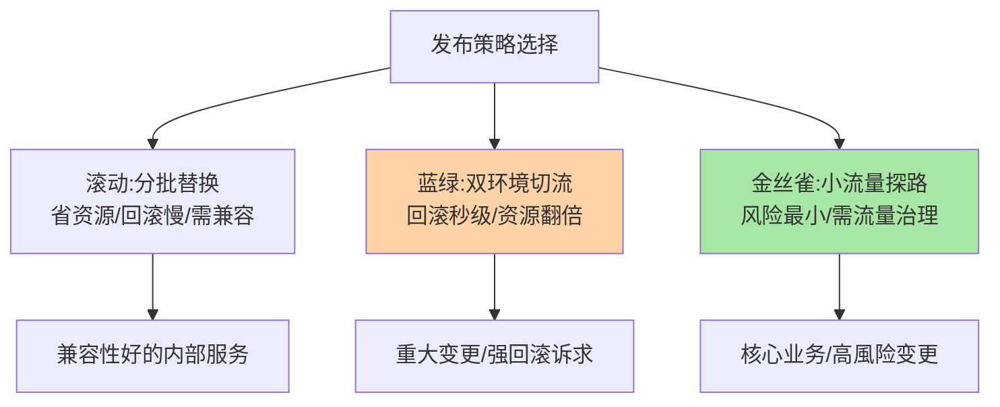
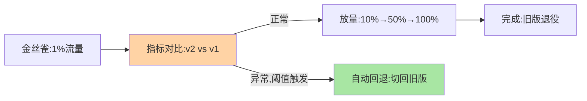

# 无损发布机制：滚动、蓝绿与金丝雀的编排

> 原语（篇 1-3 的上下线机制）有了，编排策略登场：**滚动**（分批轮流）、**蓝绿**（双环境整体切换）、**金丝雀**（小流量探路再放量）——三种策略是同一批原语的三种编排方式，各有适用场景。

> **本文核心**：三策略的机制与取舍——**滚动发布**：逐批「下线旧实例→上线新实例」轮流替换，资源省、回滚慢（要继续滚动回旧版）；**蓝绿发布**：新旧两套环境并存，入口整体切流，回滚秒级（切回）但资源翻倍；**金丝雀发布**：新版本先接小流量（路由级），验证后放量，风险最小但需要流量治理能力（互指 service-routing 篇 4 灰度）。**机制链**：策略编排原语（上线预热/下线摘流）→ 指标观察 → 推进/回退决策。

## 一句话摘要

三策略的参数与代价：**滚动**——批次大小与批间观察窗口是参数，资源经济（1:1 替换），代价是「新旧版本短暂共存」（兼容性要求）与「回滚是反向滚动」（慢）；**蓝绿**——代价是双倍资源（两套环境），收益是「回滚 = 流量开关」（秒级）与「新环境可完整验证后再切」；**金丝雀**——需要路由的流量比例能力 + 指标对比基建，收益是「生产流量下的真实验证」+「自动回退可配」——**选择轴是「资源预算 × 兼容性要求 × 回滚速度要求」的三维权衡**。

## 一、为什么发布策略是「编排」问题

单实例的优雅上下线（原语）解决了「一个实例怎么进出」，发布要处理「N 个实例怎么集体进出」——集体进出的三问构成策略空间：**同时进多少**（批次/比例）、**新旧共存吗**（共存则要求兼容，隔离则要双环境）、**回退多快**（反向滚动/切流/路由回退）——三问的不同答案组合出滚动/蓝绿/金丝雀，策略没有优劣只有场景匹配。

## 5W 速记卡

| 维度 | 一句话 |
|---|---|
| What | 滚动/蓝绿/金丝雀三种发布编排策略 |
| Why | N 实例的集体进出需要策略编排，原语之上是策略 |
| When | 发布流程设计、发布策略评审 |
| Where | 发布系统 + 流量治理（金丝雀） |
| How | 原语编排 + 指标观察 + 推进/回退决策 |

## 二、三策略的机制对比

**三策略的组合使用**是常态：核心服务「金丝雀起步（1% 流量验证）→ 蓝绿切流（新版本环境整体上线）→ 旧环境保留观察」——金丝雀提供验证、蓝绿提供回滚速度；普通内部服务滚动即可——**策略按变更风险分级适配**。

## 三、与版本灰度的区别：视角对照

| 维度 | 发布策略（本篇，发布视角） | 版本灰度（互指 service-versioning 篇 4） |
|---|---|---|
| 关注点 | 实例怎么换（部署批次） | 流量怎么分（版本比例） |
| 机制依托 | 发布系统 + 上下线原语 | 路由规则 + 指标对比 |
| 配合 | 产生新版本实例 | 控制版本间流量 |

发布策略与版本灰度是灰度体系的两个视角（互指闭环）——发布产生实例、灰度分配流量，完整无损发布两者缺一不可。

金丝雀的流量与决策闭环：

## 四、典型场景与误区

**典型场景**：日常迭代（滚动 + 优雅上下线原语）、大版本重构（蓝绿双环境 + 整体切流 + 旧环境观察期）、核心交易链路（金丝雀 + 自动回退阈值 + 人工确认放量）。

**误区与不适用**：① 蓝绿当常规——双倍资源的常驻成本，蓝绿适合「重大变更」不适合日常迭代；② 滚动发布无兼容约束——新旧实例共存期的调用不兼容（篇 1 的教训）在滚动中必然出现，滚动前提是「版本间兼容」；③ 金丝雀只分流不对比——1% 流量没有指标对比，金丝雀就只是「少上线点」，对比基建（互指版本灰度篇）是金丝雀的灵魂。

## 五、💡 实战提示

- 💡 策略选择三轴打分：资源预算/兼容性/回滚速度——每类服务预定义默认策略
- 💡 金丝雀必配自动回退（错误率阈值触发切流），人工确认只管放量
- 💡 蓝绿的旧环境保留期写进流程（如 48 小时），到点回收不恋战

## 六、你们可能会问

**Q1：K8s 的滚动更新是哪种策略？**
滚动（RollingUpdate，maxSurge/maxUnavailable 控制批次）——K8s 把滚动策略参数化；蓝绿与金丝雀在 K8s 生态由 Argo Rollouts/Flagger 类工具承载（路由级灰度 + 指标联动）。

**Q2：数据库变更怎么配合发布策略？**
约束发布顺序：**先兼容性变更（加字段）→ 发布新代码 → 后清理变更（删旧字段）**——扩展-收缩模式让发布与 DDL 解耦，任何发布策略都以「数据层向后兼容」为前提。

**Q3：发布策略能自动化决策吗？**
金丝雀的自动回退已成熟（指标阈值），自动放量（按统计显著性推进）在工具（Flagger 类）中已有——全自动发布（含业务指标判读）是演进方向，人工确认点在收缩但未消失。

## 七、开放问题

- 发布策略与流量治理（mesh）、指标系统（SLO 联动）的深度融合——「发布即流量工程」的形态下，策略编排的自动化程度将持续提升，人工决策点向「审批意图」上移。

## 八、自测三问

1. 三策略各自的代价与收益？
2. 三策略的组合使用怎么编排？
3. 发布与 DDL 的配合顺序原则是什么？

## 📎 核心带走

- **核心一句话**：无损发布 = 上下线原语的策略编排——滚动省资源、蓝绿快回滚、金丝雀低风险，按变更风险分级适配
- **机制链**：策略编排原语 → 阶梯推进 → 指标对比 → 推进/回退；金丝雀必配自动回退
- **失效点/边界**：滚动要求版本兼容；蓝绿资源翻倍；金丝雀的灵魂是指标对比不是分流本身

## 📌 数据与事实声明

- 写于 2026-09-08，策略定义为发布治理的共识口径；K8s 生态工具口径以官方文档为准
- 免责：策略选择按变更风险评审

## 📚 参考资料

| 类型 | 标题 | 来源 |
|---|---|---|
| 官方文档 | Kubernetes Deployment / Argo Rollouts / Flagger | 各官方站点 |
| 关联系列 | 本仓库 service-versioning 系列 | docs/architecture/service-governance/ |
| 社区沉淀 | 发布策略公开实践 | 技术社区公开文章 |
