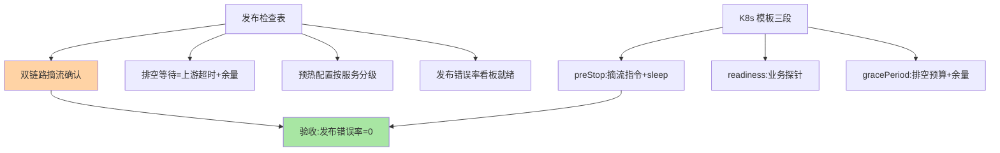
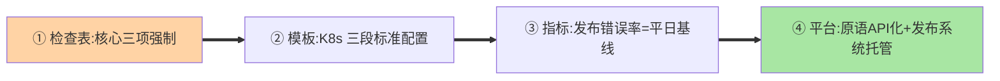

# 优雅上下线最佳实践：从检查表到平台化

> 全系列收束篇：把机制沉淀为**可执行清单**——发布检查表、K8s 配置模板、验收指标、平台化演进。规范要能直接抄进发布手册。

> **本文核心**：四件套——**发布检查表**（上下线 checklist：双链路摘流/排空等待/预热配置逐项打勾）；**K8s 配置模板**（preStop + readiness + grace period 的标准配置段）；**验收指标**（发布分钟级错误率 = 0、发布时长、排空耗时分布）；**平台化路线**（发布系统托管上下线原语，业务零心智）。**机制链**：清单化 → 模板化 → 指标化 → 平台化——四步让优雅上下线从「机制知识」变成「组织默认行为」。

## 一句话摘要

落地核心：**配置模板**是规范的载体（K8s 部署 YAML 内嵌 preStop 摘流 + readiness 探针 + grace period 三段标准配置，业务复制即用）；**验收指标**是质量的闭环（发布分钟级错误率——这是全系列的终极验收指标：做到优雅上下线的组织，发布期间的错误曲线与平日无差异）；**平台化**是终局——发布系统把「摘流→排空→停进程→上线→预热」全部托管，业务开发者不知道优雅上下线的存在（它自动发生）——**从「要求开发者做对」到「系统默认做对」是治理成熟的标志**。

## 一、为什么最佳实践的核心是「模板与平台」

机制知识（前四篇）转化为组织能力的三段衰减：知识 → 检查表（衰减一次：执行遗漏）→ 模板（再衰减：复制偏离）→ 平台（无衰减：默认正确）。**每一层的价值是减少「人的执行变量」**：检查表靠人打勾、模板靠复制、平台靠系统——治理成熟度的度量就是「人的执行变量占比」。

## 5W 速记卡

| 维度 | 一句话 |
|---|---|
| What | 检查表 + 配置模板 + 验收指标 + 平台化路线 |
| Why | 机制要转化为组织默认行为，减少人的执行变量 |
| When | 发布手册编写、发布质量验收、治理平台规划 |
| Where | 发布手册 + K8s 模板 + 发布系统 |
| How | 清单化 → 模板化 → 指标化 → 平台托管 |

## 二、检查表与配置模板



**K8s 模板三段的标准形态**（伪配置示意）：

```yaml
# 1) preStop:先摘流再等待感知
lifecycle:
  preStop:
    exec:
      command: ["/bin/sh","-c","curl -XPOST localhost:8081/offline; sleep 10"]
# 2) readiness:业务级就绪探针
readinessProbe:
  httpGet: {path: /health/ready, port: 8081}
# 3) 排空预算
terminationGracePeriodSeconds: 30
```

模板的要点：preStop 内「显式摘流 + sleep 等感知」（与篇 2 的序列对齐）、readiness 用业务探针（查依赖）、grace period 按预算公式（篇 2）。

## 三、与发布系统的区别：平台化对照

| 维度 | 检查表/模板（人工执行） | 发布系统平台化（系统托管） |
|---|---|---|
| 执行者 | 人（按清单操作） | 系统（原语自动编排） |
| 一致性 | 依赖纪律 | 默认正确 |
| 演进 | 清单更新靠人 | 平台升级全组织受益 |

平台化的接口：发布系统调「摘流 API（注册中心/网关）→ 等排空指标 → 滚动编排 → 全程指标联动」——原语的 API 化（下线接口/状态查询接口）是平台化的前置工程。

落地四步的递进：



## 四、典型场景与误区

**典型场景**：治理体系冷启动（先发检查表 + 模板，三个月后平台立项）、发布质量专项（用验收指标倒查各团队的上下线质量差距）、平台立项评审（原语 API 化完成度是立项前提）。

**误区与不适用**：① 检查表 30 项全勾——清单超 10 项必被形式化，核心三项（摘流/排空/验收）强制即可；② 模板更新无序——模板也是代码：进 Git、带修订记录、走升级流程；③ 平台化跳过原语 API——发布系统编排「不存在的 API」只能靠人肉代理，原语 API 化是地基。

## 五、💡 实战提示

- 💡 检查表只留核心三项强制：双链路摘流、排空计算值、错误率看板
- 💡 模板进 Git 做修订管理，模板升级走 PR（模板即代码）
- 💡 投入节奏的权衡：清单与模板零基建立即可用，平台化要原语 API 前置——按组织规模分级投入
- 💡 路线选型决策口径：何时用什么——10 人内团队检查表+模板即可，百人规模上指标看板，平台化留给「发布频次高到人工流程成为瓶颈」的组织
- 💡 平台化路线分三步：模板统一 → 原语 API 化 → 发布系统托管——逐步收编

## 六、你们可能会问

**Q1：验收指标的基线怎么定？**
「发布分钟级错误率 = 平日基线」——不是零容忍（业务天然波动），是与平日无差异；首次度量先采「平日基线」，再定发布窗口的达标线。

**Q2：没有发布系统的团队从哪开始？**
检查表 + K8s 模板（零基建成本）——模板复制就能拿到 80% 的收益，平台化是规模后的选项；「先模板后平台」的路径顺序不能倒。

**Q3：平台化后开发者需要理解原理吗？**
使用不需要、排障需要——平台默认正确时零心智，但异常场景（排空超时、摘流失效）的排障仍要求理解机制（前四篇的价值所在）。

## 七、开放问题

- 「发布质量」作为一级工程指标（发布错误率/发布时长/回滚时效的组织级看板）的普及，将推动优雅上下线从团队实践演进为组织级 SLO。

## 八、自测三问

1. 四件套（清单/模板/指标/平台）的递进关系？
2. K8s 模板三段各对应机制序列的哪一步？
3. 「人的执行变量占比」如何度量治理成熟度？

## 📎 核心带走

- **核心一句话**：优雅上下线落地 = 清单化 → 模板化 → 指标化 → 平台化，目标是系统默认正确
- **机制链**：检查表三项强制 → K8s 模板三段 → 验收指标（发布错误率=平日基线） → 原语 API 化 → 发布系统托管
- **失效点/边界**：清单超 10 项必形式化；模板即代码要版本管理；「先模板后平台」顺序不能倒

## 📌 数据与事实声明

- 写于 2026-09-08，落地框架为发布治理实践的归纳；模板为伪配置示意
- 免责：配置细节按 K8s 版本与应用形态调整

## 📚 参考资料

| 类型 | 标题 | 来源 |
|---|---|---|
| 关联系列 | 本系列篇 1-4 / K8s 系列 | docs/architecture/service-governance/、docs/devops/kubernetes/ |
| 官方文档 | K8s Pod lifecycle / Spring Boot graceful shutdown | 各官方站点 |
| 社区沉淀 | 发布治理平台化公开实践 | 技术社区公开文章 |
