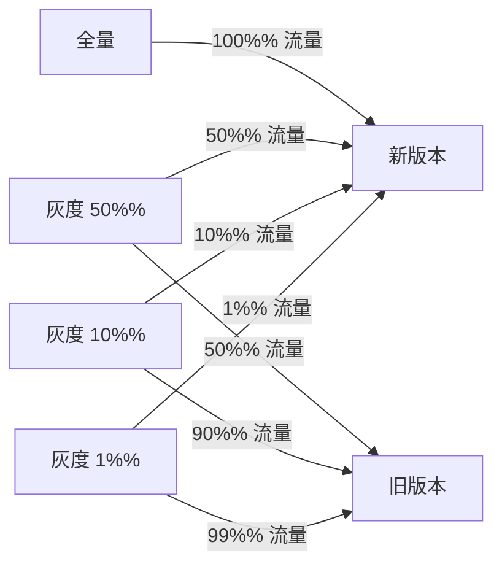
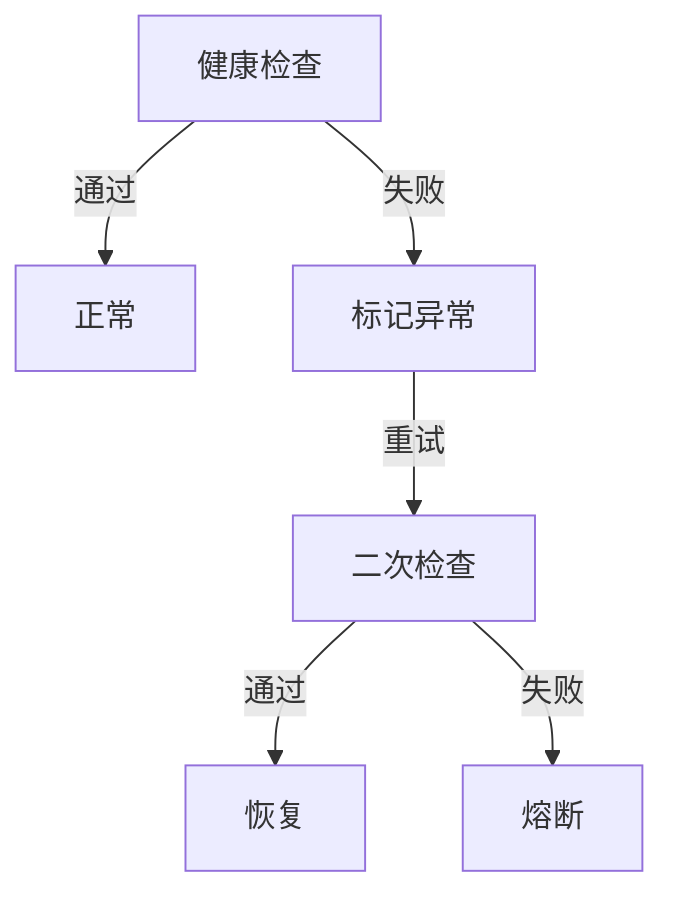

# 负载均衡灰度发布 + 故障切换实战

## 一句话摘要

负载均衡的灰度发布 + 故障切换是微服务治理的核心能力。本文讲透生产实践。

## 灰度发布

### 按权重灰度

### 按租户灰度

- 按用户 ID 哈希
- 按地域灰度
- 按标签灰度

## 故障切换

### 故障检测

### 故障切换策略

| 策略 | 说明 | 适用场景 |
|---|---|---|
| Failover | 自动重试其他实例 | 读请求 |
| Failfast | 快速失败 | 写请求 |
| Failsafe | 忽略失败 | 日志/监控 |
| Failback | 延迟重试 | 异步消息 |

## 灰度发布 + 故障切换组合

## 生产踩坑

1. **灰度比例跳变**：1% → 100% 中间无 10%
2. **故障切换误判**：正常流量触发故障切换
3. **灰度规则冲突**：多个灰度规则冲突
4. **故障回退**：故障恢复后流量不切回

## 监控指标

| 指标 | 阈值 | 告警级别 |
|---|---|---|
| 错误率 | > 1% | CRITICAL |
| 切换次数 | > 10 次/分钟 | WARNING |
| 故障实例数 | > 0 | CRITICAL |

## 量级考量

| 量级 | 灰度策略 |
|---|---|
| < 1000 QPS | 10% → 50% → 100% |
| 1000-10000 QPS | 1% → 10% → 50% → 100% |
| > 10000 QPS | 0.1% → 1% → 10% → 50% → 100% |

## 📌 数据与事实声明

- 踩坑来自生产环境经验
- 监控阈值需按业务调整
