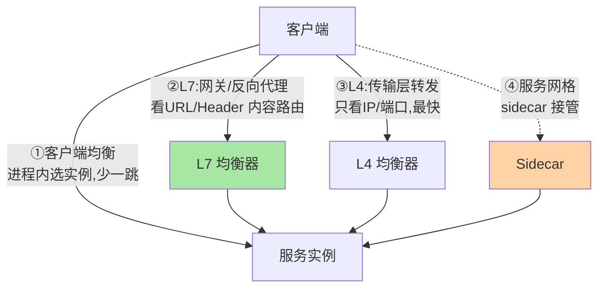
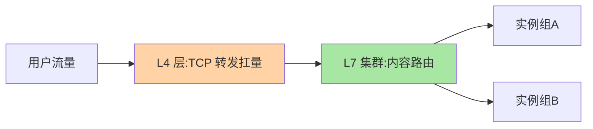

# 负载均衡的位置：四层、七层、客户端与服务端

> 同一个「分发决策」，可以发生在网络包层（L4）、应用内容层（L7）、调用发起方（客户端）、甚至内核旁路（服务网格）——位置决定能力边界，这篇把四种位置的全景讲清。

> **本文核心**：均衡位置的选择 = 「信息可见性」与「转发效率」的取舍。**机制链**：L4（看 IP/端口，最快）→ L7（看 HTTP 内容，能智能路由）→ 客户端（进程内直连，少一跳）→ 服务网格（sidecar 接管，业务无感）——信息看得越多越慢，看得越少越快，位置选型就是在这条曲线上选点。

## 一句话摘要

四种均衡位置的分工：**L4**（传输层转发，只看 IP/端口，性能极高，适合 TCP/长连接）；**L7**（应用层路由，能看 URL/Header/Cookie，适合 HTTP 内容路由与会话保持）；**客户端均衡**（RPC 框架进程内选实例，少一跳网络，语言生态绑定）；**服务网格**（sidecar 代理接管，业务无感，基础设施化）。演进主线是**「均衡能力从专用设备走向进程与基础设施」**——每一代都在换「性能与灵活性」的取舍点。

## 一、为什么位置是第一决策

策略再精，位置选错全白搭：L4 看不到 URL，做不了「按路径分发」；客户端均衡用不了异构语言生态；「能力需求 → 位置约束」是第一决策链——**先问「分发要看什么信息」，再问「这个信息在哪一层可见」**，位置就定了。

## 5W 速记卡

| 维度 | 一句话 |
|---|---|
| What | L4/L7/客户端/网格四种均衡位置 |
| Why | 位置决定信息可见性与转发效率的能力边界 |
| When | 流量入口架构设计、RPC 框架选型 |
| Where | 设备/网关/进程内/sidecar |
| How | 按分发所需信息的最小层级选位置 |

## 二、四种位置的全景

| 位置 | 信息可见性 | 转发效率 | 典型代表 | 适用 |
|---|---|---|---|---|
| L4 | IP/端口 | 极高（内核转发） | LVS/云 NLB | TCP、长连接、超大流量 |
| L7 | HTTP 全量内容 | 高（应用层解析） | Nginx/网关 | 内容路由、会话保持 |
| 客户端 | 服务列表+元数据 | 极高（进程内直连） | RPC 框架/Ribbon | 微服务内部调用 |
| 网格 | 同 L7（sidecar 代理） | 中（多两跳 local proxy） | Istio/Envoy | 业务无感的基础设施化治理 |

**演进主线**：专用硬件 → 软件负载均衡 → 客户端内置 → 基础设施下沉——每一代都在重排「性能与灵活性」的取舍点；**四代并存是现实**（L4 在最外层扛量、L7 做内容路由、内部调用客户端直连、mesh 逐步渗透）。

## 三、经典组合：L4 + L7 的分层协作

大流量入口的标准架构是 **L4 在前扛量、L7 在后路由**：

：L4 层只做 TCP 转发（性能极高，扛住洪峰），把连接转发给后端 L7 集群做内容路由——「L4 保吞吐、L7 保智能」的分工，是大型入口架构的通用骨架。云厂商的 LB 产品（NLB + ALB 类）正是这个分层的托管化。

## 四、与 CDN 调度的区别：调度层级对照

| 维度 | 负载均衡（本篇） | CDN 调度 |
|---|---|---|
| 调度对象 | 自己的实例集群 | 边缘节点集群 |
| 决策依据 | 容量与策略 | 地理就近 |
| 位置 | 业务架构内 | 公网边缘 |

CDN 的「地理级调度」在负载均衡之外更靠前一层——从用户到实例的完整链路是「DNS/CDN 调度 → L4 → L7 → 客户端均衡」的多级串联，**每级只做自己那层的分发**。

## 五、典型场景与误区

**典型场景**：电商大促入口（L4 扛量 + L7 网关路由）、内部微服务（客户端均衡直连）、多语言异构体系（服务端均衡统一管控）、渐进上 mesh（sidecar 逐步接管客户端均衡）。

**误区与不适用**：① 位置堆得越多越好——每层都加开销与故障点，按需选层；② 客户端均衡用于异构语言生态——SDK 碎片化维护是灾难，异构体系用服务端均衡；③ 把 mesh 当银弹——sidecar 的两跳代理有延迟与资源成本，收益在治理统一性，要算总账。

## 六、💡 实战提示

- 💡 流量入口的选层口诀：看内容选 L7、扛流量选 L4、内部调用客户端直连
- 💡 L4+L7 分层是入口标配，单层硬扛大流量是架构债
- 💡 位置的迁移（如客户端转 mesh）要做双跑对照，别一次切换

## 七、你们可能会问

**Q1：四层和七层的「层」指什么？**
OSI 网络模型层次——L4 传输层（TCP/UDP，只见连接与端口）、L7 应用层（HTTP 语义，可见 URL/Header/Body），可见信息的多寡决定路由能力。

**Q2：客户端均衡与网格并存会双重均衡吗？**
会且常见于过渡期——mesh 接管后客户端 SDK 的均衡逻辑要显式关闭，双均衡会导致策略互相打架（两端各选各的）。

**Q3：K8s 里这些位置对应什么？**
Service（kube-proxy 是 L4）+ Ingress/Gateway API（L7）+ 客户端 SDK——K8s 把三层位置产品化，选型即选资源类型。

## 八、开放问题

- eBPF/XDP 让 L4 转发进一步下沉内核（绕过 socket 层），均衡位置的「性能天花板」在被内核技术重写。
- mesh 的 sidecar-less 形态（istio ambient 类）可能消除「多两跳」的成本劣势，网格位置的取舍格局或将被改变。

## 九、自测三问

1. 四种位置的信息可见性与效率怎么排？
2. L4+L7 分层协作的分工是什么？
3. 「先问要看什么信息，再定位置」怎么应用到你的流量入口？

下一篇讲「随机轮询与加权」：最经典的三个策略。

## 📎 核心带走

- **核心一句话**：均衡位置 = 信息可见性与转发效率的取舍点，L4 扛量、L7 智能、客户端少一跳、网格基础设施化
- **机制链**：分发所需信息 → 可见层级 → 位置选择 → 策略填充 → 四代位置并存演进
- **失效点/边界**：位置错则策略废；多层并存要防策略打架（双均衡问题）

## 📌 数据与事实声明

- 写于 2026-09-08，位置分类为业界共识口径；K8s 对应关系以官方文档为准
- 免责：以各实现官方文档为准

## 📚 参考资料

| 类型 | 标题 | 来源 |
|---|---|---|
| 官方文档 | Nginx/Envoy/Istio 负载均衡文档 | 各官方站点 |
| 关联系列 | 本仓库 gateway / K8s 系列 | docs/ |
| 社区沉淀 | 负载均衡架构公开文章 | 技术社区公开文章 |
