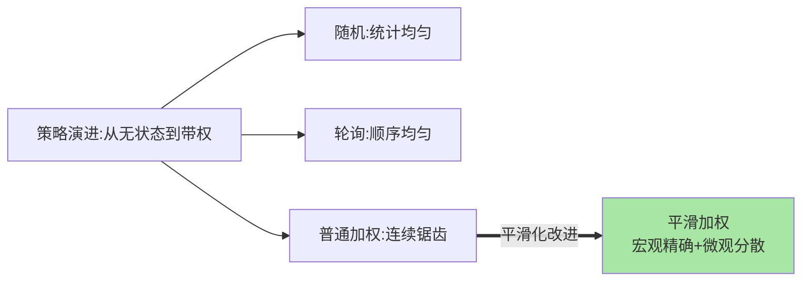
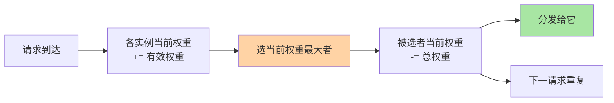

# 随机、轮询与加权：最经典的三个策略

> 随机、轮询、加权轮询——三个「不看状态」的静态策略，却是九成场景的默认答案。这篇讲清三者的机制、平滑加权的巧妙实现，以及「静态策略为什么够用」。

> **本文核心**：静态策略按「实例固有权重」分发，不感知实时状态——随机（实现最简、统计均匀）、轮询（绝对顺序均匀）、加权轮询（按能力配权重）。**机制链**：候选列表 → 按策略选一个 → 失败重选。平滑加权的核心：**总权重分母不变、按「当前权重」选最大者再归还**——让权重序列在宏观均匀的同时微观分散，避免「低权实例被连续跳过」的锯齿分发。

## 一句话摘要

三策略逐个看：**随机**——每次均匀抽一个，无状态、实现一行代码，统计意义上均匀；**轮询**——按序循环，绝对均匀但会话场景不友好；**加权轮询**——实例按能力配比（8C 机器权重 2、4C 权重 1），普通加权会「连续打同一实例」，**平滑加权**（Nginx 算法）让高权实例「分散地多拿」。静态策略的适用判断：**实例能力差异可用权重表达、负载波动不剧烈**——满足则三者任选，简单即最优。

## 一、为什么静态策略依然是默认

「不看实时状态」听起来原始，但有三个结构性优点：**无状态**（均衡器不维护计数与连接表，水平扩展容易）、**零探测成本**（不用采集实例负载）、**行为可预测**（流量回放与问题复盘容易）。动态策略（篇 5）的状态采集本身有成本与滞后——**实时性换均匀性**的取舍中，多数服务负载平稳，静态策略的「够用 + 简单」就赢了。

## 5W 速记卡

| 维度 | 一句话 |
|---|---|
| What | 随机 / 轮询 / 加权轮询（含平滑加权）三策略 |
| Why | 无状态的静态策略是多数平稳负载的最简解 |
| When | 实例同构或差异可用权重表达的任何场景 |
| Where | Nginx/RPC 框架/网关的默认策略位 |
| How | 随机抽样 / 顺序循环 / 平滑加权算法 |

三策略的演进关系：

## 二、平滑加权：Nginx 的巧妙实现

以 A(5) B(1) C(1) 为例（总权重 7）：每次请求先把所有实例的「当前权重」加上各自「有效权重」，选当前权重最大者分发，被选者当前权重减去总权重——效果是 **7 次请求中 A 拿 5 次但从不连续**（A B A C A B A 的分散序列），宏观比例精确、微观分布平滑。这个 O(n) 的小算法是「用极小状态换分发质量」的教科书案例——自 Nginx 演进定型后被 Dubbo/Ribbon 等框架相继吸收，实现同源。

## 三、三策略选型速查

| 策略 | 均匀性 | 状态依赖 | 会话友好 | 适用 |
|---|---|---|---|---|
| 随机 | 统计均匀 | 无 | 差（需粘滞配合） | 默认可用、实现最简 |
| 轮询 | 绝对顺序均匀 | 计数器 | 差 | 同构实例、无长会话 |
| 平滑加权 | 按权重精确 | 当前权重表 | 差 | 异构实例（权重表达能力差） |

会话不友好的共性解法是**粘滞（sticky）**：按会话 ID 哈希固定到实例（哈希类策略见篇 4），或上层会话共享化（会话数据进 Redis，实例无状态化——治本）。

## 四、与哈希策略的区别：哈希类对照

| 维度 | 随机/轮询/加权 | 一致性哈希（篇 4） |
|---|---|---|
| 决策依据 | 权重与顺序 | 请求特征（key） |
| 同 key 去向 | 不保证 | 恒定同一实例 |
| 扩缩容影响 | 无 | 键重映射最小化 |

静态三策略「不看请求内容」，哈希策略「按内容定去向」——需要「同一请求总到同一实例」（本地缓存命中率、分片语义）时，才升级到哈希族。

## 五、典型场景与误区

**典型场景**：同构无状态服务的默认轮询/随机、异构机器混合部署（平滑加权按核数配权）、网关 upstream 分发（Nginx 默认加权轮询）。

**误区与不适用**：① 权重拍脑袋——按实测容量（压测单实例吞吐）配比，不按机器型号想当然；② 轮询计数器在均衡器集群间不共享——多均衡器实例的轮询各数各的（宏观仍近似均匀，不必强行共享）；③ 把「随机不均」当故障——小样本下随机天然波动，看统计不看单点。

## 六、💡 实战提示

- 💡 平稳负载别过度设计：随机/轮询 + 健康剔除已经覆盖九成场景
- 💡 异构部署先上平滑加权，效果立竿见影
- 💡 有会话依赖先考虑会话外置（无状态化），再考虑粘滞策略——治本优先

## 七、你们可能会问

**Q1：随机和轮询哪个更均匀？**
大样本下统计等价；轮询是「顺序均匀」（短周期严格），随机是「统计均匀」（有局部波动）——轮询需要维护计数器状态，随机的无状态在大规模网关集群更受欢迎。

**Q2：权重比例怎么定才科学？**
单实例压测吞吐比例就是权重比例（8C 机压出 2000 QPS、4C 压出 1000 → 权重 2:1），容量变化随压测数据更新——权重是容量画像不是配置摆设——画像随压测数据演进更新。

**Q3：平滑加权在实例增减时要重算吗？**
算法自适应：增减实例只改候选列表与总权重，下一请求自动收敛到新比例——无需人工干预——扩缩容时自动演进到新比例，这是它优于「预生成分配序列」方案的地方。

## 八、开放问题

- 静态策略与自适应策略的边界在「负载波动幅度多大时值得引入动态」——波动检测驱动的策略自动切换（静态起步、动态兜底）是智能均衡的中间形态，尚未标准化。

## 九、自测三问

1. 三策略各自的均匀语义与状态依赖？
2. 平滑加权怎么做到「宏观精确 + 微观分散」？
3. 会话不友好的两类解法（粘滞 vs 外置）怎么选？

下一篇讲「一致性哈希」：按内容定去向的哈希族策略。

## 📎 核心带走

- **核心一句话**：随机/轮询/平滑加权三个无状态策略覆盖九成平稳负载，简单即最优
- **机制链**：候选列表 → 策略选择（抽样/循环/平滑加权）→ 失败重选 → 哈希族按需升级
- **失效点/边界**：负载波动剧烈或实例能力难权重化时，静态策略失准——升级动态策略（篇 5）

## 📌 数据与事实声明

- 写于 2026-09-08，平滑加权算法为 Nginx 公开实现口径（Dubbo/Ribbon 同源）
- 免责：以各实现官方文档为准

## 📚 参考资料

| 类型 | 标题 | 来源 |
|---|---|---|
| 官方文档 | Nginx upstream / Dubbo 负载均衡 | nginx.org、dubbo.apache.org |
| 关联系列 | 本系列篇 4（一致性哈希）/ 篇 5（动态策略） | docs/architecture/service-governance/ |
| 社区沉淀 | 平滑加权算法公开解析文章 | 技术社区公开文章 |
