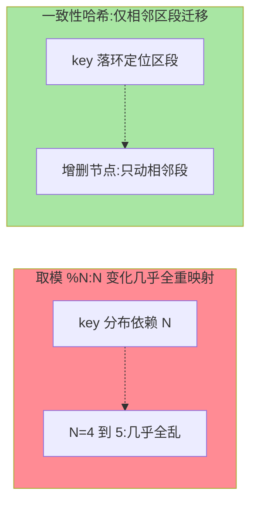
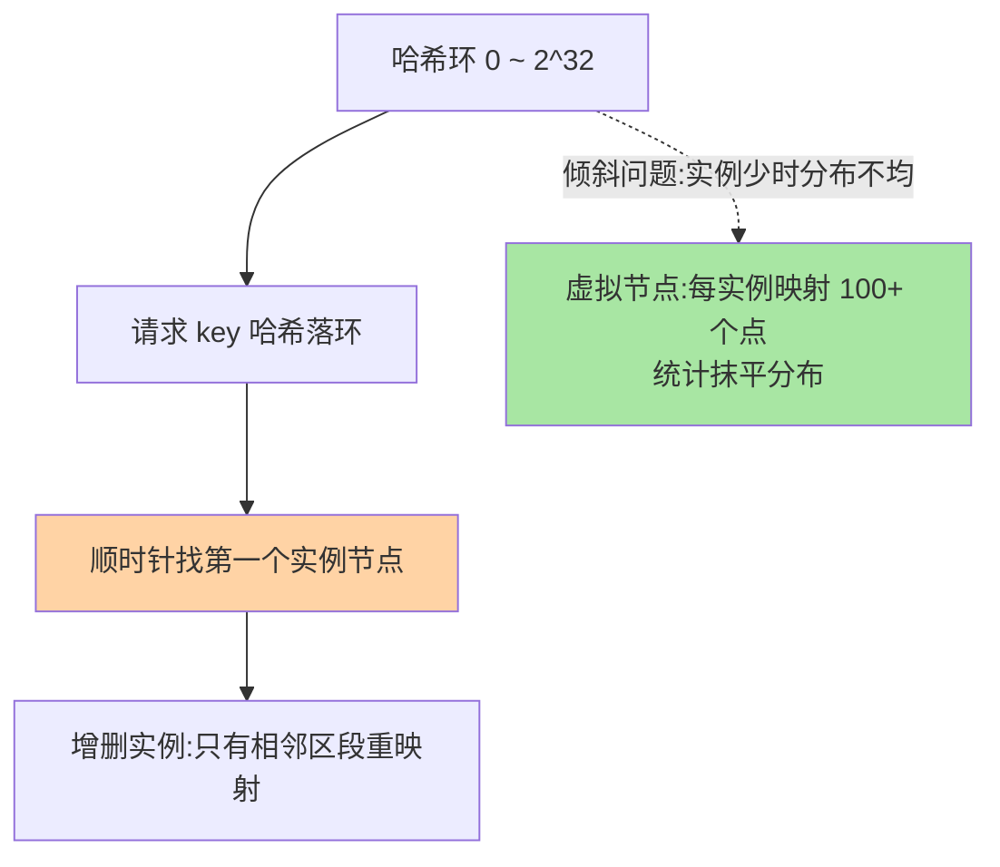

# 一致性哈希：扩缩容也少搬数据的哈希策略

> 「同一个用户总打到同一实例」——会话粘滞、本地缓存命中、分片语义都靠它。普通哈希取模在扩缩容时几乎全部重映射，一致性哈希把重映射降到最小。这篇讲哈希环、虚拟节点与工程取舍。

> **本文核心**：一致性哈希把「实例与请求都映射到一个环上」，请求顺时针找最近实例——**增删实例只影响环上相邻区段**（普通取模则几乎全乱）。**机制链**：请求 key 哈希 → 环上定位 → 顺时针最近实例 → 增删节点只迁移相邻区段 → 虚拟节点抹平数据倾斜。

## 一句话摘要

普通哈希 `hash(key) % N` 的致命伤：N 从 4 变 5 时几乎所有 key 重映射（缓存全冷）。一致性哈希的解法：**把实例与 key 都哈希到 [0, 2^32) 的环上，key 顺时针找第一个实例**——增删实例只影响「该实例在环上的相邻区段」（理论迁移量从 100% 降到 N 分之一）。**虚拟节点**解决第二个问题：真实实例少时环上分布不均（倾斜），每实例映射几十上百个虚拟节点抹平。代价也明确：**丧失全局均匀的可控性**（哈希倾斜）与「权重表达复杂」——它是「按内容定去向」场景的专用策略，不是通用均衡升级。

## 一、为什么普通取模不够用

`hash % N` 的均匀性建立在 N 恒定上——扩容瞬间（N 变化），所有 key 重新洗牌：本地缓存全失效（缓存实例化架构的雪崩）、有状态连接全断。**扩缩容频率越高，取模的代价越不可接受**——一致性哈希为「动态拓扑」而生——哈希分发策略二十年演进的关键一步，这是它与静态三策略（篇 3）的本质分野：静态策略假设实例集稳定，一致性哈希假设实例集常变。

## 5W 速记卡

| 维度 | 一句话 |
|---|---|
| What | 哈希环 + 顺时针定位 + 虚拟节点的哈希分发策略 |
| Why | 动态扩缩容下最小化 key 重映射 |
| When | 有状态亲和（缓存/会话/分片）+ 拓扑常变 |
| Where | 缓存客户端、分布式存储、网关粘滞 |
| How | key/实例同环哈希，顺时针取最近，虚拟节点抹平倾斜 |

两种哈希的扩缩容行为对照：

## 二、哈希环与虚拟节点

工程参数直觉：**虚拟节点数**常见每实例 100-1000（客户端实现各异）——太少抹不平、太多路由表内存涨；**哈希函数**要均匀（MD5/Murmur 类，不能用会聚簇的弱哈希）；**带权一致性哈希**（异构实例）通过虚拟节点数量比例表达权重（权重 2:1 = 虚节点数 2:1）——权重能力以间接方式回归。

## 三、适用判断：什么时候才用它

一致性哈希是「**亲和性需求**」的产物，判断三问：**① 同一 key 重复请求同一实例有收益吗**（本地缓存命中、会话态、分片写入）——没有就别用，静态策略更简单；**② 实例拓扑常变吗**——固定集群用普通哈希取模足够；**③ 能接受哈希倾斜与丧失全局可控吗**——不能则最少活跃类策略（篇 5）更合适。三问全过才上——**它是专用工具不是升级包**。选型推荐口径：有状态亲和 + 动态拓扑 → 一致性哈希；有状态亲和 + 固定拓扑 → 普通哈希取模；无亲和 → 静态策略（篇 3）。

## 四、与分片路由的区别：概念对照

| 维度 | 一致性哈希（均衡视角） | 分片路由（互指 MySQL 分片键系列） |
|---|---|---|
| 目的 | 流量分发 + 亲和 | 数据归属 |
| 对象 | 请求 → 实例 | 数据 → 存储节点 |
| 机制同源 | 哈希环 | 哈希/范围分片 |

同一套哈希环机制服务两个问题（流量分发与数据分布）——Redis Cluster 的槽、Kafka 的分区、一致性哈希环，都是「key → 节点」映射思想族；**机制同源、用途各异**，对照学习效率翻倍。

## 五、典型场景与误区

**典型场景**：本地缓存 + 客户端哈希（同用户同实例，缓存命中率最大化）、RPC 有状态服务路由、分布式缓存（Memcached 客户端一致性哈希的经典应用）、网关会话粘滞。

**误区与不适用**：① 无状态服务用一致性哈希——白担倾斜风险零收益；② 虚拟节点数拍脑袋——按「实例数 × 目标分布均匀度」压测校准；③ 一致性哈希后忘了实例故障的 key 迁移——故障实例的区段顺时针归并到下一实例，下游（本地缓存）要能承受这波「缓存换实例」的重映射。

## 六、💡 实战提示

- 💡 上一致性哈希前先问「亲和收益值多少」——无收益不引入——按数据特性与拓扑演进取舍
- 💡 虚拟节点数进压测清单：分布标准差是验收指标
- 💡 结合健康检查：实例摘除后区段重映射要有监控（热点迁移告警）

## 七、你们可能会问

**Q1：「有界负载一致性哈希」是什么？**
一致性哈希的改进变体（Google 公开论文）：在环定位之外加「每实例负载上限」约束——解决纯哈希环「不管实例忙闲」的问题，是哈希族与动态策略的融合方向。

**Q2：为什么环是 2^32？**
MD5 等 128 位哈希取 32 位空间是工程惯例——空间够大（冲突概率低）且路由表计算便宜；空间大小是工程参数不是理论约束。

**Q3：一致性哈希能保证绝对均匀吗？**
不能——统计均匀（虚拟节点够多时趋近），瞬时倾斜永远存在；要「绝对均匀 + 上限保证」看有界负载变体。

## 八、开放问题

- 一致性哈希在有状态服务（有状态 Workload 调度）场景的调度与均衡融合，是 K8s 有状态治理的活跃议题。
- 跨地域亲和哈希（用户就近 + 亲和兼顾）在多活架构中的方案尚未标准化。

## 九、自测三问

1. 普通取模在扩缩容时的问题量级？一致性哈希怎么降？
2. 虚拟节点解决什么问题？工程参数怎么定？
3. 适用三问是什么？为什么说它是专用工具？

下一篇讲「最少活跃与最小响应」：看状态的动态策略。

## 📎 核心带走

- **核心一句话**：一致性哈希 = 哈希环 + 顺时针定位 + 虚拟节点，为「亲和需求 + 动态拓扑」而生
- **机制链**：key 哈希落环 → 顺时针最近实例 → 增删只动相邻区段 → 虚拟节点抹倾斜
- **失效点/边界**：无亲和收益时是纯负担；倾斜与可控性丧失是固有代价

## 📌 数据与事实声明

- 写于 2026-09-08，哈希环机制为 Karger 论文以来的经典公开口径；有界负载变体为 Google 论文（公开）
- 虚拟节点参数为工程经验口径
- 免责：以各实现官方文档为准

## 📚 参考资料

| 类型 | 标题 | 来源 |
|---|---|---|
| 经典论文 | Consistent Hashing and Random Trees（Karger et al.） | 公开论文 |
| 实战书 | 《Redis 深度历险》（一致性哈希应用章） | 公开出版 |
| 关联系列 | 本仓库 MySQL《分片键设计》（哈希分片互指） | docs/data/mysql/ |
