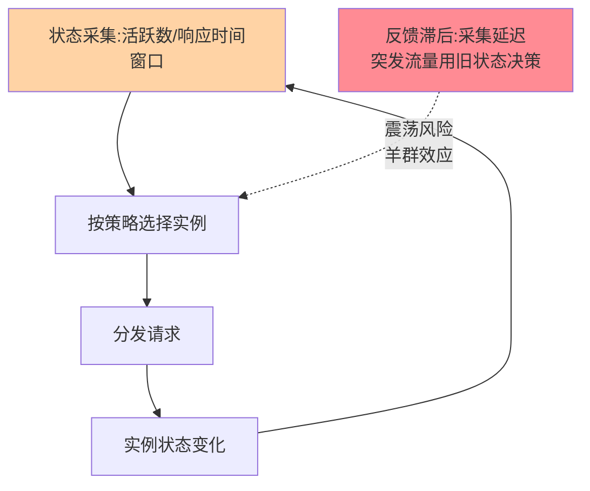
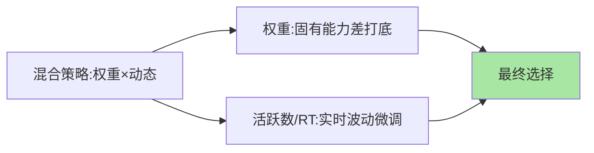

# 最少活跃与最小响应：看状态的动态策略

> 静态策略假设「所有请求一样重、实例一直稳」，负载波动剧烈时不成立——动态策略引入**实例状态反馈**：正在处理多少请求（最少活跃）、最近响应多快（最小响应时间）。这篇讲动态策略的机制、反馈滞后问题与选型。

> **本文核心**：动态策略 = 静态分发 + 实时状态反馈。**机制链**：采集实例状态（活跃数/响应时间）→ 按状态选择（最少/最快）→ 分发改变状态 → 状态反馈修正下一轮分发——一个闭环控制系统。**反馈滞后**是它的阿喀琉斯之踵：状态采集有延迟，突发流量下「旧状态」反而加剧倾斜。

## 一句话摘要

两个主流动态策略：**最少活跃（least active）**——把请求发给「当前正在处理的请求数最少」的实例（活跃数天然反映实例忙闲与请求重量差异，慢实例活跃数自然堆积、分到的流量自然减少——**自适应**是它的精髓）；**最小响应时间（least RT）**——发给「近期响应最快」的实例（响应时间聚合窗口统计，快者多得）。两者共同的前提与代价：**状态采集与统计的开销 + 反馈滞后导致的震荡风险**——负载波动大、请求重量差异大时值得，平稳场景是过度设计。

## 一、为什么需要「看状态」

静态策略的两个盲区：**请求不均匀**（有的请求 1ms、有的 10s——轮询把慢请求随机塞给谁都可能压垮某实例）与**实例状态漂移**（GC 停顿中的实例、网络抖动的实例，静态策略照发不误）。动态策略引入状态反馈补盲区：活跃数让慢实例「自然减流」，响应时间让劣化实例「自动降权」——**把「实例间的公平」升级为「系统吞吐的最大化」**。

## 5W 速记卡

| 维度 | 一句话 |
|---|---|
| What | 最少活跃 / 最小响应时间的动态均衡策略 |
| Why | 请求重量不均、实例状态漂移时静态策略失准 |
| When | 长短请求混合、实例性能抖动频繁的场景 |
| Where | Dubbo（leastactive）/网关/Envoy（least request） |
| How | 状态采集 → 按最少/最快选择 → 分发反馈闭环 |

## 二、动态闭环与反馈滞后

**羊群效应**是动态策略的经典陷阱：实例 A 状态好 → 洪峰请求全部涌向 A → A 被打垮 → 全体切向 B → B 又垮——**滞后状态 + 全体同决策 = 同步震荡**。缓解：状态统计窗口平滑（不采瞬时值）、随机化选择（最少活跃不选唯一最小者，从最小的一批里随机挑——Envoy 的 least request 默认即「从 2 个随机样本中选更优」）、叠加权重做混合策略（动态为主静态为底）。

## 三、两个策略的细分取舍

| 维度 | 最少活跃 | 最小响应时间 |
|---|---|---|
| 状态信号 | 进行中请求数（精确计数） | 响应耗时统计（窗口估计） |
| 请求重量敏感 | ✅ 慢请求自动堆积减流 | 部分反映 |
| 采集开销 | 低（进程内计数） | 中（耗时统计与窗口管理） |
| 短请求洪峰 | 好（活跃数快速周转） | 抖动大（RT 统计噪声） |
| 长请求混合 | ✅ 强项 | 一般 |

经验口径：**长短请求混合选最少活跃**（活跃数对「慢」最敏感）；**同构短请求 + 网络波动主导**选最小响应；拿不准从最少活跃起步（Dubbo/Envoy 的实践主流）。

## 四、与哈希策略的区别：混合才是常态

动态与静态不是二选一：**权重打底 + 动态微调**是工业形态（加权最少活跃——容量差异由权重表达，波动由活跃数反馈）。两者协同的混合形态：

「动态替代静态」是常见误读——**状态反馈解决的是「实时波动」，权重解决的是「固有能力差」**，两者正交互补。

## 五、典型场景与误区

**典型场景**：AI 推理服务（请求耗时差异极大，最少活跃是标配）、网关上游（长短接口混合）、混合部署集群（新旧机器性能漂移频繁）。

**误区与不适用**：① 平稳短请求场景硬上动态——采集开销白付，随机轮询即可；② 状态跨均衡器共享——多均衡器实例各看各的状态，全局不均（要么单点决策要么接受近似）；③ 统计窗口设太短——噪声驱动震荡，窗口按请求耗时分布的稳定性定。

## 六、💡 实战提示

- 💡 动态策略必配「随机化选择」防羊群效应（别选唯一最小）
- 💡 上线动态策略前后对比 P99——均衡收益要看尾延迟不是均值
- 💡 混合策略（权重 × 动态）是生产形态，纯动态很少

## 七、你们可能会问

**Q1：「活跃数」对慢请求为什么特别有效？**
慢请求占用活跃名额时间长——活跃数堆积自然减少新流量进入慢实例，形成「自动降速」闭环；请求完成后名额释放，恢复吸流——这是无需要求级识别的自适应。

**Q2：最小响应时间的时间窗口怎么定？**
按「请求耗时分布的稳定周期」定——窗口太短噪声大、太长反应钝；经验从 1-10 秒滑动窗口起步，压测校准。

**Q3：动态策略能解决实例超载吗？**
不能——均衡只决定「流量怎么分」，超载要靠限流与扩容（互指 stability 系列）；动态策略最多延缓超载，不能替代容量治理——均衡策略的演进边界在容量问题面前清晰可见。

## 八、开放问题

- 基于 RL（强化学习）的均衡决策在学术与大厂试点中，「状态反馈闭环」的下一步是「预测式调度」，离通用生产尚有距离。
- 多目标均衡（延迟 + 成本 + 可用性联合优化）在异构算力场景的需求增长快于方案成熟。

## 九、自测三问

1. 最少活跃为什么对慢请求自适应？
2. 羊群效应的成因与三个缓解手段？
3. 动态与静态权重怎么组合？各解决什么？

下一篇讲「四层与七层负载均衡」：位置篇的策略侧延伸。

## 📎 核心带走

- **核心一句话**：动态策略 = 状态反馈闭环（最少活跃/最小响应），为请求不均与状态漂移而生
- **机制链**：状态采集 → 策略选择（随机化防羊群） → 分发改变状态 → 反馈修正闭环
- **失效点/边界**：反馈滞后导致震荡风险；超载问题归限流扩容，均衡不背锅

## 📌 数据与事实声明

- 写于 2026-09-08，策略语义以 Dubbo/Envoy 官方文档为准（Envoy least request 默认两样本选择）
- 统计窗口经验口径需压测校准
- 免责：以各实现官方文档为准

## 📚 参考资料

| 类型 | 标题 | 来源 |
|---|---|---|
| 官方文档 | Dubbo LoadBalance / Envoy least request | dubbo.apache.org、envoyproxy.io |
| 关联系列 | 本仓库 stability 系列（限流扩容互指） | docs/architecture/service-governance/ |
| 社区沉淀 | 动态负载均衡公开文章 | 技术社区公开文章 |
